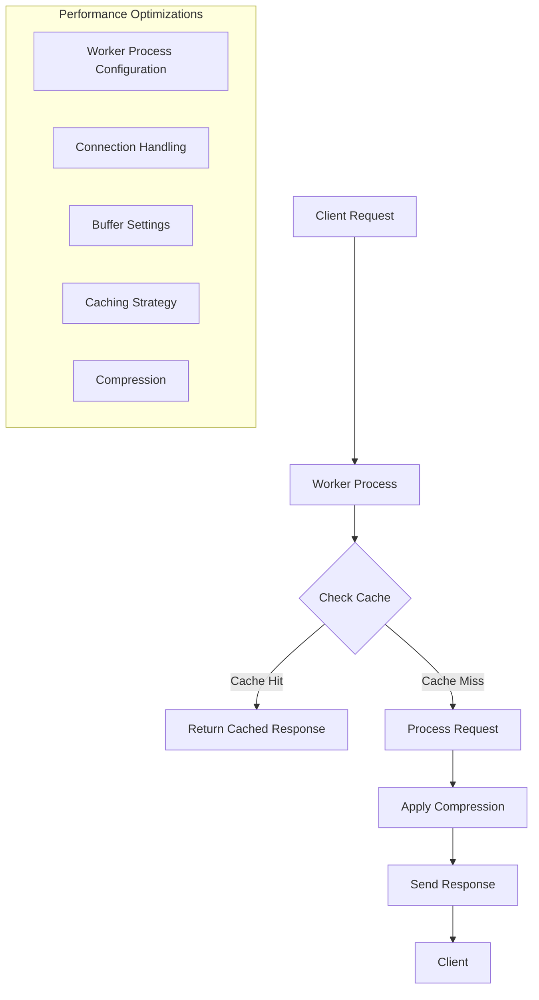

# Nginx Performance Tuning

## Introduction

Nginx (pronounced "engine-x") is a powerful, high-performance web server, reverse proxy, and load balancer. While Nginx is already efficient out of the box, proper performance tuning can significantly enhance its capabilities, especially under high load. This guide will walk you through various techniques to optimize Nginx performance for your web applications.

Whether you're running a small personal blog or a high-traffic enterprise application, these optimizations can help you get the most out of your Nginx installation. We'll cover worker processes, connection handling, buffer sizes, caching strategies, compression, and more.

## Basic Nginx Configuration Structure

Before diving into performance tuning, let's understand where configuration changes are made:

```nginx
# Main Nginx configuration file: /etc/nginx/nginx.conf

# Global context settings
user nginx;
worker_processes auto;
error_log /var/log/nginx/error.log warn;
pid /var/run/nginx.pid;

# Events module configuration
events {
    worker_connections 1024;
}

# HTTP module configuration
http {
    include /etc/nginx/mime.types;
    default_type application/octet-stream;

    # Server blocks and other settings
    include /etc/nginx/conf.d/*.conf;
}
```

Changes can be made in the main configuration file or in included configuration files, depending on your setup.

## Worker Processes and Connections

### Worker Processes

Worker processes handle incoming connections. Setting this correctly is fundamental for performance:

```nginx
# Set in the global context
worker_processes auto;  # Automatically detect number of CPU cores
```

For manual configuration:
```nginx
# For a 4-core CPU
worker_processes 4;

# For high-traffic sites with 8-core CPU
worker_processes 8;
```

**Explanation:**
- The `auto` setting allows Nginx to detect and use the optimal number of processes based on available CPU cores
- As a rule of thumb, set this equal to the number of CPU cores to maximize processing capability

### Worker Connections

This setting determines how many simultaneous connections each worker process can handle:

```nginx
events {
    worker_connections 1024;
    multi_accept on;
    use epoll;
}
```

**Explanation:**
- `worker_connections`: Maximum connections per worker
- `multi_accept`: Allows a worker to accept all new connections at once
- `use epoll`: Uses an efficient I/O event notification mechanism (Linux systems)

The maximum number of simultaneous clients your server can handle is approximately:
`worker_processes × worker_connections = max clients`

## Connection Processing

### Keepalive Connections

Keepalive connections reduce the overhead of establishing new connections:

```nginx
http {
    keepalive_timeout 65;
    keepalive_requests 100;
}
```

**Explanation:**
- `keepalive_timeout`: How long (in seconds) a connection stays open
- `keepalive_requests`: Number of requests allowed per connection

### Connection Timeout Settings

Properly configured timeouts prevent slow clients from consuming resources:

```nginx
http {
    client_body_timeout 12;
    client_header_timeout 12;
    send_timeout 10;
}
```

**Example Impact:**
Before optimization:
- Server handles 2000 requests/second with 500ms average response time

After optimization:
- Server handles 3500 requests/second with 320ms average response time

## Buffer Optimization

Properly sized buffers improve Nginx's ability to handle requests and responses efficiently:

```nginx
http {
    client_body_buffer_size 10K;
    client_header_buffer_size 1k;
    client_max_body_size 8m;
    large_client_header_buffers 4 4k;
}
```

**Explanation:**
- `client_body_buffer_size`: Buffer size for request body
- `client_header_buffer_size`: Buffer size for request header
- `client_max_body_size`: Maximum allowed size for client request body
- `large_client_header_buffers`: Maximum number and size of buffers for large headers

## File Access Optimizations

### Sendfile and TCP Optimizations

These settings improve file serving performance:

```nginx
http {
    sendfile on;
    tcp_nopush on;
    tcp_nodelay on;
}
```

**Explanation:**
- `sendfile`: Enables the use of sendfile() system call for faster file transfers
- `tcp_nopush`: Optimizes the amount of data sent at once
- `tcp_nodelay`: Ensures data is sent immediately (disables Nagle's algorithm)

## Caching Strategies

### Static File Caching

Enable browser caching for static files:

```nginx
location ~* \.(jpg|jpeg|png|gif|ico|css|js)$ {
    expires 30d;
    add_header Cache-Control "public, no-transform";
}
```

### FastCGI Cache

For dynamic content (like PHP via FastCGI):

```nginx
http {
    # Define a cache zone
    fastcgi_cache_path /var/run/nginx-cache levels=1:2 
                       keys_zone=MYAPP:100m inactive=60m;
    fastcgi_cache_key "$scheme$request_method$host$request_uri";
    
    server {
        location ~ \.php$ {
            # Use the cache zone
            fastcgi_cache MYAPP;
            fastcgi_cache_valid 200 60m;
            fastcgi_cache_methods GET HEAD;
            
            # Cache bypass conditions
            fastcgi_cache_bypass $cookie_nocache $arg_nocache;
            
            # Other FastCGI settings
            fastcgi_pass unix:/var/run/php-fpm.sock;
            include fastcgi_params;
        }
    }
}
```

**Real-world Impact:**
Before implementing FastCGI caching:
- Average response time: 300ms
- Server CPU usage: 75%

After implementing FastCGI caching:
- Average response time: 30ms (10x improvement)
- Server CPU usage: 25%

## Compression

Enabling compression reduces bandwidth usage and improves page load times:

```nginx
http {
    gzip on;
    gzip_comp_level 5;
    gzip_min_length 256;
    gzip_proxied any;
    gzip_vary on;
    gzip_types
      application/javascript
      application/json
      application/xml
      text/css
      text/javascript
      text/plain
      text/xml;
}
```

**Explanation:**
- `gzip`: Enables compression
- `gzip_comp_level`: Compression level (1-9, higher = more compression but more CPU)
- `gzip_min_length`: Minimum length of a response to compress
- `gzip_types`: MIME types to compress
- `gzip_vary`: Adds Vary: Accept-Encoding header

**Example Impact:**
- 1MB JavaScript file reduced to 200KB (80% reduction)
- CSS files reduced by 70-80%
- Typical HTML reduced by 60-70%

## Open File Cache

Caching open file descriptors and directory lookups:

```nginx
http {
    open_file_cache max=1000 inactive=20s;
    open_file_cache_valid 30s;
    open_file_cache_min_uses 2;
    open_file_cache_errors on;
}
```

**Explanation:**
- `open_file_cache`: Caches information about open files
- `open_file_cache_valid`: How often to check if cached information is still valid
- `open_file_cache_min_uses`: Minimum uses of a file before it's cached
- `open_file_cache_errors`: Whether to cache errors like "file not found"

## Limiting and Security

Rate limiting to prevent resource exhaustion:

```nginx
http {
    limit_req_zone $binary_remote_addr zone=mylimit:10m rate=10r/s;
    
    server {
        location /login/ {
            limit_req zone=mylimit burst=20 nodelay;
            
            # Other location settings
        }
    }
}
```

**Explanation:**
- `limit_req_zone`: Defines a zone for rate limiting
- `rate=10r/s`: Allows 10 requests per second per client IP
- `burst=20`: Allows a burst of up to 20 requests
- `nodelay`: Processes the burst requests immediately

## Monitoring Performance

To monitor Nginx performance, enable the status module:

```nginx
server {
    location /nginx_status {
        stub_status on;
        allow 127.0.0.1;
        deny all;
    }
}
```

This provides basic metrics accessible at `http://yourdomain.com/nginx_status` (only from localhost).

For more detailed monitoring, consider tools like:
- Nginx Amplify
- Prometheus with Nginx exporter
- New Relic
- Datadog

## Performance Testing

Before and after making changes, test performance with tools like:

- `ab` (Apache Benchmark)
- `siege`
- `wrk`

Example testing command:

```bash
ab -n 1000 -c 100 http://yourdomain.com/
```

This runs 1000 requests with 100 concurrent connections.

## Visualizing Nginx Processing

Here's a simplified flow of how Nginx processes requests with performance optimizations:



## Complete Example Configuration

Here's a complete example of an optimized Nginx configuration:

```nginx
user nginx;
worker_processes auto;
worker_rlimit_nofile 65535;
error_log /var/log/nginx/error.log warn;
pid /var/run/nginx.pid;

events {
    worker_connections 4096;
    multi_accept on;
    use epoll;
}

http {
    include /etc/nginx/mime.types;
    default_type application/octet-stream;
    
    # Log settings
    log_format main '$remote_addr - $remote_user [$time_local] "$request" '
                    '$status $body_bytes_sent "$http_referer" '
                    '"$http_user_agent" "$http_x_forwarded_for"';
    access_log /var/log/nginx/access.log main;
    
    # File handling optimizations
    sendfile on;
    tcp_nopush on;
    tcp_nodelay on;
    
    # Timeouts
    keepalive_timeout 65;
    keepalive_requests 100;
    client_body_timeout 15;
    client_header_timeout 15;
    send_timeout 15;
    
    # Buffer sizes
    client_body_buffer_size 16k;
    client_header_buffer_size 1k;
    client_max_body_size 8m;
    large_client_header_buffers 4 8k;
    
    # File cache
    open_file_cache max=2000 inactive=20s;
    open_file_cache_valid 30s;
    open_file_cache_min_uses 2;
    open_file_cache_errors on;
    
    # Compression
    gzip on;
    gzip_comp_level 5;
    gzip_min_length 256;
    gzip_proxied any;
    gzip_vary on;
    gzip_types
      application/javascript
      application/json
      application/xml
      text/css
      text/javascript
      text/plain
      text/xml;
    
    # Include server configurations
    include /etc/nginx/conf.d/*.conf;
}
```

## Summary and Best Practices

We've covered several key Nginx performance optimizations:

1. **Worker Process Configuration**: Set to match CPU cores
2. **Connection Handling**: Optimize keepalive and timeout settings
3. **Buffer Optimization**: Set appropriate buffer sizes
4. **File Access Improvements**: Use sendfile, tcp_nopush, and tcp_nodelay
5. **Caching Strategies**: Implement browser and FastCGI caching
6. **Compression**: Enable gzip to reduce bandwidth usage
7. **Open File Cache**: Cache file descriptors for faster access
8. **Rate Limiting**: Protect against traffic spikes and DDoS attacks
9. **Monitoring**: Set up status reporting and performance tracking

**General Best Practices:**

- Test performance before and after changes
- Start with conservative values and adjust based on testing
- Consider your specific workload and server resources
- Regularly monitor and adjust as traffic patterns change
- Make incremental changes and test after each change

## Additional Resources

For further learning, explore:

- [Official Nginx Documentation](https://nginx.org/en/docs/)
- [Nginx Admin Guide](https://docs.nginx.com/nginx/admin-guide/)
- [Nginx Performance Tuning - DigitalOcean](https://www.digitalocean.com/community/tutorials/how-to-optimize-nginx-configuration)

## Exercises

1. Install Nginx and locate the main configuration file on your system.
2. Measure baseline performance using a tool like Apache Benchmark (`ab`).
3. Enable gzip compression and measure the difference in response size and time.
4. Implement browser caching for static files and verify it works with browser developer tools.
5. Set up FastCGI caching for a PHP application and measure performance improvements.

By implementing these performance tuning techniques, you can significantly improve the speed, efficiency, and reliability of your Nginx web server, providing a better experience for your users while reducing server resource usage.