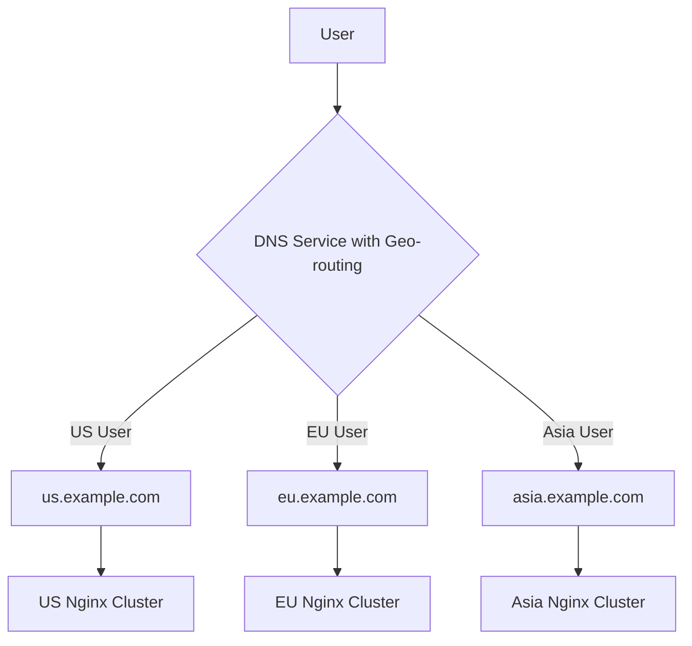

# Nginx Scalability Patterns

## Introduction

When your web application starts attracting more users, the ability to scale becomes crucial. Nginx, a high-performance web server and reverse proxy, offers numerous patterns and configurations to help your infrastructure grow smoothly with increasing demand.

In this guide, we'll explore proven scalability patterns for Nginx that allow you to handle higher traffic loads, improve reliability, and maintain performance as your application grows. Whether you're preparing for future growth or already facing scalability challenges, these patterns will help you build a robust infrastructure.

## Why Nginx for Scalability?

Before diving into specific patterns, let's understand why Nginx is particularly well-suited for scalable applications:

- **Event-driven architecture**: Unlike traditional web servers that create new processes or threads for each connection, Nginx uses an asynchronous, event-driven approach that can handle thousands of concurrent connections with minimal resources.
- **Low memory footprint**: Nginx is designed to be lightweight and efficient, making it ideal for both small and large deployments.
- **Modular design**: Its extensible architecture allows you to add only the functionality you need, keeping the core system lean and efficient.

Now, let's explore practical scalability patterns you can implement with Nginx.

## Pattern 1: Load Balancing

Load balancing is the practice of distributing network traffic across multiple servers to ensure no single server bears too much load.

### Basic HTTP Load Balancing

```nginx
http {
    upstream backend_servers {
        server backend1.example.com;
        server backend2.example.com;
        server backend3.example.com;
    }

    server {
        listen 80;
        server_name example.com;

        location / {
            proxy_pass http://backend_servers;
            proxy_set_header Host $host;
            proxy_set_header X-Real-IP $remote_addr;
        }
    }
}
```

In this configuration:
1. We define an `upstream` group named `backend_servers` that includes three backend servers.
2. In the server block, we use `proxy_pass` to forward requests to our upstream group.
3. Nginx distributes traffic among these servers using a round-robin algorithm by default.

### Load Balancing Methods

Nginx offers several load-balancing algorithms:

```nginx
upstream backend_servers {
    # Round-robin (default)
    server backend1.example.com;
    server backend2.example.com;

    # Least connections
    least_conn;
    
    # IP hash (session persistence)
    # ip_hash;
    
    # Generic hash
    # hash $request_uri consistent;
    
    # Server weights
    # server backend3.example.com weight=3;
    # server backend4.example.com weight=1;
}
```

- **Round-robin**: Requests are distributed evenly in sequential order
- **Least connections**: Requests go to the server with the fewest active connections
- **IP hash**: Requests from the same client IP always go to the same server (useful for session persistence)
- **Generic hash**: Routes based on a defined key (like URI), with optional "consistent" parameter for minimal redistribution when servers are added/removed
- **Weighted**: Allows you to send more requests to more powerful servers

### Health Checks

Ensure reliability by automatically removing unhealthy servers from the rotation:

```nginx
upstream backend_servers {
    server backend1.example.com max_fails=3 fail_timeout=30s;
    server backend2.example.com max_fails=3 fail_timeout=30s;
    server backup1.example.com backup;
}
```

This configuration:
- Marks a server as unavailable after 3 failed attempts
- Keeps it unavailable for 30 seconds before trying again
- Designates a backup server that receives requests only when primary servers are unavailable

For more advanced health checks, you can use the Nginx Plus commercial version or the open-source `nginx_upstream_check_module`.

## Pattern 2: Caching

Caching is a powerful way to reduce server load and improve response times by storing copies of frequently accessed resources.

### Basic Content Caching

```nginx
http {
    # Define cache path and settings
    proxy_cache_path /var/cache/nginx levels=1:2 keys_zone=my_cache:10m max_size=10g inactive=60m;
    
    server {
        listen 80;
        server_name example.com;
        
        location / {
            proxy_cache my_cache;
            proxy_cache_valid 200 302 10m;
            proxy_cache_valid 404 1m;
            proxy_pass http://backend_servers;
        }
    }
}
```

In this example:
- We create a cache zone named `my_cache` with 10MB of in-memory keys
- The cache can grow up to 10GB on disk
- Items become inactive after 60 minutes of non-use
- Different response codes have different cache durations (10 minutes for 200/302, 1 minute for 404)

### Cache Control and Bypassing

For more control over caching behavior:

```nginx
server {
    # ...
    
    # Add cache status to response headers (for debugging)
    add_header X-Cache-Status $upstream_cache_status;
    
    location / {
        proxy_cache my_cache;
        
        # Skip cache for certain requests
        proxy_cache_bypass $http_cache_control;
        
        # Don't cache requests with authorization headers
        proxy_no_cache $http_authorization;
        
        # Cache different content based on cookies
        proxy_cache_key "$scheme$request_method$host$request_uri$cookie_user";
        
        proxy_pass http://backend_servers;
    }
    
    # Don't cache dynamic content
    location ~ \.(php|cgi)$ {
        proxy_pass http://backend_servers;
        proxy_cache_bypass 1;
    }
}
```

This configuration gives you fine-grained control over what gets cached and when to bypass the cache.

## Pattern 3: Microcaching

Microcaching is a technique where dynamic content is cached for very short periods (often just a few seconds). This can dramatically reduce load during traffic spikes while keeping content fresh.

```nginx
http {
    proxy_cache_path /var/cache/nginx levels=1:2 keys_zone=microcache:10m max_size=1g;
    
    server {
        # ...
        
        location / {
            proxy_cache microcache;
            proxy_cache_valid 200 5s;  # Cache successful responses for just 5 seconds
            proxy_cache_lock on;       # Only allow one request to populate the cache
            proxy_cache_use_stale updating; # Serve stale content while updating
            proxy_pass http://backend_servers;
        }
    }
}
```

This pattern works well for content that changes frequently but can tolerate being a few seconds out of date. It's especially effective for protecting backend servers during sudden traffic spikes.

## Pattern 4: Connection Pooling

Nginx can maintain a pool of connections to upstream servers, reducing the overhead of creating new connections for each client request.

```nginx
http {
    upstream backend_servers {
        server backend1.example.com;
        server backend2.example.com;
        
        keepalive 32;  # Maintain up to 32 idle connections per worker process
    }
    
    server {
        # ...
        
        location / {
            proxy_pass http://backend_servers;
            proxy_http_version 1.1;           # Use HTTP/1.1 for upstream connections
            proxy_set_header Connection "";    # Remove Connection header for keepalive
        }
    }
}
```

Connection pooling is particularly beneficial when your Nginx server handles a high volume of short-lived requests to the same backend servers.

## Pattern 5: SSL Termination

Handling SSL/TLS encryption and decryption is CPU-intensive. By terminating SSL at the Nginx level, you can offload this work from your application servers.

```nginx
http {
    server {
        listen 443 ssl;
        server_name example.com;
        
        ssl_certificate /etc/nginx/ssl/example.com.crt;
        ssl_certificate_key /etc/nginx/ssl/example.com.key;
        
        # Optimize SSL settings
        ssl_session_cache shared:SSL:10m;
        ssl_session_timeout 10m;
        ssl_protocols TLSv1.2 TLSv1.3;
        ssl_prefer_server_ciphers on;
        ssl_ciphers "EECDH+AESGCM:EDH+AESGCM:AES256+EECDH:AES256+EDH";
        
        location / {
            proxy_pass http://backend_servers;  # Note: using HTTP, not HTTPS
            proxy_set_header X-Forwarded-Proto $scheme;
        }
    }
}
```

With this configuration:
1. Nginx handles all the SSL/TLS encryption and decryption
2. Backend servers receive plain HTTP traffic
3. The `X-Forwarded-Proto` header tells backends that the original request was HTTPS

## Pattern 6: Content Compression

Compressing responses can significantly reduce bandwidth usage and improve load times:

```nginx
http {
    # Enable gzip compression
    gzip on;
    gzip_comp_level 5;
    gzip_min_length 256;
    gzip_proxied any;
    gzip_vary on;
    
    # Compress common file types
    gzip_types
        application/javascript
        application/json
        application/xml
        text/css
        text/plain
        text/xml;
    
    server {
        # ...
    }
}
```

For even better compression, you can consider using Brotli compression if your Nginx build supports it:

```nginx
http {
    # Brotli compression (requires Nginx with Brotli module)
    brotli on;
    brotli_comp_level 6;
    brotli_types text/plain text/css application/javascript application/json application/xml;
    
    # ...
}
```

## Pattern 7: Rate Limiting

Protect your infrastructure from overload by limiting request rates:

```nginx
http {
    # Define limit zones
    limit_req_zone $binary_remote_addr zone=api_limit:10m rate=5r/s;
    limit_req_zone $binary_remote_addr zone=login_limit:10m rate=1r/s;
    
    server {
        # ...
        
        # API rate limiting (5 requests per second with burst of 10)
        location /api/ {
            limit_req zone=api_limit burst=10 nodelay;
            proxy_pass http://backend_servers;
        }
        
        # More strict rate limiting for login attempts
        location /login {
            limit_req zone=login_limit;
            proxy_pass http://backend_servers;
        }
    }
}
```

This configuration:
- Limits API requests to 5 per second per IP address
- Allows bursts of up to 10 requests without delay
- Restricts login attempts to 1 per second per IP

Rate limiting helps prevent denial of service attacks and ensures fair resource allocation among clients.

## Pattern 8: Worker Process Optimization

Fine-tune Nginx's worker processes for optimal performance:

```nginx
# Set in the main context (outside http, events, etc.)
worker_processes auto;      # Let Nginx detect the optimal number based on CPU cores
worker_rlimit_nofile 65535; # Increase system limits for file descriptors

events {
    worker_connections 4096;   # Max connections per worker
    multi_accept on;           # Accept as many connections as possible
    use epoll;                 # Use efficient connection method on Linux
}
```

For more advanced cases, you might want to bind workers to specific CPU cores:

```nginx
worker_processes 4;
worker_cpu_affinity 0001 0010 0100 1000;
```

## Pattern 9: Sharding by Content Type

Route different types of content to specialized server groups:

```nginx
http {
    upstream static_servers {
        server static1.example.com;
        server static2.example.com;
    }
    
    upstream api_servers {
        server api1.example.com;
        server api2.example.com;
    }
    
    upstream app_servers {
        server app1.example.com;
        server app2.example.com;
    }
    
    server {
        listen 80;
        server_name example.com;
        
        # Static content (images, CSS, JS)
        location ~* \.(jpg|jpeg|png|gif|ico|css|js)$ {
            proxy_pass http://static_servers;
            proxy_cache static_cache;
            expires 30d;
        }
        
        # API requests
        location /api/ {
            proxy_pass http://api_servers;
        }
        
        # Application pages
        location / {
            proxy_pass http://app_servers;
        }
    }
}
```

This pattern allows you to:
- Optimize each server group for its specific workload
- Scale different components independently based on demand
- Apply different caching, rate limiting, and other policies per content type

## Pattern 10: Geographic Distribution with Split DNS

For global applications, you can distribute traffic to the nearest datacenter:



Each regional Nginx cluster can then be configured with local backends:

```nginx
# Configuration for US cluster
http {
    upstream local_backends {
        server us-backend1.example.com;
        server us-backend2.example.com;
    }
    
    # For requests that need to go to other regions
    upstream eu_backends {
        server eu-proxy.example.com;
    }
    
    server {
        listen 80;
        server_name us.example.com;
        
        location / {
            proxy_pass http://local_backends;
        }
        
        # Special case: EU-specific content
        location /eu-content/ {
            proxy_pass http://eu_backends;
        }
    }
}
```

This pattern reduces latency for users and increases application resilience against regional outages.

## Implementation Walkthrough: Building a Scalable Web Application

Let's put these patterns together in a practical example: a web application with static content, dynamic pages, and an API.

### Step 1: Set Up the Basic Configuration

```nginx
user nginx;
worker_processes auto;
error_log /var/log/nginx/error.log warn;
pid /var/run/nginx.pid;

events {
    worker_connections 4096;
    multi_accept on;
}

http {
    include /etc/nginx/mime.types;
    default_type application/octet-stream;
    
    log_format main '$remote_addr - $remote_user [$time_local] "$request" '
                    '$status $body_bytes_sent "$http_referer" '
                    '"$http_user_agent" "$http_x_forwarded_for"';
    
    access_log /var/log/nginx/access.log main;
    
    sendfile on;
    tcp_nopush on;
    tcp_nodelay on;
    keepalive_timeout 65;
    types_hash_max_size 2048;
    
    # Gzip Settings
    gzip on;
    gzip_disable "msie6";
    gzip_vary on;
    gzip_proxied any;
    gzip_comp_level 6;
    gzip_buffers 16 8k;
    gzip_http_version 1.1;
    gzip_min_length 256;
    gzip_types text/plain text/css application/json application/javascript text/xml application/xml application/xml+rss text/javascript;
}
```

### Step 2: Define Cache Zones

```nginx
http {
    # ... previous settings ...
    
    # Cache zones
    proxy_cache_path /var/cache/nginx/static levels=1:2 keys_zone=static_cache:10m max_size=5g inactive=1d;
    proxy_cache_path /var/cache/nginx/api levels=1:2 keys_zone=api_cache:10m max_size=1g inactive=1h;
    proxy_cache_path /var/cache/nginx/pages levels=1:2 keys_zone=page_cache:10m max_size=2g inactive=30m;
}
```

### Step 3: Set Up Upstream Servers

```nginx
http {
    # ... previous settings ...
    
    # Backend server groups
    upstream static_servers {
        server static1.example.com;
        server static2.example.com;
    }
    
    upstream api_servers {
        least_conn;
        server api1.example.com max_fails=3 fail_timeout=30s;
        server api2.example.com max_fails=3 fail_timeout=30s;
        server api3.example.com max_fails=3 fail_timeout=30s;
        keepalive 32;
    }
    
    upstream app_servers {
        ip_hash;  # Session persistence
        server app1.example.com;
        server app2.example.com;
        server app3.example.com;
        server app4.example.com;
    }
}
```

### Step 4: Configure Rate Limiting

```nginx
http {
    # ... previous settings ...
    
    # Rate limiting
    limit_req_zone $binary_remote_addr zone=api_limit:10m rate=10r/s;
    limit_req_zone $binary_remote_addr zone=login_limit:10m rate=1r/s;
}
```

### Step 5: Create Virtual Host Configuration

```nginx
http {
    # ... previous settings ...
    
    server {
        listen 80;
        server_name example.com www.example.com;
        
        # Redirect to HTTPS
        return 301 https://$host$request_uri;
    }
    
    server {
        listen 443 ssl http2;
        server_name example.com www.example.com;
        
        # SSL Configuration
        ssl_certificate /etc/nginx/ssl/example.com.crt;
        ssl_certificate_key /etc/nginx/ssl/example.com.key;
        ssl_session_cache shared:SSL:10m;
        ssl_session_timeout 10m;
        ssl_protocols TLSv1.2 TLSv1.3;
        ssl_prefer_server_ciphers on;
        ssl_ciphers "EECDH+AESGCM:EDH+AESGCM:AES256+EECDH:AES256+EDH";
        
        # Static assets with aggressive caching
        location ~* \.(jpg|jpeg|png|gif|ico|css|js|woff|woff2)$ {
            proxy_pass http://static_servers;
            proxy_cache static_cache;
            proxy_cache_valid 200 302 304 30d;
            expires 30d;
            add_header Cache-Control "public, max-age=2592000";
            add_header X-Cache-Status $upstream_cache_status;
        }
        
        # API with rate limiting and short caching
        location /api/ {
            proxy_pass http://api_servers;
            proxy_http_version 1.1;
            proxy_set_header Connection "";
            proxy_cache api_cache;
            proxy_cache_valid 200 60s;  # Short cache for API responses
            proxy_cache_methods GET HEAD;
            limit_req zone=api_limit burst=20 nodelay;
            add_header X-Cache-Status $upstream_cache_status;
        }
        
        # Login with stricter rate limiting
        location /login {
            proxy_pass http://app_servers;
            limit_req zone=login_limit burst=5 nodelay;
        }
        
        # Application pages with microcaching
        location / {
            proxy_pass http://app_servers;
            proxy_cache page_cache;
            proxy_cache_valid 200 30s;  # Microcaching
            proxy_cache_lock on;
            proxy_cache_use_stale updating;
            add_header X-Cache-Status $upstream_cache_status;
        }
    }
}
```

This comprehensive example brings together multiple scalability patterns:
- SSL termination at the Nginx level
- Content-based routing to specialized backends
- Different caching strategies per content type
- Connection pooling for APIs
- Session persistence for application pages
- Rate limiting for APIs and login
- Microcaching for dynamic content
- Content compression with gzip

## Monitoring and Fine-Tuning

Once you've implemented these patterns, monitor your Nginx performance to identify bottlenecks and opportunities for improvement.

Key metrics to watch:
- **Request processing time**: Average and 95th percentile response time
- **Cache hit ratio**: Percentage of requests served from cache
- **Connection counts**: Active and waiting connections
- **Worker utilization**: CPU and memory usage per worker
- **Network throughput**: Bandwidth consumption
- **Error rates**: 4xx and 5xx responses

The open-source Nginx status module provides basic metrics:

```nginx
server {
    # ...
    
    # Status page (restrict access)
    location /nginx_status {
        stub_status on;
        allow 127.0.0.1;  # Only allow access from localhost
        deny all;
    }
}
```

For more comprehensive monitoring, consider tools like Prometheus with the Nginx exporter, Datadog, or New Relic.

## Summary

Nginx provides a powerful platform for building scalable web applications through patterns like:

1. **Load balancing** to distribute traffic across multiple servers
2. **Caching** to reduce backend load and improve response times
3. **Microcaching** for short-term caching of dynamic content
4. **Connection pooling** to reuse backend connections
5. **SSL termination** to offload encryption overhead
6. **Content compression** to reduce bandwidth usage
7. **Rate limiting** to protect against overload
8. **Worker process optimization** to maximize hardware utilization
9. **Content-based sharding** to specialize server groups
10. **Geographic distribution** to reduce latency and improve resilience

By implementing these patterns strategically, you can build an Nginx configuration that scales efficiently with your application's growth.

## Additional Resources

- [Nginx Official Documentation](https://nginx.org/en/docs/)
- [High Performance Browser Networking](https://hpbn.co/) by Ilya Grigorik
- [Nginx Cookbook](https://www.nginx.com/resources/library/complete-nginx-cookbook/) by Derek DeJonghe

## Exercises

1. **Basic load balancer**: Set up a simple Nginx load balancer with two backend servers and verify that traffic is being distributed.

2. **Caching experiment**: Configure caching for static assets and measure the performance improvement using tools like Apache Benchmark (ab) or wrk.

3. **Rate limiting test**: Implement rate limiting for an API endpoint and test how it handles traffic spikes.

4. **Scaling simulation**: Use Docker to create multiple backend instances and configure Nginx to load balance between them, then gradually scale up and down while monitoring performance.

5. **Advanced challenge**: Implement a blue-green deployment setup using Nginx as the traffic switch. Create a configuration that allows you to gradually shift traffic from one version of your application to another.