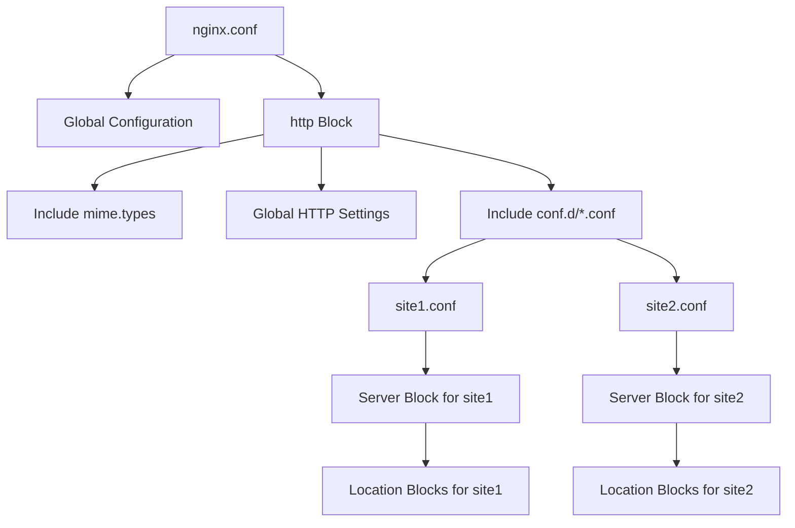

# Nginx Config Management

## Introduction

Nginx (pronounced "engine-x") is a powerful web server and reverse proxy that's known for its high performance, stability, and rich feature set. One of its key strengths is its flexible configuration system. However, with this flexibility comes complexity, making proper configuration management essential, especially in production environments.

This guide will walk you through best practices for managing Nginx configurations, from basic structure to advanced techniques that will help you maintain clean, efficient, and secure server setups.

## Understanding Nginx Configuration Structure

Nginx uses a hierarchical configuration system with a main configuration file that includes other configuration files. Let's look at the typical structure:

```
/etc/nginx/
├── nginx.conf                 # Main configuration file
├── conf.d/                    # Directory for additional configurations
│   ├── default.conf
│   └── example.com.conf
├── sites-available/           # Available site configurations
│   ├── default
│   └── example.com
├── sites-enabled/             # Enabled site configurations (symlinks)
│   ├── default -> ../sites-available/default
│   └── example.com -> ../sites-available/example.com
├── snippets/                  # Reusable configuration snippets
│   ├── ssl-params.conf
│   └── fastcgi-php.conf
└── modules-enabled/           # Enabled modules (symlinks)
    └── 50-mod-http-geoip.conf
```

### The Main Configuration File

The heart of Nginx configuration is the `nginx.conf` file. Here's a basic example:

```nginx
user nginx;
worker_processes auto;
error_log /var/log/nginx/error.log warn;
pid /var/run/nginx.pid;

events {
    worker_connections 1024;
}

http {
    include /etc/nginx/mime.types;
    default_type application/octet-stream;

    log_format main '$remote_addr - $remote_user [$time_local] "$request" '
                    '$status $body_bytes_sent "$http_referer" '
                    '"$http_user_agent" "$http_x_forwarded_for"';

    access_log /var/log/nginx/access.log main;

    sendfile on;
    keepalive_timeout 65;

    include /etc/nginx/conf.d/*.conf;
}
```

This file defines global settings and includes additional configuration files from the `conf.d` directory.

## Best Practices for Nginx Configuration Management

### 1. Use Include Directives for Modular Configurations

Break your configuration into logical modules using the `include` directive. This keeps your configuration organized and maintainable.

```nginx
# In nginx.conf
http {
    # Basic settings
    include /etc/nginx/mime.types;
    include /etc/nginx/snippets/basic.conf;
    
    # SSL configuration
    include /etc/nginx/snippets/ssl-params.conf;
    
    # Site configurations
    include /etc/nginx/sites-enabled/*;
}
```

### 2. Implement the Sites-Available/Sites-Enabled Pattern

This pattern allows you to manage site configurations efficiently:

1. Create site configurations in the `sites-available` directory
2. Enable sites by creating symbolic links in `sites-enabled`

```bash
# Creating a new site configuration
sudo nano /etc/nginx/sites-available/example.com

# Enabling the site
sudo ln -s /etc/nginx/sites-available/example.com /etc/nginx/sites-enabled/

# Disabling a site (simply remove the symlink)
sudo rm /etc/nginx/sites-enabled/example.com
```

This approach makes it easy to enable or disable sites without deleting their configurations.

### 3. Use Environment-Specific Configuration Files

Maintain different configurations for development, staging, and production environments:

```
/etc/nginx/
├── environments/
│   ├── development/
│   │   └── example.com.conf
│   ├── staging/
│   │   └── example.com.conf
│   └── production/
│       └── example.com.conf
```

You can use symbolic links to point to the current environment:

```bash
# Link the production configuration
sudo ln -sf /etc/nginx/environments/production/example.com.conf /etc/nginx/sites-available/example.com
```

### 4. Create Reusable Configuration Snippets

Store common configuration blocks in the `snippets` directory:

```nginx
# /etc/nginx/snippets/ssl-params.conf
ssl_protocols TLSv1.2 TLSv1.3;
ssl_prefer_server_ciphers on;
ssl_ciphers ECDHE-ECDSA-AES128-GCM-SHA256:ECDHE-RSA-AES128-GCM-SHA256;
ssl_session_timeout 1d;
ssl_session_cache shared:SSL:10m;
ssl_session_tickets off;
```

Then include these snippets in your site configurations:

```nginx
server {
    listen 443 ssl http2;
    server_name example.com;
    
    include snippets/ssl-params.conf;
    
    # Site-specific configuration here
}
```

### 5. Implement Version Control for Configurations

Track changes to your Nginx configurations using Git or another version control system:

```bash
# Initialize a Git repository
cd /etc/nginx
sudo git init

# Add and commit your configurations
sudo git add .
sudo git commit -m "Initial configuration"

# Before making changes, commit the current state
sudo git commit -am "Before implementing SSL changes"
```

This approach provides:
- Change history
- Easy rollbacks
- Documentation of why changes were made (through commit messages)

### 6. Validate Configurations Before Applying

Always test your configuration changes before reloading Nginx:

```bash
# Check syntax
sudo nginx -t

# Example output:
# nginx: the configuration file /etc/nginx/nginx.conf syntax is ok
# nginx: configuration file /etc/nginx/nginx.conf test is successful
```

### 7. Use Configuration Templates

For deployments across multiple servers, use templates with environment-specific variables:

```nginx
# template.conf
server {
    listen 80;
    server_name ${SERVER_NAME};
    root ${DOCUMENT_ROOT};
    
    location / {
        try_files $uri $uri/ /index.php?$args;
    }
}
```

Then generate the actual configuration using a script or deployment tool:

```bash
#!/bin/bash
# generate-config.sh
export SERVER_NAME="example.com"
export DOCUMENT_ROOT="/var/www/example.com"

envsubst '${SERVER_NAME} ${DOCUMENT_ROOT}' < template.conf > /etc/nginx/sites-available/example.com.conf
```

## Practical Example: Complete Server Block Configuration

Here's a comprehensive example of a server block configuration for a typical website:

```nginx
# /etc/nginx/sites-available/example.com
server {
    listen 80;
    server_name example.com www.example.com;
    
    # Redirect to HTTPS
    return 301 https://example.com$request_uri;
}

server {
    listen 443 ssl http2;
    server_name www.example.com;
    
    # SSL configuration
    include snippets/ssl-params.conf;
    ssl_certificate /etc/letsencrypt/live/example.com/fullchain.pem;
    ssl_certificate_key /etc/letsencrypt/live/example.com/privkey.pem;
    
    # Redirect www to non-www
    return 301 https://example.com$request_uri;
}

server {
    listen 443 ssl http2;
    server_name example.com;
    
    # SSL configuration
    include snippets/ssl-params.conf;
    ssl_certificate /etc/letsencrypt/live/example.com/fullchain.pem;
    ssl_certificate_key /etc/letsencrypt/live/example.com/privkey.pem;
    
    # Security headers
    add_header X-Frame-Options "SAMEORIGIN" always;
    add_header X-Content-Type-Options "nosniff" always;
    add_header X-XSS-Protection "1; mode=block" always;
    add_header Referrer-Policy "no-referrer-when-downgrade" always;
    
    # Logging
    access_log /var/log/nginx/example.com.access.log;
    error_log /var/log/nginx/example.com.error.log;
    
    # Root directory and index files
    root /var/www/example.com/public;
    index index.php index.html;
    
    # Main location block
    location / {
        try_files $uri $uri/ /index.php?$query_string;
    }
    
    # Static files handling
    location ~* \.(js|css|png|jpg|jpeg|gif|ico|svg)$ {
        expires max;
        log_not_found off;
        access_log off;
    }
    
    # PHP handling
    location ~ \.php$ {
        include snippets/fastcgi-php.conf;
        fastcgi_pass unix:/var/run/php/php8.0-fpm.sock;
    }
    
    # Deny access to hidden files
    location ~ /\.(?!well-known) {
        deny all;
    }
}
```

## Managing Nginx Configuration with Docker

When using Nginx with Docker, you can manage configurations by mounting volumes:

```yaml
# docker-compose.yml
version: '3'
services:
  nginx:
    image: nginx:alpine
    volumes:
      - ./nginx/nginx.conf:/etc/nginx/nginx.conf:ro
      - ./nginx/conf.d:/etc/nginx/conf.d:ro
      - ./nginx/ssl:/etc/nginx/ssl:ro
    ports:
      - "80:80"
      - "443:443"
```

## Configuration Flow Visualization

Here's a diagram showing how Nginx processes configuration files:



## Automated Configuration Management

For larger deployments, consider using automation tools:

### Using Ansible for Nginx Configuration

```yaml
# nginx-playbook.yml
- hosts: webservers
  tasks:
    - name: Install Nginx
      apt:
        name: nginx
        state: present
        
    - name: Copy nginx configuration
      template:
        src: templates/nginx.conf.j2
        dest: /etc/nginx/nginx.conf
        
    - name: Copy site configuration
      template:
        src: templates/site.conf.j2
        dest: /etc/nginx/sites-available/{{ item.domain }}
      with_items: "{{ websites }}"
      
    - name: Enable sites
      file:
        src: /etc/nginx/sites-available/{{ item.domain }}
        dest: /etc/nginx/sites-enabled/{{ item.domain }}
        state: link
      with_items: "{{ websites }}"
      
    - name: Test and reload nginx
      shell: nginx -t && systemctl reload nginx
```

## Troubleshooting Nginx Configuration Issues

Common configuration issues and their solutions:

### 1. Syntax Errors

```bash
# Check for syntax errors
sudo nginx -t

# Fix permissions if needed
sudo chmod 644 /etc/nginx/sites-available/*
sudo chown -R root:root /etc/nginx/
```

### 2. 502 Bad Gateway Errors

Often caused by upstream server issues:

```nginx
# Increase timeouts
proxy_connect_timeout 600;
proxy_send_timeout 600;
proxy_read_timeout 600;
send_timeout 600;

# Check logs
error_log /var/log/nginx/error.log debug;
```

### 3. Performance Issues

```nginx
# Add caching
proxy_cache_path /var/cache/nginx levels=1:2 keys_zone=my_cache:10m max_size=1g inactive=60m;
proxy_cache_key "$scheme$request_method$host$request_uri";

location / {
    proxy_pass http://backend;
    proxy_cache my_cache;
    proxy_cache_valid 200 302 10m;
    proxy_cache_valid 404 1m;
}
```

## Summary

Effective Nginx configuration management is crucial for maintaining reliable, secure, and high-performing web servers. Key takeaways include:

1. Organize configurations in a modular, hierarchical structure
2. Use the sites-available/sites-enabled pattern for flexibility
3. Create reusable snippets for common configuration blocks
4. Implement version control to track changes
5. Always validate configurations before applying
6. Use templates for consistent deployments across environments
7. Consider automation tools for larger deployments

By following these practices, you'll be able to manage your Nginx configurations more efficiently, reduce errors, and make your infrastructure more maintainable.

## Additional Resources

- [Official Nginx Documentation](https://nginx.org/en/docs/)
- [Nginx Configuration Examples](https://www.nginx.com/resources/wiki/start/topics/examples/full/)
- [Mozilla SSL Configuration Generator](https://ssl-config.mozilla.org/)

## Exercises

1. Create a basic Nginx configuration for a static website with proper caching headers.
2. Set up a reverse proxy configuration that forwards requests to a backend application server.
3. Implement a configuration for load balancing between multiple backend servers.
4. Create a configuration template that can be used across development, staging, and production environments.
5. Set up HTTPS with Let's Encrypt certificates for your Nginx server.