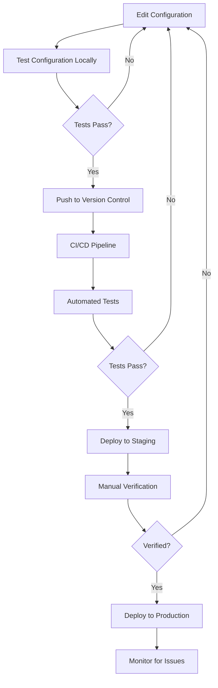

# Nginx Production Checklist

## Introduction

Deploying Nginx in production requires careful consideration of security, performance, and reliability. This checklist will guide you through the essential steps to ensure your Nginx server is properly configured for a production environment. Whether you're hosting a simple website or a complex web application, following these best practices will help you create a robust, secure, and efficient setup.

Nginx (pronounced "engine-x") is a popular web server, reverse proxy, and load balancer known for its high performance, stability, and low resource consumption. When moving from development to production, it's critical to properly configure Nginx to handle real-world traffic and potential security threats.

## Pre-Deployment Preparation

### Update to the Latest Stable Version

Always use the latest stable version of Nginx to benefit from security patches and performance improvements.

```bash
# Check current version
nginx -v

# Update on Ubuntu/Debian
sudo apt update
sudo apt upgrade nginx

# Update on CentOS/RHEL
sudo yum update nginx
```

### Choose the Right Nginx Flavor

Depending on your needs, consider using:

- **Nginx Open Source**: The free, community version
- **Nginx Plus**: Commercial version with additional features like advanced load balancing and monitoring
- **OpenResty**: Nginx bundled with LuaJIT for extended functionality
- **Tengine**: Alibaba's fork with additional features

## Essential Configuration Best Practices

### Basic Configuration Structure

Keep your configuration organized using include directives:

```nginx
# Main nginx.conf
http {
    include /etc/nginx/conf.d/*.conf;
    include /etc/nginx/sites-enabled/*;
}
```

### Server Blocks (Virtual Hosts)

Use separate server blocks for each domain:

```nginx
# /etc/nginx/sites-available/example.com.conf
server {
    listen 80;
    server_name example.com www.example.com;
    
    root /var/www/example.com;
    index index.html;
    
    # Additional configuration
}
```

### Enable HTTPS

In production, HTTPS is mandatory for security:

```nginx
server {
    listen 443 ssl http2;
    server_name example.com www.example.com;
    
    ssl_certificate /etc/nginx/ssl/example.com.crt;
    ssl_certificate_key /etc/nginx/ssl/example.com.key;
    
    # Rest of configuration
}
```

Let's Encrypt provides free SSL certificates:

```bash
# Install certbot
sudo apt install certbot python3-certbot-nginx

# Get a certificate
sudo certbot --nginx -d example.com -d www.example.com
```

### Redirect HTTP to HTTPS

Force all traffic to use HTTPS:

```nginx
server {
    listen 80;
    server_name example.com www.example.com;
    return 301 https://$host$request_uri;
}
```

## Security Hardening

### Hide Server Information

Prevent exposing Nginx version information:

```nginx
# In http block
http {
    server_tokens off;
}
```

### Configure Security Headers

Add security headers to protect against common vulnerabilities:

```nginx
server {
    # Other configuration
    
    # Security headers
    add_header X-Content-Type-Options "nosniff" always;
    add_header X-Frame-Options "SAMEORIGIN" always;
    add_header X-XSS-Protection "1; mode=block" always;
    add_header Referrer-Policy "strict-origin-when-cross-origin" always;
    add_header Content-Security-Policy "default-src 'self';" always;
}
```

### Implement Rate Limiting

Protect against brute force attacks and DoS attempts:

```nginx
http {
    # Define a zone
    limit_req_zone $binary_remote_addr zone=one:10m rate=1r/s;
    
    server {
        # Apply rate limiting to login endpoint
        location /login {
            limit_req zone=one burst=5;
            # Other configuration
        }
    }
}
```

### Configure Allowed Methods

Restrict HTTP methods to only those needed:

```nginx
server {
    # Other configuration
    
    # Only allow GET, HEAD, and POST requests
    if ($request_method !~ ^(GET|HEAD|POST)$) {
        return 444;
    }
}
```

### Secure File Access

Prevent access to sensitive files:

```nginx
server {
    # Deny access to hidden files
    location ~ /\. {
        deny all;
    }
    
    # Deny access to backup files
    location ~ ~$ {
        deny all;
    }
}
```

## Performance Optimization

### Enable Gzip Compression

Reduce bandwidth and improve loading times:

```nginx
http {
    gzip on;
    gzip_comp_level 5;
    gzip_min_length 256;
    gzip_proxied any;
    gzip_vary on;
    gzip_types
        application/javascript
        application/json
        application/xml
        text/css
        text/plain
        text/xml;
}
```

### Configure Worker Processes and Connections

Optimize based on your server's resources:

```nginx
# Automatically set worker processes based on CPU cores
worker_processes auto;

events {
    # Increase worker connections based on your server capacity
    worker_connections 1024;
    multi_accept on;
}
```

### Set Up Buffers and Timeouts

Configure appropriate buffer sizes and timeouts:

```nginx
http {
    # Client buffer size
    client_body_buffer_size 10k;
    client_header_buffer_size 1k;
    client_max_body_size 8m;
    large_client_header_buffers 2 1k;
    
    # Timeouts
    client_body_timeout 12;
    client_header_timeout 12;
    keepalive_timeout 15;
    send_timeout 10;
}
```

### Configure Caching

Enable caching for static content:

```nginx
http {
    # Define cache path
    proxy_cache_path /var/cache/nginx levels=1:2 keys_zone=my_cache:10m max_size=1g inactive=60m;
    
    server {
        # Apply caching to static content
        location ~* \.(jpg|jpeg|png|gif|ico|css|js)$ {
            expires 1y;
            add_header Cache-Control "public, max-age=31536000";
        }
        
        # Cache API responses
        location /api/ {
            proxy_pass http://backend_server;
            proxy_cache my_cache;
            proxy_cache_valid 200 302 10m;
            proxy_cache_valid 404 1m;
        }
    }
}
```

## Logging and Monitoring

### Configure Proper Logging

Set up detailed logs without exposing sensitive information:

```nginx
http {
    # Define log format
    log_format main '$remote_addr - $remote_user [$time_local] "$request" '
                     '$status $body_bytes_sent "$http_referer" '
                     '"$http_user_agent" "$http_x_forwarded_for"';
    
    # Apply log format
    access_log /var/log/nginx/access.log main;
    error_log /var/log/nginx/error.log warn;
    
    server {
        # Site-specific logs
        access_log /var/log/nginx/example.com.access.log main;
        error_log /var/log/nginx/example.com.error.log warn;
    }
}
```

### Log Rotation

Set up log rotation to manage log files:

```bash
# /etc/logrotate.d/nginx
/var/log/nginx/*.log {
    daily
    missingok
    rotate 14
    compress
    delaycompress
    notifempty
    create 0640 www-data adm
    sharedscripts
    postrotate
        [ -s /run/nginx.pid ] && kill -USR1 `cat /run/nginx.pid`
    endscript
}
```

### Set Up Monitoring

Integrate with monitoring tools by enabling the Nginx status page:

```nginx
server {
    # Other configuration
    
    # Status page only accessible from localhost
    location /nginx_status {
        stub_status on;
        access_log off;
        allow 127.0.0.1;
        deny all;
    }
}
```

## High Availability and Load Balancing

### Configure Upstream Servers

Set up load balancing across multiple backend servers:

```nginx
http {
    upstream backend {
        server backend1.example.com weight=3;
        server backend2.example.com;
        server backup1.example.com backup;
        
        keepalive 16;
    }
    
    server {
        location / {
            proxy_pass http://backend;
            proxy_http_version 1.1;
            proxy_set_header Connection "";
        }
    }
}
```

### Load Balancing Methods

Choose the appropriate load balancing algorithm:

```nginx
upstream backend {
    # Round Robin (default)
    server backend1.example.com;
    server backend2.example.com;
    
    # Or least connections
    least_conn;
    
    # Or IP hash for session persistence
    ip_hash;
}
```

## Configuration Testing and Deployment

### Test Configuration Before Applying

Always verify your configuration before reloading Nginx:

```bash
# Test configuration
sudo nginx -t

# Apply configuration if test passes
sudo nginx -s reload
```

### Continuous Integration Workflow



## Production Deployment Checklist

Use this checklist before going live:

1. ✅ Latest stable Nginx version installed
2. ✅ HTTPS configured with proper certificates
3. ✅ HTTP to HTTPS redirection enabled
4. ✅ Security headers implemented
5. ✅ Server information hidden
6. ✅ Rate limiting configured
7. ✅ Gzip compression enabled
8. ✅ Worker processes and connections optimized
9. ✅ Buffers and timeouts configured
10. ✅ File access restrictions in place
11. ✅ Caching strategy implemented
12. ✅ Proper logging configured
13. ✅ Log rotation set up
14. ✅ Monitoring enabled
15. ✅ Backup and disaster recovery plan in place
16. ✅ Configuration tested and validated

## Real-World Example: Complete Production Server Block

Here's a comprehensive example that incorporates many of the best practices discussed:

```nginx
server {
    listen 80;
    server_name example.com www.example.com;
    return 301 https://$host$request_uri;
}

server {
    listen 443 ssl http2;
    server_name example.com www.example.com;
    
    # SSL Configuration
    ssl_certificate /etc/letsencrypt/live/example.com/fullchain.pem;
    ssl_certificate_key /etc/letsencrypt/live/example.com/privkey.pem;
    ssl_trusted_certificate /etc/letsencrypt/live/example.com/chain.pem;
    
    ssl_protocols TLSv1.2 TLSv1.3;
    ssl_prefer_server_ciphers on;
    ssl_ciphers ECDHE-ECDSA-AES128-GCM-SHA256:ECDHE-RSA-AES128-GCM-SHA256:ECDHE-ECDSA-AES256-GCM-SHA384:ECDHE-RSA-AES256-GCM-SHA384:ECDHE-ECDSA-CHACHA20-POLY1305:ECDHE-RSA-CHACHA20-POLY1305:DHE-RSA-AES128-GCM-SHA256:DHE-RSA-AES256-GCM-SHA384;
    
    ssl_session_timeout 1d;
    ssl_session_cache shared:SSL:10m;
    ssl_session_tickets off;
    
    ssl_stapling on;
    ssl_stapling_verify on;
    resolver 8.8.8.8 8.8.4.4 valid=300s;
    resolver_timeout 5s;
    
    # Security headers
    add_header Strict-Transport-Security "max-age=63072000; includeSubDomains; preload" always;
    add_header X-Content-Type-Options "nosniff" always;
    add_header X-Frame-Options "SAMEORIGIN" always;
    add_header X-XSS-Protection "1; mode=block" always;
    add_header Referrer-Policy "strict-origin-when-cross-origin" always;
    add_header Content-Security-Policy "default-src 'self'; script-src 'self' 'unsafe-inline' 'unsafe-eval' https://www.google-analytics.com; img-src 'self' data: https://www.google-analytics.com; style-src 'self' 'unsafe-inline'; font-src 'self'; connect-src 'self'; frame-ancestors 'none'; form-action 'self';" always;
    
    # Root directory and index files
    root /var/www/example.com/public;
    index index.html index.htm index.php;
    
    # Logs
    access_log /var/log/nginx/example.com.access.log main;
    error_log /var/log/nginx/example.com.error.log warn;
    
    # Gzip
    gzip on;
    gzip_vary on;
    gzip_proxied any;
    gzip_comp_level 6;
    gzip_types text/plain text/css text/xml application/json application/javascript application/xml+rss application/atom+xml image/svg+xml;
    
    # Deny access to hidden files
    location ~ /\. {
        deny all;
    }
    
    # Static file caching
    location ~* \.(jpg|jpeg|png|gif|ico|css|js|svg|woff|woff2|ttf|eot)$ {
        expires 1y;
        add_header Cache-Control "public, max-age=31536000";
        access_log off;
    }
    
    # PHP handling
    location ~ \.php$ {
        try_files $uri =404;
        fastcgi_pass unix:/var/run/php/php8.0-fpm.sock;
        fastcgi_index index.php;
        fastcgi_param SCRIPT_FILENAME $document_root$fastcgi_script_name;
        include fastcgi_params;
        fastcgi_intercept_errors on;
        fastcgi_buffer_size 16k;
        fastcgi_buffers 4 16k;
    }
    
    # API proxy with caching
    location /api/ {
        proxy_pass http://backend;
        proxy_http_version 1.1;
        proxy_set_header Host $host;
        proxy_set_header X-Real-IP $remote_addr;
        proxy_set_header X-Forwarded-For $proxy_add_x_forwarded_for;
        proxy_set_header X-Forwarded-Proto $scheme;
        
        proxy_cache api_cache;
        proxy_cache_valid 200 10m;
        proxy_cache_bypass $http_pragma;
        add_header X-Cache-Status $upstream_cache_status;
        
        proxy_connect_timeout 5s;
        proxy_send_timeout 10s;
        proxy_read_timeout 10s;
    }
    
    # Default location block
    location / {
        try_files $uri $uri/ /index.php?$query_string;
    }
}
```

## Maintenance Best Practices

### Regular Updates and Patches

Schedule regular maintenance windows to apply updates:

```bash
# Set up unattended upgrades for security patches
sudo apt install unattended-upgrades
sudo dpkg-reconfigure -plow unattended-upgrades
```

### Backup Strategy

Regularly back up your Nginx configuration:

```bash
# Create a backup script
#!/bin/bash
BACKUP_DIR="/backup/nginx/$(date +%Y%m%d)"
mkdir -p $BACKUP_DIR
cp -R /etc/nginx/* $BACKUP_DIR
tar -czf $BACKUP_DIR.tar.gz $BACKUP_DIR
rm -rf $BACKUP_DIR
```

## Summary

This Nginx production checklist covers the essential aspects of deploying Nginx in a production environment:

1. **Pre-Deployment Preparation**: Keep Nginx updated and choose the right flavor for your needs.
2. **Essential Configuration**: Organize your configuration, set up server blocks, and enable HTTPS.
3. **Security Hardening**: Hide server information, add security headers, implement rate limiting, and restrict file access.
4. **Performance Optimization**: Enable compression, optimize workers and connections, configure buffers and timeouts, and set up caching.
5. **Logging and Monitoring**: Configure proper logging, set up log rotation, and enable monitoring.
6. **High Availability**: Set up load balancing and choose appropriate balancing methods.
7. **Testing and Deployment**: Test configurations before applying and establish a CI/CD workflow.
8. **Maintenance**: Keep Nginx updated and back up configurations regularly.

By following these best practices, you'll ensure your Nginx server is secure, performant, and reliable in a production environment.

## Additional Resources

- [Official Nginx Documentation](https://nginx.org/en/docs/)
- [Nginx Security Hardening Guide](https://www.nginx.com/blog/security-hardening-nginx/)
- [Mozilla SSL Configuration Generator](https://ssl-config.mozilla.org/)
- [Nginx Tuning for Best Performance](https://www.nginx.com/blog/tuning-nginx/)

## Exercises

1. Set up a basic Nginx server with HTTPS using Let's Encrypt.
2. Configure rate limiting to protect a login endpoint.
3. Implement a caching strategy for a website with static and dynamic content.
4. Set up a load balancer to distribute traffic across two backend servers.
5. Create a monitoring dashboard for your Nginx server using Prometheus and Grafana.