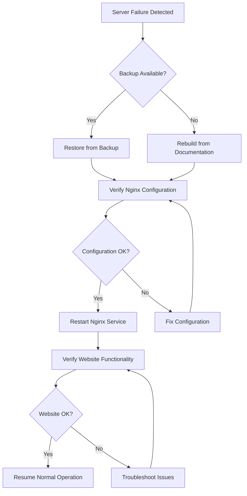

# Nginx Backup Strategies

## Introduction

Backup strategies are a critical aspect of maintaining reliable Nginx web server deployments. Even the most robust infrastructure can experience unexpected failures, configuration errors, or security breaches. Having a comprehensive backup plan ensures you can quickly restore your services with minimal downtime.

This guide will walk you through various approaches to backing up your Nginx environment, from configuration files to entire server states. Whether you're running a small personal website or managing enterprise-level infrastructure, these backup strategies will help protect your Nginx deployments.

## Why Backup Your Nginx Environment?

Before diving into specific backup strategies, let's understand why backing up your Nginx environment is essential:

1. **Disaster Recovery**: Quickly restore your web services after hardware failures, software issues, or other disasters.
2. **Configuration Management**: Maintain snapshots of working configurations before making changes.
3. **Migration**: Easily move your setup to new servers or environments.
4. **Compliance**: Meet regulatory requirements for data retention and protection.
5. **Peace of Mind**: Sleep better knowing your critical infrastructure is protected.

## What to Back Up

A comprehensive Nginx backup strategy should include:

### 1. Configuration Files

Nginx configuration files contain your server blocks, routing rules, SSL settings, and more. These are the first items you should include in your backup plan.

Key files to back up:

```bash
# Main configuration file
/etc/nginx/nginx.conf

# Site-specific configurations
/etc/nginx/sites-available/
/etc/nginx/sites-enabled/

# Module configurations
/etc/nginx/modules-enabled/

# SSL certificates and keys
/etc/nginx/ssl/
```

### 2. Website Content

Back up the actual content that Nginx serves:

```bash
# Default document root
/var/www/html/

# Custom site directories
/var/www/your-site/
```

### 3. Logs

Nginx logs provide valuable information for troubleshooting and analytics:

```bash
# Access and error logs
/var/log/nginx/access.log
/var/log/nginx/error.log

# Custom log locations as defined in your configuration
```

### 4. SSL Certificates

Even if they are stored within your Nginx configuration directory, it's worth emphasizing separately:

```bash
# Certificate locations (may vary)
/etc/nginx/ssl/
/etc/letsencrypt/live/
```

## Backup Strategies

Let's explore different backup approaches, from simple to more comprehensive:

### Strategy 1: Manual Configuration Backup

The simplest approach is to manually copy configuration files to a backup location.

```bash
# Create a backup directory
sudo mkdir -p /backup/nginx

# Copy configuration files
sudo cp -r /etc/nginx/* /backup/nginx/

# Create a dated backup
sudo cp -r /etc/nginx/ /backup/nginx-$(date +%Y%m%d)/
```

**Pros**:
- Simple to implement
- Easy to understand
- No special tools required

**Cons**:
- Manual process prone to human error
- Not easily automated
- Doesn't scale well for multiple servers

### Strategy 2: Automated Script-Based Backup

Create a shell script to automate the backup process:

```bash
#!/bin/bash
# nginx-backup.sh

# Set variables
BACKUP_DIR="/backup/nginx"
DATE=$(date +%Y%m%d-%H%M%S)
NGINX_CONF="/etc/nginx"
WEB_ROOT="/var/www"
LOG_DIR="/var/log/nginx"

# Create backup directory
mkdir -p $BACKUP_DIR/$DATE

# Backup configuration files
tar -czf $BACKUP_DIR/$DATE/nginx-conf.tar.gz $NGINX_CONF

# Backup web content
tar -czf $BACKUP_DIR/$DATE/web-content.tar.gz $WEB_ROOT

# Backup logs (optional)
tar -czf $BACKUP_DIR/$DATE/nginx-logs.tar.gz $LOG_DIR

# Cleanup old backups (keep last 7 days)
find $BACKUP_DIR -type d -mtime +7 -exec rm -rf {} \;

echo "Nginx backup completed: $BACKUP_DIR/$DATE"
```

Set up a cron job to run this script regularly:

```bash
# Run backup daily at 2 AM
0 2 * * * /path/to/nginx-backup.sh
```

**Pros**:
- Automated process
- Can include rotation and cleanup
- Can be scheduled with cron

**Cons**:
- Server-specific solution
- Requires script maintenance
- Local backups are vulnerable to server failures

### Strategy 3: Configuration Management Tools

Use tools like Ansible, Puppet, or Chef to manage and backup your Nginx configurations:

Example Ansible playbook for backing up Nginx:

```yaml
---
# nginx-backup.yml
- name: Backup Nginx Configuration
  hosts: web_servers
  become: yes
  
  vars:
    backup_dir: "/backup/nginx"
    date: "{{ ansible_date_time.date }}"
    
  tasks:
    - name: Ensure backup directory exists
      file:
        path: "{{ backup_dir }}/{{ date }}"
        state: directory
        
    - name: Backup Nginx configuration
      archive:
        path: /etc/nginx
        dest: "{{ backup_dir }}/{{ date }}/nginx-conf.tar.gz"
        format: gz
        
    - name: Backup web content
      archive:
        path: /var/www
        dest: "{{ backup_dir }}/{{ date }}/web-content.tar.gz"
        format: gz
      
    - name: Prune old backups
      shell: find {{ backup_dir }} -type d -mtime +7 -exec rm -rf {} \;
      args:
        warn: no
```

**Pros**:
- Infrastructure as Code approach
- Can manage multiple servers
- Integrates with existing configuration management

**Cons**:
- Requires knowledge of configuration management tools
- More complex setup
- Requires additional infrastructure

### Strategy 4: Version Control Systems

Store your Nginx configurations in a Git repository for version tracking and backup:

```bash
# Initialize a Git repository for your Nginx configuration
cd /etc/nginx
git init
git add .
git commit -m "Initial commit of Nginx configuration"

# Create a remote repository and push to it
git remote add origin git@github.com:yourusername/nginx-config.git
git push -u origin master
```

**Pros**:
- Version history and change tracking
- Distributed backups
- Easy rollback to previous configurations
- Collaboration features

**Cons**:
- Requires Git knowledge
- Need to manage sensitive information carefully
- Manual or scripted synchronization required

### Strategy 5: Full Server Backup

For comprehensive protection, back up the entire server using tools like:

1. **Snapshot-based backup**: For virtual machines or cloud instances
2. **Disk-level backup**: Tools like dd, Clonezilla, or commercial backup software
3. **Cloud backup services**: AWS Backup, Google Cloud Backup, etc.

Example of creating a snapshot in AWS CLI:

```bash
aws ec2 create-snapshot \
    --volume-id vol-1234567890abcdef0 \
    --description "Nginx server backup $(date +%Y%m%d)"
```

**Pros**:
- Complete system backup
- Includes all Nginx components
- Easier full system recovery

**Cons**:
- Larger backup size
- More resource-intensive
- May include unnecessary data

## Restoration Procedures

Having backups is only half the solution; knowing how to restore them is equally important:

### Restoring Configuration Files

```bash
# Restore from a tarball
sudo tar -xzf /backup/nginx/20230515/nginx-conf.tar.gz -C /

# Or for a specific file
sudo cp /backup/nginx/20230515/etc/nginx/nginx.conf /etc/nginx/

# Don't forget to test and reload
sudo nginx -t
sudo systemctl reload nginx
```

### Restoring from Version Control

```bash
# Clone the repository
git clone git@github.com:yourusername/nginx-config.git /tmp/nginx-config

# Copy files to their proper location
sudo cp -r /tmp/nginx-config/* /etc/nginx/

# Test and reload
sudo nginx -t
sudo systemctl reload nginx
```

## Disaster Recovery Planning

A complete backup strategy includes a disaster recovery plan:



## Best Practices

1. **Regular Testing**: Test your backups by performing regular restore drills
2. **Offsite Storage**: Keep copies of backups in different physical or cloud locations
3. **Encryption**: Encrypt backups that contain sensitive information like SSL keys
4. **Documentation**: Maintain clear documentation of your backup and restore procedures
5. **Automation**: Automate as much of the backup process as possible
6. **Monitoring**: Implement monitoring to alert you if backups fail
7. **Retention Policy**: Define how long to keep different types of backups

## Automated Backup and Restoration Example

Here's a more comprehensive backup script that includes verification and logging:

```bash
#!/bin/bash
# comprehensive-nginx-backup.sh

# Configuration
BACKUP_DIR="/backup/nginx"
DATE=$(date +%Y%m%d-%H%M%S)
LOG_FILE="/var/log/nginx-backup.log"
BACKUP_RETENTION_DAYS=30
REMOTE_BACKUP_SERVER="backup.example.com"
REMOTE_BACKUP_PATH="/remote/backup/nginx"
ENCRYPTION_KEY="/root/.backup-encryption-key"

# Create backup directory
mkdir -p $BACKUP_DIR/$DATE

# Start logging
echo "Starting backup at $(date)" >> $LOG_FILE

# Verify Nginx configuration before backup
echo "Verifying Nginx configuration..." >> $LOG_FILE
nginx -t >> $LOG_FILE 2>&1
if [ $? -ne 0 ]; then
    echo "ERROR: Nginx configuration is invalid. Proceeding with backup anyway." >> $LOG_FILE
fi

# Backup configuration files
echo "Backing up Nginx configuration..." >> $LOG_FILE
tar -czf $BACKUP_DIR/$DATE/nginx-conf.tar.gz /etc/nginx
if [ $? -eq 0 ]; then
    echo "Configuration backup successful" >> $LOG_FILE
else
    echo "ERROR: Configuration backup failed" >> $LOG_FILE
fi

# Backup web content
echo "Backing up web content..." >> $LOG_FILE
tar -czf $BACKUP_DIR/$DATE/web-content.tar.gz /var/www
if [ $? -eq 0 ]; then
    echo "Web content backup successful" >> $LOG_FILE
else
    echo "ERROR: Web content backup failed" >> $LOG_FILE
fi

# Backup SSL certificates
echo "Backing up SSL certificates..." >> $LOG_FILE
if [ -d "/etc/letsencrypt" ]; then
    tar -czf $BACKUP_DIR/$DATE/letsencrypt.tar.gz /etc/letsencrypt
    echo "Let's Encrypt certificates backup successful" >> $LOG_FILE
fi

# Encrypt the backups
echo "Encrypting backups..." >> $LOG_FILE
for file in $BACKUP_DIR/$DATE/*.tar.gz; do
    gpg --encrypt --recipient-file $ENCRYPTION_KEY $file
    if [ $? -eq 0 ]; then
        rm $file
        echo "Encrypted $(basename $file)" >> $LOG_FILE
    else
        echo "ERROR: Failed to encrypt $(basename $file)" >> $LOG_FILE
    fi
done

# Copy to remote server
echo "Copying to remote server..." >> $LOG_FILE
rsync -avz $BACKUP_DIR/$DATE $REMOTE_BACKUP_SERVER:$REMOTE_BACKUP_PATH
if [ $? -eq 0 ]; then
    echo "Remote backup successful" >> $LOG_FILE
else
    echo "ERROR: Remote backup failed" >> $LOG_FILE
fi

# Cleanup old backups
echo "Cleaning up old backups..." >> $LOG_FILE
find $BACKUP_DIR -type d -mtime +$BACKUP_RETENTION_DAYS -exec rm -rf {} \; 2>/dev/null
ssh $REMOTE_BACKUP_SERVER "find $REMOTE_BACKUP_PATH -type d -mtime +$BACKUP_RETENTION_DAYS -exec rm -rf {} \; 2>/dev/null"

echo "Backup completed at $(date)" >> $LOG_FILE
echo "-----------------------------------" >> $LOG_FILE
```

## Summary

Implementing a robust Nginx backup strategy is essential for ensuring the reliability and resilience of your web infrastructure. By following the approaches outlined in this guide, you can protect your Nginx configurations, website content, and associated data against various failure scenarios.

Remember that the best backup strategy is one that you've tested thoroughly and can rely on when you need it most. Regular testing, automation, and documentation are key components of any successful backup plan.

## Additional Resources

- [Nginx Documentation](https://nginx.org/en/docs/)
- [Linux Backup and Recovery Best Practices](https://www.linux.org/threads/backup-and-recovery-best-practices.4309/)
- [Introduction to Git Version Control](https://git-scm.com/book/en/v2/Getting-Started-About-Version-Control)
- [Ansible Documentation](https://docs.ansible.com/)

## Exercises

1. Create a basic shell script to back up your Nginx configuration files to a dated directory.
2. Set up a Git repository for your Nginx configuration and practice making changes and reverting them.
3. Design a disaster recovery plan for your specific Nginx environment, including step-by-step restoration procedures.
4. Implement a cron job to automatically back up your Nginx environment daily.
5. Perform a restore drill by deliberately breaking your Nginx configuration and restoring it from a backup.