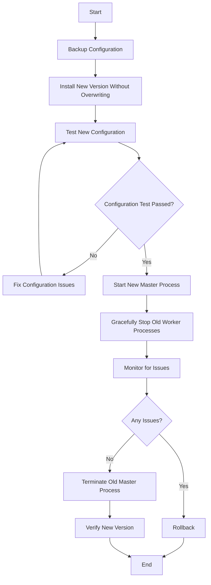

# Nginx Upgrade Procedures

## Introduction

Upgrading Nginx is a critical maintenance task that system administrators and DevOps engineers need to perform regularly. This guide covers the best practices for upgrading Nginx while ensuring minimal to zero downtime for your web applications. 

Whether you're upgrading to get the latest security patches, bug fixes, or new features, following proper procedures ensures your web services remain stable and secure. This guide is designed for beginners but includes techniques that are valuable for all experience levels.

## Why Upgrade Nginx?

Before diving into the procedures, let's understand why regular Nginx upgrades are important:

- **Security patches**: Protect against vulnerabilities
- **Bug fixes**: Resolve known issues
- **Performance improvements**: Take advantage of optimizations
- **New features**: Access the latest capabilities
- **Compatibility**: Ensure compatibility with modern web technologies

## Understanding Nginx Versions

Nginx follows a specific versioning scheme:

```
nginx-[major].[minor].[patch]
```

For example, in version `1.20.2`:
- `1` is the major version
- `20` is the minor version
- `2` is the patch level

Each release is categorized as either:
- **Mainline** versions: Include the latest features, may contain experimental modules
- **Stable** versions: Thoroughly tested releases recommended for production environments

## Checking Your Current Version

Before upgrading, identify your current Nginx version:

```bash
nginx -v
```

Output example:
```
nginx version: nginx/1.18.0 (Ubuntu)
```

For more detailed information:

```bash
nginx -V
```

This provides compile-time options and module information which is important to preserve during upgrades.

## Backup Before Upgrading

Always create backups before proceeding with any upgrade:

1. Configuration files:

```bash
sudo cp -r /etc/nginx /etc/nginx.bak
```

2. Custom modules or compilation options (if applicable):

```bash
nginx -V > nginx-compile-options.txt
```

3. Document your current setup in a text file for reference.

## Upgrade Approaches

### 1. Package Manager Upgrade (Recommended for Beginners)

This is the simplest approach for those who installed Nginx using package managers like apt, yum, or dnf.

#### For Debian/Ubuntu:

First, update your package lists:

```bash
sudo apt update
```

Then upgrade Nginx:

```bash
sudo apt upgrade nginx
```

For a specific version:

```bash
sudo apt install nginx=1.20.2-1~focal
```

#### For RHEL/CentOS:

```bash
sudo yum update nginx
```

#### For Alpine:

```bash
sudo apk update
sudo apk upgrade nginx
```

### 2. In-Place Binary Upgrade

Nginx supports in-place binary upgrades for zero downtime:

```bash
# Send USR2 signal to create a new binary
sudo kill -USR2 `cat /var/run/nginx.pid`

# Gracefully shut down old worker processes
sudo kill -WINCH `cat /var/run/nginx.pid.oldbin`

# Optional: Fully terminate the old master process
sudo kill -QUIT `cat /var/run/nginx.pid.oldbin`
```

### 3. Compile from Source

For custom installations or when you need specific modules:

```bash
# Download the new version
wget https://nginx.org/download/nginx-1.20.2.tar.gz
tar -zxvf nginx-1.20.2.tar.gz
cd nginx-1.20.2

# Configure with the same options as your current installation
# (Use the output from nginx -V)
./configure --with-http_ssl_module --with-http_v2_module [other options]

# Compile but don't install yet
make

# Backup the old binary
sudo cp /usr/sbin/nginx /usr/sbin/nginx.old

# Install the new binary
sudo make install

# Reload Nginx
sudo nginx -s reload
```

## Zero Downtime Upgrade Process

To perform a zero-downtime upgrade, follow this detailed procedure:



### Step-by-Step Zero Downtime Upgrade

1. **Backup configuration**:

```bash
sudo cp -r /etc/nginx /etc/nginx.bak
```

2. **Install the new version** (without overwriting the running binary):

```bash
# Using package managers with special options to only download
sudo apt-get install -d nginx

# Or for compiled versions, build but don't install yet
```

3. **Test your configuration with the new binary**:

```bash
sudo nginx -t -c /etc/nginx/nginx.conf
```

4. **Start the new master process**:

```bash
sudo kill -USR2 `cat /var/run/nginx.pid`
```

This creates a new master process with the new binary while keeping the old one running.

5. **Verify both processes are running**:

```bash
ps aux | grep nginx
```

You should see both old and new master processes.

6. **Gracefully stop old worker processes**:

```bash
sudo kill -WINCH `cat /var/run/nginx.pid.oldbin`
```

7. **Monitor for any issues**:

```bash
tail -f /var/log/nginx/error.log
```

8. **If everything is stable, terminate the old master process**:

```bash
sudo kill -QUIT `cat /var/run/nginx.pid.oldbin`
```

9. **Verify the new version is running**:

```bash
nginx -v
```

## Rolling Back an Upgrade

If you encounter issues, here's how to roll back:

### For package-based installations:

```bash
# Debian/Ubuntu
sudo apt install nginx=previous-version

# RHEL/CentOS
sudo yum downgrade nginx-previous-version
```

### For binary upgrades:

If you've kept the old binary during an in-place upgrade:

```bash
# Send USR2 signal to the new master
sudo kill -USR2 `cat /var/run/nginx.pid`

# Stop new worker processes
sudo kill -WINCH `cat /var/run/nginx.pid.oldbin`

# Terminate new master when ready
sudo kill -QUIT `cat /var/run/nginx.pid.oldbin`
```

### For source-compiled installations:

```bash
# If you kept the old binary as recommended
sudo cp /usr/sbin/nginx.old /usr/sbin/nginx
sudo nginx -s reload
```

## Common Issues During Upgrades

### 1. Configuration Incompatibilities

Newer Nginx versions might deprecate certain directives or change default behaviors.

**Solution**: Use the configuration test before applying changes:

```bash
sudo nginx -t
```

### 2. Module Compatibility

Custom modules might not work with newer Nginx versions.

**Solution**: Check module documentation for compatibility information and upgrade modules as needed.

### 3. Permission Issues

After upgrading, permission problems might occur if the installation changes file ownership.

**Solution**: Restore proper permissions:

```bash
sudo chown -R www-data:www-data /var/log/nginx
sudo chmod -R 755 /etc/nginx
```

## Best Practices for Nginx Upgrades

1. **Schedule upgrades during low-traffic periods**
2. **Always create backups before upgrading**
3. **Test configuration files with the new version before applying**
4. **Document your upgrade process for future reference**
5. **Consider using a staging environment to test upgrades first**
6. **Monitor your application closely after upgrades**
7. **Have a rollback plan ready before starting**
8. **Keep previous versions available for quick rollbacks**

## Automating Nginx Upgrades

For production environments with multiple servers, consider automating upgrades:

```bash
#!/bin/bash
# Simple Nginx upgrade script

# Set variables
BACKUP_DIR="/etc/nginx/backups/$(date +%Y%m%d_%H%M%S)"

# Create backup
mkdir -p $BACKUP_DIR
cp -r /etc/nginx/nginx.conf /etc/nginx/sites-available $BACKUP_DIR

# Update package lists
apt update

# Test current configuration
nginx -t || { echo "Current configuration is invalid!"; exit 1; }

# Upgrade Nginx
apt upgrade nginx -y

# Test new configuration
nginx -t || {
  echo "New configuration is invalid!"
  echo "Rolling back..."
  cp -r $BACKUP_DIR/* /etc/nginx/
  systemctl restart nginx
  exit 1
}

# Reload Nginx
systemctl reload nginx

echo "Nginx upgraded successfully!"
```

## Summary

Proper Nginx upgrade procedures ensure your web server remains secure, performant, and stable. By following the zero-downtime approach outlined in this guide, you can keep your Nginx installation up-to-date without disrupting service to your users.

Remember these key points:
- Always backup before upgrading
- Test configurations with the new version
- Use zero-downtime techniques for production environments
- Have a rollback plan ready
- Monitor your application after upgrading

## Additional Resources

- [Official Nginx Upgrade Documentation](https://nginx.org/en/docs/control.html)
- [Nginx Change Log](https://nginx.org/en/CHANGES)
- [Nginx Admin Guide](https://nginx.org/en/docs/ngx_core_module.html)

## Exercises

1. **Practice Exercise**: Create a test environment and perform a zero-downtime upgrade.
2. **Configuration Challenge**: Identify deprecated directives in your current Nginx configuration.
3. **Automation Task**: Create a more advanced upgrade script with automatic rollback on failure.
4. **Monitoring Exercise**: Set up monitoring to track performance before and after an upgrade.