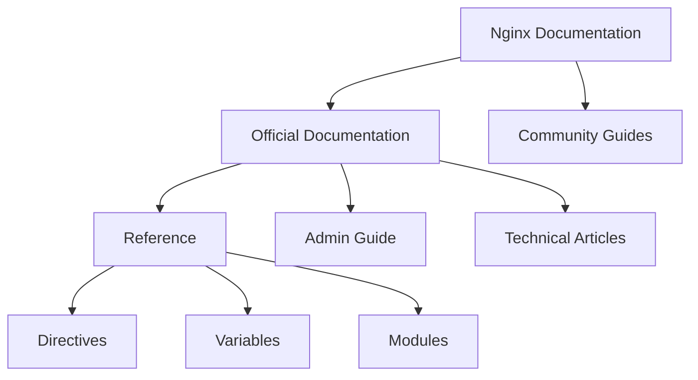

# Nginx Documentation

## Introduction

Nginx (pronounced "engine-x") is a powerful, high-performance web server and reverse proxy that has gained immense popularity due to its efficiency and scalability. Understanding Nginx documentation is essential for anyone looking to configure, optimize, and troubleshoot their Nginx server setup. This guide will walk you through the structure and usage of Nginx documentation, helping you navigate this critical resource effectively.

## Understanding Nginx Documentation Structure

Nginx documentation is organized hierarchically, making it both comprehensive and accessible once you understand its structure.



### Official Documentation Sources

The official Nginx documentation is the most authoritative source and includes:

1. **Main Documentation Portal**: Available at the official Nginx website
2. **Reference Documentation**: Details all directives, variables, and modules
3. **Admin Guide**: Covers installation, configuration, and optimization
4. **Module Documentation**: Explains functionality of standard and additional modules

## Navigating Nginx Configuration Documentation

Nginx configuration follows a specific syntax that's crucial to understand:

```nginx
# Main context
user nginx;
worker_processes auto;
error_log /var/log/nginx/error.log warn;
pid /var/run/nginx.pid;

# Events context
events {
    worker_connections 1024;
}

# HTTP context
http {
    include /etc/nginx/mime.types;
    default_type application/octet-stream;
    
    # Server context
    server {
        listen 80;
        server_name example.com;
        
        # Location context
        location / {
            root /usr/share/nginx/html;
            index index.html index.htm;
        }
    }
}
```

### Understanding Directive Documentation

Each line in an Nginx configuration contains a directive. The documentation for each directive typically includes:

1. **Syntax**: The correct format and parameters
2. **Default**: The default value (if any)
3. **Context**: Where the directive can be used (http, server, location, etc.)
4. **Description**: What the directive does

For example, let's look at the `listen` directive documentation:

| Attribute | Value |
|-----------|-------|
| Syntax | `listen address[:port] [default_server] [ssl] [http2] [other options];` |
| Default | `listen *:80;` |
| Context | server |
| Description | Sets the address and port for IP, or the path for UNIX-domain socket on which the server will accept requests |

## Reading Module Documentation

Nginx's functionality is organized into modules. Understanding module documentation is essential for extending Nginx's capabilities.

### Example: Reading the `ngx_http_rewrite_module` Documentation

The rewrite module is commonly used for URL manipulation. Here's how to interpret its documentation:

```nginx
server {
    listen 80;
    server_name example.com;
    
    # Redirect example
    rewrite ^/old-page$ /new-page permanent;
    
    # Rewrite with conditions
    if ($http_user_agent ~* "googlebot") {
        rewrite ^/$ /googlebot-index.html;
    }
}
```

The documentation explains:

1. **Module Directives**: `rewrite`, `if`, `set`, `return`, etc.
2. **Variables**: Variables available to the module
3. **Examples**: Common usage patterns
4. **Warnings**: Potential pitfalls or performance considerations

## Practical Examples of Using Nginx Documentation

### Example 1: Setting Up a Basic Reverse Proxy

Let's say you want to set up a reverse proxy. The documentation would guide you to:

```nginx
http {
    server {
        listen 80;
        server_name example.com;
        
        location / {
            proxy_pass http://localhost:8080;
            proxy_set_header Host $host;
            proxy_set_header X-Real-IP $remote_addr;
        }
    }
}
```

### Example 2: Configuring SSL/TLS

When implementing HTTPS, the documentation would lead you to:

```nginx
server {
    listen 443 ssl;
    server_name example.com;
    
    ssl_certificate /etc/nginx/ssl/example.com.crt;
    ssl_certificate_key /etc/nginx/ssl/example.com.key;
    ssl_protocols TLSv1.2 TLSv1.3;
    ssl_ciphers HIGH:!aNULL:!MD5;
    
    location / {
        root /usr/share/nginx/html;
        index index.html;
    }
}
```

## Troubleshooting with Nginx Documentation

The documentation is invaluable when troubleshooting issues. Here's a systematic approach:

1. **Identify the error message** in Nginx logs (`/var/log/nginx/error.log`)
2. **Search the documentation** for the specific error code or message
3. **Review directive context** to ensure directives are used in the correct context
4. **Check module compatibility** for potential conflicts

### Common Error Example

If you encounter a "403 Forbidden" error, the documentation would guide you to check:

```nginx
server {
    listen 80;
    server_name example.com;
    
    location / {
        root /usr/share/nginx/html;
        # Check file permissions
        # Ensure Nginx worker process has read access
    }
}
```

The documentation would explain that this could be due to:
- File permissions issues
- SELinux restrictions
- Missing index files
- Incorrect `root` directive path

## Best Practices for Reading Nginx Documentation

1. **Start with the official documentation** before community resources
2. **Understand the context hierarchy** (main, http, server, location)
3. **Check directive compatibility** with your Nginx version
4. **Review examples thoroughly** before implementing
5. **Test configuration changes** using `nginx -t` before reloading

## Summary

Mastering Nginx documentation is key to becoming proficient with this powerful web server. By understanding the structure of the documentation, learning how to interpret directive specifications, and following best practices, you'll be able to configure Nginx for any scenario confidently.

The documentation serves as both a learning resource and a reference guide that you'll return to regularly as you work with Nginx. Remember that the official documentation is continually updated, so it's always worth checking for the latest information.

## Additional Resources

- **Official Nginx Docs**: The primary source of Nginx documentation
- **Nginx Wiki**: Community-contributed guides and examples
- **Nginx Blog**: Technical articles and best practices
- **GitHub Examples**: Real-world configuration examples

## Exercises

1. Find the documentation for the `proxy_buffer_size` directive and explain its purpose and default value.
2. Use the documentation to create a configuration for load balancing between three backend servers.
3. Research how to implement rate limiting using Nginx documentation and create a sample configuration.
4. Find and explain three different logging directives available in Nginx.
5. Using the documentation, configure a server to redirect all HTTP traffic to HTTPS.