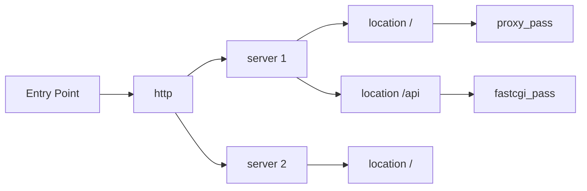

# Nginx Community Resources

## Introduction

Nginx (pronounced "engine-x") is one of the world's most popular web servers, reverse proxies, and load balancers. Behind this powerful tool is a vibrant community of developers, system administrators, and enthusiasts who constantly contribute to its growth and improvement. 

In this guide, we'll explore the various community resources available for Nginx users of all skill levels. Whether you're just starting with Nginx or looking to deepen your knowledge, these resources will help you navigate the Nginx ecosystem more effectively.

## Official Nginx Resources

### Nginx Documentation

The official documentation is always the best place to start:

```
https://nginx.org/en/docs/
```

The documentation provides comprehensive information on:

- Installation instructions
- Configuration directives
- Module references
- Beginner to advanced tutorials

### Nginx Blog

The official Nginx blog regularly publishes:

- New feature announcements
- Best practices
- Case studies
- Performance optimization tips

```
https://www.nginx.com/blog/
```

### Nginx Mailing Lists

For direct community interaction, Nginx maintains several mailing lists:

- **nginx-announce**: Low-traffic list for important announcements
- **nginx-devel**: For discussions about Nginx development
- **nginx-ru**: Russian-language discussions

To subscribe, visit:

```
https://mailman.nginx.org
```

## Community Forums and Q&A Sites

### Stack Overflow

Stack Overflow hosts thousands of answered questions about Nginx configuration, troubleshooting, and optimization.

Popular tags to follow:
- `nginx`
- `nginx-config`
- `nginx-rewrite`
- `nginx-location`

### Server Fault

Server Fault, part of the Stack Exchange network, focuses on server configuration issues, including many Nginx-specific questions:

```
https://serverfault.com/questions/tagged/nginx
```

### Reddit Communities

Several subreddits have active Nginx discussions:

- r/nginx - Dedicated to Nginx discussions
- r/webdev - General web development, including Nginx topics
- r/devops - DevOps practices, often covering Nginx in production environments

## GitHub Resources

### Official Repositories

The official Nginx repositories contain the source code, issues, and documentation:

```
https://github.com/nginx/nginx
```

For Nginx Plus and other commercial products:

```
https://github.com/nginxinc
```

### Community Modules and Extensions

One of Nginx's strengths is its extensibility. Here are some popular community modules:

| Module | Description |
| ------ | ----------- |
| [nginx-rtmp-module](https://github.com/arut/nginx-rtmp-module) | RTMP/HLS video streaming |
| [echo-nginx-module](https://github.com/openresty/echo-nginx-module) | Brings "echo" and other shell-style commands to Nginx config |
| [headers-more-nginx-module](https://github.com/openresty/headers-more-nginx-module) | Additional control over HTTP headers |
| [ngx_cache_purge](https://github.com/FRiCKLE/ngx_cache_purge) | Adds cache purge functionality |

### Configuration Examples

The community maintains repositories of example configurations for different scenarios:

```
https://github.com/fcambus/nginx-resources
```

## Example: Contributing to Nginx Community

Let's look at a simple example of how you might contribute to the Nginx community by sharing a useful configuration snippet:

```nginx
# Enhanced security headers configuration
server {
    listen 80;
    server_name example.com;
    
    # Redirect all HTTP traffic to HTTPS
    return 301 https://$host$request_uri;
}

server {
    listen 443 ssl;
    server_name example.com;
    
    ssl_certificate /etc/nginx/ssl/example.com.crt;
    ssl_certificate_key /etc/nginx/ssl/example.com.key;
    
    # Security headers
    add_header Strict-Transport-Security "max-age=31536000; includeSubDomains" always;
    add_header X-Content-Type-Options "nosniff" always;
    add_header X-Frame-Options "SAMEORIGIN" always;
    add_header X-XSS-Protection "1; mode=block" always;
    add_header Content-Security-Policy "default-src 'self';" always;
    
    location / {
        root /var/www/html;
        index index.html;
    }
}
```

After testing this configuration, you could share it on:
1. GitHub as a gist
2. Stack Overflow when answering related questions
3. Reddit when discussing web security with Nginx

## OpenResty and Nginx-based Platforms

### OpenResty

OpenResty extends Nginx with Lua scripting capabilities, creating a powerful platform for building web applications:

```
https://openresty.org/
```

Example of a simple Lua script in an Nginx configuration:

```nginx
location /hello {
    content_by_lua_block {
        ngx.say("<p>Hello, OpenResty!</p>")
    }
}
```

### Tengine

Tengine is a fork of Nginx created by Alibaba that includes additional features:

```
https://tengine.taobao.org/
```

## Community Chat and Real-time Help

### Discord and Slack Communities

Several DevOps and web development Discord/Slack communities have active Nginx channels:

- DevOps Discord servers
- WebDev Slack communities
- Cloud Native Computing Foundation (CNCF) Slack

### IRC Channels

For those who prefer IRC, there are channels dedicated to Nginx discussions:

- #nginx on Freenode

## Nginx Community Events

### Nginx Conf

Nginx Inc. regularly hosts conferences featuring:
- Workshops
- Case studies
- Networking opportunities
- New feature announcements

### Local Meetups

Many cities have DevOps or web server meetups where Nginx is frequently discussed:
- Check Meetup.com for "Nginx," "Web Server," or "DevOps" groups
- Look for local CNCF chapters

## Learning Paths and Tutorials

### Interactive Learning

Platforms offering hands-on Nginx tutorials include:

- Katacoda
- Linux Academy
- A Cloud Guru

### Video Tutorials

Many content creators publish quality Nginx tutorials:

- YouTube channels focused on DevOps
- Udemy courses on Nginx configuration
- LinkedIn Learning (formerly Lynda.com)

## Visualization Tools

Understanding Nginx configurations visually can help beginners grasp complex setups:

### Nginx Config Visualization

This community-created tool helps visualize the structure of Nginx configurations:



## Monitoring and Dashboard Tools

Community-created tools for monitoring Nginx:

- **Nginx Amplify**: Monitoring and configuration assistant
- **Netdata**: Real-time performance monitoring
- **Nginx-Prometheus-Exporter**: Exports Nginx metrics to Prometheus

Example Prometheus configuration for Nginx metrics:

```yaml
scrape_configs:
  - job_name: nginx
    static_configs:
      - targets: ['localhost:9113']
```

## Troubleshooting with Community Help

When facing issues with Nginx, follow these steps to get community assistance:

1. Gather relevant information:
   - Nginx error logs (`tail -f /var/log/nginx/error.log`)
   - Configuration snippets
   - Expected vs. actual behavior

2. Create a minimal, reproducible example

3. Format your question clearly, including:
   ```
   - Nginx version
   - Operating system
   - What you tried
   - Exact error messages
   ```

4. Post to appropriate community channels (Stack Overflow, Reddit, etc.)

## Summary

The Nginx community offers a wealth of resources for users at all skill levels. From official documentation to third-party modules, from forums to conferences, there are numerous ways to enhance your Nginx knowledge and get help when needed.

By actively participating in these community resources, you not only improve your own skills but also contribute to the growth and development of the Nginx ecosystem.

## Additional Resources

### Books

Several excellent books cover Nginx in depth:

- "Nginx HTTP Server" by Clément Nedelcu
- "Mastering Nginx" by Dimitri Aivaliotis
- "Nginx Cookbook" by Derek DeJonghe

### Practice Exercises

To solidify your understanding:

1. Set up a basic Nginx server and share your configuration in a community forum
2. Install and configure a community module
3. Create a Docker container with a custom Nginx setup
4. Contribute documentation improvements to the Nginx project
5. Help answer Nginx questions on Stack Overflow or Reddit

Remember that the best way to learn is by doing and sharing your knowledge with others in the community!