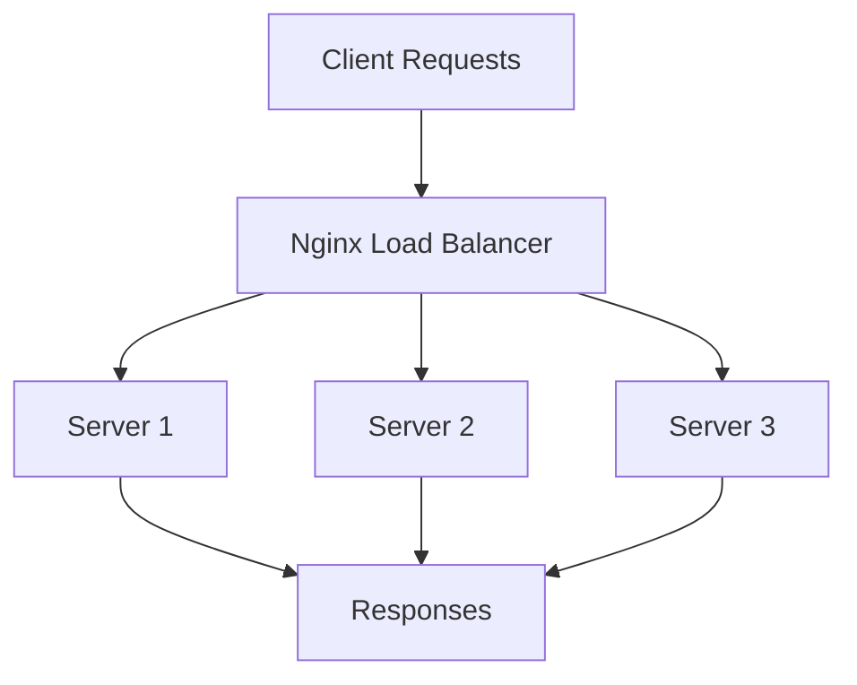

# Nginx Load Balancing Basics

## Introduction

Load balancing is a critical concept in web infrastructure that helps distribute incoming network traffic across multiple servers to ensure no single server becomes overwhelmed. Nginx, a popular high-performance web server, excels at load balancing and is widely used in production environments.

In this tutorial, we'll explore the fundamentals of Nginx load balancing, learn how to set up basic configurations, and understand key concepts that will help you build more resilient and scalable web applications.

## What is Load Balancing?

Load balancing is the process of distributing network traffic across multiple servers to:

- Improve application responsiveness and availability
- Prevent any single server from becoming a bottleneck
- Provide fault tolerance if one or more servers fail
- Scale horizontally by adding more servers as needed

Before diving into specific configurations, let's visualize how load balancing works:



## Setting Up Nginx as a Load Balancer

Let's start with a basic Nginx load balancer configuration:

```nginx
http {
    # Define a group of servers to balance between
    upstream backend_servers {
        server 192.168.1.101:8080;
        server 192.168.1.102:8080;
        server 192.168.1.103:8080;
    }

    server {
        listen 80;
        server_name example.com;

        location / {
            proxy_pass http://backend_servers;
            proxy_set_header Host $host;
            proxy_set_header X-Real-IP $remote_addr;
        }
    }
}
```

In this configuration:

1. We define an `upstream` block named `backend_servers` that lists the available servers.
2. We create a server block that listens on port 80.
3. The `location /` directive tells Nginx to forward requests to our backend servers.
4. The `proxy_pass` directive points to our upstream group.
5. We set headers to preserve client information when forwarding requests.

## Load Balancing Methods

Nginx offers several methods to distribute traffic:

### Round Robin (Default)

The default method distributes requests sequentially to each server in the upstream group:

```nginx
upstream backend_servers {
    server 192.168.1.101:8080;
    server 192.168.1.102:8080;
    server 192.168.1.103:8080;
}
```

### Least Connections

Directs traffic to the server with the fewest active connections:

```nginx
upstream backend_servers {
    least_conn;
    server 192.168.1.101:8080;
    server 192.168.1.102:8080;
    server 192.168.1.103:8080;
}
```

### IP Hash

Uses the client's IP address to determine which server should receive the request. This ensures that clients are consistently sent to the same server, which helps with session persistence:

```nginx
upstream backend_servers {
    ip_hash;
    server 192.168.1.101:8080;
    server 192.168.1.102:8080;
    server 192.168.1.103:8080;
}
```

## Server Weights

You can assign different weights to servers to control the proportion of requests they receive:

```nginx
upstream backend_servers {
    server 192.168.1.101:8080 weight=3;
    server 192.168.1.102:8080 weight=1;
    server 192.168.1.103:8080 weight=1;
}
```

In this example, the first server will receive approximately 60% of the requests (3/5 of the total), while each of the other servers will handle about 20% (1/5 each).

## Health Checks

Nginx can perform health checks to ensure it only forwards traffic to healthy servers.

### Passive Health Checks

Passive health checks are included in the open source version of Nginx:

```nginx
upstream backend_servers {
    server 192.168.1.101:8080 max_fails=3 fail_timeout=30s;
    server 192.168.1.102:8080 max_fails=3 fail_timeout=30s;
    server 192.168.1.103:8080 max_fails=3 fail_timeout=30s;
}
```

This configuration:
- Marks a server as unavailable after 3 failed attempts (`max_fails=3`)
- Doesn't try to use that server again for 30 seconds (`fail_timeout=30s`)

### Active Health Checks

Active health checks, which proactively test backend servers, are available in the commercial Nginx Plus version. Here's what the syntax looks like:

```nginx
# Nginx Plus feature - not available in open source version
upstream backend_servers {
    server 192.168.1.101:8080;
    server 192.168.1.102:8080;
    server 192.168.1.103:8080;
    
    health_check interval=5s timeout=3s fails=3 passes=2;
}
```

## Real-World Example: Load Balancing a Web Application

Let's look at a complete real-world example for a web application with both static content and dynamic API endpoints:

```nginx
http {
    # Define upstream servers for our API
    upstream api_servers {
        least_conn;
        server 10.0.0.101:3000 max_fails=2 fail_timeout=30s;
        server 10.0.0.102:3000 max_fails=2 fail_timeout=30s;
        server 10.0.0.103:3000 max_fails=2 fail_timeout=30s backup;
    }
    
    # Define upstream servers for our web app
    upstream web_servers {
        ip_hash;
        server 10.0.0.201:8080 weight=2;
        server 10.0.0.202:8080 weight=1;
    }
    
    # Main server configuration
    server {
        listen 80;
        server_name example.com;
        
        # Static content
        location /static/ {
            proxy_pass http://web_servers;
            proxy_set_header Host $host;
            proxy_set_header X-Real-IP $remote_addr;
            proxy_cache my_cache;
            proxy_cache_valid 200 302 10m;
            proxy_cache_valid 404 1m;
        }
        
        # API requests
        location /api/ {
            proxy_pass http://api_servers;
            proxy_set_header Host $host;
            proxy_set_header X-Real-IP $remote_addr;
            proxy_read_timeout 60s;
            proxy_connect_timeout 60s;
        }
        
        # All other requests go to web servers
        location / {
            proxy_pass http://web_servers;
            proxy_set_header Host $host;
            proxy_set_header X-Real-IP $remote_addr;
            proxy_set_header X-Forwarded-For $proxy_add_x_forwarded_for;
            proxy_set_header X-Forwarded-Proto $scheme;
        }
    }
}
```

This configuration:
1. Creates separate upstream groups for API and web servers
2. Uses different load balancing methods for each group (least connections for API, IP hash for web to maintain sessions)
3. Designates a backup server for the API in case the others fail
4. Adds caching for static content
5. Sets different timeouts for API requests

## Handling SSL/TLS with Load Balancing

When setting up load balancing with HTTPS, you have two main options:

### SSL Termination

The load balancer handles SSL encryption/decryption and forwards unencrypted traffic to backend servers:

```nginx
server {
    listen 443 ssl;
    server_name example.com;
    
    ssl_certificate /etc/nginx/ssl/example.com.crt;
    ssl_certificate_key /etc/nginx/ssl/example.com.key;
    ssl_protocols TLSv1.2 TLSv1.3;
    
    location / {
        proxy_pass http://backend_servers; # Note: using http here
        proxy_set_header Host $host;
        proxy_set_header X-Real-IP $remote_addr;
    }
}
```

### SSL Passthrough

The load balancer forwards encrypted traffic directly to backend servers, which handle SSL themselves:

```nginx
stream {
    upstream backend_servers_ssl {
        server 192.168.1.101:443;
        server 192.168.1.102:443;
        server 192.168.1.103:443;
    }
    
    server {
        listen 443;
        proxy_pass backend_servers_ssl;
    }
}
```

## Troubleshooting and Testing

After setting up your load balancer, it's essential to test and verify your configuration.

### Testing Configuration Syntax

Before applying changes, check your configuration syntax:

```bash
sudo nginx -t
```

Expected output:
```
nginx: the configuration file /etc/nginx/nginx.conf syntax is ok
nginx: configuration file /etc/nginx/nginx.conf test is successful
```

### Checking Server Distribution

A simple way to verify your load balancing is to add a custom header that identifies which backend server handled the request:

```nginx
# Add to each backend server's Nginx configuration
location / {
    add_header X-Server-ID "Server 1";
    # Other configuration...
}
```

Then, when making requests to your load balancer, you can check the response headers to see which server responded.

### Monitoring Load Balancing

For production environments, you should monitor your load balancer and backend servers. Nginx provides basic status information with the `stub_status` module:

```nginx
server {
    location /nginx_status {
        stub_status on;
        allow 127.0.0.1; # Only allow access from localhost
        deny all;
    }
}
```

This will output basic information like:

```
Active connections: 43
server accepts handled requests
 7368 7368 10993
Reading: 0 Writing: 5 Waiting: 38
```

For more detailed monitoring, consider using tools like Prometheus with the Nginx exporter or commercial solutions like Nginx Plus.

## Summary

In this guide, we've covered the basics of Nginx load balancing:

- Core load balancing concepts and benefits
- Setting up basic load balancer configurations
- Different load balancing methods (round robin, least connections, IP hash)
- Weighting servers for proportional traffic distribution
- Health checks to ensure traffic only goes to healthy servers
- Real-world examples including SSL handling
- Troubleshooting and monitoring techniques

With these fundamentals, you can now implement basic load balancing for your web applications, increasing their reliability, performance, and scalability.

## Additional Resources and Exercises

### Exercises

1. **Basic Setup**: Set up a simple Nginx load balancer on your local machine that distributes traffic between two different ports (e.g., servers running on 8081 and 8082).

2. **Test Different Methods**: Modify your configuration to test each load balancing method and observe the differences in request distribution.

3. **Failover Test**: Configure one server to intentionally fail (or just turn it off) and observe how Nginx redirects traffic to the remaining healthy servers.

### Further Reading

- [Nginx Official Documentation](https://nginx.org/en/docs/)
- [Nginx HTTP Load Balancing Guide](https://nginx.org/en/docs/http/load_balancing.html)
- [High Performance Load Balancing with Nginx](https://www.nginx.com/resources/library/high-performance-load-balancing/)

Remember that load balancing is just the beginning of building scalable web applications. As you advance, you'll want to explore concepts like rate limiting, caching strategies, and more sophisticated high-availability configurations.