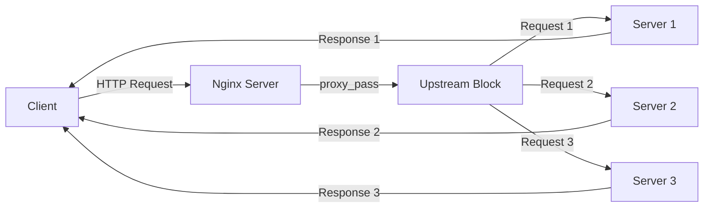

# Nginx Upstream Blocks

## Introduction

When building web applications that need to handle significant traffic, distributing that load across multiple servers becomes crucial. Nginx, a powerful web server and reverse proxy, offers an elegant solution through its **upstream blocks**. These configuration elements are fundamental building blocks for implementing load balancing in Nginx.

An upstream block defines a group of server instances that can handle requests. When Nginx receives a request, it can forward it to one of the servers defined in the upstream block according to the specified load balancing algorithm. This allows your application to distribute traffic efficiently, improve reliability, and enhance overall performance.

In this guide, we'll explore how upstream blocks work, how to configure them, and examine practical scenarios where they can be applied.

## Understanding Upstream Blocks

### What is an Upstream Block?

An upstream block in Nginx is a configuration directive that defines a group of servers that can receive forwarded requests. These servers typically run identical applications and can interchangeably process client requests.

Here's the basic syntax of an upstream block:

```nginx
upstream backend_servers {
    server 192.168.1.101:8080;
    server 192.168.1.102:8080;
    server 192.168.1.103:8080;
}
```

In this example:
- `backend_servers` is the name given to this group of servers
- Three different servers are defined within the block, each with their own IP address and port
- By default, Nginx will distribute requests using a round-robin algorithm

### Where to Place Upstream Blocks

Upstream blocks are typically defined in the Nginx configuration file (`nginx.conf`) or in separate configuration files included from the main configuration. They should be placed in the `http` context, but outside of any `server` or `location` blocks.

```nginx
http {
    # Other http configurations
    
    upstream backend_servers {
        server 192.168.1.101:8080;
        server 192.168.1.102:8080;
    }
    
    server {
        # Server configurations
        
        location / {
            proxy_pass http://backend_servers;
            # Other proxy configurations
        }
    }
}
```

## Basic Upstream Configuration

### Simple Round-Robin Example

The most basic upstream configuration uses the default round-robin algorithm, which distributes requests evenly across all servers:

```nginx
upstream app_servers {
    server 10.0.0.1:8080;
    server 10.0.0.2:8080;
    server app3.example.com:8080;
}

server {
    listen 80;
    server_name example.com;
    
    location / {
        proxy_pass http://app_servers;
        proxy_set_header Host $host;
        proxy_set_header X-Real-IP $remote_addr;
    }
}
```

In this configuration:
1. We define an upstream group named `app_servers` with three backend servers
2. In our server block, the `proxy_pass` directive forwards requests to our upstream group
3. We also set some headers to pass the original client information to the backend servers

When clients make requests to `example.com`, Nginx will distribute these requests in sequence to each of the servers in the upstream block.

### How Requests Flow Through Upstream Blocks

Let's visualize how requests flow through an Nginx setup with upstream blocks:



## Advanced Upstream Configuration Options

### Weight Parameter

You can assign different weights to servers to control the distribution of requests. Servers with higher weights receive more requests:

```nginx
upstream weighted_backend {
    server 10.0.0.1:8080 weight=3;  # Will receive 3x more requests
    server 10.0.0.2:8080;           # Default weight is 1
    server 10.0.0.3:8080 weight=2;  # Will receive 2x more requests
}
```

This is useful when your servers have different processing capabilities, allowing more powerful servers to handle more traffic.

### Health Checks

Nginx can perform health checks to ensure that only healthy servers receive traffic:

```nginx
upstream app_servers {
    server 10.0.0.1:8080 max_fails=3 fail_timeout=30s;
    server 10.0.0.2:8080 max_fails=3 fail_timeout=30s;
    server 10.0.0.3:8080 backup;
}
```

In this configuration:
- `max_fails=3` means the server will be considered unavailable after 3 failed attempts
- `fail_timeout=30s` indicates that after a server is marked as unavailable, Nginx will wait 30 seconds before attempting to send requests to it again
- The third server is marked as a `backup`, which means it will only receive requests when all primary servers are unavailable

### Server States

You can control the state of servers in an upstream block:

```nginx
upstream app_servers {
    server 10.0.0.1:8080;             # Normal server
    server 10.0.0.2:8080 down;        # Marked as unavailable
    server 10.0.0.3:8080 backup;      # Backup server
}
```

- `down` marks a server as permanently unavailable
- `backup` designates a server as a backup that only receives requests when all primary servers are unavailable

### Different Load Balancing Methods

Nginx offers several load balancing algorithms:

```nginx
# Round-robin (default)
upstream round_robin {
    server 10.0.0.1:8080;
    server 10.0.0.2:8080;
}

# Least connections
upstream least_conn {
    least_conn;
    server 10.0.0.1:8080;
    server 10.0.0.2:8080;
}

# IP Hash
upstream ip_hash {
    ip_hash;
    server 10.0.0.1:8080;
    server 10.0.0.2:8080;
}

# Generic Hash
upstream generic_hash {
    hash $request_uri consistent;
    server 10.0.0.1:8080;
    server 10.0.0.2:8080;
}
```

- **Round-robin**: Default method, distributes requests sequentially across servers
- **Least connections**: Sends requests to the server with the fewest active connections
- **IP hash**: Uses the client's IP address to determine which server to send the request to (ensures a client always connects to the same server)
- **Generic hash**: Uses any specified key (like the URI) to determine the server (with the `consistent` parameter providing ketama consistent hashing)

## Real-World Examples

### Scaling a Web Application

Let's consider a scenario where you have a Node.js application and need to scale it horizontally:

```nginx
upstream node_app {
    server 10.0.0.1:3000;
    server 10.0.0.2:3000;
    server 10.0.0.3:3000;
}

server {
    listen 80;
    server_name myapp.example.com;
    
    location / {
        proxy_pass http://node_app;
        proxy_http_version 1.1;
        proxy_set_header Upgrade $http_upgrade;
        proxy_set_header Connection 'upgrade';
        proxy_set_header Host $host;
        proxy_cache_bypass $http_upgrade;
    }
}
```

This configuration distributes requests across three Node.js application instances, enabling you to handle more concurrent users.

### High Availability with Failover

For applications requiring high availability, you can use backup servers:

```nginx
upstream critical_app {
    server 10.0.0.1:8080 max_fails=2 fail_timeout=30s;
    server 10.0.0.2:8080 max_fails=2 fail_timeout=30s;
    server 10.0.0.3:8080 backup;
    server 10.0.0.4:8080 backup;
}

server {
    listen 80;
    server_name critical.example.com;
    
    location / {
        proxy_pass http://critical_app;
        proxy_set_header Host $host;
        proxy_set_header X-Real-IP $remote_addr;
        
        # Set a timeout for responses
        proxy_connect_timeout 5s;
        proxy_read_timeout 10s;
    }
}
```

In this setup, if both primary servers fail, traffic automatically routes to the backup servers, ensuring your application remains available.

### Sticky Sessions for Stateful Applications

For applications that maintain session state:

```nginx
upstream session_app {
    ip_hash;  # Or use "sticky cookie srv_id expires=1h domain=.example.com path=/" for cookie-based sessions
    server 10.0.0.1:8080;
    server 10.0.0.2:8080;
    server 10.0.0.3:8080;
}

server {
    listen 80;
    server_name webapp.example.com;
    
    location / {
        proxy_pass http://session_app;
        proxy_set_header Host $host;
        proxy_set_header X-Real-IP $remote_addr;
    }
}
```

This ensures that a client always connects to the same backend server, which is essential for applications that don't share session data across instances.

## Troubleshooting Upstream Configurations

### Common Issues and Solutions

1. **Backend server not responding**:
   - Check if the backend server is running
   - Verify network connectivity between Nginx and the backend
   - Check logs with `tail -f /var/log/nginx/error.log`

2. **Uneven load distribution**:
   - Review your load balancing method
   - Check server weights if using weighted distribution
   - Monitor server performance to ensure all servers can handle equal loads

3. **Session loss after load balancing**:
   - Implement sticky sessions using `ip_hash` or cookie-based stickiness
   - Consider using a shared session storage like Redis

### Debugging with Logs

Adding logging for upstream connections can help identify issues:

```nginx
http {
    log_format upstream_log '$remote_addr - $remote_user [$time_local] '
                          '"$request" $status $body_bytes_sent '
                          '"$http_referer" "$http_user_agent" '
                          'upstream_addr=$upstream_addr '
                          'upstream_response_time=$upstream_response_time '
                          'request_time=$request_time';
    
    access_log /var/log/nginx/access.log upstream_log;
    
    # Rest of your configuration
}
```

This log format includes the upstream server address and response time, helping you identify slow or problematic servers.

## Best Practices

### Performance Optimization

1. **Keep backend connections alive**:
   ```nginx
   upstream app_servers {
       server 10.0.0.1:8080;
       server 10.0.0.2:8080;
       keepalive 32;  # Keep up to 32 connections per worker process
   }
   
   server {
       # ...
       location / {
           proxy_pass http://app_servers;
           proxy_http_version 1.1;
           proxy_set_header Connection "";  # Required for keepalive
           # ...
       }
   }
   ```

2. **Use buffers appropriately**:
   ```nginx
   location / {
       proxy_pass http://app_servers;
       proxy_buffers 16 32k;
       proxy_buffer_size 32k;
   }
   ```

### Security Considerations

1. **Hide backend server information**:
   ```nginx
   location / {
       proxy_pass http://app_servers;
       proxy_hide_header X-Powered-By;
       proxy_hide_header Server;
       # Add security headers
       add_header X-Content-Type-Options nosniff;
       add_header X-XSS-Protection "1; mode=block";
   }
   ```

2. **Limit connections per server**:
   ```nginx
   upstream limited_connections {
       server 10.0.0.1:8080 max_conns=100;
       server 10.0.0.2:8080 max_conns=100;
   }
   ```

## Summary

Nginx upstream blocks provide a powerful and flexible way to distribute traffic across multiple backend servers. By understanding how to configure these blocks with various load balancing algorithms, health checks, and server states, you can build highly available and scalable web applications.

Key points to remember:
- Upstream blocks define groups of servers that can handle client requests
- Nginx offers several load balancing algorithms to distribute traffic optimally
- Health checks ensure that traffic is only sent to healthy servers
- Advanced options like server weights and backup servers provide fine-grained control
- Proper configuration of upstream blocks can significantly improve your application's performance, reliability, and scalability

## Practice Exercises

1. **Basic Implementation**: 
   - Set up an Nginx server with an upstream block containing two backend servers
   - Configure round-robin load balancing and test the distribution

2. **Advanced Configuration**:
   - Implement weighted load balancing with three servers
   - Add health checks and a backup server
   - Test failover by stopping one of the primary servers

3. **Real-world Scenario**:
   - Implement sticky sessions for a web application
   - Configure proper logging for upstream connections
   - Optimize backend connections with keepalive settings

## Additional Resources

- [Nginx Official Documentation on HTTP Load Balancing](http://nginx.org/en/docs/http/load_balancing.html)
- [Nginx Admin Guide: Load Balancing](https://docs.nginx.com/nginx/admin-guide/load-balancer/http-load-balancer/)
- [Digital Ocean Guide on Nginx Load Balancing](https://www.digitalocean.com/community/tutorials/how-to-set-up-nginx-load-balancing)