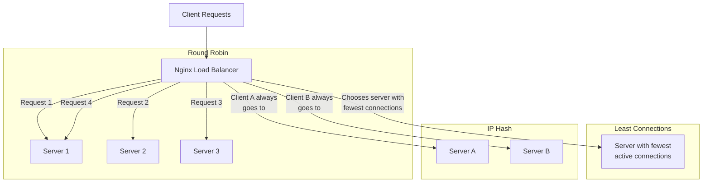

# Nginx Balancing Methods

## Introduction

Load balancing is a critical concept in web infrastructure that distributes incoming network traffic across multiple servers to ensure no single server bears too much load. This improves application availability, scalability, and reliability. Nginx, a popular web server and reverse proxy, offers several balancing methods (algorithms) that determine how requests are distributed among backend servers.

In this guide, we'll explore the various load balancing methods available in Nginx, understand how each works, and learn when to use each method depending on your application requirements.

## Understanding Nginx Load Balancing

Before diving into specific methods, let's understand the basic configuration of an Nginx load balancer:

```nginx
http {
    upstream backend_servers {
        # Balancing method and servers defined here
        server backend1.example.com;
        server backend2.example.com;
        server backend3.example.com;
    }
    
    server {
        listen 80;
        
        location / {
            proxy_pass http://backend_servers;
        }
    }
}
```

The `upstream` block defines a group of servers among which the load will be balanced. The balancing method is determined by directives added to this block.

## Round Robin (Default Method)

The round robin method is Nginx's default balancing strategy, distributing requests sequentially to each server in turn.

### How It Works

Each new request is sent to the next server in the list, returning to the first server when it reaches the end.

### Configuration

Since round robin is the default, no special directive is needed:

```nginx
upstream backend_servers {
    server backend1.example.com;
    server backend2.example.com;
    server backend3.example.com;
}
```

### Example Scenario

With three servers and six incoming requests, the distribution would be:
- Request 1 → backend1
- Request 2 → backend2
- Request 3 → backend3
- Request 4 → backend1
- Request 5 → backend2
- Request 6 → backend3

### When to Use

Round robin is ideal when:
- All servers have similar specifications
- Requests have roughly equal processing requirements
- You need a simple, predictable distribution pattern

## Weighted Round Robin

This method allows you to distribute a different proportion of traffic to different servers based on their capacity.

### How It Works

Each server is assigned a weight, and requests are distributed proportionally to that weight. Servers with higher weights receive more connections.

### Configuration

```nginx
upstream backend_servers {
    server backend1.example.com weight=5;
    server backend2.example.com weight=3;
    server backend3.example.com weight=2;
}
```

### Example Scenario

With the configuration above and 10 requests, the approximate distribution would be:
- 5 requests to backend1 (50%)
- 3 requests to backend2 (30%)
- 2 requests to backend3 (20%)

### When to Use

Weighted round robin is useful when:
- Servers have different processing capabilities
- You want to gradually shift traffic during migrations
- You're testing new server configurations with limited traffic

## Least Connections

The least connections method directs traffic to the server with the fewest active connections.

### How It Works

Nginx tracks the number of active connections to each server and routes new requests to the server handling the fewest connections at that moment.

### Configuration

```nginx
upstream backend_servers {
    least_conn;
    server backend1.example.com;
    server backend2.example.com;
    server backend3.example.com;
}
```

### Example Scenario

If current connections are:
- backend1: 10 active connections
- backend2: 7 active connections
- backend3: 15 active connections

The next request will go to backend2 since it has the fewest active connections.

### When to Use

Least connections is effective when:
- Request processing times vary significantly
- Long-lived connections are common (like WebSockets)
- You want to prevent server overloading

## Weighted Least Connections

This method combines weights with the least connections algorithm.

### How It Works

It considers both the number of active connections and the server's weight when making routing decisions.

### Configuration

```nginx
upstream backend_servers {
    least_conn;
    server backend1.example.com weight=5;
    server backend2.example.com weight=3;
    server backend3.example.com weight=2;
}
```

In this example, the load balancer will consider both the current connection count and the weights.

### When to Use

Weighted least connections is beneficial when:
- Servers have different capacities and processing times vary
- You need to account for both server capacity and current workload
- You want to prevent overwhelming less powerful servers

## IP Hash

IP hash uses the client's IP address to determine which server should receive the request.

### How It Works

It creates a hash based on the client's IP address and uses that hash to select a server. This means requests from the same client always go to the same server (as long as the server is available).

### Configuration

```nginx
upstream backend_servers {
    ip_hash;
    server backend1.example.com;
    server backend2.example.com;
    server backend3.example.com;
}
```

### Example Scenario

- Client with IP 192.168.1.10 always goes to backend1
- Client with IP 192.168.1.20 always goes to backend3
- Client with IP 192.168.1.30 always goes to backend2

### When to Use

IP hash is suitable when:
- Session persistence is important
- Your application doesn't use cookies for session management
- You want to maintain client-server affinity

### Consideration

If a server is temporarily removed from the group, Nginx can apply a `down` parameter to remember the hashing pattern:

```nginx
upstream backend_servers {
    ip_hash;
    server backend1.example.com;
    server backend2.example.com;
    server backend3.example.com down; # Marked as down but preserves hash consistency
}
```

## Generic Hash

The generic hash method allows you to define custom variables for the hashing process.

### How It Works

It creates a hash based on the specified variables, which can include combinations of:
- Text strings
- Variables (like request URI, arguments, or headers)
- Combined values

### Configuration

```nginx
upstream backend_servers {
    hash $request_uri consistent;
    server backend1.example.com;
    server backend2.example.com;
    server backend3.example.com;
}
```

You can use multiple variables:

```nginx
upstream backend_servers {
    hash $request_uri$args consistent;
    server backend1.example.com;
    server backend2.example.com;
    server backend3.example.com;
}
```

The `consistent` parameter implements [consistent hashing](https://en.wikipedia.org/wiki/Consistent_hashing), which minimizes redistribution when servers are added or removed.

### When to Use

Generic hash is ideal when:
- You need custom session persistence based on specific request attributes
- You want more control over which parameters determine server selection
- IP hash doesn't meet your specific needs

## Least Time (Commercial Nginx Plus Only)

:::note
This method is only available in Nginx Plus, the commercial version.
:::

### How It Works

Least time selects the server with the lowest combination of response times and active connections.

### Configuration

```nginx
upstream backend_servers {
    least_time header; # Options: header, last_byte, or last_byte inflight
    server backend1.example.com;
    server backend2.example.com;
    server backend3.example.com;
}
```

Options include:
- `header`: Time to receive the response header
- `last_byte`: Time to receive the full response
- `last_byte inflight`: Considers incomplete requests too

### When to Use

Least time is valuable when:
- Response time is critical to application performance
- Backend server performance varies significantly
- You need to optimize for actual server performance, not just connection count

## Random with Two Choices

This method randomly selects two servers and then chooses the one with fewer active connections.

### How It Works

1. Nginx randomly selects two servers from the group
2. It checks the number of active connections on both
3. It directs the request to the server with fewer connections

### Configuration

```nginx
upstream backend_servers {
    random two least_conn;
    server backend1.example.com;
    server backend2.example.com;
    server backend3.example.com;
    server backend4.example.com;
}
```

### When to Use

Random with two choices is useful when:
- You have a large number of backend servers
- You want to combine randomization with load awareness
- You need a solution that scales well with many servers

## Advanced Configuration Options

### Server Weights

As mentioned earlier, you can assign weights to servers with any balancing method:

```nginx
upstream backend_servers {
    server backend1.example.com weight=5;
    server backend2.example.com weight=3;
}
```

### Server Flags

Additional server flags can modify load balancer behavior:

```nginx
upstream backend_servers {
    server backend1.example.com max_fails=3 fail_timeout=30s;
    server backend2.example.com backup;
    server backend3.example.com down;
}
```

Common flags include:
- `max_fails=n`: Maximum failed attempts before marking server as unavailable
- `fail_timeout=time`: How long to consider a server unavailable
- `backup`: Server only receives requests when primary servers are down
- `down`: Marks server as permanently unavailable

### Sticky Sessions with Cookies (Nginx Plus)

In Nginx Plus, you can implement sticky sessions:

```nginx
upstream backend_servers {
    server backend1.example.com;
    server backend2.example.com;
    sticky cookie srv_id expires=1h domain=.example.com path=/;
}
```

## Visualizing Different Balancing Methods

Here's a diagram showing how different balancing methods distribute traffic:



## Real-World Example: Multi-Tiered Application

Let's look at a complete example of a multi-tiered application with different balancing methods for different services:

```nginx
# Web frontend servers - using least connections
upstream web_frontend {
    least_conn;
    server frontend1.example.com max_fails=2 fail_timeout=30s;
    server frontend2.example.com max_fails=2 fail_timeout=30s;
    server frontend3.example.com max_fails=2 fail_timeout=30s;
}

# API servers - using IP hash for session persistence
upstream api_servers {
    ip_hash;
    server api1.example.com;
    server api2.example.com;
}

# Database read replicas - using weighted distribution
upstream db_read_replicas {
    server db_read1.example.com weight=3;
    server db_read2.example.com weight=1; # Newer, smaller instance
}

server {
    listen 80;
    server_name example.com;
    
    # Frontend web content
    location / {
        proxy_pass http://web_frontend;
        proxy_set_header Host $host;
        proxy_set_header X-Real-IP $remote_addr;
    }
    
    # API endpoints
    location /api/ {
        proxy_pass http://api_servers;
        proxy_set_header Host $host;
        proxy_set_header X-Real-IP $remote_addr;
    }
    
    # Database read operations
    location /data/ {
        proxy_pass http://db_read_replicas;
        proxy_set_header Host $host;
        proxy_set_header X-Real-IP $remote_addr;
    }
}
```

In this example:
1. Frontend web servers use least connections to ensure even distribution
2. API servers use IP hash to maintain session consistency
3. Database read replicas use weighted distribution to send more traffic to the larger server

## Performance Testing Different Methods

When selecting a balancing method, it's important to test under conditions similar to your production environment. Here's a simple approach using benchmarking tools:

1. Set up your servers with the balancing method you want to test
2. Use a tool like Apache Bench (`ab`) or wrk to generate load
3. Monitor server response times and resource utilization
4. Test with realistic traffic patterns
5. Compare results between different balancing methods

Example benchmark command:

```bash
ab -n 10000 -c 100 http://your-load-balanced-domain.com/
```

## Summary

Nginx offers several load balancing methods, each suited to different scenarios:

- **Round Robin**: Simple, equal distribution (default)
- **Weighted Round Robin**: Proportional distribution based on server capacity
- **Least Connections**: Routes to servers with fewer active connections
- **Weighted Least Connections**: Combines weights with connection awareness
- **IP Hash**: Session persistence based on client IP
- **Generic Hash**: Custom hashing based on specified variables
- **Least Time**: Routes based on response time (Nginx Plus only)
- **Random with Two Choices**: Combines randomization with connection awareness

When choosing a balancing method, consider:
- Server hardware capabilities
- Request processing complexity
- Session persistence requirements
- Application architecture

The right balancing method can significantly improve your application's performance, availability, and reliability.

## Additional Resources

- [Nginx Official Documentation on Load Balancing](https://nginx.org/en/docs/http/load_balancing.html)
- [Nginx Plus Features](https://www.nginx.com/products/nginx/)
- [Understanding Consistent Hashing](https://www.nginx.com/blog/nginx-load-balancing-with-consistent-hashing/)

## Exercises

1. Set up a basic round robin load balancer with two backend servers using Docker containers.
2. Modify your configuration to use weighted round robin, giving one server twice the traffic of the other.
3. Implement an IP hash strategy and test it by making requests from different source IPs.
4. Create a complex setup using different balancing methods for different URL paths.
5. Test the performance of least connections vs. round robin with a benchmarking tool.