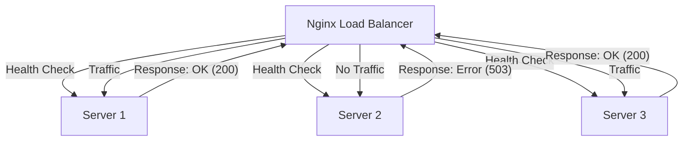

# Nginx Health Checks

## Introduction

Health checks are a crucial component of any load balancing system. They allow Nginx to monitor the health of backend servers and automatically direct traffic only to servers that are functioning properly. This ensures high availability and reliability of your application.

In this guide, you'll learn how to implement health checks in Nginx, understand different health check methods, and see real-world examples of health check configurations.

## What are Health Checks?

Health checks are automated tests that Nginx performs on your backend servers to determine if they're functioning correctly. If a server fails a health check, Nginx will temporarily remove it from the load balancing pool until it passes the check again.



## Types of Health Checks in Nginx

Nginx offers several methods to perform health checks:

### 1. Passive Health Checks

Passive health checks monitor the responses that servers provide during actual client requests. They don't generate additional traffic to your backend servers.

### 2. Active Health Checks

Active health checks proactively send requests to backend servers to verify their health, even when there are no client requests. This requires the Nginx Plus commercial version.

### 3. External Health Checks

These involve third-party tools or scripts that check server health and communicate with Nginx.

## Implementing Passive Health Checks

Passive health checks are available in the open-source version of Nginx. They're implemented using the `max_fails` and `fail_timeout` parameters.

Here's how to configure passive health checks:

```nginx
upstream backend {
    server backend1.example.com max_fails=3 fail_timeout=30s;
    server backend2.example.com max_fails=3 fail_timeout=30s;
    server backend3.example.com max_fails=3 fail_timeout=30s;
}
```

In this configuration:

- `max_fails=3`: If the server fails to respond correctly 3 times, it's considered unhealthy
- `fail_timeout=30s`: The server will be marked as unavailable for 30 seconds after reaching max_fails

### How Passive Health Checks Work

1. Nginx monitors responses from backend servers during normal operation
2. If a server fails to respond or returns an error status (`502`, `503`, `504`), Nginx increments a failure counter
3. When failures reach `max_fails`, the server is marked as unavailable for the duration specified by `fail_timeout`
4. After the timeout period, Nginx attempts to forward requests to the server again

## Implementing Active Health Checks (Nginx Plus)

Active health checks are more robust but require Nginx Plus, the commercial version of Nginx. They periodically send dedicated health check requests to servers.

```nginx
upstream backend {
    zone backend 64k;
    
    server backend1.example.com:80;
    server backend2.example.com:80;
    server backend3.example.com:80;
    
    health_check interval=5s uri=/health;
}
```

In this Nginx Plus configuration:

- `zone backend 64k`: Creates a shared memory zone for storing configuration and runtime state
- `health_check interval=5s uri=/health`: Checks each server every 5 seconds by sending a request to `/health`

### Advanced Active Health Check Configuration

Nginx Plus offers advanced health check options:

```nginx
upstream backend {
    zone backend 64k;
    
    server backend1.example.com:80;
    server backend2.example.com:80;
    server backend3.example.com:80;
    
    health_check interval=5s 
                 uri=/health 
                 match=health_status 
                 fails=3 
                 passes=2;
}

# Define what constitutes a successful health check
match health_status {
    status 200;
    header Content-Type = application/json;
    body ~ '"status":"up"';
}
```

In this example:

- `match=health_status`: Defines custom criteria for a successful health check
- `fails=3`: Server is marked unhealthy after 3 consecutive failed checks
- `passes=2`: Server needs 2 consecutive successful checks to be marked healthy again
- The `match` block specifies what determines a successful response

## Creating Health Check Endpoints

To implement health checks effectively, you need to create proper health check endpoints on your backend servers. Here's a simple example of a health check endpoint in Node.js:

```javascript
const express = require('express');
const app = express();

// Basic health check endpoint
app.get('/health', (req, res) => {
  res.status(200).json({ status: 'up' });
});

// More detailed health check that checks database connection
app.get('/health/detailed', async (req, res) => {
  try {
    // Check database connection
    await checkDatabaseConnection();
    // Check other dependencies
    await checkCacheConnection();
    
    res.status(200).json({
      status: 'up',
      database: 'connected',
      cache: 'connected',
      uptime: process.uptime()
    });
  } catch (error) {
    res.status(503).json({
      status: 'down',
      error: error.message
    });
  }
});

app.listen(3000, () => {
  console.log('Server running on port 3000');
});
```

## Real-world Health Check Implementation

Let's walk through a complete example that combines both Nginx configuration and a backend server:

### Nginx Configuration (nginx.conf)

```nginx
http {
    upstream app_servers {
        server app1.example.com:3000 max_fails=2 fail_timeout=30s;
        server app2.example.com:3000 max_fails=2 fail_timeout=30s;
        server app3.example.com:3000 backup;  # Backup server, used when others fail
    }
    
    server {
        listen 80;
        server_name example.com;
        
        location / {
            proxy_pass http://app_servers;
            proxy_set_header Host $host;
            proxy_set_header X-Real-IP $remote_addr;
            
            # Configure connection timeouts
            proxy_connect_timeout 2s;
            proxy_read_timeout 10s;
            proxy_send_timeout 10s;
        }
    }
}
```

### Application Server Health Check Endpoint (Express.js)

```javascript
const express = require('express');
const mongoose = require('mongoose');
const redis = require('redis');
const app = express();

// Database connection
const dbClient = mongoose.connection;
// Redis cache connection
const cacheClient = redis.createClient();

app.get('/health', async (req, res) => {
  const healthStatus = {
    status: 'up',
    timestamp: new Date(),
    services: {
      database: dbClient.readyState === 1 ? 'connected' : 'disconnected',
      cache: cacheClient.connected ? 'connected' : 'disconnected'
    }
  };
  
  // If any critical service is down, return 503
  if (healthStatus.services.database !== 'connected') {
    return res.status(503).json(healthStatus);
  }
  
  res.status(200).json(healthStatus);
});

// Rest of application code...
app.listen(3000);
```

## Best Practices for Health Checks

1. **Use appropriate endpoints**: Create dedicated health check endpoints that test critical dependencies.

2. **Keep health checks lightweight**: Health checks should be fast and consume minimal resources.

3. **Set reasonable thresholds**: Configure `max_fails` and `fail_timeout` values based on your application's reliability and performance characteristics.

4. **Implement different check levels**:
   - `/health`: Basic check that the service is responding
   - `/health/liveness`: Checks if the application is running
   - `/health/readiness`: Checks if the application is ready to accept requests

5. **Monitor your health checks**: Keep track of health check results to identify patterns of failures.

6. **Use backup servers**: Configure backup servers that only receive traffic when primary servers are unavailable.

## Troubleshooting Health Checks

If your health checks aren't working as expected, check the following:

1. **Connectivity issues**: Ensure Nginx can reach your backend servers
2. **Firewall rules**: Check that health check requests aren't being blocked
3. **Correct endpoints**: Verify the health check endpoint path is correct
4. **Response times**: Slow responses might trigger timeouts
5. **Log files**: Check Nginx error logs for health check failures

```bash
# Check Nginx error logs
tail -f /var/log/nginx/error.log

# Test a health endpoint directly
curl -v http://backend1.example.com/health
```

## Summary

Health checks are an essential component of Nginx load balancing that ensure high availability and reliability. We've covered:

- How health checks work in Nginx
- The difference between passive and active health checks
- How to implement health checks in both open-source Nginx and Nginx Plus
- Creating effective health check endpoints in your application
- Best practices for implementing health checks

By properly configuring health checks, you can ensure that your load balancer directs traffic only to healthy servers, providing a better experience for your users and reducing downtime.

## Further Learning

To deepen your understanding of Nginx health checks, consider exploring:

- **HTTP status codes**: Learn which status codes indicate healthy vs unhealthy services
- **Advanced monitoring**: Combine health checks with monitoring tools like Prometheus and Grafana
- **Containerized environments**: Implement health checks in Docker and Kubernetes environments
- **Service discovery**: Integrate Nginx with service discovery systems like Consul or etcd