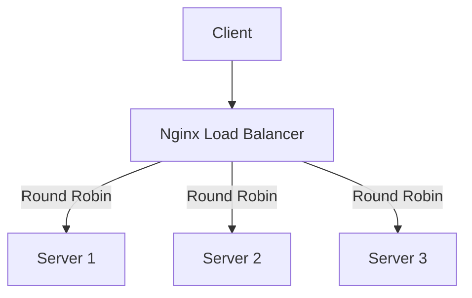
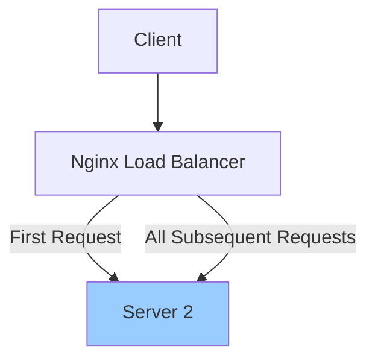
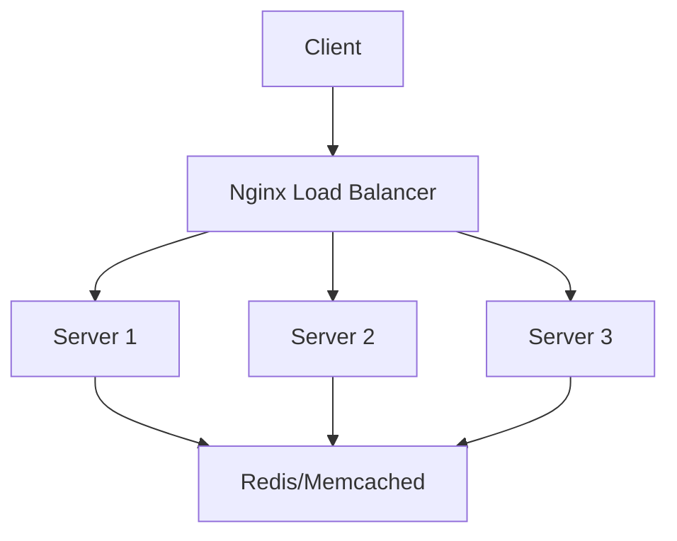

# Nginx Sticky Sessions

## Introduction

When working with load-balanced web applications, one challenge you'll encounter is maintaining session persistence. Imagine a user logs into your application, but their subsequent requests get routed to different servers that don't have their session information. This results in a poor user experience where they might need to log in repeatedly or lose their shopping cart items.

**Sticky sessions** (also known as session affinity) solve this problem by routing all requests from a specific client to the same backend server. In this guide, we'll explore how to implement sticky sessions with Nginx, one of the most popular web servers and load balancers.

## What Are Sticky Sessions?

Sticky sessions ensure that once a client establishes a connection with a particular server in your cluster, all subsequent requests from that client are directed to the same server.

Let's visualize how load balancing works with and without sticky sessions:



Without sticky sessions, each request might go to a different server based on the load balancing algorithm (like round-robin).



With sticky sessions, after the initial connection, all subsequent requests from the same client are directed to the same server.

## Why Use Sticky Sessions?

Sticky sessions are essential in several scenarios:

1. **Session-dependent applications**: Applications that store session data locally on the server.
2. **Authentication flows**: To prevent users from having to authenticate multiple times.
3. **Stateful operations**: When you're performing multi-step operations that rely on state.
4. **Shopping carts**: To ensure items added to a cart aren't lost when requests are routed to different servers.

## Implementing Sticky Sessions in Nginx

### Prerequisites

- Nginx installed with the `nginx-sticky-module-ng` or using Nginx Plus
- Basic understanding of Nginx configuration

### Method 1: Using Nginx Plus

If you're using the commercial Nginx Plus, implementing sticky sessions is straightforward:

```nginx
upstream backend {
    sticky cookie srv_id expires=1h domain=.example.com path=/;
    
    server backend1.example.com;
    server backend2.example.com;
    server backend3.example.com;
}

server {
    listen 80;
    server_name example.com;
    
    location / {
        proxy_pass http://backend;
        proxy_set_header Host $host;
        proxy_set_header X-Real-IP $remote_addr;
    }
}
```

This configuration:
- Creates a cookie named `srv_id` that expires after 1 hour
- Sets the cookie domain to `.example.com` and path to `/`
- Routes requests to the appropriate backend based on this cookie

### Method 2: Using the Community Module

For open-source Nginx, you'll need to compile Nginx with the `nginx-sticky-module-ng`:

1. First, install the necessary build dependencies:

```bash
sudo apt-get install build-essential libpcre3-dev zlib1g-dev libssl-dev
```

2. Download and extract the Nginx source code:

```bash
wget http://nginx.org/download/nginx-1.20.2.tar.gz
tar -xzvf nginx-1.20.2.tar.gz
```

3. Clone the sticky module repository:

```bash
git clone https://bitbucket.org/nginx-goodies/nginx-sticky-module-ng.git
```

4. Compile Nginx with the sticky module:

```bash
cd nginx-1.20.2
./configure --add-module=../nginx-sticky-module-ng --with-http_ssl_module
make
sudo make install
```

5. Configure Nginx with sticky sessions:

```nginx
upstream backend {
    sticky;
    
    server backend1.example.com;
    server backend2.example.com;
    server backend3.example.com;
}

server {
    listen 80;
    server_name example.com;
    
    location / {
        proxy_pass http://backend;
        proxy_set_header Host $host;
        proxy_set_header X-Real-IP $remote_addr;
    }
}
```

This configuration enables sticky sessions using the `sticky` directive, which creates a cookie to track which server a client should be sent to.

## Configuration Options

The sticky module provides several configuration options:

```nginx
sticky [name=route] [domain=.example.com] [path=/] [expires=1h] [hash=index|md5|sha1] [no_fallback];
```

- **name**: Sets the cookie name (default is "route")
- **domain**: Sets the domain attribute of the cookie
- **path**: Sets the path attribute of the cookie
- **expires**: Sets the expiration time of the cookie
- **hash**: Specifies the hash method
- **no_fallback**: If specified, requests with no cookie or an invalid cookie will return a 502 error instead of being assigned to a new server

## Real-World Example: E-commerce Application

Let's implement sticky sessions for an e-commerce application with authentication and shopping cart functionality:

```nginx
http {
    # Define the upstream group of servers
    upstream ecommerce_backend {
        sticky cookie sessionid expires=1d domain=shop.example.com path=/;
        
        server backend1.example.com:8080 max_fails=3 fail_timeout=30s;
        server backend2.example.com:8080 max_fails=3 fail_timeout=30s;
        server backend3.example.com:8080 max_fails=3 fail_timeout=30s backup;
    }
    
    server {
        listen 80;
        server_name shop.example.com;
        
        # Redirect to HTTPS
        return 301 https://$host$request_uri;
    }
    
    server {
        listen 443 ssl;
        server_name shop.example.com;
        
        ssl_certificate /etc/nginx/ssl/example.com.crt;
        ssl_certificate_key /etc/nginx/ssl/example.com.key;
        
        # Static content
        location /static/ {
            alias /var/www/static/;
            expires 1d;
        }
        
        # Main application
        location / {
            proxy_pass http://ecommerce_backend;
            proxy_set_header Host $host;
            proxy_set_header X-Real-IP $remote_addr;
            proxy_set_header X-Forwarded-For $proxy_add_x_forwarded_for;
            proxy_set_header X-Forwarded-Proto $scheme;
            
            # Websocket support
            proxy_http_version 1.1;
            proxy_set_header Upgrade $http_upgrade;
            proxy_set_header Connection "upgrade";
            
            # Timeouts
            proxy_connect_timeout 60s;
            proxy_send_timeout 60s;
            proxy_read_timeout 60s;
        }
    }
}
```

This configuration:
1. Sets up sticky sessions with a cookie named "sessionid" that expires after 1 day
2. Includes three backend servers with health checks (max_fails and fail_timeout)
3. Designates the third server as a backup
4. Handles both HTTP and HTTPS traffic, with a redirect from HTTP to HTTPS
5. Serves static content directly
6. Configures proper headers for the proxied connections
7. Supports WebSocket connections
8. Sets appropriate timeouts

## Potential Issues and Solutions

### 1. Server Failure Handling

If a server becomes unavailable, Nginx will route the request to another server, which might cause session loss. To mitigate this:

- Implement session replication between servers
- Use a centralized session store (Redis, Memcached)
- Implement client-side session storage with JWT tokens

### 2. Uneven Load Distribution

Sticky sessions can lead to uneven load distribution if some clients generate more traffic than others. Solutions include:

- Careful monitoring of server loads
- Implementing timeout for sticky sessions
- Using IP hash instead of cookies for certain use cases

### 3. Cookie-Related Issues

Some considerations when using cookie-based sticky sessions:

```nginx
# Handling clients with cookies disabled
upstream backend {
    sticky cookie route falls_through;
    ip_hash;  # Use IP hash as fallback
    
    server backend1.example.com;
    server backend2.example.com;
}
```

## Alternative Approaches

### IP Hash

Instead of cookies, you can use the client's IP address to determine which server to route to:

```nginx
upstream backend {
    ip_hash;
    
    server backend1.example.com;
    server backend2.example.com;
    server backend3.example.com;
}
```

This works well for clients with stable IP addresses but isn't suitable for clients behind proxies or with dynamic IPs.

### External Session Storage

A more robust approach is to use external session storage:



With this approach, any server can handle any request because session data is stored externally.

## Summary

Sticky sessions in Nginx provide a way to ensure that a client consistently connects to the same backend server, which is crucial for maintaining stateful connections in load-balanced environments.

Key takeaways:
- Sticky sessions solve the problem of session persistence in load-balanced environments
- Implementation options include Nginx Plus or the community nginx-sticky-module-ng
- Configure with care to handle server failures and load distribution
- Consider alternatives like external session storage for more robust applications

## Exercises

1. Set up a basic Nginx load balancer with sticky sessions using the community module
2. Implement sticky sessions with a 30-minute timeout for an authentication system
3. Create a configuration that falls back to IP hash if cookies are disabled
4. Design a high-availability setup with sticky sessions and proper failure handling

## Additional Resources

- [Nginx Official Documentation](https://nginx.org/en/docs/)
- [Nginx Load Balancing Guide](https://docs.nginx.com/nginx/admin-guide/load-balancer/)
- [Sticky Module GitHub Repository](https://bitbucket.org/nginx-goodies/nginx-sticky-module-ng)
- [Session Management Patterns for Scale](https://www.nginx.com/blog/session-management-patterns-scale/)