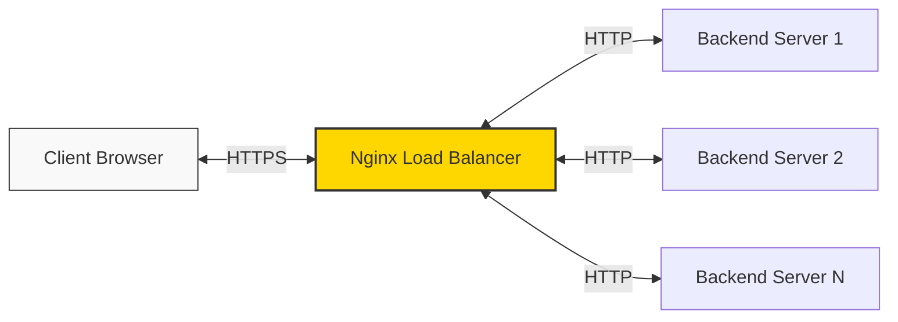

# Nginx SSL Termination

## Introduction

SSL termination is a critical concept in web infrastructure that allows you to handle encrypted traffic efficiently while maintaining security. In this guide, we'll explore how Nginx can act as an SSL termination proxy, handling the encryption overhead while passing unencrypted requests to your backend servers.

When a client connects to your website using HTTPS, the connection needs to be encrypted. However, maintaining encrypted connections all the way to your application servers can be resource-intensive. SSL termination solves this problem by decrypting traffic at the load balancer level (in this case, Nginx) and then forwarding the requests to your backend servers over a regular HTTP connection.

## Why Use SSL Termination?

SSL termination offers several benefits:

1. **Performance optimization**: The CPU-intensive encryption/decryption process happens only at the Nginx level, reducing the load on backend servers.
2. **Centralized certificate management**: Maintain SSL certificates in one place (Nginx) instead of on each backend server.
3. **Enhanced security**: Inspect decrypted traffic for threats before passing it to backend servers.
4. **Simplified infrastructure**: Backend servers don't need to handle SSL/TLS complexities.

## How SSL Termination Works

Let's visualize the SSL termination process:



1. The client initiates an HTTPS connection to your website
2. Nginx (acting as a reverse proxy) receives the encrypted request
3. Nginx decrypts the request using the configured SSL certificate
4. Nginx forwards the decrypted request to the appropriate backend server over HTTP
5. The backend server processes the request and sends the response back to Nginx
6. Nginx encrypts the response and sends it back to the client over HTTPS

## Setting Up SSL Termination in Nginx

Let's go through the step-by-step process of configuring SSL termination in Nginx:

### Step 1: Obtain SSL Certificate

First, you need a valid SSL certificate. You can use a free certificate from Let's Encrypt or purchase one from a certificate authority.

For Let's Encrypt, you can use Certbot:

```bash
sudo apt-get update
sudo apt-get install certbot
sudo certbot certonly --standalone -d yourdomain.com
```

This will generate certificates at:
- `/etc/letsencrypt/live/yourdomain.com/fullchain.pem` (certificate)
- `/etc/letsencrypt/live/yourdomain.com/privkey.pem` (private key)

### Step 2: Configure Nginx for SSL Termination

Create or modify your Nginx configuration file (typically in `/etc/nginx/sites-available/`):

```nginx
upstream backend_servers {
    server 192.168.1.10:8080;
    server 192.168.1.11:8080;
    server 192.168.1.12:8080;
}

server {
    listen 80;
    server_name yourdomain.com;
    
    # Redirect all HTTP requests to HTTPS
    return 301 https://$host$request_uri;
}

server {
    listen 443 ssl;
    server_name yourdomain.com;
    
    # SSL Certificate Configuration
    ssl_certificate /etc/letsencrypt/live/yourdomain.com/fullchain.pem;
    ssl_certificate_key /etc/letsencrypt/live/yourdomain.com/privkey.pem;
    
    # Recommended SSL settings
    ssl_protocols TLSv1.2 TLSv1.3;
    ssl_ciphers HIGH:!aNULL:!MD5;
    ssl_prefer_server_ciphers on;
    ssl_session_cache shared:SSL:10m;
    ssl_session_timeout 10m;
    
    # Proxy configuration
    location / {
        proxy_pass http://backend_servers;
        proxy_set_header Host $host;
        proxy_set_header X-Real-IP $remote_addr;
        proxy_set_header X-Forwarded-For $proxy_add_x_forwarded_for;
        proxy_set_header X-Forwarded-Proto $scheme;
    }
}
```

### Step 3: Test and Apply the Configuration

Verify the syntax of your Nginx configuration:

```bash
sudo nginx -t
```

If everything is correct, reload Nginx to apply the changes:

```bash
sudo systemctl reload nginx
```

## Enhancing Your SSL Termination Setup

### Adding HTTP/2 Support

HTTP/2 improves performance through multiplexing, header compression, and other optimizations. Add it to your configuration:

```nginx
server {
    listen 443 ssl http2;
    server_name yourdomain.com;
    
    # Rest of the SSL configuration...
}
```

### Implementing HSTS (HTTP Strict Transport Security)

HSTS tells browsers to always use HTTPS for your domain:

```nginx
server {
    listen 443 ssl;
    server_name yourdomain.com;
    
    # Add HSTS header
    add_header Strict-Transport-Security "max-age=31536000; includeSubDomains" always;
    
    # Rest of the SSL configuration...
}
```

### Optimizing SSL Parameters

For better security and performance:

```nginx
# Add this block in the http {} section or in a separate file included in the http {} section
ssl_protocols TLSv1.2 TLSv1.3;
ssl_prefer_server_ciphers on;
ssl_ciphers 'ECDHE-ECDSA-AES128-GCM-SHA256:ECDHE-RSA-AES128-GCM-SHA256:ECDHE-ECDSA-AES256-GCM-SHA384:ECDHE-RSA-AES256-GCM-SHA384';
ssl_session_cache shared:SSL:10m;
ssl_session_timeout 1d;
ssl_session_tickets off;
ssl_stapling on;
ssl_stapling_verify on;
resolver 8.8.8.8 8.8.4.4 valid=300s;
resolver_timeout 5s;
```

## Real-World Example: Multi-Site SSL Termination

Let's look at a more complex example where we handle multiple domains with SSL termination:

```nginx
# Define backend server groups
upstream app1_backend {
    server 10.0.0.1:8080;
    server 10.0.0.2:8080;
}

upstream app2_backend {
    server 10.0.0.3:8080;
    server 10.0.0.4:8080;
}

# HTTP server block - redirect to HTTPS
server {
    listen 80;
    server_name app1.example.com app2.example.com;
    return 301 https://$host$request_uri;
}

# HTTPS server block for app1
server {
    listen 443 ssl http2;
    server_name app1.example.com;
    
    ssl_certificate /etc/letsencrypt/live/app1.example.com/fullchain.pem;
    ssl_certificate_key /etc/letsencrypt/live/app1.example.com/privkey.pem;
    
    location / {
        proxy_pass http://app1_backend;
        proxy_set_header Host $host;
        proxy_set_header X-Real-IP $remote_addr;
        proxy_set_header X-Forwarded-For $proxy_add_x_forwarded_for;
        proxy_set_header X-Forwarded-Proto $scheme;
    }
}

# HTTPS server block for app2
server {
    listen 443 ssl http2;
    server_name app2.example.com;
    
    ssl_certificate /etc/letsencrypt/live/app2.example.com/fullchain.pem;
    ssl_certificate_key /etc/letsencrypt/live/app2.example.com/privkey.pem;
    
    location / {
        proxy_pass http://app2_backend;
        proxy_set_header Host $host;
        proxy_set_header X-Real-IP $remote_addr;
        proxy_set_header X-Forwarded-For $proxy_add_x_forwarded_for;
        proxy_set_header X-Forwarded-Proto $scheme;
    }
}
```

This configuration:
1. Redirects all HTTP traffic to HTTPS
2. Routes traffic to different backend servers based on the domain name
3. Uses separate SSL certificates for each domain

## Common Challenges and Solutions

### Challenge 1: Certificate Renewal

Let's Encrypt certificates expire after 90 days. Set up automatic renewal:

```bash
# Add to crontab
echo "0 3 * * * /usr/bin/certbot renew --quiet --post-hook 'systemctl reload nginx'" | sudo tee -a /etc/crontab > /dev/null
```

### Challenge 2: Backend Authentication

If your backend requires authentication, you can use client certificates:

```nginx
server {
    listen 443 ssl;
    # SSL configuration...
    
    location / {
        proxy_pass https://backend_servers;
        proxy_ssl_certificate /path/to/client.crt;
        proxy_ssl_certificate_key /path/to/client.key;
        # Other proxy headers...
    }
}
```

### Challenge 3: Mixed Content Warnings

When using SSL termination, ensure your applications don't hardcode HTTP URLs:

```nginx
# Add this to fix mixed content issues
location / {
    proxy_pass http://backend_servers;
    
    # Fix links in the response
    sub_filter 'http://' 'https://';
    sub_filter_once off;
    
    # Other proxy settings...
}
```

## Security Considerations

When implementing SSL termination, keep these security aspects in mind:

1. **Internal Network Security**: After SSL termination, traffic to backend servers is unencrypted. Ensure your internal network is secure.

2. **Sensitive Information**: For highly sensitive applications (like banking), consider using end-to-end encryption instead of SSL termination.

3. **Regular Updates**: Keep Nginx and OpenSSL updated to patch known vulnerabilities.

4. **Certificate Security**: Protect your private keys and consider using secure key storage solutions.

5. **Cipher Strength**: Use strong ciphers and disable outdated protocols like SSLv3 and TLSv1.0/1.1.

## Performance Tuning

To optimize your SSL termination setup:

1. **Session Caching**: Implement proper SSL session caching to reduce handshake overhead:

```nginx
ssl_session_cache shared:SSL:10m;
ssl_session_timeout 10m;
```

2. **OCSP Stapling**: Improve connection times by enabling OCSP stapling:

```nginx
ssl_stapling on;
ssl_stapling_verify on;
resolver 8.8.8.8 8.8.4.4 valid=300s;
resolver_timeout 5s;
```

3. **Worker Processes**: Adjust worker processes based on CPU cores:

```nginx
worker_processes auto;
```

## Summary

SSL termination with Nginx provides a powerful way to secure your web applications while optimizing performance. By handling the SSL/TLS encryption and decryption at the Nginx level, you reduce the load on your backend servers and simplify certificate management.

In this guide, we've covered:
- The concept and benefits of SSL termination
- Step-by-step configuration in Nginx
- Advanced features like HTTP/2 and HSTS
- Real-world examples for multi-site setups
- Common challenges and their solutions
- Security considerations and performance tuning tips

By implementing SSL termination correctly, you create a more secure, efficient, and manageable web infrastructure.

## Additional Resources

- [Nginx SSL Documentation](https://nginx.org/en/docs/http/configuring_https_servers.html)
- [Let's Encrypt Documentation](https://letsencrypt.org/docs/)
- [Mozilla SSL Configuration Generator](https://ssl-config.mozilla.org/)

## Exercises

1. **Basic Setup**: Configure a basic Nginx SSL termination for a single backend server.
2. **Certificate Renewal**: Set up automatic certificate renewal with Let's Encrypt.
3. **Advanced Configuration**: Implement a multi-site SSL termination setup with different backend server groups.
4. **Security Hardening**: Enhance your SSL configuration with HSTS, OCSP stapling, and strong cipher settings.
5. **Load Testing**: Use a tool like Apache Benchmark to test the performance difference between direct HTTPS connections to your backend vs. using Nginx SSL termination.