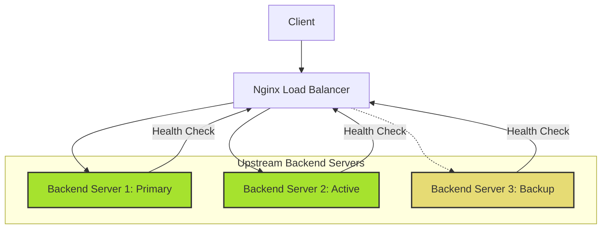
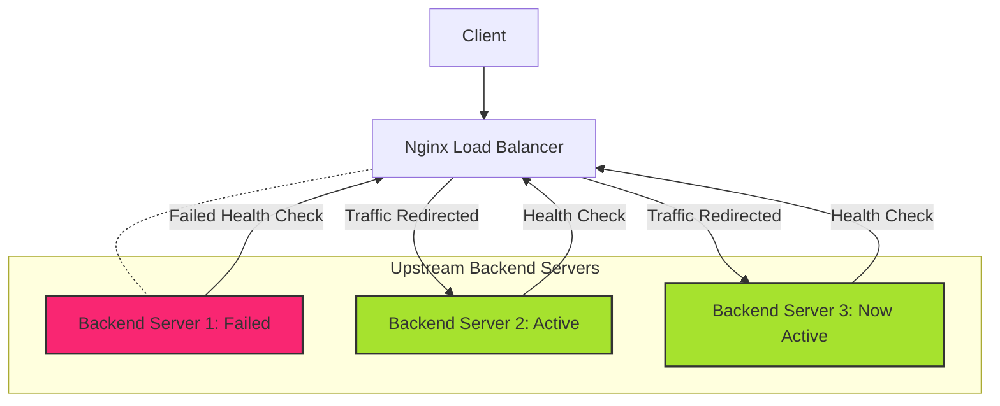

# Nginx Backend Failover

## Introduction

When running web applications in a production environment, ensuring high availability is crucial. If a backend server goes down, your users shouldn't experience service disruptions. This is where **backend failover** comes into play.

Backend failover is a critical feature of Nginx's load balancing capabilities that automatically redirects traffic away from failed servers to healthy ones. In this guide, we'll explore how to implement robust failover mechanisms using Nginx to maintain service availability even when backend servers fail.

## Understanding Backend Failover

Backend failover is a high-availability technique that ensures continuity of service when one or more backend servers become unavailable. Nginx constantly monitors the health of backend servers and automatically routes traffic to operational servers when failures are detected.

### Key Benefits

- **Improved Reliability**: Minimize downtime during server failures
- **Enhanced User Experience**: Users remain unaffected by backend issues
- **Simplified Maintenance**: Perform server maintenance without service interruption
- **Disaster Recovery**: Quick recovery from unexpected server failures

## Basic Failover Configuration

Let's start with a basic failover configuration in Nginx:

```nginx
http {
    upstream backend_servers {
        server backend1.example.com:8080;
        server backend2.example.com:8080 backup;
    }

    server {
        listen 80;
        server_name example.com;

        location / {
            proxy_pass http://backend_servers;
            proxy_set_header Host $host;
            proxy_set_header X-Real-IP $remote_addr;
        }
    }
}
```

In this example:
- We define an `upstream` group called `backend_servers` with two backend servers
- The second server has the `backup` parameter, designating it as a backup server
- Nginx will only route traffic to the backup server if the primary server is unavailable

### How It Works

1. All traffic is initially directed to `backend1.example.com`
2. If `backend1.example.com` fails, traffic is automatically redirected to `backend2.example.com`
3. When `backend1.example.com` becomes available again, traffic returns to it

## Active Health Checks

For more robust failover, Nginx Plus provides active health checks that proactively monitor backend servers:

```nginx
http {
    upstream backend_servers {
        server backend1.example.com:8080;
        server backend2.example.com:8080;
        server backend3.example.com:8080;

        health_check interval=5s fails=3 passes=2;
    }

    server {
        listen 80;
        server_name example.com;

        location / {
            proxy_pass http://backend_servers;
            health_check uri=/health;
        }
    }
}
```

In this configuration:
- Nginx checks the `/health` endpoint every 5 seconds
- A server is considered failed after 3 consecutive failed checks
- A server is marked as healthy after 2 consecutive successful checks

### Custom Health Check Parameters

You can customize health checks with various parameters:

```nginx
upstream backend_servers {
    server backend1.example.com:8080;
    server backend2.example.com:8080;
    
    health_check interval=10s 
                 fails=3 
                 passes=2 
                 uri=/status 
                 match=health_check_status;
}

match health_check_status {
    status 200;
    body ~ "OK";
}
```

This configuration checks for both an HTTP 200 status code and the text "OK" in the response body.

## Passive Health Checks

For Nginx open-source, we can implement passive health checks using the `max_fails` and `fail_timeout` parameters:

```nginx
http {
    upstream backend_servers {
        server backend1.example.com:8080 max_fails=3 fail_timeout=30s;
        server backend2.example.com:8080 max_fails=3 fail_timeout=30s;
    }

    server {
        listen 80;
        server_name example.com;

        location / {
            proxy_pass http://backend_servers;
            proxy_next_upstream error timeout http_500 http_502 http_503 http_504;
        }
    }
}
```

In this setup:
- `max_fails=3`: A server is considered unavailable after 3 failed attempts
- `fail_timeout=30s`: After failure, the server is marked unavailable for 30 seconds
- `proxy_next_upstream`: Specifies conditions when Nginx should try the next server

## Real-world Example: E-commerce Application

Let's look at a practical example for an e-commerce application with different backend services:

```nginx
http {
    # Product catalog service
    upstream product_service {
        server product1.example.com:8080 weight=3;
        server product2.example.com:8080 weight=1;
        server product3.example.com:8080 backup;

        least_conn;
        keepalive 32;
    }

    # Payment processing service
    upstream payment_service {
        server payment1.example.com:8080;
        server payment2.example.com:8080 backup;

        keepalive 16;
    }

    server {
        listen 80;
        server_name shop.example.com;

        # Product catalog endpoints
        location /api/products {
            proxy_pass http://product_service;
            proxy_next_upstream error timeout http_500 http_502 http_503 http_504;
            proxy_next_upstream_timeout 10s;
            proxy_next_upstream_tries 3;
            
            proxy_set_header Host $host;
            proxy_set_header X-Real-IP $remote_addr;
            proxy_set_header X-Forwarded-For $proxy_add_x_forwarded_for;
        }

        # Payment processing endpoints
        location /api/payments {
            proxy_pass http://payment_service;
            proxy_next_upstream error timeout http_500 http_502 http_503 http_504;
            
            proxy_set_header Host $host;
            proxy_set_header X-Real-IP $remote_addr;
            proxy_set_header X-Forwarded-For $proxy_add_x_forwarded_for;
        }
    }
}
```

This configuration:
1. Creates separate upstream groups for different services
2. Uses weighted load balancing for the product service
3. Employs dedicated backup servers for each service
4. Sets different connection parameters based on service requirements
5. Configures timeout and retry settings for failover scenarios

## Visualizing Failover in Action

Let's visualize how failover works with a diagram:



When a server fails:



## Advanced Failover Techniques

### Slow-start Recovery

Nginx Plus offers a "slow start" feature that gradually increases traffic to a recovered server:

```nginx
upstream backend {
    server backend1.example.com:8080 slow_start=30s;
    server backend2.example.com:8080;
    server backup.example.com:8080 backup;
}
```

When `backend1` recovers from a failure, Nginx gradually increases traffic over 30 seconds, preventing it from being overwhelmed.

### Circuit Breaker Pattern

We can implement a basic circuit breaker pattern using Nginx variables and maps:

```nginx
http {
    # Define a map to track server state
    map $upstream_addr $upstream_status_key {
        default "server_$upstream_addr";
        "~[^:]+$" "server_$upstream_addr";
    }

    # Circuit breaker logic using Nginx Keyval module
    keyval_zone zone=circuit_breaker:10m timeout=60s;
    keyval $upstream_status_key $server_failures zone=circuit_breaker;

    server {
        listen 80;
        
        location / {
            set $upstream_endpoint "http://backend_servers";
            
            # Check if server has too many failures
            access_by_lua_block {
                local failures = tonumber(ngx.var.server_failures) or 0
                
                if failures >= 5 then
                    ngx.log(ngx.WARN, "Circuit open for ", ngx.var.upstream_status_key)
                    ngx.var.upstream_endpoint = "http://backup_servers"
                end
            }
            
            proxy_pass $upstream_endpoint;
            
            # Track failures
            header_filter_by_lua_block {
                if ngx.status >= 500 then
                    local failures = tonumber(ngx.var.server_failures) or 0
                    ngx.var.server_failures = failures + 1
                end
            }
        }
    }
}
```

This advanced technique requires the Nginx Lua module but provides more sophisticated failover control.

## Common Troubleshooting Issues

### Problem: All Servers Marked as Failed

If all your servers are being marked as failed, check:

1. Health check endpoints are properly implemented
2. Network connectivity between Nginx and backend servers
3. Timeouts are configured appropriately

```nginx
# More lenient health check configuration
health_check interval=10s 
             fails=5 
             passes=2 
             timeout=5s;
```

### Problem: Premature Failover

If Nginx is failing over too aggressively:

1. Increase the `max_fails` threshold
2. Adjust `fail_timeout` duration
3. Verify your backend server's response times

```nginx
# Less aggressive failover configuration
server backend1.example.com:8080 max_fails=5 fail_timeout=60s;
```

## Summary

Nginx backend failover provides essential high-availability capabilities for your web applications. By implementing proper failover mechanisms, you can ensure your services remain available even when individual servers experience issues.

Key takeaways:
- Use backup servers for basic failover scenarios
- Implement health checks to detect server failures automatically
- Configure timeout and retry parameters to fine-tune failover behavior
- Consider advanced techniques like slow-start and circuit breakers for critical applications

## Additional Resources and Exercises

### Exercises

1. **Basic Failover Configuration**: Set up a simple Nginx environment with two backend servers and configure one as a backup. Test failover by stopping the primary server.

2. **Health Check Implementation**: Configure passive health checks using `max_fails` and `fail_timeout`. Test different values to see how they affect failover behavior.

3. **Advanced Configuration**: Create a multi-service configuration similar to the e-commerce example with different failover policies for each service.

### Further Learning

- Explore Nginx Plus features for enhanced failover capabilities
- Learn about centralized monitoring solutions that complement Nginx's failover mechanisms
- Study distributed system patterns like circuit breakers, bulkheads, and retries

Remember that a well-designed failover strategy is just one part of a comprehensive high-availability solution. Consider implementing additional reliability patterns like retries, caching, and graceful degradation for robust web applications.