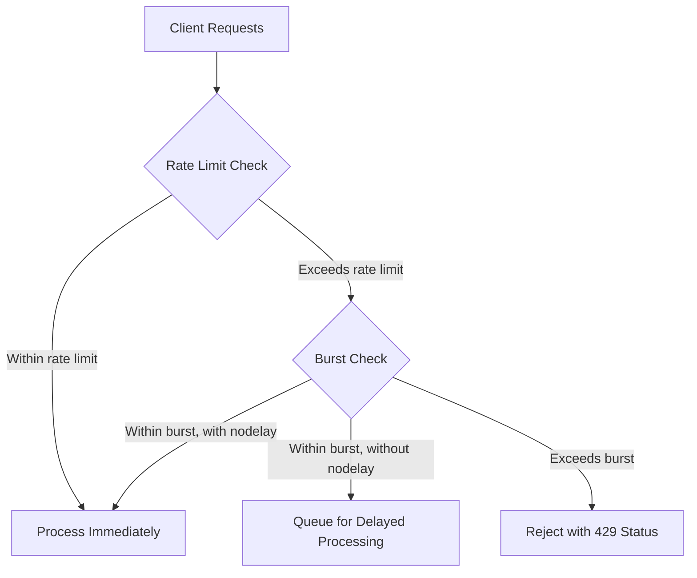

# Nginx Connection Limiting

## Introduction

Connection limiting is a critical technique in Nginx that helps protect your servers from being overwhelmed by too many simultaneous connections. By controlling the rate and number of connections to your applications, you can ensure stable performance, prevent denial of service scenarios, and fairly distribute resources among clients.

In this guide, we'll explore how to implement and configure various connection limiting techniques in Nginx. You'll learn not only the configuration syntax but also the rationale behind each approach and real-world scenarios where they're beneficial.

## Why Connection Limiting Matters

Before diving into the implementation details, let's understand why connection limiting is important:

1. **Resource Protection**: Every connection consumes server resources (memory, file descriptors, CPU time)
2. **Abuse Prevention**: Prevents malicious actors from overwhelming your services
3. **Fair Distribution**: Ensures all users get reasonable access to your application
4. **Stability**: Maintains consistent performance by preventing resource exhaustion

## Basic Connection Limiting Concepts

Nginx offers several modules for connection limiting:

- `ngx_http_limit_conn_module`: Limits the number of connections
- `ngx_http_limit_req_module`: Limits the request rate
- `ngx_http_core_module`: Provides basic timeout settings

Let's explore each of these in detail.

## Limiting Connections per Client

The most basic form of connection limiting restricts how many connections a single client can establish.

### Configuration Example

```nginx
# Define a connection limit zone based on client IP
http {
    # Create a zone named "per_ip_conn" that tracks client IPs
    # Allocate 10MB of memory for this tracking
    limit_conn_zone $binary_remote_addr zone=per_ip_conn:10m;
    
    server {
        listen 80;
        server_name example.com;
        
        location / {
            # Limit each IP to 10 concurrent connections
            limit_conn per_ip_conn 10;
            
            # Optional: configure the error response
            limit_conn_status 429; # Too Many Requests
            limit_conn_log_level warn;
            
            proxy_pass http://backend;
        }
    }
}
```

### How It Works

1. The `limit_conn_zone` directive creates a shared memory zone that tracks client connections
2. `$binary_remote_addr` is the client's IP address in binary form (more memory-efficient than text)
3. `zone=per_ip_conn:10m` allocates 10MB of memory for tracking
4. `limit_conn per_ip_conn 10` restricts each client IP to a maximum of 10 concurrent connections

### Memory Considerations

The `$binary_remote_addr` variable uses about 4 bytes per IP address for IPv4 (16 bytes for IPv6). With 10MB of memory allocated, you can track approximately:

```
10MB / 4 bytes = ~2.5 million IPv4 addresses
```

For higher traffic sites, you may need to increase the memory allocation.

## Request Rate Limiting

While connection limiting focuses on concurrent connections, request rate limiting controls how frequently a client can make requests.

### Configuration Example

```nginx
http {
    # Define a rate limit zone based on client IP
    # Store state for 10,000 IP addresses in 10MB
    limit_req_zone $binary_remote_addr zone=req_limit_per_ip:10m rate=5r/s;
    
    server {
        listen 80;
        server_name example.com;
        
        location / {
            # Apply the rate limit with a burst of 10
            limit_req zone=req_limit_per_ip burst=10 nodelay;
            
            # Set the status code for rejected requests
            limit_req_status 429;
            
            proxy_pass http://backend;
        }
    }
}
```

### Understanding the Parameters

- `rate=5r/s`: Limits each client to 5 requests per second
- `burst=10`: Allows bursts of up to 10 additional requests to queue
- `nodelay`: Processes queued burst requests immediately instead of spacing them out

### With vs. Without "nodelay"

The `nodelay` parameter significantly changes how Nginx handles burst requests:

- **With `nodelay`**: Burst requests are processed immediately up to the burst limit
- **Without `nodelay`**: Burst requests are processed at the defined rate, essentially queuing them

Let's visualize this difference:



## Combined Connection and Rate Limiting

For optimal protection, you can combine both approaches:

```nginx
http {
    # Connection limit zone
    limit_conn_zone $binary_remote_addr zone=conn_limit:10m;
    
    # Request rate limit zone
    limit_req_zone $binary_remote_addr zone=req_limit:10m rate=10r/s;
    
    server {
        listen 80;
        server_name example.com;
        
        location / {
            # Apply both limits
            limit_conn conn_limit 5;
            limit_req zone=req_limit burst=20 nodelay;
            
            proxy_pass http://backend;
        }
    }
}
```

This configuration:
- Limits each client to 5 concurrent connections
- Limits each client to 10 requests per second with a burst allowance of 20

## Connection Limiting by Different Variables

You can limit connections based on various parameters besides client IP:

### By Server Name

```nginx
# Limit connections per server name
limit_conn_zone $server_name zone=per_server:10m;

server {
    # Limit entire server to 1000 connections
    limit_conn per_server 1000;
}
```

### By User Authentication

```nginx
# Limit connections per authenticated user
limit_conn_zone $remote_user zone=per_user:10m;

location /app {
    auth_basic "Authentication Required";
    auth_basic_user_file /etc/nginx/htpasswd;
    
    # Limit each user to 2 connections
    limit_conn per_user 2;
}
```

## Advanced: Limiting Specific Endpoints

You can apply different limits to different parts of your application:

```nginx
http {
    limit_conn_zone $binary_remote_addr zone=api_conn:10m;
    limit_req_zone $binary_remote_addr zone=api_req:10m rate=2r/s;
    
    server {
        # Static content - more lenient
        location /static/ {
            limit_conn api_conn 20;
            limit_req zone=api_req burst=10 nodelay;
            root /var/www/static;
        }
        
        # API endpoints - stricter
        location /api/ {
            limit_conn api_conn 5;
            limit_req zone=api_req burst=5;
            proxy_pass http://api_backend;
        }
        
        # Login endpoint - very strict to prevent brute force
        location /login {
            limit_conn api_conn 3;
            limit_req zone=api_req rate=1r/s;
            proxy_pass http://auth_backend;
        }
    }
}
```

## Real-World Scenario: E-commerce Site Protection

Let's implement a real-world example for an e-commerce site:

```nginx
http {
    # General browsing - relatively lenient
    limit_conn_zone $binary_remote_addr zone=browsing:10m;
    limit_req_zone $binary_remote_addr zone=browse_rate:10m rate=10r/s;
    
    # Shopping cart operations - moderate limits
    limit_req_zone $binary_remote_addr zone=cart_ops:10m rate=3r/s;
    
    # Checkout process - stricter protection
    limit_conn_zone $binary_remote_addr zone=checkout:5m;
    
    # Admin operations - very strict
    limit_req_zone $binary_remote_addr zone=admin_ops:5m rate=1r/s;
    
    server {
        server_name shop.example.com;
        
        # Product browsing
        location ~ ^/products/ {
            limit_conn browsing 20;
            limit_req zone=browse_rate burst=20 nodelay;
            proxy_pass http://product_service;
        }
        
        # Cart operations
        location ~ ^/cart/ {
            limit_req zone=cart_ops burst=5 nodelay;
            proxy_pass http://cart_service;
        }
        
        # Checkout process
        location ~ ^/checkout/ {
            limit_conn checkout 2;
            limit_req zone=cart_ops burst=3;
            proxy_pass http://checkout_service;
        }
        
        # Admin panel
        location ~ ^/admin/ {
            limit_req zone=admin_ops burst=5;
            auth_basic "Admin Area";
            auth_basic_user_file /etc/nginx/admin_users;
            proxy_pass http://admin_service;
        }
    }
}
```

This configuration provides different protection levels based on the sensitivity and resource requirements of each section.

## Monitoring Connection Limits

To monitor your connection limiting, you can use Nginx's status module:

```nginx
location /nginx_status {
    # Only allow internal access
    allow 127.0.0.1;
    deny all;
    
    # Enable status display
    stub_status on;
}
```

You can then check the status with:

```bash
curl http://localhost/nginx_status
```

Which outputs something like:

```
Active connections: 43
server accepts handled requests
 1977231 1977231 3457324
Reading: 0 Writing: 5 Waiting: 38
```

## Handling Limit Violations

When limits are exceeded, you can customize how Nginx responds:

```nginx
location /api {
    # Set status code for connection limit violations
    limit_conn_status 429;
    
    # Set status code for rate limit violations
    limit_req_status 429;
    
    # Customize error page
    error_page 429 /rate_limited.html;
    
    # Log level for limit violations
    limit_conn_log_level warn;
    limit_req_log_level warn;
}
```

You can create a custom error page that explains the situation to users:

```html
<!-- /var/www/rate_limited.html -->
<!DOCTYPE html>
<html>
<head>
    <title>Rate Limited</title>
</head>
<body>
    <h1>Too Many Requests</h1>
    <p>Please slow down and try again in a moment.</p>
</body>
</html>
```

## Connection Limiting with Upstream Servers

When using Nginx as a load balancer, you can apply connection limits to upstream servers:

```nginx
upstream backend {
    server backend1.example.com max_conns=100;
    server backend2.example.com max_conns=100;
    server backup1.example.com backup;
}

server {
    location / {
        proxy_pass http://backend;
    }
}
```

The `max_conns` parameter limits how many connections Nginx will forward to each upstream server.

## Best Practices

1. **Start Conservative**: Begin with more permissive limits and tighten them as you understand traffic patterns
2. **Monitor Closely**: Watch logs for rejected connections to ensure legitimate users aren't affected
3. **Customize by Section**: Apply stricter limits to sensitive or resource-intensive parts of your application
4. **Layer Protection**: Combine connection limiting with rate limiting for comprehensive defense
5. **Consider Legitimate Use Cases**: Account for your application's normal usage patterns when setting limits
6. **Test Under Load**: Verify your settings under realistic traffic conditions

## Troubleshooting

If you encounter issues with connection limiting, check:

1. **Nginx Logs**: Look for entries with "limiting connections" or "limiting requests"
2. **Memory Allocation**: Ensure you've allocated enough memory for your zones
3. **Variable Choice**: Make sure you're using the right variable to track clients
4. **Client Identification**: Consider if you need to account for proxies or load balancers

## Summary

Connection limiting in Nginx provides essential protection for your web applications by controlling how clients interact with your services. By implementing appropriate limits, you can:

- Prevent resource exhaustion
- Protect against denial of service attacks
- Ensure fair resource distribution
- Maintain application stability under load

The configuration options we've explored give you fine-grained control over connection behavior, allowing you to tailor limits to your specific application needs.

## Practice Exercises

1. Configure connection limiting for a simple web server with different limits for static content and dynamic content
2. Set up rate limiting for an API with a reasonable burst allowance
3. Implement both connection and rate limiting for an authentication endpoint
4. Create a monitoring endpoint that shows your current connection statistics
5. Design a connection limiting strategy for a multi-tier application with different resource requirements at each tier

## Additional Resources

- [Nginx Documentation on limit_conn_module](https://nginx.org/en/docs/http/ngx_http_limit_conn_module.html)
- [Nginx Documentation on limit_req_module](https://nginx.org/en/docs/http/ngx_http_limit_req_module.html)
- [Digital Ocean Guide on Rate Limiting](https://www.digitalocean.com/community/tutorials/how-to-rate-limit-traffic-with-nginx-on-ubuntu-20-04)