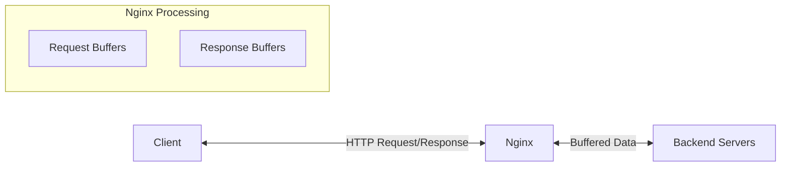

# Nginx Buffer Settings

## Introduction

When working with Nginx as a load balancer, understanding buffer settings is crucial for optimizing performance. Buffers are temporary storage areas in memory that Nginx uses to process requests and responses. Properly configured buffer settings can significantly improve your server's performance, especially under high load conditions.

In this guide, we'll explore the various buffer settings available in Nginx, their purpose, and how to configure them effectively for load balancing scenarios. Whether you're dealing with large file uploads, proxy connections, or high-traffic websites, mastering these settings will help you create a more efficient and responsive system.

## Understanding Nginx Buffers

Nginx uses different types of buffers to temporarily store data during request processing. Think of buffers as waiting areas where data sits before being processed further or sent to its destination.

### Why Buffers Matter



Buffers serve several important purposes:

1. **Memory Management**: They prevent excessive memory usage by controlling how much data is handled at once
2. **Performance Optimization**: They allow Nginx to continue serving other clients while waiting for slow clients or backends
3. **Protection**: They can help protect against certain types of attacks by limiting resource consumption

## Key Buffer Settings for Load Balancing

### Client Request Buffers

These buffers handle incoming requests from clients before they're passed to upstream servers.

#### `client_body_buffer_size`

This setting defines the buffer size for the request body, which is particularly important for POST requests or file uploads.

```nginx
http {
    client_body_buffer_size 16k;
}
```

- **Default**: 8k or 16k (depends on platform)
- **When to increase**: When handling large form submissions or file uploads
- **When to decrease**: On memory-constrained systems with primarily small requests

If a request exceeds this buffer size, Nginx will write the request body to a temporary file. This is less efficient, so setting an appropriate buffer size is important.

#### `client_header_buffer_size`

This setting controls the buffer size for the client request header.

```nginx
http {
    client_header_buffer_size 1k;
}
```

- **Default**: 1k
- **When to increase**: When clients send requests with large headers (cookies, authentication tokens, etc.)

#### `large_client_header_buffers`

When the client_header_buffer_size is insufficient, Nginx allocates buffers from this pool.

```nginx
http {
    large_client_header_buffers 4 8k;
}
```

The configuration above allocates 4 buffers of 8k each for large client request headers.

### Proxy Buffers (for Load Balancing)

These are particularly important for load balancing as they handle data between Nginx and your backend servers.

#### `proxy_buffer_size`

This sets the size of the buffer used for reading the first part of the response from the proxied server (typically contains headers).

```nginx
location / {
    proxy_buffer_size 4k;
}
```

- **Default**: 4k or 8k
- **When to increase**: When backend servers send responses with large headers

#### `proxy_buffers`

This setting configures the number and size of buffers used for reading the response from the proxied server.

```nginx
location / {
    proxy_buffers 8 4k;
}
```

The configuration above sets 8 buffers of 4k each for the response from the proxied server.

- **Default**: 8 buffers of 4k or 8k each
- **When to increase**: When proxying large responses
- **When to decrease**: On memory-constrained systems

#### `proxy_busy_buffers_size`

This limits the total size of buffers that can be busy sending a response to the client while the response is not yet fully read.

```nginx
location / {
    proxy_busy_buffers_size 16k;
}
```

- **Default**: 8k or 16k
- **When to adjust**: To control how much data can be sent to a client while still reading from the backend

#### `proxy_buffering`

This directive enables or disables buffering of responses from the proxied server.

```nginx
location / {
    proxy_buffering on;
}
```

- **Default**: on
- **When to disable**: For real-time applications where immediate response is critical

## Practical Configuration Example

Let's look at a complete example of buffer settings for a load balancing scenario:

```nginx
http {
    # Client buffers
    client_body_buffer_size 16k;
    client_header_buffer_size 1k;
    large_client_header_buffers 4 8k;
    
    # Default proxy settings for all locations
    proxy_buffer_size 4k;
    proxy_buffers 8 4k;
    proxy_busy_buffers_size 16k;
    
    upstream backend_servers {
        server backend1.example.com;
        server backend2.example.com;
        server backend3.example.com;
    }
    
    server {
        listen 80;
        server_name example.com;
        
        # Regular web traffic
        location / {
            proxy_pass http://backend_servers;
            proxy_buffering on;
        }
        
        # API with potentially large responses
        location /api {
            proxy_pass http://backend_servers;
            proxy_buffers 16 8k;  # Increased buffer for large API responses
        }
        
        # Real-time data that shouldn't be buffered
        location /stream {
            proxy_pass http://backend_servers;
            proxy_buffering off;  # Disable buffering for real-time data
        }
    }
}
```

## Tuning Buffer Settings

Finding the optimal buffer settings often requires experimentation and monitoring. Here's a step-by-step approach:

1. **Start with defaults**: Begin with Nginx's default settings
2. **Monitor performance**: Use tools like `nginx-status`, `htop`, or commercial monitoring solutions
3. **Look for bottlenecks**: Watch for high memory usage, disk I/O (from buffer overflow to disk), or delayed responses
4. **Adjust incrementally**: Make small changes and observe their effects
5. **Test under load**: Use tools like Apache Bench (`ab`) or JMeter to simulate real-world traffic

### Example Monitoring Script

Here's a simple bash script to check if your Nginx process is using excessive memory due to buffer issues:

```bash
#!/bin/bash
# Monitor Nginx memory usage

while true; do
  mem=$(ps aux | grep nginx | grep -v grep | awk '{sum+=$6} END {print sum/1024 "MB"}')
  echo "$(date) - Nginx memory usage: $mem"
  sleep 10
done
```

## Common Buffer-Related Issues and Solutions

### Problem: Frequently Writing to Temporary Files

**Symptoms**: High disk I/O, slower response times
**Cause**: `client_body_buffer_size` is too small for your typical requests
**Solution**: Increase the buffer size to accommodate common request sizes

```nginx
http {
    client_body_buffer_size 32k;  # Increased from default
}
```

### Problem: "414 Request-URI Too Large" Errors

**Symptoms**: Clients receive 414 errors
**Cause**: Large request headers exceed buffer size
**Solution**: Increase large_client_header_buffers

```nginx
http {
    large_client_header_buffers 4 16k;  # Increased from 4 8k
}
```

### Problem: High Memory Usage

**Symptoms**: Nginx using excessive RAM
**Cause**: Buffers too large or too numerous
**Solution**: Reduce buffer sizes or counts based on actual needs

```nginx
location / {
    proxy_buffers 4 4k;  # Reduced from 8 4k
}
```

### Problem: Slow Response for Streaming Content

**Symptoms**: Real-time applications experience delays
**Cause**: Buffering enabled for content that should be streamed immediately
**Solution**: Disable buffering for those locations

```nginx
location /events {
    proxy_pass http://backend_servers;
    proxy_buffering off;
}
```

## Advanced Buffer Optimization

For high-traffic load balancers, consider these advanced techniques:

### Use tmpfs for Temporary Files

If requests occasionally overflow buffers, storing temporary files in memory can reduce the performance penalty:

```nginx
http {
    client_body_temp_path /dev/shm/nginx/client_temp;
    proxy_temp_path /dev/shm/nginx/proxy_temp;
}
```

Make sure to create these directories with appropriate permissions:

```bash
mkdir -p /dev/shm/nginx/client_temp /dev/shm/nginx/proxy_temp
chown -R nginx:nginx /dev/shm/nginx
chmod 700 /dev/shm/nginx
```

### Conditional Buffering

You can conditionally enable or disable buffering based on response headers from your backend:

```nginx
location / {
    proxy_pass http://backend_servers;
    
    # Use backend's suggestion for buffering
    proxy_buffering on;
    proxy_ignore_headers X-Accel-Buffering;
    
    # Backend can control buffering with header
    # X-Accel-Buffering: yes|no
}
```

This allows your backend application to specify which responses should be buffered.

## Summary

Nginx buffer settings are powerful tools for optimizing your load balancer's performance. By understanding and properly configuring these settings, you can:

- Reduce memory usage
- Improve response times
- Handle more concurrent connections
- Better manage the flow of data between clients and backend servers

Remember that there's no one-size-fits-all configuration. The optimal buffer settings depend on your specific workload, traffic patterns, and hardware resources. Regular monitoring and incremental adjustments are key to finding the perfect balance.

## Practice Exercises

1. Set up a test Nginx server and experiment with different buffer sizes while monitoring memory usage
2. Create a configuration for a scenario where you need to handle both large file uploads and real-time streaming
3. Write a shell script that monitors and reports when Nginx is writing to temporary files due to buffer overflow
4. Compare performance with different buffer settings using a tool like Apache Bench

## Additional Resources

- [Nginx Official Documentation on Buffering](http://nginx.org/en/docs/http/ngx_http_proxy_module.html)
- [Digital Ocean's Nginx Config Guide](https://www.digitalocean.com/community/tutorials/how-to-optimize-nginx-configuration)
- [Tuning Nginx for Performance](https://www.nginx.com/blog/tuning-nginx/)

With a solid understanding of buffer settings, you're now better equipped to configure Nginx for optimal performance in your load balancing scenarios.