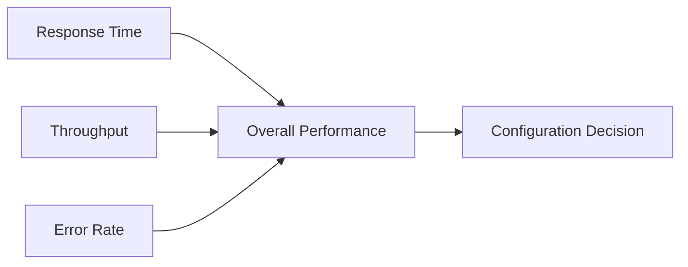

# Nginx Load Testing

## Introduction

Load testing is a critical practice for ensuring your Nginx server can handle production traffic levels. When you've configured Nginx as a load balancer, testing becomes even more important as you need to verify that your traffic distribution strategy works effectively under pressure. This guide will walk you through the process of load testing your Nginx load balancing setup, interpreting results, and making optimizations based on those findings.

## Why Load Testing Matters

Before diving into how to perform load testing, let's understand why it's essential:

1. **Identifying bottlenecks**: Discover performance limitations before your users do
2. **Validating configurations**: Ensure your load balancing strategy works under stress
3. **Capacity planning**: Determine how many concurrent users your system can support
4. **Failure testing**: Understand how your system behaves when components fail

## Load Testing Tools

Several powerful tools are available for load testing Nginx servers. We'll focus on three popular options:

### 1. Apache Benchmark (ab)

Apache Benchmark is a simple command-line tool that comes installed with Apache. Despite its name, it can test any HTTP server, including Nginx.

```bash
# Basic syntax
ab -n 1000 -c 100 http://your-load-balanced-domain.com/

# Where:
# -n: Total number of requests
# -c: Concurrent requests at a time
```

Example output:

```
This is ApacheBench, Version 2.3 <$Revision: 1843412 $>
Copyright 1996 Adam Twiss, Zeus Technology Ltd, http://www.zeustech.net/
Licensed to The Apache Software Foundation, http://www.apache.org/

Benchmarking your-load-balanced-domain.com (be patient)
Completed 100 requests
Completed 200 requests
...
Completed 1000 requests
Finished 1000 requests

Server Software:        nginx/1.18.0
Server Hostname:        your-load-balanced-domain.com
Server Port:            80

Document Path:          /
Document Length:        12454 bytes

Concurrency Level:      100
Time taken for tests:   2.735 seconds
Complete requests:      1000
Failed requests:        0
Total transferred:      12753000 bytes
HTML transferred:       12454000 bytes
Requests per second:    365.67 [#/sec] (mean)
Time per request:       273.474 [ms] (mean)
Time per request:       2.735 [ms] (mean, across all concurrent requests)
Transfer rate:          4552.36 [Kbytes/sec] received

Connection Times (ms)
              min  mean[+/-sd] median   max
Connect:       45   88  12.4     89     123
Processing:    67  183  22.3    184     234
Waiting:       67  182  22.3    183     233
Total:        112  271  25.3    273     345
```

### 2. Siege

Siege is more advanced than Apache Benchmark and can simulate multiple users accessing a site.

```bash
# Install on Ubuntu/Debian
sudo apt-get install siege

# Basic usage
siege -c 100 -t 1M http://your-load-balanced-domain.com/

# Where:
# -c: Concurrent users
# -t: Time duration (1M = 1 minute)
```

Example output:

```
** SIEGE 4.0.4
** Preparing 100 concurrent users for battle.
The server is now under siege...
Lifting the server siege...
Transactions:               12657 hits
Availability:              100.00 %
Elapsed time:              59.67 secs
Data transferred:          157.34 MB
Response time:               0.47 secs
Transaction rate:          212.12 trans/sec
Throughput:                  2.64 MB/sec
Concurrency:                99.13
Successful transactions:    12657
Failed transactions:            0
Longest transaction:         1.83
Shortest transaction:        0.11
```

### 3. Locust

Locust is a more modern, Python-based load testing tool that allows you to define user behavior using Python code.

First, install Locust:

```bash
pip install locust
```

Then create a file called `locustfile.py`:

```python
from locust import HttpUser, task, between

class WebsiteUser(HttpUser):
    wait_time = between(1, 5)  # Wait 1-5 seconds between tasks
    
    @task
    def index_page(self):
        self.client.get("/")
        
    @task(3)  # This task runs 3x more frequently
    def api_endpoint(self):
        self.client.get("/api/data")
```

Run Locust:

```bash
locust -f locustfile.py --host=http://your-load-balanced-domain.com
```

Then open http://localhost:8089 in your browser to start the test and visualize results.

## Testing Methodologies

When testing your Nginx load balancer, consider these different approaches:

### 1. Ramp-up Testing

Start with a small number of users and gradually increase to identify at what point performance degrades.

```bash
# Using siege with a ramp-up approach
for i in 10 25 50 100 200 500; do
  echo "Testing with $i concurrent users"
  siege -c $i -t 30S http://your-load-balanced-domain.com/
  sleep 60  # Allow system to recover
done
```

### 2. Sustained Load Testing

Maintain a consistent load over an extended period to identify issues that might not appear in short tests.

```bash
# Maintain 100 concurrent users for 10 minutes
siege -c 100 -t 10M http://your-load-balanced-domain.com/
```

### 3. Spike Testing

Suddenly increase load to simulate traffic spikes:

```bash
# Normal load
ab -n 1000 -c 10 http://your-load-balanced-domain.com/
# Then immediately spike
ab -n 10000 -c 1000 http://your-load-balanced-domain.com/
```

## Monitoring During Tests

While running load tests, it's crucial to monitor your servers. Here are some important metrics to track:

### CPU and Memory Usage

```bash
# SSH into your server and run
top
# or for continuous monitoring
htop
```

### Nginx-specific Metrics

Enable Nginx status module in your configuration:

```nginx
server {
    listen 80;
    server_name status.example.com;
    
    location /nginx_status {
        stub_status on;
        allow 127.0.0.1;  # Only allow local access
        deny all;
    }
}
```

Then access http://status.example.com/nginx_status to see:

```
Active connections: 291
server accepts handled requests
 16630948 16630948 31070465
Reading: 6 Writing: 179 Waiting: 106
```

### Load Balancing Visualization

You can visualize how requests are distributed across your backend servers by modifying your upstream configuration to log the chosen server:

```nginx
log_format upstream_log '[$time_local] $remote_addr - $remote_user - $server_name $host to: $upstream_addr: $request $status upstream_response_time $upstream_response_time msec $msec request_time $request_time';

access_log /var/log/nginx/upstream.log upstream_log;
```

## Common Load Testing Scenarios

Let's walk through some real-world scenarios you should test:

### 1. Testing Session Persistence

If you've configured sticky sessions in your load balancer, verify that subsequent requests from the same client go to the same backend server.

```python
# Using Python requests to test sticky sessions
import requests

# Create a session that will maintain cookies
session = requests.Session()

# Make multiple requests with the same session
for i in range(10):
    response = session.get("http://your-load-balanced-domain.com/")
    server = response.headers.get('X-Served-By', 'unknown')
    print(f"Request {i+1} served by: {server}")
```

In your Nginx configuration, add this to your backend servers to identify which server handles each request:

```nginx
# Inside the location block
add_header X-Served-By $hostname;
```

### 2. Testing Failover

Simulate a backend server failure to ensure your load balancer properly redirects traffic:

1. Start load testing with a moderate load
2. Shut down or disconnect one of your backend servers
3. Monitor if requests are correctly routed to healthy servers
4. Check for error spikes or increased response times

### 3. Testing Different Load Balancing Algorithms

Compare the performance of different algorithms (round-robin, least connections, IP hash) under various traffic patterns:

```bash
# Test with round-robin (default)
siege -c 100 -t 2M http://round-robin.example.com/

# Test with least connections
siege -c 100 -t 2M http://least-conn.example.com/

# Test with IP hash
siege -c 100 -t 2M http://ip-hash.example.com/
```

Create separate server blocks in your Nginx configuration for each algorithm:

```nginx
upstream backend_round_robin {
    server backend1.example.com:8080;
    server backend2.example.com:8080;
    # Round-robin is default
}

upstream backend_least_conn {
    least_conn;
    server backend1.example.com:8080;
    server backend2.example.com:8080;
}

upstream backend_ip_hash {
    ip_hash;
    server backend1.example.com:8080;
    server backend2.example.com:8080;
}

server {
    listen 80;
    server_name round-robin.example.com;
    
    location / {
        proxy_pass http://backend_round_robin;
    }
}

server {
    listen 80;
    server_name least-conn.example.com;
    
    location / {
        proxy_pass http://backend_least_conn;
    }
}

server {
    listen 80;
    server_name ip-hash.example.com;
    
    location / {
        proxy_pass http://backend_ip_hash;
    }
}
```

## Analyzing Results

After completing your load tests, focus on these key metrics:

1. **Response Time**: The average time to complete requests
2. **Throughput**: Requests handled per second
3. **Error Rate**: Percentage of failed requests
4. **Resource Utilization**: CPU, memory, and network usage
5. **Concurrency**: How many concurrent users the system can handle

Create a comparison table to evaluate different configurations:



## Optimizing Based on Test Results

After identifying performance bottlenecks, consider these common optimizations:

### 1. Tuning Nginx Worker Processes

```nginx
# In nginx.conf
worker_processes auto;  # Let Nginx decide based on CPU cores
worker_connections 1024;  # Increase for higher concurrency
```

### 2. Enabling Connection Pooling

```nginx
upstream backend {
    server backend1.example.com:8080;
    server backend2.example.com:8080;
    keepalive 32;  # Keep connections open
}

server {
    # ...
    location / {
        proxy_pass http://backend;
        proxy_http_version 1.1;  # Required for keepalive
        proxy_set_header Connection "";  # Clear Connection header
    }
}
```

### 3. Content Caching

```nginx
http {
    # Define a cache zone
    proxy_cache_path /var/cache/nginx levels=1:2 keys_zone=my_cache:10m inactive=60m;
    
    server {
        # ...
        location / {
            proxy_cache my_cache;
            proxy_cache_valid 200 302 10m;
            proxy_cache_valid 404 1m;
            proxy_pass http://backend;
        }
    }
}
```

### 4. Adjusting Buffer Sizes

```nginx
http {
    # Increase buffer sizes
    client_body_buffer_size 10K;
    client_header_buffer_size 1k;
    client_max_body_size 8m;
    large_client_header_buffers 2 1k;
}
```

## Real-world Case Study

Let's examine a realistic scenario of scaling a web application:

**Initial Setup:**
- 2 backend application servers
- 1 Nginx load balancer
- Round-robin distribution

**Problem:** During peak hours (9-11 AM), users experience slow response times and occasional timeout errors.

**Load Testing Process:**

1. Created a test simulating the peak traffic pattern:

```bash
# Simulate peak traffic pattern
siege -c 500 -t 30M -f urls.txt
```

Where urls.txt contains typical user paths:
```
http://example.com/
http://example.com/products
http://example.com/login
http://example.com/cart
```

2. Monitored server metrics during the test:
   - Load balancer CPU: `45%` utilized
   - Backend servers: `95%` CPU utilized
   - Response times: Average `3.2` seconds (target: `<1` second)

3. Identified backend servers as the bottleneck

**Solution:**

1. Added two more backend servers (total: 4)
2. Changed load balancing algorithm from round-robin to least connections
3. Implemented content caching for product pages

```nginx
upstream backend {
    least_conn;
    server backend1.example.com:8080;
    server backend2.example.com:8080;
    server backend3.example.com:8080;
    server backend4.example.com:8080;
    keepalive 32;
}

server {
    # ...
    location /products {
        proxy_cache product_cache;
        proxy_cache_valid 200 5m;
        proxy_pass http://backend;
    }
    
    location / {
        proxy_pass http://backend;
    }
}
```

**Results after optimization:**
- Response times: Average `0.8` seconds
- Backend server CPU utilization: `65%`
- Zero timeout errors
- `30%` increase in throughput

## Troubleshooting Common Issues

When load testing reveals problems, check these common issues:

### 1. Connection Timeouts

```
siege: unable to connect to host: Connection timed out
```

**Possible fixes:**
- Increase `keepalive_timeout` in Nginx
- Check for network issues between load balancer and backends
- Verify backend server capacity

### 2. 502 Bad Gateway Errors

Indicates the upstream server is unavailable or crashing under load.

**Possible fixes:**
- Increase backend resources
- Check application logs for errors
- Adjust `proxy_read_timeout` and `proxy_connect_timeout`

```nginx
location / {
    proxy_pass http://backend;
    proxy_connect_timeout 60s;
    proxy_read_timeout 60s;
    proxy_send_timeout 60s;
}
```

### 3. High CPU Usage on Load Balancer

**Possible fixes:**
- Increase worker processes
- Enable HTTP/2
- Implement content caching
- Use a more powerful server

## Summary

Load testing your Nginx load balancer is essential for ensuring reliability, performance, and scalability of your web applications. By systematically testing different load patterns and configurations, you can identify bottlenecks, optimize your setup, and deliver a better user experience.

Remember these key points:
- Use appropriate tools (Apache Benchmark, Siege, Locust) for different testing needs
- Test multiple scenarios: ramp-up, sustained load, and traffic spikes
- Monitor key metrics during testing
- Optimize based on test results
- Re-test after making changes to verify improvements

## Additional Resources

- [Nginx Documentation](https://nginx.org/en/docs/)
- [Siege Documentation](https://www.joedog.org/siege-manual/)
- [Locust Documentation](https://docs.locust.io/)

## Exercises

1. Set up a basic Nginx load balancer with two backend servers and perform a load test with 100 concurrent users. Document the results.

2. Compare the performance of round-robin vs. least connections algorithms for your specific application workload.

3. Create a load testing plan that includes ramp-up, sustained load, and spike testing phases.

4. Implement content caching in your load balancer and measure the performance improvement.

5. Simulate a backend server failure during a load test and evaluate how your load balancer handles the failover.