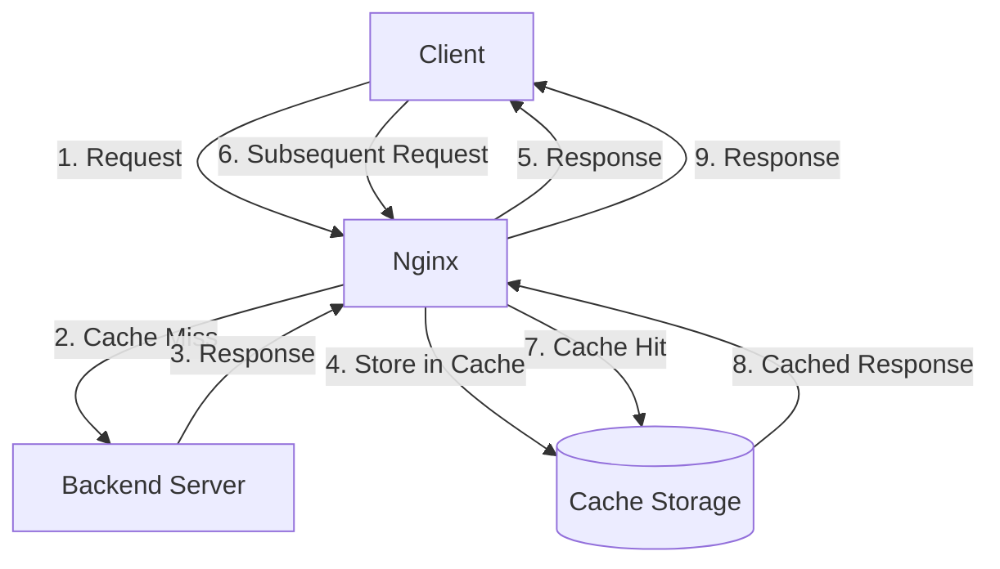

# Nginx Caching Basics

## Introduction

Caching is one of the most effective ways to improve the performance of your web applications. Nginx, a popular web server and reverse proxy, offers powerful built-in caching capabilities that can significantly reduce server load and improve response times.

In this guide, we'll explore the fundamentals of Nginx caching, understand how it works, and learn how to implement basic caching configurations.

## What is Nginx Caching?

Nginx caching refers to the process of storing copies of server responses—such as HTML pages, images, or API responses—in a designated storage area. When a client requests a resource that has been cached, Nginx can serve the cached copy directly instead of forwarding the request to the backend server.



## Why Use Nginx Caching?

Caching with Nginx provides several key benefits:

- **Reduced server load**: Backend servers process fewer requests
- **Faster response times**: Cached responses are served directly from memory or disk
- **Improved scalability**: Handle more concurrent users with the same resources
- **Lower bandwidth usage**: Reduced traffic between Nginx and backend servers
- **Better reliability**: Continue serving cached content even if backend servers are down

## Nginx Caching Components

Before diving into configuration, let's understand the main components involved in Nginx caching:

### 1. Proxy Cache Path

The `proxy_cache_path` directive defines where Nginx will store cached items and configures basic cache behavior:

```nginx
proxy_cache_path /path/to/cache levels=1:2 keys_zone=my_cache:10m max_size=10g inactive=60m;
```

Let's break down the parameters:

- `/path/to/cache`: Physical location on disk where cache files are stored
- `levels=1:2`: Creates a two-level directory hierarchy for cache files
- `keys_zone=my_cache:10m`: Names the cache zone and allocates 10MB of shared memory
- `max_size=10g`: Sets the maximum size of the cache
- `inactive=60m`: Removes cached items not accessed in 60 minutes

### 2. Proxy Cache

The `proxy_cache` directive activates caching within a specific context (http, server, or location):

```nginx
proxy_cache my_cache;
```

### 3. Proxy Cache Key

The `proxy_cache_key` directive determines how Nginx identifies unique requests:

```nginx
proxy_cache_key "$scheme$request_method$host$request_uri";
```

### 4. Cache Valid Time

The `proxy_cache_valid` directive sets how long different types of responses should be cached:

```nginx
proxy_cache_valid 200 302 10m;
proxy_cache_valid 404 1m;
```

## Basic Nginx Caching Configuration

Let's put these concepts together into a basic caching configuration:

```nginx
http {
    # Define cache location and settings
    proxy_cache_path /var/cache/nginx levels=1:2 keys_zone=my_cache:10m max_size=10g 
                    inactive=60m use_temp_path=off;
    
    server {
        listen 80;
        server_name example.com;
        
        location / {
            # Enable caching
            proxy_cache my_cache;
            
            # Define what makes a cache entry unique
            proxy_cache_key "$scheme$request_method$host$request_uri";
            
            # Cache successful responses for 1 hour
            proxy_cache_valid 200 60m;
            
            # Add cache status header
            add_header X-Cache-Status $upstream_cache_status;
            
            # Forward requests to backend
            proxy_pass http://backend_server;
        }
    }
}
```

With this configuration:
1. Nginx creates a cache zone named "my_cache" stored in `/var/cache/nginx`
2. All GET requests to example.com are eligible for caching
3. Successful responses (HTTP 200) are cached for 60 minutes
4. The X-Cache-Status header shows if the response came from cache

## Cache Bypass and Cache Control

Sometimes you need to bypass the cache or have finer control over what gets cached:

### Bypassing Cache for Specific Requests

```nginx
location /admin/ {
    proxy_cache_bypass $http_cache_control;
    proxy_no_cache $http_pragma;
    proxy_pass http://backend_server;
}
```

This configuration bypasses caching for requests with specific HTTP headers.

### Conditionally Caching Responses

```nginx
# Don't cache if the request contains a nocache cookie
proxy_no_cache $cookie_nocache;

# Don't cache responses with Set-Cookie header
proxy_no_cache $upstream_http_set_cookie;
```

## Testing Your Caching Configuration

After setting up caching, it's important to verify it's working correctly. You can check the `X-Cache-Status` header in the response to see the cache status:

- `MISS`: The response was not found in the cache and was fetched from the upstream server
- `HIT`: The response was served from the cache
- `BYPASS`: The response was intentionally not taken from the cache
- `EXPIRED`: The response was in the cache but expired
- `STALE`: The response is stale (expired) but was served anyway (e.g., when using stale-while-revalidate)

Example using curl:

```bash
curl -I http://example.com/
```

Output:

```
HTTP/1.1 200 OK
Server: nginx/1.20.1
Date: Fri, 14 Mar 2025 12:00:00 GMT
Content-Type: text/html; charset=UTF-8
Content-Length: 15243
Connection: keep-alive
X-Cache-Status: HIT
```

## Real-World Example: Caching API Responses

Let's look at a practical example of caching API responses differently based on their content type:

```nginx
http {
    proxy_cache_path /var/cache/nginx/api levels=1:2 keys_zone=api_cache:10m max_size=1g;
    
    server {
        listen 80;
        server_name api.example.com;
        
        # Cache static JSON data longer
        location ~ \.json$ {
            proxy_cache api_cache;
            proxy_cache_valid 200 12h;
            proxy_pass http://api_backend;
        }
        
        # Cache search results for a shorter time
        location /search/ {
            proxy_cache api_cache;
            proxy_cache_valid 200 5m;
            proxy_pass http://api_backend;
        }
        
        # Don't cache user-specific data
        location /user/ {
            proxy_cache_bypass 1;
            proxy_pass http://api_backend;
        }
    }
}
```

This configuration:
- Caches static JSON files for 12 hours
- Caches search results for only 5 minutes (as they may change more frequently)
- Never caches user-specific data (which should always be fresh)

## Common Pitfalls and Gotchas

When implementing Nginx caching, be aware of these common issues:

1. **Caching dynamic content**: Be careful about caching content that changes frequently or is user-specific
2. **Cache key issues**: If your cache key doesn't include all relevant variables, different users might see the wrong content
3. **Disk space problems**: Without proper cache size limits, the cache can fill up your disk
4. **Cache invalidation**: It can be difficult to invalidate specific cached items when content changes

## Summary

Nginx's caching capabilities offer a powerful way to improve the performance and reliability of your web applications. In this guide, we've covered:

- The basics of how Nginx caching works
- Key caching directives and their purpose
- How to set up a basic caching configuration
- Techniques for controlling what gets cached
- Testing and verifying your cache setup
- A real-world example of API response caching

By implementing these caching strategies, you can significantly reduce the load on your backend servers and improve response times for your users.

## Additional Resources

To further improve your Nginx caching skills, consider exploring these topics:

- Cache purging and invalidation
- Microcaching (caching content for just a few seconds)
- Browser caching with Nginx
- Using Nginx as a caching layer for various backend technologies

## Practice Exercises

1. Set up a basic Nginx cache for a simple website and measure the performance improvement.
2. Configure different cache times for different types of content (images, CSS, HTML).
3. Implement a solution to bypass the cache when a specific query parameter is present.
4. Create a configuration that serves stale content when the backend is unavailable.