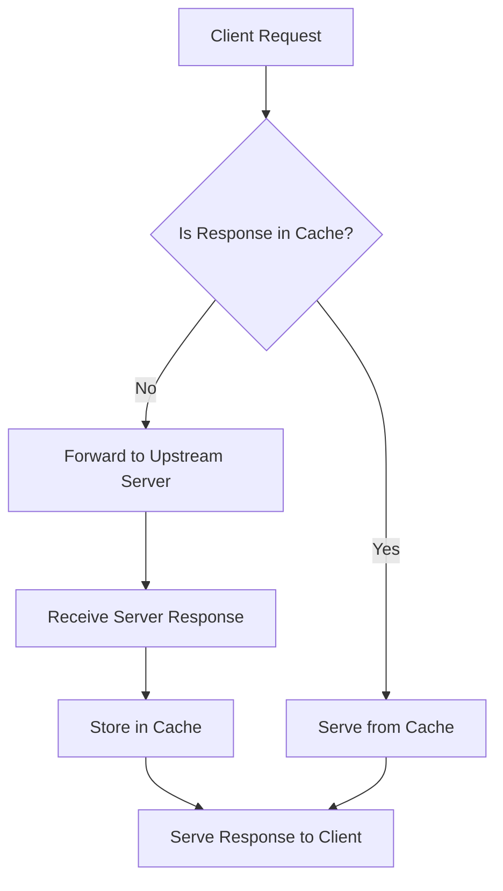

# Nginx Proxy Cache

## Introduction

Nginx proxy caching is a powerful feature that allows you to store copies of server responses at the proxy level. This means when a user requests content that's already been cached, Nginx can serve it directly without contacting the upstream server. This significantly improves response times, reduces the load on your backend servers, and enhances the overall performance of your web applications.

In this guide, we'll explore how Nginx proxy caching works, how to configure it, and best practices for implementing it in real-world scenarios.

## How Nginx Proxy Cache Works

Before diving into configuration, let's understand the basic flow of how Nginx proxy caching operates:



The process works as follows:

1. A client makes a request to Nginx
2. Nginx checks if the response for this request is already in its cache
3. If found in cache (and still valid), Nginx serves the cached response directly
4. If not in cache, Nginx forwards the request to the upstream server
5. When the upstream server responds, Nginx stores a copy in its cache
6. The response is then sent to the client

This simple but effective mechanism can dramatically improve your site's performance.

## Basic Proxy Cache Configuration

Let's start with a basic Nginx proxy cache configuration:

```nginx
http {
    # Define a cache path where Nginx will store cached responses
    proxy_cache_path /var/cache/nginx levels=1:2 keys_zone=my_cache:10m max_size=10g 
                    inactive=60m use_temp_path=off;

    server {
        listen 80;
        server_name example.com;

        location / {
            # Enable caching for this location
            proxy_cache my_cache;
            
            # Define what is considered a cache hit
            proxy_cache_valid 200 302 10m;
            proxy_cache_valid 404 1m;
            
            # Set the cache key
            proxy_cache_key $scheme$proxy_host$request_uri;
            
            # Pass request to backend
            proxy_pass http://backend_server;
        }
    }
}
```

Let's break down the key components:

### 1. `proxy_cache_path` Directive

This defines where and how Nginx stores cached content:

- `/var/cache/nginx`: The directory where cache files are stored
- `levels=1:2`: Creates a two-level directory hierarchy to store cache files
- `keys_zone=my_cache:10m`: Names the cache zone "my_cache" and allocates 10MB of memory for cache keys
- `max_size=10g`: Limits the cache size to 10GB
- `inactive=60m`: Removes cached items not accessed for 60 minutes
- `use_temp_path=off`: Writes files directly to the cache directory without using a temp location

### 2. Cache Configuration in Location Block

- `proxy_cache my_cache`: Enables caching using the previously defined cache zone
- `proxy_cache_valid`: Sets how long different response codes should be cached
- `proxy_cache_key`: Defines what makes each cache entry unique

## Advanced Configuration Options

Now let's explore some advanced configurations to fine-tune your caching behavior:

### Bypassing Cache

Sometimes you need to bypass the cache for certain requests:

```nginx
location / {
    proxy_cache my_cache;
    proxy_cache_bypass $http_cache_control;
    proxy_pass http://backend_server;
}
```

This allows clients to bypass the cache by sending appropriate cache-control headers.

### Conditional Caching

You might want to cache only specific types of content:

```nginx
location / {
    proxy_cache my_cache;
    
    # Only cache GET and HEAD requests
    proxy_cache_methods GET HEAD;
    
    # Only cache 200, 301, and 302 responses
    proxy_cache_valid 200 301 302 30m;
    
    # Don't cache if the response has a "Set-Cookie" header
    proxy_no_cache $http_set_cookie;
    
    proxy_pass http://backend_server;
}
```

### Cache Locking

To prevent "cache stampede" (multiple identical requests hitting your backend simultaneously):

```nginx
location / {
    proxy_cache my_cache;
    proxy_cache_lock on;
    proxy_cache_lock_timeout 5s;
    proxy_pass http://backend_server;
}
```

With this, only one request will be allowed to populate the cache while others wait.

### Adding Cache Headers

To indicate when content is served from cache:

```nginx
location / {
    proxy_cache my_cache;
    add_header X-Cache-Status $upstream_cache_status;
    proxy_pass http://backend_server;
}
```

This adds a header to the response showing whether it was a cache HIT, MISS, EXPIRED, etc.

## Practical Example: Caching a Dynamic API

Here's a real-world example of caching responses from a dynamic API:

```nginx
http {
    proxy_cache_path /var/cache/nginx/api_cache 
                    levels=1:2 
                    keys_zone=api_cache:10m 
                    max_size=1g 
                    inactive=1h;

    server {
        listen 80;
        server_name api.example.com;
        
        # Cache product listings for 30 minutes
        location /api/products {
            proxy_cache api_cache;
            proxy_cache_valid 200 30m;
            proxy_cache_key $request_uri;
            proxy_pass http://api_backend;
            
            # Add cache status header
            add_header X-Cache-Status $upstream_cache_status;
            
            # Vary cache by Accept and Accept-Encoding headers
            proxy_vary on Accept Accept-Encoding;
        }
        
        # Don't cache user-specific data
        location /api/user {
            proxy_cache off;
            proxy_pass http://api_backend;
        }
    }
}
```

This example demonstrates how to:
1. Cache product listings for 30 minutes
2. Avoid caching user-specific data
3. Include cache status headers for debugging
4. Vary cache based on request headers

## Cache Purging

Sometimes you need to invalidate cache entries when content changes:

```nginx
http {
    proxy_cache_path /var/cache/nginx levels=1:2 
                    keys_zone=my_cache:10m 
                    max_size=10g
                    inactive=60m
                    use_temp_path=off;
    
    map $request_method $purge_method {
        PURGE 1;
        default 0;
    }

    server {
        listen 80;
        server_name example.com;
        
        location / {
            proxy_cache my_cache;
            proxy_cache_valid 200 10m;
            proxy_cache_key $scheme$proxy_host$request_uri;
            proxy_pass http://backend_server;
            
            # Allow cache purging
            if ($purge_method) {
                proxy_cache_purge $scheme$proxy_host$request_uri;
                return 200 "Cache purged";
            }
        }
    }
}
```

With this configuration, you can purge specific URLs from the cache by sending a PURGE request:

```
PURGE /some/path HTTP/1.1
Host: example.com
```

## Monitoring Cache Performance

To monitor how well your cache is performing, add the following to your virtual host:

```nginx
log_format cache_log '[$time_local] "$request" $upstream_cache_status';
access_log /var/log/nginx/cache.log cache_log;
```

This logs each request with its cache status, allowing you to analyze cache hit ratios.

## Best Practices for Nginx Proxy Caching

1. **Set appropriate cache durations**: Cache static content longer than dynamic content.

2. **Use stale cache when backend is down**: Add `proxy_cache_use_stale error timeout` to serve stale content when your backend is unavailable.

3. **Implement cache purging**: Set up a mechanism to purge cache when content changes.

4. **Monitor cache hit ratios**: Regularly check how often requests are served from cache.

5. **Be careful with cookies and personalized content**: Don't cache content that varies by user.

6. **Set cache keys carefully**: Make sure your cache key includes all relevant variables for proper caching.

7. **Use cache locking**: Prevent cache stampede with `proxy_cache_lock on`.

8. **Size your cache appropriately**: Allocate enough space to store your frequently accessed content without wasting resources.

## Example: Complete Caching Configuration

Here's a complete example incorporating many best practices:

```nginx
http {
    # Define cache path
    proxy_cache_path /var/cache/nginx 
                    levels=1:2 
                    keys_zone=main_cache:10m 
                    max_size=10g 
                    inactive=60m 
                    use_temp_path=off;
    
    # Custom log format for cache monitoring
    log_format cache_log '[$time_local] "$request" $upstream_cache_status';
    
    # Define upstream servers
    upstream backend {
        server backend1.example.com;
        server backend2.example.com backup;
    }
    
    server {
        listen 80;
        server_name www.example.com;
        
        # Log cache status
        access_log /var/log/nginx/cache.log cache_log;
        
        # Cache static files aggressively
        location ~* \.(jpg|jpeg|png|gif|ico|css|js)$ {
            proxy_cache main_cache;
            proxy_cache_valid 200 302 304 7d;
            proxy_cache_key $scheme$host$request_uri;
            proxy_pass http://backend;
            proxy_cache_use_stale error timeout updating http_500 http_502 http_503 http_504;
            proxy_cache_lock on;
            expires 7d;
            add_header X-Cache-Status $upstream_cache_status;
        }
        
        # Cache dynamic content briefly
        location / {
            proxy_cache main_cache;
            proxy_cache_valid 200 302 5m;
            proxy_cache_valid 404 1m;
            proxy_cache_key $scheme$host$request_uri$http_user_agent;
            proxy_cache_bypass $cookie_session;  # Don't cache for logged-in users
            proxy_cache_use_stale updating error timeout http_500 http_502 http_503 http_504;
            proxy_cache_background_update on;
            proxy_cache_lock on;
            proxy_pass http://backend;
            add_header X-Cache-Status $upstream_cache_status;
        }
        
        # Don't cache user account pages
        location /user/ {
            proxy_cache off;
            proxy_pass http://backend;
        }
    }
}
```

This configuration:
- Aggressively caches static files for 7 days
- Moderately caches dynamic content for 5 minutes
- Doesn't cache user-specific pages
- Serves stale content when backend servers are unavailable
- Logs cache status for monitoring
- Bypasses cache for logged-in users
- Uses cache locking to prevent cache stampede

## Summary

Nginx proxy caching is a powerful tool for improving website performance by reducing the load on your backend servers and decreasing response times. Key concepts to remember include:

- Setting up a cache path with appropriate size and structure
- Configuring cache validity periods based on content type
- Creating appropriate cache keys
- Implementing cache bypass and purging mechanisms
- Monitoring cache performance

When properly configured, Nginx proxy caching can dramatically improve your site's speed and resilience, while reducing server costs by handling more traffic with the same resources.

## Additional Resources

- [Nginx Documentation on Proxy Caching](https://nginx.org/en/docs/http/ngx_http_proxy_module.html#proxy_cache)
- [Nginx Admin Guide: Content Caching](https://docs.nginx.com/nginx/admin-guide/content-cache/content-caching/)

## Exercises

1. Set up a basic Nginx proxy cache for a simple website and test the performance improvement.
2. Create a configuration that caches different types of content for different durations.
3. Implement a cache purging mechanism and test it by making changes to your backend content.
4. Set up cache monitoring and analyze your cache hit ratio over time.
5. Configure conditional caching that only caches responses for anonymous users.