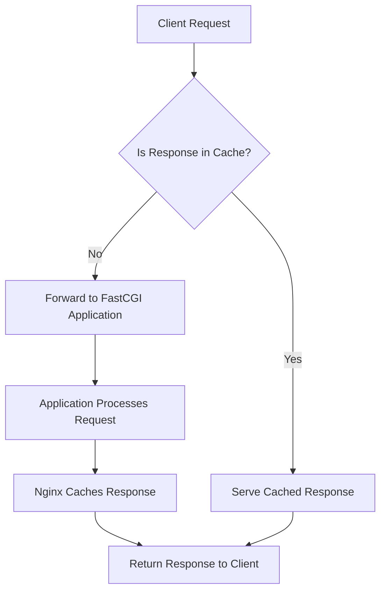

# Nginx FastCGI Cache

## Introduction

When your website serves dynamic content (like PHP applications), the server needs to process each request before sending it to users. This processing takes time and uses server resources. Wouldn't it be great if we could somehow save the results of these processes and reuse them for future visitors? That's exactly what FastCGI caching in Nginx does!

FastCGI Cache is a powerful caching mechanism in Nginx that stores the responses from your dynamic content processors (like PHP-FPM) on disk. When a user requests a page that's already in the cache, Nginx can serve it directly without having to process the request again, resulting in significantly faster response times and reduced server load.

In this tutorial, we'll explore:
- How FastCGI caching works
- How to set it up in Nginx
- Essential configuration options
- Best practices for real-world applications

## How FastCGI Caching Works

Before diving into configuration, let's understand how FastCGI caching works:



When a request comes in:
1. Nginx checks if a valid cached version exists
2. If found, it serves the cached content immediately (bypassing PHP/application processing)
3. If not found, Nginx forwards the request to the application server (like PHP-FPM)
4. The application processes the request and returns the response
5. Nginx stores this response in the cache for future use
6. The response is sent to the client

This process dramatically reduces the load on your application servers and database, while delivering content to users much faster.

## Setting Up FastCGI Cache in Nginx

Let's start with a basic Nginx FastCGI cache configuration:

### Step 1: Define the Cache Location

First, we need to tell Nginx where to store the cached files. This is done in the `http` context of your Nginx configuration:

```nginx
http {
    # Other http configurations...
    
    # Define FastCGI cache path
    fastcgi_cache_path /var/cache/nginx 
                       levels=1:2 
                       keys_zone=my_cache:10m 
                       inactive=60m 
                       max_size=100m;
    
    # Other configurations...
}
```

Let's break down these parameters:

- `fastcgi_cache_path`: Specifies the directory where cached files will be stored
- `levels=1:2`: Creates a two-level directory hierarchy to organize cache files efficiently
- `keys_zone=my_cache:10m`: Allocates 10MB of shared memory for cache keys and metadata
- `inactive=60m`: Removes cached items not accessed for 60 minutes
- `max_size=100m`: Limits the cache size to 100MB

### Step 2: Configure Cache Settings in Server Block

Next, we need to configure the FastCGI cache in the `server` or `location` blocks:

```nginx
server {
    listen 80;
    server_name example.com;
    root /var/www/html;
    
    # Enable FastCGI cache for this server
    fastcgi_cache my_cache;
    fastcgi_cache_valid 200 60m;  # Cache 200 responses for 60 minutes
    fastcgi_cache_methods GET HEAD; # Only cache GET and HEAD requests
    
    # Add cache status to response headers (useful for debugging)
    add_header X-Cache-Status $upstream_cache_status;
    
    location ~ \.php$ {
        include fastcgi_params;
        fastcgi_param SCRIPT_FILENAME $document_root$fastcgi_script_name;
        fastcgi_pass unix:/var/run/php/php7.4-fpm.sock;
        
        # Create a cache key based on request parameters
        fastcgi_cache_key "$scheme$request_method$host$request_uri";
        
        # Include these in the cache
        fastcgi_cache_valid 404 1m;  # Cache 404 responses for 1 minute
    }
    
    # Other location blocks...
}
```

### Step 3: Configure Cache Bypassing (Optional)

Sometimes you want to exclude certain requests from being cached, such as when users are logged in or for dynamic API endpoints. Add this to your server block:

```nginx
# Define a map to set cache bypass for certain conditions
map $http_cookie $skip_cache {
    default 0;
    ~PHPSESSID 1;  # Skip cache if PHP session cookie exists
}

server {
    # Other configurations...
    
    # Use the map variable to conditionally bypass cache
    fastcgi_cache_bypass $skip_cache;
    fastcgi_no_cache $skip_cache;
    
    # Other configurations...
}
```

## Cache Purging

Cached content can become stale when your website's content changes. Here's how to implement cache purging:

### Using the Nginx Cache Purge Module

First, you'll need to install the `ngx_cache_purge` module. Many Nginx distributions include this module, or you can compile Nginx with it.

Once installed, add this configuration:

```nginx
server {
    # Other configurations...
    
    # Allow cache purging from internal network only
    location ~ /purge(/.*) {
        allow 127.0.0.1;
        allow 192.168.0.0/24;  # Your internal network
        deny all;
        
        fastcgi_cache_purge my_cache "$scheme$request_method$host$1";
    }
    
    # Other configurations...
}
```

This allows you to purge specific URLs from the cache by making a request to `/purge/your-path`.

### Manually Clearing the Cache

You can also manually clear the entire cache by removing the cache files:

```bash
rm -rf /var/cache/nginx/*
```

Or, more safely, you can use:

```bash
find /var/cache/nginx -type f -delete
```

## Real-World Example: WordPress with FastCGI Cache

Let's see a practical example of FastCGI caching for a WordPress site:

```nginx
http {
    # Define cache path
    fastcgi_cache_path /var/cache/nginx/wordpress 
                       levels=1:2 
                       keys_zone=wordpress_cache:20m 
                       inactive=60m 
                       max_size=500m;
    
    # Define what to exclude from caching
    map $http_cookie $skip_wordpress_cache {
        default 0;
        ~wordpress_logged_in 1;  # Skip for logged-in users
        ~wp-postpass 1;          # Skip for password-protected content
        ~comment_author 1;       # Skip for users who left comments
    }
    
    server {
        listen 80;
        server_name blog.example.com;
        root /var/www/wordpress;
        
        # Cache settings
        fastcgi_cache wordpress_cache;
        fastcgi_cache_key "$scheme$request_method$host$request_uri";
        fastcgi_cache_valid 200 301 302 60m;
        fastcgi_cache_bypass $skip_wordpress_cache;
        fastcgi_no_cache $skip_wordpress_cache;
        
        # Show cache status in headers
        add_header X-Cache-Status $upstream_cache_status;
        
        # Skip caching for certain WordPress URLs
        set $skip_cache 0;
        
        # Don't cache wp-admin, wp-login, or WooCommerce pages
        if ($request_uri ~* "/(wp-admin|wp-login.php)") {
            set $skip_cache 1;
        }
        
        if ($request_uri ~* "/shop.*|/cart.*|/my-account.*|/checkout.*") {
            set $skip_cache 1;
        }
        
        # Don't cache search results
        if ($request_uri ~* "/\?s=") {
            set $skip_cache 1;
        }
        
        location ~ \.php$ {
            include fastcgi_params;
            fastcgi_param SCRIPT_FILENAME $document_root$fastcgi_script_name;
            fastcgi_pass unix:/var/run/php/php7.4-fpm.sock;
            
            # Skip cache based on the variable we set
            fastcgi_cache_bypass $skip_cache;
            fastcgi_no_cache $skip_cache;
        }
        
        # Other location blocks...
    }
}
```

This configuration:
1. Creates a dedicated cache for WordPress
2. Skips caching for logged-in users and dynamic pages
3. Caches most public-facing pages for 60 minutes
4. Includes specific rules for WordPress admin, search, and e-commerce pages

## Performance Tuning

To get the most out of FastCGI caching, consider these optimizations:

### 1. Use Cache Locking

Cache locking prevents multiple requests from generating the same cached content simultaneously (the "thundering herd" problem):

```nginx
# Add to http context
fastcgi_cache_lock on;
fastcgi_cache_lock_timeout 5s;
```

### 2. Configure Stale Cache Usage

Allow Nginx to serve stale content while updating the cache:

```nginx
fastcgi_cache_use_stale error timeout updating http_500 http_503;
fastcgi_cache_background_update on;
```

This serves stale content during backend errors or while updating the cache, providing better user experience.

### 3. Adjust Buffer Sizes

Optimize buffer sizes based on your application's typical response size:

```nginx
fastcgi_buffer_size 16k;
fastcgi_buffers 16 16k;
```

## Monitoring and Debugging

The `X-Cache-Status` header we added earlier will show one of these values:

- `MISS`: The response wasn't in the cache and was fetched from the backend
- `HIT`: The response was served from the cache
- `BYPASS`: The cache was bypassed (due to configuration)
- `EXPIRED`: The cached response was expired and a new one was fetched
- `STALE`: A stale cached response was served (useful with `fastcgi_cache_use_stale`)
- `UPDATING`: The cache is being updated but a stale response was served
- `REVALIDATED`: The response was revalidated with the backend and remains valid

You can check these values in your browser's developer tools under the Response Headers section.

## Troubleshooting Common Issues

### Cache Not Working

If your cache doesn't seem to be working:

1. Check permissions on the cache directory:
   ```bash
   chown -R nginx:nginx /var/cache/nginx
   chmod -R 755 /var/cache/nginx
   ```

2. Verify the `keys_zone` name matches in both `fastcgi_cache_path` and `fastcgi_cache` directives

3. Make sure the request method is included in `fastcgi_cache_methods`

### Content Not Updating

If your website shows outdated content:

1. Check if your cache key includes all necessary variables
2. Implement cache purging as described earlier
3. Reduce the cache validity time with `fastcgi_cache_valid`

## Summary

Nginx FastCGI Cache is a powerful tool that can dramatically improve your website's performance by reducing the load on your application servers. By storing pre-processed dynamic content, Nginx can serve requests directly from disk, resulting in faster response times and reduced server resource usage.

In this guide, we've covered:
- How FastCGI caching works
- Basic configuration steps
- Cache key creation and management
- Cache bypass for dynamic content
- Cache purging techniques
- Real-world implementation for WordPress
- Performance optimization tips
- Monitoring and troubleshooting

By implementing FastCGI caching, you can take a significant step toward making your dynamic websites faster and more resilient to traffic spikes.

## Exercise

Try implementing FastCGI caching for a PHP application:

1. Set up a basic PHP application with Nginx and PHP-FPM
2. Configure FastCGI caching as described in this guide
3. Use browser developer tools to observe the `X-Cache-Status` header
4. Create a simple cache purging mechanism for your application
5. Compare the performance before and after implementing caching

## Additional Resources

- [Nginx Documentation on FastCGI](https://nginx.org/en/docs/http/ngx_http_fastcgi_module.html)
- [Nginx Caching Guide](https://www.nginx.com/blog/nginx-caching-guide/)
- [PHP-FPM Configuration Best Practices](https://www.php.net/manual/en/install.fpm.configuration.php)