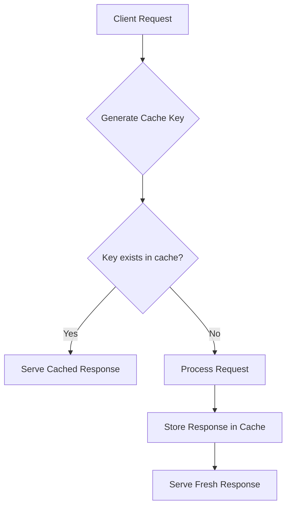

# Understanding Nginx Cache Keys

## Introduction

When working with Nginx caching, one of the most fundamental concepts to grasp is the **cache key**. A cache key is essentially the unique identifier that Nginx uses to store and retrieve cached content. Think of it as an address or label that helps Nginx locate the right cached response when a request comes in.

In this guide, we'll explore how Nginx cache keys work, how to configure them to suit your needs, and how proper cache key configuration can significantly improve your website's performance.

## What is a Cache Key?

In Nginx, a cache key is a string that uniquely identifies a cached response. When Nginx receives a request, it generates a cache key based on various request attributes, then:

1. Checks if content matching that key exists in the cache
2. If it exists, serves the cached content (cache hit)
3. If not, processes the request, stores the response with that key, and serves it (cache miss)

By default, Nginx uses the request's URI as the cache key, but this can be customized to include additional parameters like query strings, HTTP headers, cookies, or even custom variables.



## Default Cache Key Behavior

By default, Nginx uses the following components to form a cache key:

- HTTP method (GET, POST, etc.)
- Request URI (the path portion of the URL)

This means that two requests to the same URI but with different query parameters would, by default, use the same cache key and receive the same cached response.

## Customizing Cache Keys with `proxy_cache_key`

Nginx allows you to customize the cache key using the `proxy_cache_key` directive. This gives you fine-grained control over how Nginx identifies and retrieves cached content.

Basic syntax:

```nginx
proxy_cache_key $scheme$proxy_host$request_uri;
```

Here's what each part means:
- `$scheme`: The protocol (http or https)
- `$proxy_host`: The hostname of the proxied server
- `$request_uri`: The full URI with query string

## Common Cache Key Variables

You can include various Nginx variables in your cache key definition:

| Variable | Description | Example |
|----------|-------------|---------|
| `$scheme` | Protocol (http/https) | "http" |
| `$request_method` | HTTP method | "GET" |
| `$host` | Host from request | "example.com" |
| `$request_uri` | Full URI with query string | "/page?id=123" |
| `$uri` | URI without query string | "/page" |
| `$args` | Query string | "id=123" |
| `$is_args` | "?" if query string exists, empty otherwise | "?" |
| `$http_*` | Any request header | `$http_user_agent` |
| `$cookie_*` | Any cookie value | `$cookie_sessionid` |

## Practical Cache Key Examples

### Example 1: Basic Cache Key with Host and URI

This basic configuration caches based on the host and the full URI (including query parameters):

```nginx
proxy_cache_key $host$request_uri;
```

**Effect:** Requests to `example.com/page?id=123` and `example.com/page?id=456` will be cached separately, while requests to `example.com/page?id=123` and `othersite.com/page?id=123` will also be cached separately.

### Example 2: Including HTTP Method

If your application behaves differently for different HTTP methods, include the method in your cache key:

```nginx
proxy_cache_key $request_method$host$request_uri;
```

**Effect:** GET and POST requests to the same URL will be cached separately.

### Example 3: Cache Key with Specific Query Parameters

If you want to cache based on specific query parameters while ignoring others:

```nginx
# Extract important query parameters
set $cache_args "";
if ($args ~ "(?:^|&)(id|category)=([^&]*)") {
    set $cache_args $1=$2;
}

# Use only these parameters in the cache key
proxy_cache_key $host$uri$is_args$cache_args;
```

**Effect:** Requests to `/products?id=123&timestamp=1634567890` and `/products?id=123&timestamp=1634567999` will share the same cache entry since the `timestamp` parameter is ignored.

### Example 4: Varying Cache by User Agent Type

When you need different cached versions for mobile and desktop:

```nginx
# Simplified user agent detection
set $ua_type "desktop";
if ($http_user_agent ~* "mobile|android|iphone|ipad|phone") {
    set $ua_type "mobile";
}

# Include device type in cache key
proxy_cache_key $host$request_uri$ua_type;
```

**Effect:** Mobile and desktop users will see different cached versions of the same page.

### Example 5: Cache Keys for Authenticated Content

For sites with both authenticated and anonymous users:

```nginx
# Check if user is logged in via cookie
set $is_logged_in "0";
if ($cookie_session_id) {
    set $is_logged_in "1";
}

# Anonymous users share cache, logged-in users bypass it
proxy_cache_key $host$request_uri$is_logged_in;
proxy_cache_bypass $is_logged_in;
proxy_no_cache $is_logged_in;
```

**Effect:** Logged-in users always get fresh content, while anonymous users share cached content.

## Best Practices for Cache Keys

1. **Keep Keys Simple**: Include only the variables that truly affect the content. Extra variables reduce cache efficiency.

2. **Consider Varying by User State**: Often you'll want different caches for logged-in vs. anonymous users.

3. **Handle Query Parameters Carefully**: For many applications, not all query parameters affect the content. Only include relevant ones in your cache key.

4. **Use Normalization When Possible**: 
   ```nginx
   # Normalize the URI to improve cache hits
   if ($request_uri ~* "^(.+)/+$") {
       set $normalized_uri $1;
       rewrite ^ $normalized_uri permanent;
   }
   ```

5. **Debug Your Cache Keys**: Use Nginx's logging to see what cache keys are being generated:
   ```nginx
   log_format cache_keys '$remote_addr - [$time_local] "$request" '
                          'cache_key: "$scheme$host$request_uri"';
   access_log /var/log/nginx/cache_keys.log cache_keys;
   ```

## Common Issues and Solutions

### Problem: Low Cache Hit Rate

If your cache hit rate is low, your cache keys might be too specific, creating unique entries for content that could be shared.

**Solution:** Simplify your cache keys and only include parameters that truly affect content.

### Problem: Serving Stale Content to the Wrong Users

If users are seeing content intended for others, your cache keys might not be specific enough.

**Solution:** Add more discriminating factors to your cache key, such as cookies or headers that identify user state.

### Problem: Excessive Cache Size

Too many unique cache keys can lead to an oversized cache.

**Solution:** Normalize URLs, limit which query parameters affect the cache key, and set appropriate cache sizes and eviction policies.

## Complete Configuration Example

Here's a comprehensive example that demonstrates many of the concepts we've covered:

```nginx
http {
    # Define cache path and settings
    proxy_cache_path /var/cache/nginx levels=1:2 keys_zone=my_cache:10m max_size=10g 
                     inactive=60m use_temp_path=off;
    
    server {
        listen 80;
        server_name example.com;
        
        # Enable caching
        proxy_cache my_cache;
        proxy_cache_valid 200 302 10m;
        proxy_cache_valid 404 1m;
        
        # Cache key configuration
        set $custom_cache_key "";
        
        # Extract only id and category query params if they exist
        if ($args ~* "(^|&)(id|category)=([^&]*)") {
            set $custom_cache_key "$2=$3";
        }
        
        # Detect if user is logged in
        set $user_state "anon";
        if ($cookie_session_id) {
            set $user_state "auth";
        }
        
        # Simplified mobile detection
        set $device_type "desktop";
        if ($http_user_agent ~* "mobile|android|iphone|ipod|phone") {
            set $device_type "mobile";
        }
        
        # Combine everything into a custom cache key
        proxy_cache_key "$host$uri$is_args$custom_cache_key:$user_state:$device_type";
        
        # Bypass cache for authenticated users
        proxy_cache_bypass $user_state;
        proxy_no_cache $user_state;
        
        # Add cache status to response headers for debugging
        add_header X-Cache-Status $upstream_cache_status;
        
        location / {
            proxy_pass http://backend_servers;
            
            # Standard proxy settings
            proxy_set_header Host $host;
            proxy_set_header X-Real-IP $remote_addr;
            proxy_set_header X-Forwarded-For $proxy_add_x_forwarded_for;
            proxy_set_header X-Forwarded-Proto $scheme;
        }
    }
}
```

## Summary

Cache keys are fundamental to effective Nginx caching. By understanding and properly configuring them, you can:

- Improve cache hit rates
- Ensure users see the appropriate content
- Reduce server load and improve performance
- Provide a faster experience for your users

The optimal cache key configuration depends on your specific application. Take time to analyze your content, user behaviors, and how different request attributes affect the response. With this knowledge, you can create cache keys that strike the perfect balance between performance and content relevance.

## Exercises

1. Configure a cache key that varies based on a "theme" cookie, allowing users to see different styles while still benefiting from caching.

2. Create a cache key strategy for an e-commerce site where product pages should be cached but shopping carts should never be cached.

3. Implement a cache key configuration that serves different content to users from different countries based on the `Accept-Language` header.

## Further Reading

- [Nginx HTTP Proxy Module Documentation](https://nginx.org/en/docs/http/ngx_http_proxy_module.html)
- [Nginx Caching Guide](https://www.nginx.com/blog/nginx-caching-guide/)
- [HTTP Caching Specification](https://tools.ietf.org/html/rfc7234)