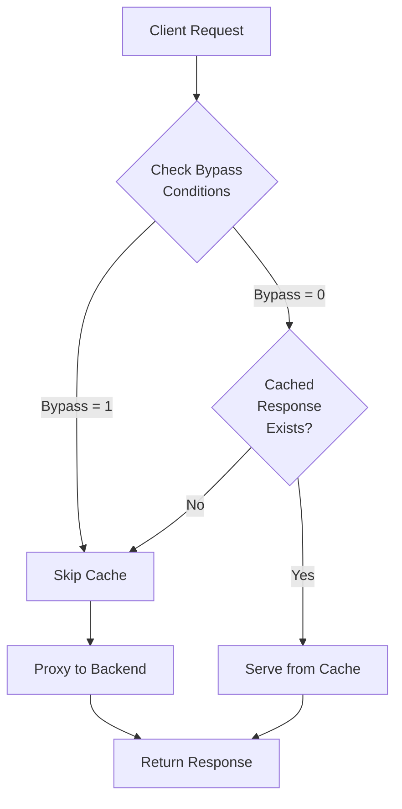

# Nginx Cache Bypass

## Introduction

When implementing caching with Nginx, there are situations where you need certain requests to bypass the cache. This could be for dynamic content, authenticated users, or during development and debugging. This guide explains how to implement cache bypass mechanisms in Nginx, giving you fine-grained control over your caching strategy.

## What is Cache Bypassing?

Cache bypassing is a technique that allows specific requests to skip the cache and be processed directly by the origin server. This is useful when:

- Serving personalized or user-specific content
- Handling form submissions or API requests
- Debugging cache-related issues
- Processing real-time data that shouldn't be cached

## Basic Cache Bypass Techniques

### 1. Using Query Parameters

One of the simplest ways to bypass cache is by adding a query parameter to your URLs.

```nginx
# Cache configuration
proxy_cache_bypass $arg_nocache;

# This will bypass cache when URLs contain ?nocache=1
```

**Example usage:**
- Normal cached URL: `https://example.com/products`
- Cache bypass URL: `https://example.com/products?nocache=1`

### 2. Using Request Headers

You can configure Nginx to bypass cache based on specific request headers.

```nginx
# Bypass cache for requests with a specific header
proxy_cache_bypass $http_cache_control;

# This will bypass cache when the Cache-Control header is set to "no-cache"
```

**Example configuration:**

```nginx
location / {
    proxy_cache my_cache_zone;
    proxy_cache_bypass $http_cache_control;
    proxy_pass http://backend_server;
}
```

When a client sends a request with `Cache-Control: no-cache` header, Nginx will bypass the cache.

## Advanced Cache Bypass Techniques

### 1. Conditional Bypass Based on Request Method

Often, you'll want to cache GET requests but bypass cache for POST, PUT, DELETE requests.

```nginx
# Bypass cache for non-GET requests
proxy_cache_bypass $request_method !~ ^GET$;
```

### 2. Bypass for Authenticated Users

For personalized content, you may want to bypass cache for authenticated users:

```nginx
# Check for authentication cookie
map $cookie_sessionid $skip_cache {
    "" 0;
    default 1;
}

server {
    # ...
    location / {
        proxy_cache my_cache_zone;
        proxy_cache_bypass $skip_cache;
        proxy_pass http://backend;
    }
}
```

### 3. Bypass for Specific URI Patterns

You can selectively bypass cache for specific URL patterns:

```nginx
# Define locations to bypass
map $request_uri $bypass_cache {
    ~/admin/* 1;
    ~/user/profile/* 1;
    ~/api/* 1;
    default 0;
}

server {
    # ...
    location / {
        proxy_cache my_cache_zone;
        proxy_cache_bypass $bypass_cache;
        proxy_pass http://backend;
    }
}
```

## Combining Multiple Bypass Conditions

You can combine multiple conditions for more complex caching rules:

```nginx
map $request_uri$http_authorization$args $bypass_cache {
    ~*(admin|user/profile)    1;  # Admin or profile URLs
    ~*auth                    1;  # Has authorization header
    ~*nocache=1               1;  # Has nocache parameter
    default                   0;
}

server {
    # ...
    location / {
        proxy_cache my_cache_zone;
        proxy_cache_bypass $bypass_cache;
        proxy_pass http://backend;
    }
}
```

## Practical Example: Complete Configuration

Let's put everything together in a real-world example for a website with both public and private content:

```nginx
http {
    # Define cache zone
    proxy_cache_path /var/cache/nginx levels=1:2 keys_zone=my_cache:10m inactive=60m;
    
    # Define cache bypass conditions
    map $cookie_logged_in$request_method$arg_nocache $bypass_cache {
        ~*1                1;  # Logged in users
        ~*POST             1;  # POST requests
        ~*DELETE           1;  # DELETE requests
        ~*PUT              1;  # PUT requests
        ~*1$               1;  # nocache=1 parameter
        default            0;
    }
    
    server {
        listen 80;
        server_name example.com;
        
        # Static content - Always cache
        location ~* \.(css|js|jpg|jpeg|png|gif|ico|svg)$ {
            proxy_cache my_cache;
            proxy_cache_valid 200 302 304 1h;
            proxy_pass http://backend;
            # No bypass for static content
        }
        
        # Admin area - Never cache
        location /admin {
            proxy_pass http://backend;
            proxy_no_cache 1;
            proxy_cache_bypass 1;
        }
        
        # API - Selective cache
        location /api {
            proxy_cache my_cache;
            proxy_cache_valid 200 30s;
            proxy_cache_bypass $bypass_cache;
            proxy_pass http://backend;
        }
        
        # Everything else
        location / {
            proxy_cache my_cache;
            proxy_cache_valid 200 5m;
            proxy_cache_bypass $bypass_cache;
            proxy_pass http://backend;
        }
    }
}
```

## Cache Bypass via Response Headers

In addition to client-side bypass, you can configure your backend server to send cache control headers:

```nginx
proxy_no_cache $http_cache_control;
```

With this configuration, when your backend server responds with a `Cache-Control: no-store` or `Cache-Control: private` header, Nginx won't cache the response.

## Cache Bypass Flow Diagram



## Debugging Cache Bypass

To confirm if your cache bypass is working, add debug headers to your Nginx configuration:

```nginx
add_header X-Cache-Status $upstream_cache_status;
```

This will add a header to responses indicating the cache status:
- `MISS`: The response was not found in the cache
- `BYPASS`: The cache was bypassed
- `EXPIRED`: The cached response was expired
- `HIT`: The response was served from cache

## Common Issues and Solutions

### 1. Cache Bypass Not Working

If your cache bypass isn't working, check:

- Configuration syntax and placement
- Nginx reload/restart after changes
- Variable values using `add_header` for debugging

### 2. Everything Bypassing Cache

If too many requests are bypassing cache:

- Check your conditions - they may be too broad
- Use Nginx debug logs to see which condition is triggering
- Consider using more specific matching patterns

### 3. Cache-Control Headers Being Ignored

Ensure you've configured:

```nginx
proxy_cache_bypass $http_cache_control;
proxy_no_cache $http_cache_control;
```

## Summary

Cache bypassing is a crucial technique for balancing performance with content freshness in Nginx. By implementing the methods described in this guide, you can create intelligent caching strategies that serve static content quickly while ensuring dynamic content remains fresh.

Remember these key points:
- Use query parameters for simple cache bypassing
- Configure conditions based on headers, cookies, or URI patterns
- Always test your cache bypass rules
- Add debug headers to verify your configuration
- Consider the performance implications of excessive cache bypassing

## Further Learning

To expand your knowledge about Nginx caching:

1. Explore the Nginx documentation on caching
2. Learn about cache purging mechanisms
3. Study cache key customization
4. Explore microcaching for dynamic content

## Practice Exercises

1. Configure an Nginx server to bypass cache for all requests with a `X-Custom-Bypass` header
2. Set up cache bypassing for authenticated users while caching content for anonymous users
3. Create a configuration that bypasses cache during business hours but caches content overnight