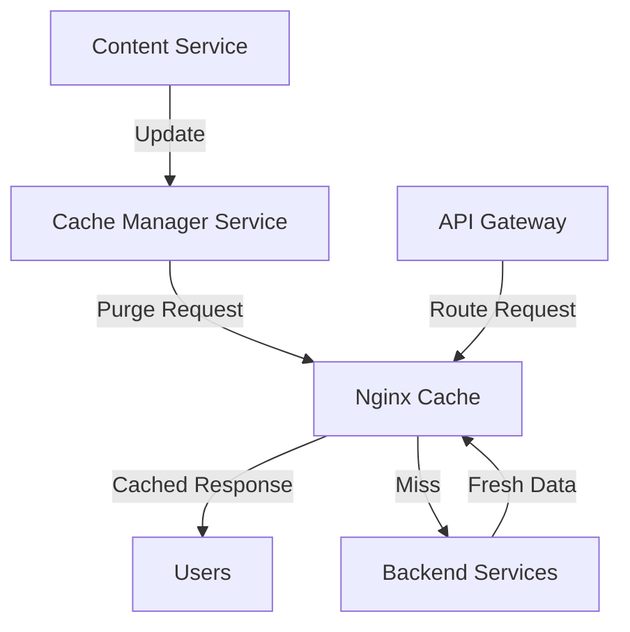

# Nginx Cache Purging

## Introduction

Cache purging is a critical aspect of any caching strategy. While Nginx's caching capabilities significantly improve website performance by serving static content from memory or disk instead of regenerating it for each request, there are times when you need to clear this cached content to ensure users receive the most up-to-date information.

In this guide, we'll explore various techniques for purging Nginx's cache, from manual approaches to automated solutions, ensuring your content stays fresh while still benefiting from the performance advantages of caching.

## Why Cache Purging Is Necessary

Before diving into implementation, let's understand why cache purging is essential:

1. **Content Updates**: When you update your website's content, users might still see the old version if it's served from cache.
2. **Critical Fixes**: Security patches or bug fixes need to be immediately visible to all users.
3. **Dynamic Content**: Some content that changes frequently shouldn't be cached for long periods.
4. **User-specific Data**: Preventing one user's data from being accidentally served to another user.

## Basic Cache Purging Methods

### Method 1: Manual File System Purging

The simplest way to purge Nginx's cache is by deleting cache files directly from the file system:

```bash
# Remove all cache
rm -rf /path/to/cache/*

# Remove specific cache using cache key pattern
find /path/to/cache -name "*example.com*" -delete
```

:::caution
Manual deletion requires SSH access to your server and should be used carefully, especially in production environments.
:::

### Method 2: Using the proxy_cache_purge Directive

Nginx provides the `proxy_cache_purge` directive, which is part of the commercial Nginx Plus or the open-source `ngx_cache_purge` module. This method allows you to purge cache via HTTP requests.

First, install the `ngx_cache_purge` module if you're using open-source Nginx:

```bash
# For Debian/Ubuntu
apt-get install nginx-extras

# For compilation from source
./configure --add-module=/path/to/ngx_cache_purge
```

Then configure Nginx:

```nginx
http {
    proxy_cache_path /path/to/cache levels=1:2 keys_zone=my_cache:10m;
    
    server {
        listen 80;
        server_name example.com;
        
        location / {
            proxy_cache my_cache;
            proxy_pass http://backend;
        }
        
        location ~ /purge(/.*) {
            # Allow only specific IPs
            allow 127.0.0.1;
            allow 192.168.1.0/24;
            deny all;
            
            proxy_cache_purge my_cache $scheme://$host$1$is_args$args;
        }
    }
}
```

Now you can purge cache with a simple HTTP request:

```bash
curl -X PURGE http://example.com/purge/some-path
```

## Advanced Cache Purging Techniques

### Setting Up Automated Cache Purging

For dynamic websites, manual purging quickly becomes unsustainable. Let's set up automated cache purging:

#### Example: WordPress with Nginx Cache Purging

If you're running WordPress, you can use the Nginx Helper plugin to automatically purge cache when content is updated:

1. Install the Nginx Helper plugin
2. Configure it to work with `ngx_cache_purge`
3. Add the following to your Nginx configuration:

```nginx
# WordPress-specific cache purging configuration
map $http_x_purge_method $purge_method {
    PURGE 1;
    default 0;
}

server {
    # ... other directives ...
    
    location ~ /wp-content/.*/cache/.*\.html$ {
        if ($purge_method) {
            proxy_cache_purge my_cache $request_uri;
            return 200 "Cache purged";
        }
    }
}
```

### Implementing Cache Purging with Microservices

In a microservice architecture, you might need a more sophisticated approach:



Implementation example using a cache manager service:

```javascript
// cache-manager.js - Node.js example
const express = require('express');
const axios = require('axios');
const app = express();

app.post('/purge', async (req, res) => {
    const { paths } = req.body;
    
    try {
        // For each path that needs purging
        for (const path of paths) {
            await axios({
                method: 'PURGE',
                url: `http://nginx-server/purge${path}`,
                headers: {
                    'Host': 'example.com'
                }
            });
        }
        res.status(200).send({ status: 'Cache purged successfully' });
    } catch (error) {
        res.status(500).send({ status: 'Error purging cache', error: error.message });
    }
});

app.listen(3000, () => console.log('Cache manager running on port 3000'));
```

## Implementing Cache Busting as an Alternative

Sometimes, rather than purging cache, you can implement cache busting techniques:

```nginx
# Add version query parameter to static assets
location ~* \.(css|js|jpg|png)$ {
    expires 1y;
    add_header Cache-Control "public, max-age=31536000";
    try_files $uri$args$arg_v /path/to/file$uri =404;
}
```

In your HTML/templates, reference files with a version parameter:

```html
<link rel="stylesheet" href="/styles.css?v=1.2.3" />
<script src="/app.js?v=1.2.3"></script>
```

## Monitoring Cache Purging

To ensure your cache purging strategy is working effectively:

```nginx
# Log cache status
log_format cache '$remote_addr - $upstream_cache_status [$time_local] '
                 '"$request" $status $body_bytes_sent '
                 '"$http_referer" "$http_user_agent"';

access_log /var/log/nginx/cache.log cache;
```

Sample output:

```
192.168.1.1 - MISS [12/Mar/2023:12:00:00 +0000] "GET /index.html HTTP/1.1" 200 1234 "-" "Mozilla/5.0"
192.168.1.1 - HIT [12/Mar/2023:12:00:30 +0000] "GET /index.html HTTP/1.1" 200 1234 "-" "Mozilla/5.0"
192.168.1.1 - PURGE [12/Mar/2023:12:01:00 +0000] "PURGE /purge/index.html HTTP/1.1" 200 0 "-" "curl/7.68.0"
192.168.1.1 - MISS [12/Mar/2023:12:01:30 +0000] "GET /index.html HTTP/1.1" 200 1234 "-" "Mozilla/5.0"
```

## Best Practices for Nginx Cache Purging

1. **Be selective about purging**: Only purge what needs to be updated to maximize cache efficiency.
2. **Implement security measures**: Restrict cache purging to specific IPs or authenticated requests.
3. **Consider automated solutions**: For dynamic content, set up automated purging triggered by content changes.
4. **Use cache headers wisely**: Configure appropriate `Cache-Control` and `Expires` headers to reduce the need for manual purging.
5. **Monitor cache performance**: Keep an eye on cache hit rates and purge operations.
6. **Test in staging first**: Always test your cache purging strategy in a staging environment before implementing in production.

## Troubleshooting Cache Purging Issues

### Common Problems and Solutions

1. **Cache not being purged**
   - Check if the cache path is correct
   - Verify the cache key format matches what's being used
   - Ensure the purge request is reaching Nginx

2. **"Permission denied" errors**
   - Check filesystem permissions for the cache directory
   - Ensure Nginx worker processes have write access

3. **Purge requests not working**
   - Verify the `ngx_cache_purge` module is properly installed
   - Check if the purge location and cache zone names match

Code example for debugging:

```nginx
location ~ /purge(/.*) {
    # Add debug log
    error_log /var/log/nginx/purge_debug.log debug;
    
    allow 127.0.0.1;
    deny all;
    
    # Log cache key being purged
    access_by_lua_block {
        ngx.log(ngx.INFO, "Purging cache key: ", ngx.var.scheme, "://", ngx.var.host, ngx.var.1, ngx.var.is_args, ngx.var.args)
    }
    
    proxy_cache_purge my_cache $scheme://$host$1$is_args$args;
}
```

## Summary

Cache purging is an essential part of maintaining a well-functioning Nginx caching system. By implementing proper purging strategies, you can enjoy the performance benefits of caching while ensuring your content remains fresh and up-to-date.

In this guide, we've covered:
- Why cache purging is necessary
- Basic manual and directive-based purging methods
- Advanced automated purging techniques
- Monitoring and troubleshooting cache purging
- Best practices for effective cache management

By applying these techniques to your Nginx setup, you'll be able to create a robust caching strategy that optimizes both performance and content freshness.

## Further Learning

To deepen your understanding of Nginx caching and purging, try these exercises:

1. Set up a basic Nginx cache and experiment with different purging methods
2. Implement an automated cache purging solution for a simple web application
3. Create a monitoring dashboard for cache performance and purge events
4. Explore different cache key configurations and how they affect purging strategies

## Additional Resources

- [Nginx Documentation on Caching](https://nginx.org/en/docs/http/ngx_http_proxy_module.html#proxy_cache)
- [ngx_cache_purge Module Documentation](https://github.com/FRiCKLE/ngx_cache_purge)
- [Nginx Plus Documentation on Cache Purging](https://docs.nginx.com/nginx/admin-guide/content-cache/content-caching/)