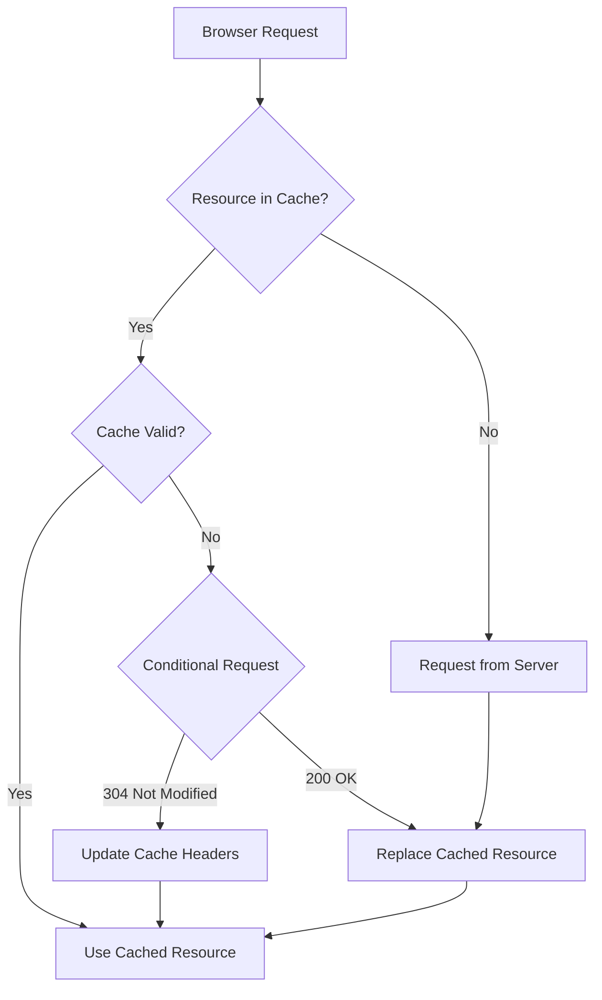

# Nginx Cache Headers

## Introduction

HTTP cache headers are a crucial component of web performance optimization. They instruct browsers and proxy servers on how, when, and for how long to cache resources. When properly configured in Nginx, cache headers can dramatically improve your website's loading times, reduce server load, and decrease bandwidth usage.

In this guide, we'll explore how to configure and optimize cache headers in Nginx. You'll learn about the different types of cache headers, their purpose, and how to implement them effectively in your Nginx configuration.

## Understanding HTTP Cache Headers

Before diving into Nginx configuration, let's understand the key HTTP cache headers:

### Primary Cache Headers

1. **`Cache-Control`**: The most important modern caching header that defines caching policies
2. **`Expires`**: Sets a specific date/time when content becomes stale
3. **`ETag`**: A unique identifier for a specific version of a resource
4. **`Last-Modified`**: Indicates when the resource was last changed

### How Caching Works

When a browser requests a resource:

1. It first checks its local cache
2. If the resource exists and is still valid (according to cache headers), it uses the cached version
3. Otherwise, it makes a new request to the server



## Configuring Cache Headers in Nginx

Let's look at how to configure these headers in Nginx:

### Basic Cache-Control Configuration

The `add_header` directive is used to set HTTP headers in Nginx. Here's a basic example:

```nginx
location ~* \.(jpg|jpeg|png|gif|ico|css|js)$ {
    expires 30d;
    add_header Cache-Control "public, max-age=2592000";
    add_header X-Content-Type-Options nosniff;
}
```

This configuration:
- Matches static files with the specified extensions
- Sets them to expire after 30 days
- Adds a `Cache-Control` header with `public` (can be cached by browsers and proxies) and `max-age=2592000` (seconds, equivalent to 30 days)

### Common Cache-Control Directives

The `Cache-Control` header supports several directives:

- **`max-age=<seconds>`**: How long the resource is fresh
- **`s-maxage=<seconds>`**: Similar to max-age but for shared caches (CDNs, proxies)
- **`public`**: Resource can be cached by browsers and intermediaries
- **`private`**: Resource can only be cached by browsers
- **`no-cache`**: Must revalidate with server before using cached version
- **`no-store`**: Don't cache at all (for sensitive data)

### Conditional Caching with ETag and Last-Modified

ETags and Last-Modified headers enable conditional requests, which can save bandwidth:

```nginx
location /api/ {
    etag on;
    add_header Cache-Control "no-cache";
    # Other API configuration...
}
```

When `etag` is enabled:
1. Nginx generates an ETag based on the response content
2. Browsers send an `If-None-Match` header with the ETag on subsequent requests
3. If the content hasn't changed, Nginx returns a `304 Not Modified` without sending the full response body

## Practical Cache Header Strategies

Let's look at real-world examples for different types of content:

### Static Assets (CSS, JS, Images)

```nginx
location ~* \.(css|js)$ {
    add_header Cache-Control "public, max-age=31536000, immutable";
    access_log off;
}

location ~* \.(png|jpg|jpeg|gif|ico|svg|webp)$ {
    add_header Cache-Control "public, max-age=31536000";
    access_log off;
}
```

The `immutable` directive tells browsers that the content will never change, so they won't revalidate even when users refresh the page.

### HTML Content

```nginx
location ~* \.html$ {
    add_header Cache-Control "public, max-age=3600";
}
```

HTML content typically changes more frequently, so a shorter cache time (1 hour in this example) is appropriate.

### API Responses

```nginx
location /api/ {
    add_header Cache-Control "private, no-cache";
    etag on;
}
```

API responses often contain dynamic or personalized data, so we use `no-cache` to ensure freshness while still enabling conditional requests.

### Vary Header for Content Negotiation

When serving different content based on request headers (like Accept-Encoding or User-Agent):

```nginx
location / {
    add_header Vary "Accept-Encoding, User-Agent";
    # Other configuration...
}
```

This tells caches that the response may differ based on these headers, preventing mismatched content delivery.

## Testing Cache Headers

To verify your cache headers are working correctly, you can use:

1. Browser DevTools (Network tab)
2. Command-line tools like curl:

```bash
curl -I https://example.com/style.css
```

Expected output:

```
HTTP/1.1 200 OK
Server: nginx/1.18.0
Date: Mon, 14 Mar 2022 12:00:00 GMT
Content-Type: text/css
Content-Length: 5432
Last-Modified: Sun, 13 Mar 2022 10:15:30 GMT
Connection: keep-alive
ETag: "60ad7-5cc-593d765e9d140"
Cache-Control: public, max-age=31536000, immutable
```

## Common Cache Header Issues and Solutions

### Problem: Content Updates Not Reflected

If updates to your site aren't appearing for users:

```nginx
# Add version parameters to resource URLs
location ~* \.(css|js)$ {
    expires max;
    add_header Cache-Control "public, max-age=31536000, immutable";
}
```

Then in your HTML:

```html
<link rel="stylesheet" href="/styles.css?v=123456" />
```

When you update the content, change the version parameter to force a fresh request.

### Problem: Too Much or Too Little Caching

Balance caching duration based on content volatility:

```nginx
# Frequently changing content
location /news/ {
    add_header Cache-Control "public, max-age=900"; # 15 minutes
}

# Rarely changing content
location /about/ {
    add_header Cache-Control "public, max-age=604800"; # 1 week
}
```

### Problem: Private Information Being Cached

For personalized content:

```nginx
location /account/ {
    add_header Cache-Control "private, no-store";
}
```

## Complete Nginx Caching Configuration Example

Here's a comprehensive example that covers different content types:

```nginx
server {
    listen 80;
    server_name example.com;
    root /var/www/html;

    # Default caching policy
    add_header Cache-Control "no-cache" always;

    # Static assets
    location ~* \.(css|js)$ {
        expires 1y;
        add_header Cache-Control "public, max-age=31536000, immutable" always;
        access_log off;
    }

    # Images, icons, fonts
    location ~* \.(ico|gif|jpg|jpeg|png|svg|webp|woff|woff2|ttf|otf|eot)$ {
        expires 1M;
        add_header Cache-Control "public, max-age=2592000" always;
        access_log off;
    }

    # HTML files
    location ~* \.html$ {
        expires 1h;
        add_header Cache-Control "public, max-age=3600" always;
    }

    # API endpoints
    location /api/ {
        add_header Cache-Control "private, no-cache" always;
        etag on;
    }

    # User-specific content
    location /user/ {
        add_header Cache-Control "private, no-store" always;
    }

    # Add vary header where appropriate
    location / {
        add_header Vary "Accept-Encoding" always;
    }
}
```

## Summary

Properly configured cache headers in Nginx can significantly improve your website's performance. Key points to remember:

- Use `Cache-Control` as your primary caching directive
- Match cache durations to content update frequency
- Use `public` for shared resources and `private` for user-specific content
- Enable `etag` for conditional requests
- Use the `Vary` header when serving different content based on request headers

By implementing these practices, you'll reduce server load, decrease bandwidth usage, and provide a faster experience for your users.

## Additional Resources

- [Nginx HTTP Caching Module Documentation](https://nginx.org/en/docs/http/ngx_http_headers_module.html)
- [MDN Web Docs: HTTP Caching](https://developer.mozilla.org/en-US/docs/Web/HTTP/Caching)
- [Web.dev: HTTP Caching](https://web.dev/http-cache/)

## Exercises

1. Configure Nginx to cache CSS and JS files for 1 year but HTML files for only 1 hour.
2. Set up a conditional cache using ETags for an API endpoint.
3. Create a configuration that ensures user profile pages are never cached by shared caches.
4. Test your cache headers using curl and browser DevTools.
5. Implement a versioning strategy for static assets that allows for long cache times while still enabling immediate updates when needed.