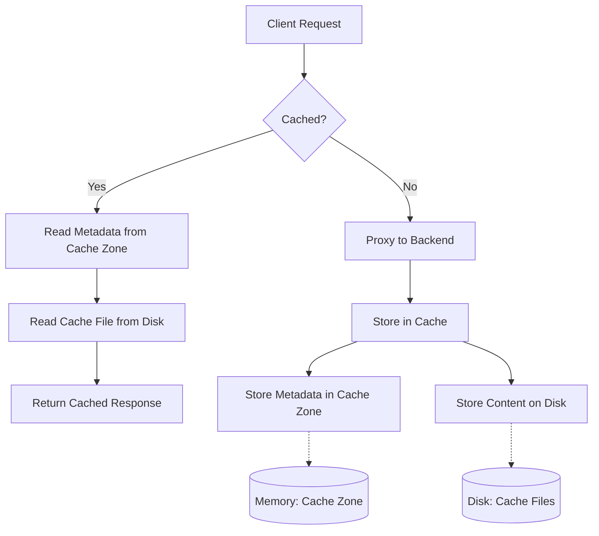

# Nginx Cache Zones

## Introduction

Nginx is a powerful web server that can also function as a reverse proxy, load balancer, and HTTP cache. One of its most useful features for improving performance is caching. Within Nginx's caching system, **cache zones** play a crucial role in determining how cached content is stored and managed in memory.

In this guide, we'll explore what cache zones are, how they work, and how to configure them effectively to boost your application's performance.

## What Are Cache Zones?

Cache zones in Nginx are designated areas in shared memory where Nginx stores metadata about cached items. Think of a cache zone as a map or index that keeps track of what's cached and where it's stored on disk.

:::info
Nginx uses a two-tier caching system:
1. Metadata is stored in memory (in cache zones)
2. Actual cached content is stored on disk
:::

This approach allows Nginx to quickly determine if a requested resource is cached (by checking memory) without having to search through files on disk for each request.

## Basic Cache Zone Configuration

To use Nginx caching, you first need to define a cache zone in your Nginx configuration:

```nginx
http {
    # Define a cache zone named "my_cache" with 10MB of memory
    proxy_cache_path /path/to/cache levels=1:2 keys_zone=my_cache:10m inactive=60m max_size=1g;
    
    server {
        listen 80;
        server_name example.com;
        
        location / {
            proxy_cache my_cache;
            proxy_pass http://backend_server;
        }
    }
}
```

Let's break down the `proxy_cache_path` directive:

- `/path/to/cache`: The directory where cached files will be stored on disk
- `levels=1:2`: Directory hierarchy levels for cache organization
- `keys_zone=my_cache:10m`: Defines a cache zone named "my_cache" with 10MB of memory allocation
- `inactive=60m`: Items inactive for 60 minutes will be removed
- `max_size=1g`: Maximum size of the cache on disk is 1GB

## Understanding Cache Zone Memory Allocation

The memory allocated to a cache zone (the `10m` in our example) is not used to store the actual cached content. Instead, it stores metadata about the cached items. This includes:

- Keys (typically hashed URLs)
- Information about when the cached item was created
- Expiration details
- File paths to the actual cached content on disk

Each cached item typically requires about 64 bytes of metadata in the cache zone. This means a 10MB cache zone can store metadata for approximately:

```
10MB ÷ 64 bytes = 10 * 1024 * 1024 ÷ 64 = 163,840 items
```

:::tip
Choose your cache zone size based on the number of unique items you expect to cache, not the total size of cached content.
:::

## Multiple Cache Zones

You can define multiple cache zones for different purposes:

```nginx
http {
    # Cache zone for static content
    proxy_cache_path /path/to/static_cache levels=1:2 keys_zone=static_cache:10m 
                     inactive=24h max_size=5g;
    
    # Cache zone for dynamic content
    proxy_cache_path /path/to/dynamic_cache levels=1:2 keys_zone=dynamic_cache:20m 
                     inactive=10m max_size=1g;
    
    server {
        listen 80;
        server_name example.com;
        
        # Use static cache for images, CSS, and JS
        location ~* \.(jpg|jpeg|png|gif|ico|css|js)$ {
            proxy_cache static_cache;
            proxy_cache_valid 200 302 24h;
            proxy_cache_valid 404 1m;
            proxy_pass http://backend_server;
        }
        
        # Use dynamic cache for everything else
        location / {
            proxy_cache dynamic_cache;
            proxy_cache_valid 200 302 10m;
            proxy_pass http://backend_server;
        }
    }
}
```

This configuration:
- Creates a 10MB cache zone for static content with a 24-hour inactive timeout
- Creates a 20MB cache zone for dynamic content with a 10-minute inactive timeout
- Uses different cache settings based on the content type

## Cache Zone Sharing

One powerful feature of cache zones is that they can be shared across multiple server blocks:

```nginx
http {
    # Define a shared cache zone
    proxy_cache_path /path/to/cache levels=1:2 keys_zone=shared_cache:20m inactive=60m max_size=2g;
    
    server {
        listen 80;
        server_name site1.example.com;
        
        location / {
            proxy_cache shared_cache;
            proxy_pass http://backend1;
        }
    }
    
    server {
        listen 80;
        server_name site2.example.com;
        
        location / {
            proxy_cache shared_cache;
            proxy_pass http://backend2;
        }
    }
}
```

Both sites now use the same cache zone, which can be beneficial when:
- The sites share similar content
- You want to maximize memory efficiency
- You need to implement cross-site caching

## Monitoring Cache Zone Usage

To check how your cache zones are performing, you can enable the Nginx status module and access cache statistics:

```nginx
http {
    # Other configurations...
    
    server {
        listen 8080;
        server_name localhost;
        
        location /nginx_status {
            stub_status on;
            access_log off;
            allow 127.0.0.1;
            deny all;
        }
    }
}
```

For more detailed cache statistics, you can use the `proxy_cache_path` directive with the `use_temp_path=off` parameter to improve caching performance:

```nginx
proxy_cache_path /path/to/cache levels=1:2 keys_zone=my_cache:10m 
                 inactive=60m max_size=1g use_temp_path=off;
```

## Cache Zone Purging

Sometimes you need to purge items from your cache. Nginx provides a way to do this with the `proxy_cache_purge` directive:

```nginx
http {
    # Define cache zone
    proxy_cache_path /path/to/cache levels=1:2 keys_zone=my_cache:10m;
    
    map $request_method $purge_method {
        PURGE 1;
        default 0;
    }
    
    server {
        listen 80;
        server_name example.com;
        
        location / {
            proxy_cache my_cache;
            proxy_cache_purge $purge_method;
            proxy_pass http://backend_server;
        }
    }
}
```

With this configuration, you can purge a cached item by sending a PURGE request:

```bash
curl -X PURGE http://example.com/path/to/cached/resource
```

## Real-world Example: Caching API Responses

Here's a practical example of configuring cache zones for an API server:

```nginx
http {
    # Cache zone for API responses
    proxy_cache_path /var/cache/nginx/api_cache levels=1:2 
                     keys_zone=api_cache:20m
                     inactive=30m max_size=500m
                     use_temp_path=off;
    
    # Cache key definition
    map $request_method $api_cache_key {
        default         $scheme$request_method$host$request_uri;
    }
    
    server {
        listen 80;
        server_name api.example.com;
        
        # Cache GET requests only
        location /api/ {
            proxy_cache api_cache;
            proxy_cache_methods GET;
            proxy_cache_key $api_cache_key;
            proxy_cache_valid 200 30m;
            proxy_cache_valid 404 1m;
            
            # Add cache status to response headers
            add_header X-Cache-Status $upstream_cache_status;
            
            # Skip cache for requests with certain headers
            proxy_cache_bypass $http_cache_control;
            
            proxy_pass http://api_backend;
        }
        
        # Don't cache admin endpoints
        location /api/admin/ {
            proxy_cache_bypass 1;
            proxy_pass http://api_backend;
        }
    }
}
```

This configuration:
1. Creates a 20MB cache zone for API responses
2. Caches successful responses for 30 minutes and 404 responses for 1 minute
3. Skips caching for admin endpoints
4. Includes cache status in response headers
5. Respects cache-control headers

## Performance Considerations for Cache Zones

When configuring cache zones, consider these performance tips:

1. **Right-size your cache zone memory**: Too small and you'll have frequent cache purges; too large and you'll waste memory.

2. **Use `use_temp_path=off`**: This parameter improves performance by skipping the use of a temporary file.

```nginx
proxy_cache_path /path/to/cache levels=1:2 keys_zone=my_cache:10m use_temp_path=off;
```

3. **Optimize the `levels` parameter**: For large caches, increasing subdirectory levels improves file system performance.

```nginx
# For very large caches
proxy_cache_path /path/to/cache levels=1:2:2 keys_zone=my_cache:10m;
```

4. **Consider using SSD storage**: For the file system cache location when high performance is needed.

## Cache Zone Flow Diagram

Here's a diagram illustrating how Nginx cache zones work:



## Summary

Nginx cache zones are a powerful mechanism for improving your web application's performance by storing metadata about cached content in memory. By properly configuring cache zones, you can:

- Reduce load on backend servers
- Improve response times
- Handle traffic spikes more effectively
- Customize caching behavior for different types of content

When designing your caching strategy, remember that the cache zone size should be based on the number of unique items you expect to cache, while the disk cache size depends on the actual content size.

## Further Learning

To deepen your understanding of Nginx caching:

1. Explore more advanced caching techniques like cache locking and cache slicing
2. Learn about cache invalidation strategies
3. Experiment with different cache key configurations
4. Implement cache warming for critical resources

## Practice Exercises

1. Configure a basic Nginx server with a cache zone for static files
2. Set up different cache TTLs for different HTTP response codes
3. Implement cache purging for a specific URL pattern
4. Create a configuration with multiple cache zones for different content types
5. Monitor your cache hit ratio and optimize your configuration accordingly