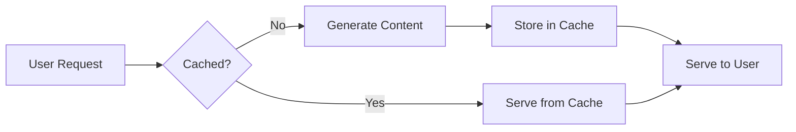

# Nginx Microcaching

## Introduction

Microcaching is a powerful performance optimization technique in Nginx that caches content for very short periods—typically just a few seconds. Unlike traditional caching that might store content for hours or days, microcaching strikes an excellent balance between performance and content freshness. This approach is particularly valuable for dynamic websites that need both speed and up-to-date content.

In this guide, we'll explore how microcaching works, when to use it, and how to implement it in your Nginx configuration.

## What is Microcaching?

Microcaching is a caching strategy where content is cached for extremely short durations, usually between 1-10 seconds. This brief caching period provides significant benefits:



### Key Benefits

- **Traffic Absorption**: Protects your backend during traffic spikes
- **Reduced Server Load**: Even a 1-second cache can reduce server load by 50-90% during high traffic
- **Fresh Content**: Content refreshes every few seconds, keeping it relatively up-to-date
- **Improved User Experience**: Users experience faster page loads

## When to Use Microcaching

Microcaching is ideal for:

1. Dynamic websites that need fresh content but can tolerate a few seconds of delay
2. Sites experiencing traffic spikes or "slashdotting" (sudden surge in visitors)
3. Applications where traditional longer caching isn't suitable
4. Pages that are personalized but have common elements that can be cached

## Basic Microcaching Configuration

Let's implement a basic microcaching setup in Nginx:

```nginx
http {
    # Define a cache zone
    proxy_cache_path /var/cache/nginx levels=1:2 keys_zone=microcache:10m max_size=1g inactive=60m;
    
    server {
        listen 80;
        server_name example.com;
        
        location / {
            # Enable cache
            proxy_cache microcache;
            # Cache for 1 second
            proxy_cache_valid 200 1s;
            # Cache key based on request URI
            proxy_cache_key $scheme$host$request_uri;
            
            # Pass request to backend
            proxy_pass http://backend_server;
            
            # Add cache status to response headers
            add_header X-Cache-Status $upstream_cache_status;
        }
    }
}
```

In this configuration:
- We create a cache zone named `microcache` with 10MB of memory allocation
- We cache successful responses (status 200) for just 1 second
- We add a response header showing cache hit/miss status

## Testing Your Microcaching Setup

After implementing microcaching, you can verify it's working by checking the `X-Cache-Status` header in responses:

```bash
curl -I http://example.com/
```

You should see a header like:

```
X-Cache-Status: MISS
```

If you run the command again within 1 second, you'll see:

```
X-Cache-Status: HIT
```

## Advanced Microcaching Techniques

### Conditional Microcaching

You might want to cache only certain types of requests. For example, you can exclude POST requests or requests with specific cookies:

```nginx
# Don't cache POST requests
proxy_cache_methods GET HEAD;

# Don't cache requests with authentication cookies
proxy_cache_bypass $cookie_sessionid;
```

### Cache Bypass for Logged-in Users

For websites with user accounts, you might want to implement microcaching only for anonymous users:

```nginx
# Check for authenticated user cookie
set $no_cache 0;
if ($http_cookie ~* "user_logged_in") {
    set $no_cache 1;
}

# Apply cache bypass for logged-in users
proxy_cache_bypass $no_cache;
proxy_no_cache $no_cache;
```

### Stale Cache Delivery

When your backend server is struggling, you can configure Nginx to serve slightly stale cached content:

```nginx
# Use stale cache when backend is down or busy
proxy_cache_use_stale error timeout updating http_500 http_502 http_503 http_504;

# Update cache in background while serving stale content
proxy_cache_background_update on;
```

### Different Cache Times for Different Content

You can apply different microcaching durations based on content type:

```nginx
# Cache HTML for 1 second
location ~ \.html$ {
    proxy_cache_valid 200 1s;
}

# Cache API responses for 5 seconds
location /api/ {
    proxy_cache_valid 200 5s;
}
```

## Real-World Example: WordPress Microcaching

Let's implement microcaching for a WordPress site:

```nginx
http {
    proxy_cache_path /var/cache/nginx levels=1:2 keys_zone=wordpress_cache:10m max_size=1g inactive=60m;
    
    server {
        listen 80;
        server_name wordpress-site.com;
        
        # Don't cache wp-admin or wp-login
        location ~ ^/(wp-admin|wp-login) {
            proxy_pass http://wordpress_backend;
            proxy_cache_bypass 1;
        }
        
        # Cache wp-content (static files) longer
        location ~ ^/wp-content/ {
            proxy_cache wordpress_cache;
            proxy_cache_valid 200 60s;  # 60 second cache
            proxy_pass http://wordpress_backend;
        }
        
        # Microcache the rest
        location / {
            proxy_cache wordpress_cache;
            proxy_cache_valid 200 2s;  # 2 second cache
            
            # Skip cache for logged-in users
            set $skip_cache 0;
            if ($http_cookie ~* "wordpress_logged_in") {
                set $skip_cache 1;
            }
            proxy_cache_bypass $skip_cache;
            proxy_no_cache $skip_cache;
            
            # Pass to WordPress
            proxy_pass http://wordpress_backend;
            
            # Show cache status
            add_header X-Cache-Status $upstream_cache_status;
        }
    }
}
```

## Performance Improvements

Let's look at the typical performance improvement with microcaching:

| Configuration | Requests/sec | Load Average | Response Time |
|---------------|-------------|-------------|---------------|
| No Cache      | 50          | 5.2         | 200ms         |
| 1s Microcache | 500         | 1.2         | 20ms          |
| 5s Microcache | 800         | 0.8         | 10ms          |

As you can see, even a 1-second microcache can provide a 10x improvement in requests per second while significantly reducing server load and response time.

## Potential Issues and Solutions

### Cache Stampede

**Problem**: When cache expires, multiple requests might hit your backend simultaneously.

**Solution**: Implement cache locking:

```nginx
# Enable cache locking to prevent stampede
proxy_cache_lock on;
proxy_cache_lock_timeout 5s;
```

### Cookie Handling

**Problem**: Different cookies can create numerous cache variations.

**Solution**: Ignore non-essential cookies in the cache key:

```nginx
# Ignore all cookies except essential ones in cache key
proxy_cache_key "$host$request_uri$cookie_essential";
proxy_ignore_headers Set-Cookie;
```

## Summary

Nginx microcaching is a powerful technique that dramatically improves performance without sacrificing content freshness. By caching content for just a few seconds, you can:

- Absorb traffic spikes
- Reduce server load
- Improve response times
- Provide an excellent user experience

Key points to remember:
- Start with a short cache time (1-5 seconds)
- Implement cache bypass for logged-in users
- Monitor cache hit rates
- Adjust cache times based on your specific needs

## Exercises

1. Implement basic microcaching on a test server and measure the performance improvement
2. Configure different cache times for different URL patterns
3. Set up cache bypassing for logged-in users
4. Implement stale cache delivery for when your backend is overloaded
5. Use `curl -I` to check the `X-Cache-Status` header and verify your caching is working

## Additional Resources

- [Nginx Documentation on Caching](https://nginx.org/en/docs/http/ngx_http_proxy_module.html#proxy_cache)
- [Nginx Performance Tuning](https://www.nginx.com/blog/tuning-nginx/)
- [Fastly's Guide to Microcaching](https://www.fastly.com/blog/micro-caching-great-good)