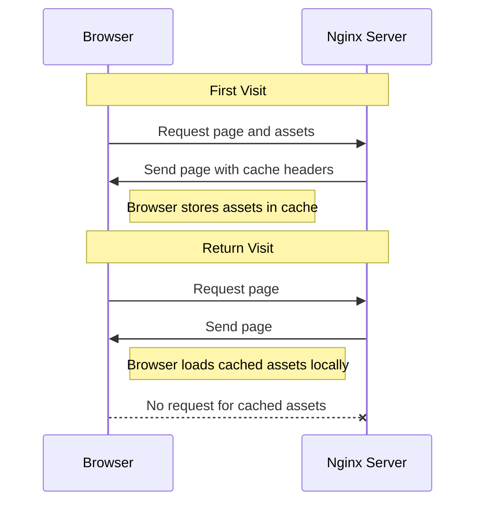

# Nginx Browser Caching

## Introduction

Browser caching is a powerful technique that significantly improves website performance by storing static assets locally in the user's browser. When properly configured, it reduces server load, decreases bandwidth usage, and delivers a faster user experience by eliminating unnecessary network requests.

In this tutorial, we'll explore how to implement browser caching using Nginx, one of the most popular web servers. By the end, you'll understand how browser caching works and be able to configure Nginx to leverage this performance optimization technique effectively.

## What is Browser Caching?

Browser caching works on a simple principle: resources that don't change frequently (like images, CSS, JavaScript files) can be stored in the user's browser. This way, when a user revisits your website, their browser can load these resources from local storage instead of requesting them again from the server.



## How Nginx Handles Browser Caching

Nginx controls browser caching through HTTP headers, particularly:

1. `Cache-Control`: Defines how, and for how long, the browser should cache resources
2. `Expires`: Sets a specific date/time when the resource becomes invalid
3. `ETag`: Provides a unique identifier for a specific version of a resource
4. `Last-Modified`: Indicates when the resource was last changed

## Implementing Browser Caching in Nginx

### Basic Configuration

Let's start with a basic browser caching configuration in Nginx:

```nginx
server {
    listen 80;
    server_name example.com;
    root /var/www/html;

    location ~* \.(jpg|jpeg|png|gif|ico|css|js)$ {
        expires 30d;
        add_header Cache-Control "public, no-transform";
    }
}
```

In this example:
- We target static files with common extensions
- We set them to expire after 30 days
- We add a Cache-Control header specifying these resources are "public" (can be cached by browsers and intermediary proxies)

### Detailed Configuration with Different Cache Times

Different types of assets may need different caching strategies. Here's a more comprehensive example:

```nginx
server {
    listen 80;
    server_name example.com;
    root /var/www/html;

    # CSS and JavaScript files - longer cache time since they often use versioning
    location ~* \.(?:css|js)$ {
        expires 1y;
        add_header Cache-Control "public, immutable";
    }

    # Images, icons, video, audio, HTC
    location ~* \.(?:jpg|jpeg|gif|png|ico|cur|gz|svg|mp4|ogg|ogv|webm|htc)$ {
        expires 1M;
        add_header Cache-Control "public";
    }

    # WebFonts
    location ~* \.(?:ttf|ttc|otf|eot|woff|woff2)$ {
        expires 1M;
        add_header Cache-Control "public";
    }

    # HTML files - short cache or no cache
    location ~* \.(?:html|htm)$ {
        expires 1d;
        add_header Cache-Control "public";
    }
}
```

Let's understand each section:

1. **CSS/JS files**: Cached for 1 year with `immutable` flag (indicating the file won't change)
2. **Media files**: Cached for 1 month
3. **Web fonts**: Cached for 1 month
4. **HTML files**: Cached for just 1 day (as content might change more frequently)

### Cache-Control Header Options

The `Cache-Control` header has several directives you can use:

- `public`: The response can be cached by browsers and shared caches (like CDNs)
- `private`: The response is intended for a single user and must not be stored by shared caches
- `no-cache`: Must revalidate with the server before using cached version
- `no-store`: Don't cache the response at all
- `max-age=<seconds>`: Maximum time the resource is considered fresh
- `immutable`: Indicates the resource will not change over its freshness lifetime

## Cache Busting

What happens when you update an asset that's already cached? That's where cache busting comes into play. There are several approaches:

### 1. Filename Versioning

```html
<link rel="stylesheet" href="styles.v2.css">
<script src="main.v3.js"></script>
```

### 2. Query Parameters

```html
<link rel="stylesheet" href="styles.css?v=1634567890">
<script src="main.js?v=1634567890"></script>
```

### 3. Content Hashing (Best Practice)

```html
<link rel="stylesheet" href="styles.d41d8cd98f.css">
<script src="main.7e4f21eb9b.js"></script>
```

When implementing any of these strategies, your Nginx configuration remains the same. When a file name or parameter changes, the browser treats it as a completely new resource.

## Testing Your Cache Configuration

After implementing browser caching, it's important to verify it's working correctly. Here are some ways to check:

### Using Browser Developer Tools

1. Open Developer Tools (F12 in most browsers)
2. Go to the Network tab
3. Reload the page
4. Click on a resource and check the "Headers" section

Look for:
- Cache-Control header
- Expires header
- Status code 304 (Not Modified) for subsequent requests

### Using curl

```bash
curl -I https://example.com/style.css
```

You should see headers like:

```
HTTP/1.1 200 OK
Server: nginx/1.18.0
Date: Fri, 14 Mar 2025 12:00:00 GMT
Content-Type: text/css
Content-Length: 12345
Last-Modified: Wed, 12 Mar 2025 15:30:00 GMT
Connection: keep-alive
ETag: "5fc66821-3039"
Expires: Sat, 14 Mar 2026 12:00:00 GMT
Cache-Control: public, max-age=31536000
```

## Common Issues and Troubleshooting

### Cache Not Working

1. **Check your syntax**: Ensure there are no typos in your Nginx configuration
2. **Verify Nginx reloaded**: Run `sudo nginx -t` to test configuration and `sudo systemctl reload nginx` to apply changes
3. **Inspect response headers**: Use browser DevTools to verify headers are being sent

### Assets Not Updating

1. **Force refresh**: Use Ctrl+F5 to bypass browser cache
2. **Implement cache busting**: As discussed earlier
3. **Temporarily disable cache**: Add `location ~* \.(css|js)$ { add_header Cache-Control "no-store"; }`

### Too Aggressive Caching

If users aren't seeing updates, your cache duration might be too long. Consider:
- Shorter expiry times for frequently updated content
- Implementing proper cache busting strategies

## Real-World Configuration Example

Here's a production-ready Nginx configuration for a typical web application:

```nginx
server {
    listen 80;
    server_name example.com;
    root /var/www/html;

    # API Endpoints - No caching
    location /api/ {
        add_header Cache-Control "no-store, no-cache, must-revalidate";
    }

    # HTML and data files
    location ~* \.(?:manifest|appcache|html?|xml|json)$ {
        expires -1;
        add_header Cache-Control "no-store, must-revalidate";
    }

    # Feed
    location ~* \.(?:rss|atom)$ {
        expires 1h;
        add_header Cache-Control "public";
    }

    # Media: images, icons, video, audio, HTC
    location ~* \.(?:jpg|jpeg|gif|png|ico|cur|gz|svg|svgz|mp4|ogg|ogv|webm|htc)$ {
        expires 1M;
        access_log off;
        add_header Cache-Control "public, immutable";
    }

    # CSS, JavaScript, Fonts
    location ~* \.(?:css|js|woff|woff2|eot|ttf|otf)$ {
        expires 1y;
        access_log off;
        add_header Cache-Control "public, immutable";
    }

    # Add trailing slash to directories
    location ~* ^[^.]+$ {
        try_files $uri $uri/ /index.html;
    }
}
```

This configuration provides:
- No caching for API endpoints and dynamic content
- Short cache times for feeds
- Medium cache times for media
- Long cache times for assets that typically use versioning
- Proper handling of single-page applications

## Summary

Browser caching is an essential optimization technique that:
- Reduces server load
- Decreases bandwidth usage
- Improves page load speed
- Enhances user experience

With Nginx, implementing browser caching is straightforward through proper HTTP headers. The key takeaways:

1. Use appropriate cache durations for different types of assets
2. Implement cache busting strategies for updated resources
3. Test and verify your cache configuration
4. Consider both performance and content freshness in your strategy

## Further Resources

To deepen your understanding of Nginx caching:

- Explore Nginx's [official documentation](https://nginx.org/en/docs/) for more advanced configurations
- Learn about combining browser caching with server-side caching for maximum performance
- Study HTTP caching specifications in [RFC 7234](https://tools.ietf.org/html/rfc7234)

## Exercises

1. Implement browser caching for a simple static website and test the performance improvement using tools like Google PageSpeed Insights.
2. Create a custom Nginx configuration that applies different caching strategies based on device type or user agent.
3. Build a simple versioning system for your static assets to implement cache busting.
4. Configure conditional caching based on cookies (e.g., different cache strategies for logged-in vs anonymous users).