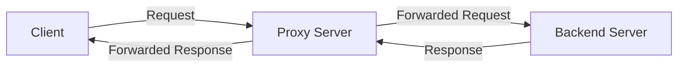

# Nginx Proxy Basics

## Introduction

Nginx (pronounced "engine-x") is a powerful web server that can also function as a proxy server. A proxy server acts as an intermediary between clients and servers, forwarding requests and responses between them. Understanding Nginx's proxy capabilities is essential for modern web development, as it enables load balancing, security enhancement, and efficient resource management.

In this guide, we'll explore the fundamental concepts of Nginx as a proxy server, focusing on basic configurations and practical implementations that will help you get started with proxying requests in your web applications.

## What is a Proxy Server?

Before diving into Nginx-specific configurations, let's understand what a proxy server does:



A proxy server sits between clients (like web browsers) and backend servers (where your application runs). It receives requests from clients and forwards them to the appropriate backend, then returns the responses back to the clients.

There are two main types of proxy servers:

1. **Forward Proxy**: Acts on behalf of clients, typically used to bypass restrictions or provide anonymity.
2. **Reverse Proxy**: Acts on behalf of servers, which is Nginx's most common use case.

## Nginx as a Reverse Proxy

Nginx excels as a reverse proxy server, where it:

- Distributes client requests across multiple application servers
- Serves as a protective layer between clients and your backend
- Caches content to improve performance
- Handles SSL/TLS termination

### Basic Proxy Configuration

Let's start with a simple Nginx configuration that proxies requests to a backend application:

```nginx
server {
    listen 80;
    server_name example.com;

    location / {
        proxy_pass http://localhost:3000;
        proxy_set_header Host $host;
        proxy_set_header X-Real-IP $remote_addr;
    }
}
```

This configuration:

1. Creates a server block that listens on port 80 for requests to `example.com`
2. For all paths (`location /`), it forwards requests to a backend server running on `localhost:3000`
3. Adds headers to pass the original host and client IP address to the backend

### Key Proxy Directives

Here are some essential Nginx directives used for proxying:

#### `proxy_pass`

The most fundamental directive that specifies where to forward requests:

```nginx
proxy_pass http://backend_server;
```

#### `proxy_set_header`

Allows you to modify HTTP headers sent to the backend server:

```nginx
proxy_set_header Host $host;
proxy_set_header X-Real-IP $remote_addr;
proxy_set_header X-Forwarded-For $proxy_add_x_forwarded_for;
```

These headers help the backend application identify the original client rather than seeing all requests as coming from Nginx.

#### `proxy_buffer_size` and `proxy_buffers`

Control how Nginx buffers responses from the backend:

```nginx
proxy_buffer_size 16k;
proxy_buffers 4 32k;
```

#### `proxy_read_timeout`

Sets a timeout for reading a response from the backend:

```nginx
proxy_read_timeout 90s;
```

## Practical Examples

Let's look at some common scenarios where Nginx proxy capabilities shine:

### Example 1: Proxying to a Node.js Application

A typical setup for a Node.js application:

```nginx
server {
    listen 80;
    server_name myapp.example.com;

    location / {
        proxy_pass http://localhost:3000;
        proxy_http_version 1.1;
        proxy_set_header Upgrade $http_upgrade;
        proxy_set_header Connection 'upgrade';
        proxy_set_header Host $host;
        proxy_cache_bypass $http_upgrade;
    }
}
```

This configuration includes special headers needed for WebSocket support, which is common in modern Node.js applications.

### Example 2: Proxying Different Paths to Different Services

A microservices setup where different paths go to different backends:

```nginx
server {
    listen 80;
    server_name api.example.com;

    # Main API service
    location /api/v1/ {
        proxy_pass http://localhost:3001/;
        proxy_set_header Host $host;
        proxy_set_header X-Real-IP $remote_addr;
    }

    # User service
    location /api/users/ {
        proxy_pass http://localhost:3002/users/;
        proxy_set_header Host $host;
        proxy_set_header X-Real-IP $remote_addr;
    }

    # Authentication service
    location /auth/ {
        proxy_pass http://localhost:3003/;
        proxy_set_header Host $host;
        proxy_set_header X-Real-IP $remote_addr;
    }
}
```

Notice how we can strip parts of the URL path when forwarding to the backend by adding a trailing slash to both the `location` and `proxy_pass` values.

### Example 3: Basic Load Balancing

Distributing traffic across multiple backend servers:

```nginx
upstream backend_servers {
    server backend1.example.com:8080;
    server backend2.example.com:8080;
    server backend3.example.com:8080;
}

server {
    listen 80;
    server_name example.com;

    location / {
        proxy_pass http://backend_servers;
        proxy_set_header Host $host;
        proxy_set_header X-Real-IP $remote_addr;
    }
}
```

This configuration defines an upstream group of servers and proxies requests to them in a round-robin fashion by default.

## Common Issues and Solutions

### Handling Path Rewriting

When the backend application expects a different URL structure than what clients use:

```nginx
location /api/ {
    # Removes /api/ from the URL when forwarding
    proxy_pass http://localhost:3000/;
    
    # Keep /api/ in the URL when forwarding
    # proxy_pass http://localhost:3000;
}
```

The presence or absence of a trailing slash in the `proxy_pass` URL determines whether Nginx rewrites the path.

### Dealing with CORS

To enable Cross-Origin Resource Sharing for your API:

```nginx
location /api/ {
    proxy_pass http://localhost:3000;
    
    # CORS headers
    add_header 'Access-Control-Allow-Origin' '*';
    add_header 'Access-Control-Allow-Methods' 'GET, POST, OPTIONS, PUT, DELETE';
    add_header 'Access-Control-Allow-Headers' 'DNT,User-Agent,X-Requested-With,If-Modified-Since,Cache-Control,Content-Type,Range,Authorization';
    
    # Handle OPTIONS method
    if ($request_method = 'OPTIONS') {
        add_header 'Access-Control-Max-Age' 1728000;
        add_header 'Content-Type' 'text/plain; charset=utf-8';
        add_header 'Content-Length' 0;
        return 204;
    }
}
```

### Timeouts

Preventing gateway timeout errors with proper timeout settings:

```nginx
location /api/ {
    proxy_pass http://localhost:3000;
    proxy_connect_timeout 60s;
    proxy_send_timeout 60s;
    proxy_read_timeout 60s;
}
```

## Testing Your Proxy Configuration

After setting up your Nginx proxy, test the configuration before applying it:

```bash
# Test the syntax of your configuration
sudo nginx -t

# If successful, reload Nginx to apply changes
sudo nginx -s reload
```

To verify your proxy is working correctly:

```bash
# Send a request to your proxy
curl -I http://example.com

# Look for the proxy headers in the response
curl -I http://example.com | grep -i "X-Powered-By\|Server"
```

## Summary

Nginx's proxy capabilities make it an invaluable tool in modern web infrastructure. In this guide, we've covered:

- The basic concept of proxy servers
- Configuring Nginx as a reverse proxy
- Essential proxy directives
- Real-world examples for common scenarios
- Troubleshooting common issues

By mastering these fundamentals, you're now equipped to implement Nginx as a proxy in various scenarios, from simple application hosting to complex microservices architectures.

## Further Learning

To deepen your understanding of Nginx proxying, consider exploring:

- Load balancing strategies
- SSL/TLS termination
- Caching with Nginx
- Health checks and failover configurations
- Advanced header manipulation

## Exercises

1. Set up a simple Nginx proxy for a local web application running on port 3000.
2. Configure Nginx to proxy requests to two different backend services based on URL path.
3. Implement a basic load balancer with Nginx that distributes traffic between three backend servers.
4. Configure proper timeout settings and test how they affect long-running requests.
5. Set up CORS headers for an API that needs to be accessed from different domains.