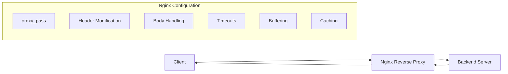

# Nginx Proxy Parameters

## Introduction

When setting up Nginx as a reverse proxy, configuring the right proxy parameters is essential for performance, reliability, and security. A reverse proxy sits between clients and backend servers, forwarding client requests to appropriate servers and returning the servers' responses to clients. Proxy parameters allow you to control exactly how this forwarding behavior works.

In this guide, we'll explore the most important Nginx proxy parameters, understand their purpose, and learn how to configure them effectively for different scenarios.

## Basic Proxy Parameters

Let's start with the fundamental proxy parameters that form the backbone of any Nginx reverse proxy configuration.

### proxy_pass

The `proxy_pass` directive is the most essential parameter in a proxy configuration. It specifies the protocol and address of a proxied server.

```nginx
location /api/ {
    proxy_pass http://backend_server:8080/;
}
```

In this example, requests to `/api/` will be forwarded to `http://backend_server:8080/`.

### Understanding URI Handling in proxy_pass

The way Nginx handles URIs depends on whether you include a URI in the `proxy_pass` directive:

1. **Without a URI** - The full original request URI is appended:
   ```nginx
   # If a request comes in as /api/users
   location /api/ {
       proxy_pass http://backend_server:8080;
       # Request becomes http://backend_server:8080/api/users
   }
   ```

2. **With a URI** - Nginx replaces the matched location part:
   ```nginx
   # If a request comes in as /api/users
   location /api/ {
       proxy_pass http://backend_server:8080/;
       # Request becomes http://backend_server:8080/users
   }

   # If a request comes in as /api/users
   location /api/ {
       proxy_pass http://backend_server:8080/data/;
       # Request becomes http://backend_server:8080/data/users
   }
   ```

## Header Modification Parameters

Controlling HTTP headers is crucial for proper communication between clients, Nginx, and backend servers.

### proxy_set_header

This directive allows you to redefine or append fields to the request header passed to the backend server.

```nginx
location /api/ {
    proxy_pass http://backend_server:8080/;
    proxy_set_header Host $host;
    proxy_set_header X-Real-IP $remote_addr;
    proxy_set_header X-Forwarded-For $proxy_add_x_forwarded_for;
    proxy_set_header X-Forwarded-Proto $scheme;
}
```

Common headers to set:

- **Host**: Defines which hostname to pass to the backend
- **X-Real-IP**: Passes the client's actual IP address
- **X-Forwarded-For**: Maintains a list of IPs in the request chain
- **X-Forwarded-Proto**: Indicates the protocol (HTTP or HTTPS) used by the client

### proxy_pass_request_headers

Controls whether to pass the header fields from the client request to the proxied server.

```nginx
location /api/ {
    proxy_pass http://backend_server:8080/;
    proxy_pass_request_headers on; # Default value
}
```

## Request Body Handling

These parameters control how Nginx manages the request body before proxying it.

### proxy_pass_request_body

Determines whether the request body is passed to the proxied server.

```nginx
location /api/ {
    proxy_pass http://backend_server:8080/;
    proxy_pass_request_body on; # Default value
}
```

### client_max_body_size

Sets the maximum allowed size of the client request body.

```nginx
location /api/upload/ {
    proxy_pass http://backend_server:8080/;
    client_max_body_size 10M; # Allows uploads up to 10 megabytes
}
```

If the size exceeds this value, Nginx returns a 413 (Request Entity Too Large) error.

## Timeout Parameters

Timeout parameters are crucial for managing connection behavior and preventing issues with slow clients or backends.

### proxy_connect_timeout

Defines the timeout for establishing a connection with the proxied server.

```nginx
proxy_connect_timeout 60s; # Default is 60 seconds
```

### proxy_send_timeout

Sets the timeout for transmitting a request to the proxied server.

```nginx
proxy_send_timeout 60s; # Default is 60 seconds
```

### proxy_read_timeout

Defines the timeout for reading a response from the proxied server.

```nginx
proxy_read_timeout 60s; # Default is 60 seconds
```

## Buffer Parameters

Buffer settings control how Nginx buffers responses from proxied servers.

### proxy_buffering

Enables or disables buffering of responses from the proxied server.

```nginx
location /api/ {
    proxy_pass http://backend_server:8080/;
    proxy_buffering on; # Default value
}
```

With buffering enabled, Nginx receives the response from the proxied server as quickly as possible and stores it in internal buffers. This can improve performance when clients are slow.

### proxy_buffers

Sets the number and size of buffers for a single connection.

```nginx
location /api/ {
    proxy_pass http://backend_server:8080/;
    proxy_buffers 4 16k; # 4 buffers of 16 kilobytes each
}
```

### proxy_buffer_size

Sets the size of the buffer used for reading the first part of the response.

```nginx
proxy_buffer_size 4k;
```

## SSL Parameters

When proxying to HTTPS backends, these parameters are important.

### proxy_ssl_protocols

Specifies the SSL protocols that should be used when connecting to the proxied HTTPS server.

```nginx
proxy_ssl_protocols TLSv1.2 TLSv1.3;
```

### proxy_ssl_verify

Enables or disables verification of the proxied HTTPS server certificate.

```nginx
proxy_ssl_verify on;
```

### proxy_ssl_trusted_certificate

Specifies a file with trusted CA certificates for verifying the proxied HTTPS server certificate.

```nginx
proxy_ssl_trusted_certificate /path/to/trusted_ca_cert.crt;
```

## Caching Parameters

Nginx can cache responses from proxied servers for improved performance.

### proxy_cache_path

Defines a cache area on disk:

```nginx
# In http context
proxy_cache_path /var/cache/nginx levels=1:2 keys_zone=my_cache:10m max_size=10g inactive=60m;
```

### proxy_cache

Enables caching for a specific location:

```nginx
location /api/ {
    proxy_pass http://backend_server:8080/;
    proxy_cache my_cache;
    proxy_cache_valid 200 302 10m;
    proxy_cache_valid 404 1m;
}
```

## Practical Example: Complete Reverse Proxy Configuration

Let's put everything together in a practical example:

```nginx
http {
    # Define upstream servers
    upstream backend {
        server backend1.example.com:8080;
        server backend2.example.com:8080 backup;
    }

    # Define cache
    proxy_cache_path /var/cache/nginx levels=1:2 keys_zone=proxy_cache:10m max_size=1g inactive=60m;
    
    # Common proxy headers
    proxy_set_header Host $host;
    proxy_set_header X-Real-IP $remote_addr;
    proxy_set_header X-Forwarded-For $proxy_add_x_forwarded_for;
    proxy_set_header X-Forwarded-Proto $scheme;
    
    # Common timeout settings
    proxy_connect_timeout 60s;
    proxy_send_timeout 60s;
    proxy_read_timeout 60s;
    
    # Buffer settings
    proxy_buffering on;
    proxy_buffer_size 4k;
    proxy_buffers 4 32k;
    proxy_busy_buffers_size 64k;
    
    server {
        listen 80;
        server_name example.com;
        
        # API requests
        location /api/ {
            proxy_pass http://backend/;
            proxy_cache proxy_cache;
            proxy_cache_valid 200 10m;
            client_max_body_size 1M;
        }
        
        # Static content
        location /static/ {
            proxy_pass http://backend/static/;
            proxy_cache proxy_cache;
            proxy_cache_valid 200 60m;
            add_header X-Cache-Status $upstream_cache_status;
        }
        
        # Streaming content
        location /stream/ {
            proxy_pass http://backend/stream/;
            proxy_buffering off;
        }
        
        # Large file uploads
        location /upload/ {
            proxy_pass http://backend/upload/;
            client_max_body_size 100M;
            proxy_request_buffering off;
        }
    }
}
```

This configuration:
1. Defines an upstream group with a backup server
2. Sets up caching for proxied responses
3. Configures common proxy headers and timeouts
4. Creates separate location blocks for different types of requests
5. Adjusts parameters for each use case (API, static content, streaming, uploads)

## Understanding Proxy Request Flow with Nginx

Let's visualize how requests flow through Nginx with proxy parameters:



## Troubleshooting Common Issues

### 502 Bad Gateway Errors

This typically indicates that Nginx couldn't connect to the backend server or the backend server closed the connection.

Potential solutions:
- Check if the backend server is running
- Increase `proxy_connect_timeout`
- Verify network connectivity between Nginx and backend

### Slow Response Times

If your proxy seems slow:
- Adjust buffer settings (`proxy_buffers`, `proxy_buffer_size`)
- Enable `proxy_buffering` for slow clients
- Consider implementing caching with `proxy_cache`

### Header or Cookie Issues

If applications behind the proxy aren't receiving proper headers:
- Ensure you're setting the correct `proxy_set_header` directives
- Check for any header modifications in your backend

## Best Practices

1. **Always set essential headers**:
```nginx
proxy_set_header Host $host;
proxy_set_header X-Real-IP $remote_addr;
proxy_set_header X-Forwarded-For $proxy_add_x_forwarded_for;
proxy_set_header X-Forwarded-Proto $scheme;
```

2. **Set reasonable timeouts**: Too short and valid requests might fail; too long and resources might be wasted on hanging connections.

3. **Configure buffer sizes appropriately**: Match your typical response sizes to avoid wasting memory.

4. **Implement caching when possible**: This dramatically improves performance for frequently requested content.

5. **Use upstream blocks for load balancing**: This provides failover and distribution capabilities.

## Summary

Nginx proxy parameters provide powerful tools for controlling how requests and responses are handled in a reverse proxy setup. By understanding and properly configuring these parameters, you can:

- Correctly route requests to backend servers
- Preserve important client information through headers
- Optimize performance with buffering and caching
- Handle different types of content appropriately
- Implement timeouts to protect your servers
- Create robust, high-performance proxy configurations

The flexibility of these parameters allows Nginx to serve as an effective reverse proxy for virtually any web application or service.

## Additional Resources

- [Official Nginx Proxy Module Documentation](https://nginx.org/en/docs/http/ngx_http_proxy_module.html)
- [Nginx Admin Guide](https://docs.nginx.com/nginx/admin-guide/web-server/reverse-proxy/)
- [Digital Ocean's Nginx Configuration Guide](https://www.digitalocean.com/community/tutorials/how-to-set-up-nginx-server-blocks-virtual-hosts-on-ubuntu-16-04)

## Exercises

1. Configure a basic Nginx reverse proxy for a local development server running on port 3000.
2. Set up caching for static content with a 1-hour cache duration.
3. Create a proxy configuration that handles both HTTP and WebSocket connections.
4. Implement a configuration that proxies requests to different backend servers based on the URL path.
5. Configure Nginx to proxy requests to a backend HTTPS server with certificate verification.