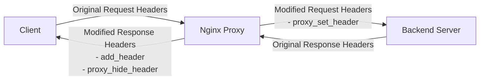

# Nginx Headers Modification

## Introduction

HTTP headers are an essential part of the communication between clients and servers. They provide metadata about the request or response, such as content type, caching instructions, security policies, and more. When using Nginx as a reverse proxy, you can modify these headers to enhance security, improve performance, or add custom functionality to your web applications.

In this guide, we'll explore how to add, modify, and remove HTTP headers using Nginx. Whether you're looking to implement security best practices, fix compatibility issues, or customize your application's behavior, understanding header modification in Nginx is a valuable skill for any web developer.

## Why Modify Headers?

There are several reasons you might want to modify HTTP headers in your Nginx configuration:

1. **Security enhancement** - Adding headers like `Content-Security-Policy` or `X-XSS-Protection` can protect your users from common web vulnerabilities
2. **Privacy protection** - Removing server information or other sensitive headers
3. **Browser compatibility** - Adding cross-origin headers for modern web applications
4. **Custom functionality** - Passing custom information between servers or to clients
5. **Caching optimization** - Modifying cache-control headers for better performance

## Basic Header Modifications

### Adding Custom Headers

To add a new header to responses, use the `add_header` directive in your Nginx configuration:

```nginx
server {
    listen 80;
    server_name example.com;
    
    location / {
        add_header X-Custom-Header "Hello World";
        proxy_pass http://backend;
    }
}
```

This configuration adds a custom header `X-Custom-Header` with the value "Hello World" to all responses from this location.

### Important Note About add_header

The `add_header` directive is **inherited but not cumulative**. If you define an `add_header` directive in a child block, it will override all `add_header` directives from parent blocks. For example:

```nginx
server {
    add_header X-Header-1 "Value 1";
    
    location / {
        add_header X-Header-2 "Value 2";
        # X-Header-1 will NOT be present in responses from this location
    }
}
```

To ensure all headers are included, you need to redeclare all headers in each block:

```nginx
server {
    add_header X-Header-1 "Value 1";
    
    location / {
        add_header X-Header-1 "Value 1";
        add_header X-Header-2 "Value 2";
    }
}
```

## Modifying Request Headers

When Nginx acts as a reverse proxy, you can modify headers sent to your backend servers using the `proxy_set_header` directive:

```nginx
server {
    listen 80;
    server_name example.com;
    
    location / {
        proxy_set_header Host $host;
        proxy_set_header X-Real-IP $remote_addr;
        proxy_set_header X-Forwarded-For $proxy_add_x_forwarded_for;
        proxy_set_header X-Forwarded-Proto $scheme;
        
        proxy_pass http://backend;
    }
}
```

This configuration:
- Sets the `Host` header to the requested host
- Adds the client's IP address in `X-Real-IP`
- Appends the client's IP to the `X-Forwarded-For` header
- Sends the protocol (http/https) in `X-Forwarded-Proto`

These headers help your backend server understand the original client request, which is essential when using a reverse proxy.

## Removing Headers

### Removing Response Headers

To remove headers sent by your backend server, use the `proxy_hide_header` directive:

```nginx
server {
    listen 80;
    server_name example.com;
    
    location / {
        proxy_hide_header X-Powered-By;
        proxy_hide_header Server;
        
        proxy_pass http://backend;
    }
}
```

This configuration removes the `X-Powered-By` and `Server` headers from responses, which can help improve security by hiding information about your technology stack.

### Removing Headers with Empty Values

Alternatively, you can use the `more_clear_headers` directive from the `headers-more-nginx-module`:

```nginx
http {
    more_clear_headers Server;
    more_clear_headers X-Powered-By;
    
    server {
        listen 80;
        server_name example.com;
        
        location / {
            proxy_pass http://backend;
        }
    }
}
```

Note: This requires the [headers-more-nginx-module](https://github.com/openresty/headers-more-nginx-module), which is not included in the standard Nginx installation.

## Security Headers Example

Here's a comprehensive example of adding security-related headers to your application:

```nginx
server {
    listen 80;
    server_name example.com;
    
    # Redirect to HTTPS
    return 301 https://$host$request_uri;
}

server {
    listen 443 ssl;
    server_name example.com;
    
    # SSL configuration (not shown for brevity)
    
    # Security headers
    add_header Strict-Transport-Security "max-age=31536000; includeSubDomains; preload" always;
    add_header X-Content-Type-Options "nosniff" always;
    add_header X-Frame-Options "SAMEORIGIN" always;
    add_header X-XSS-Protection "1; mode=block" always;
    add_header Referrer-Policy "strict-origin-when-cross-origin" always;
    add_header Content-Security-Policy "default-src 'self'; script-src 'self' 'unsafe-inline' https://trusted-cdn.com; style-src 'self' 'unsafe-inline' https://trusted-cdn.com; img-src 'self' data: https:; font-src 'self' https://trusted-cdn.com; connect-src 'self';" always;
    
    location / {
        proxy_pass http://backend;
        
        # Forward real IP and protocol
        proxy_set_header Host $host;
        proxy_set_header X-Real-IP $remote_addr;
        proxy_set_header X-Forwarded-For $proxy_add_x_forwarded_for;
        proxy_set_header X-Forwarded-Proto $scheme;
    }
}
```

This configuration:
1. Redirects all HTTP traffic to HTTPS
2. Adds HSTS header to ensure future connections use HTTPS
3. Prevents MIME type sniffing with `X-Content-Type-Options`
4. Prevents clickjacking with `X-Frame-Options`
5. Helps prevent XSS attacks with `X-XSS-Protection`
6. Controls referrer information with `Referrer-Policy`
7. Implements a Content Security Policy to restrict resource loading

## Conditional Header Modification

You can conditionally modify headers based on various factors:

```nginx
server {
    listen 80;
    server_name example.com;
    
    location / {
        # Only add the header for specific file types
        if ($request_uri ~* \.(jpg|jpeg|png|gif)$) {
            add_header Cache-Control "public, max-age=86400";
        }
        
        # Different cache control for CSS and JS
        if ($request_uri ~* \.(css|js)$) {
            add_header Cache-Control "public, max-age=604800";
        }
        
        proxy_pass http://backend;
    }
}
```

Note: Nginx recommends using `map` instead of `if` for better performance when possible:

```nginx
map $request_uri $cache_control {
    ~*\.(jpg|jpeg|png|gif)$ "public, max-age=86400";
    ~*\.(css|js)$           "public, max-age=604800";
    default                 "no-cache";
}

server {
    listen 80;
    server_name example.com;
    
    location / {
        add_header Cache-Control $cache_control;
        proxy_pass http://backend;
    }
}
```

## Visualizing Header Flow

Let's visualize how headers flow through an Nginx reverse proxy setup:



## Real-world Use Cases

### API Gateway Header Transformation

When using Nginx as an API gateway, you might need to transform authentication headers:

```nginx
server {
    listen 80;
    server_name api.example.com;
    
    location /api/ {
        # Convert Authorization header to an API key header
        if ($http_authorization) {
            set $api_key $http_authorization;
            rewrite ^(.*)$ $1 break;
        }
        
        proxy_set_header X-API-Key $api_key;
        proxy_set_header Authorization ""; # Remove original Authorization header
        
        proxy_pass http://api-backend;
    }
}
```

### Controlling CORS Headers

For web applications that need to support cross-origin requests:

```nginx
server {
    listen 80;
    server_name api.example.com;
    
    location /api/ {
        if ($request_method = 'OPTIONS') {
            add_header 'Access-Control-Allow-Origin' 'https://example.com';
            add_header 'Access-Control-Allow-Methods' 'GET, POST, OPTIONS';
            add_header 'Access-Control-Allow-Headers' 'DNT,User-Agent,X-Requested-With,If-Modified-Since,Cache-Control,Content-Type,Range,Authorization';
            add_header 'Access-Control-Max-Age' 1728000;
            add_header 'Content-Type' 'text/plain; charset=utf-8';
            add_header 'Content-Length' 0;
            return 204;
        }
        
        add_header 'Access-Control-Allow-Origin' 'https://example.com';
        add_header 'Access-Control-Allow-Methods' 'GET, POST, OPTIONS';
        add_header 'Access-Control-Allow-Headers' 'DNT,User-Agent,X-Requested-With,If-Modified-Since,Cache-Control,Content-Type,Range,Authorization';
        add_header 'Access-Control-Expose-Headers' 'Content-Length,Content-Range';
        
        proxy_pass http://api-backend;
    }
}
```

### Load Balancing with Custom Headers

When load balancing across multiple backends, you can add custom headers to track which server handled the request:

```nginx
upstream backend {
    server backend1.example.com;
    server backend2.example.com;
    server backend3.example.com;
}

server {
    listen 80;
    server_name example.com;
    
    location / {
        proxy_pass http://backend;
        
        # Add header showing which backend server handled the request
        add_header X-Backend-Server $upstream_addr;
        
        # Pass original client IP
        proxy_set_header X-Real-IP $remote_addr;
    }
}
```

## Common Issues and Solutions

### Headers Not Being Added

If your `add_header` directives seem to have no effect, remember:

1. The `add_header` directive is only applied to 2xx, 3xx, and 4xx response codes by default. To apply to all responses, use the `always` parameter:

```nginx
add_header X-Custom-Header "Value" always;
```

2. Check for `add_header` directives in child blocks that might be overriding parent directives.

### Managing Response Headers from Backends

Sometimes your backend server might send headers that conflict with what you want to send. To handle this:

1. Use `proxy_hide_header` to remove specific headers
2. For more complex cases, use the headers-more-nginx-module:

```nginx
# Remove all headers matching pattern
more_clear_headers 'X-*';

# Set a header regardless of backend
more_set_headers 'Server: MyCustomServer';
```

## Summary

In this guide, we've covered how to modify HTTP headers in Nginx:

- Adding response headers with `add_header`
- Modifying request headers with `proxy_set_header`
- Removing headers with `proxy_hide_header` or the headers-more-nginx-module
- Implementing security best practices with headers
- Creating conditional header rules
- Solving common header-related issues

Mastering header modification in Nginx gives you powerful control over the security, performance, and functionality of your web applications. With these techniques, you can create more robust, secure, and efficient web services.

## Practice Exercises

1. Set up an Nginx server that adds security headers to a simple static website.
2. Create a configuration that serves different cache headers based on file types.
3. Implement a CORS configuration for an API that allows requests only from specific domains.
4. Set up a reverse proxy that removes server information from responses.
5. Create a configuration that adds custom debugging headers only in a development environment.

## Further Reading

- [Nginx HTTP Core Module Documentation](https://nginx.org/en/docs/http/ngx_http_core_module.html)
- [OWASP Secure Headers Project](https://owasp.org/www-project-secure-headers/)
- [Mozilla Web Security Guidelines](https://infosec.mozilla.org/guidelines/web_security)
- [Headers-more-nginx-module Documentation](https://github.com/openresty/headers-more-nginx-module)