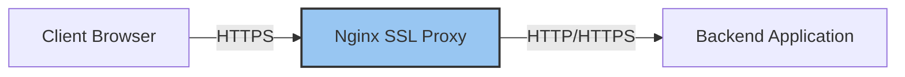

# Nginx SSL Proxying

## Introduction

SSL proxying with Nginx allows you to add a layer of encryption to your web applications, ensuring that data transmitted between clients and your server remains secure. This tutorial will guide you through setting up Nginx as an SSL proxy, which serves as an intermediary that handles encrypted HTTPS connections from clients while communicating with your backend applications.

SSL proxying is essential for modern web applications because it:
- Protects sensitive user data from eavesdropping
- Builds trust with your users
- Improves SEO rankings (Google favors HTTPS websites)
- Enables modern web features that require secure contexts

In this guide, you'll learn how to configure Nginx to handle SSL/TLS termination and proxy requests to your backend services.

## Prerequisites

Before getting started, you should have:
- A server with Nginx installed
- A domain name pointing to your server
- Basic familiarity with the Linux command line
- Basic understanding of Nginx configuration

## Understanding SSL Termination

SSL termination refers to the process where an SSL connection is ended (or "terminated") at the Nginx proxy before being forwarded to the backend application. This approach offers several benefits:



Benefits of SSL termination at the proxy level:
1. **Reduced backend load**: Your application servers don't need to handle the CPU-intensive SSL encryption/decryption
2. **Centralized certificate management**: Manage SSL certificates in one place
3. **Enhanced security**: Nginx can add additional security headers and protections
4. **Simplified application development**: Backend applications can focus on business logic

## Obtaining SSL Certificates

Before configuring Nginx, you need an SSL certificate. We'll use Let's Encrypt, a free certificate authority.

### Installing Certbot

```bash
# For Ubuntu/Debian
sudo apt update
sudo apt install certbot python3-certbot-nginx

# For CentOS/RHEL
sudo yum install certbot python3-certbot-nginx
```

### Obtaining a Certificate

```bash
sudo certbot --nginx -d yourdomain.com -d www.yourdomain.com
```

Follow the prompts, and Certbot will automatically obtain certificates and configure Nginx for you.

## Basic SSL Proxy Configuration

Here's a basic Nginx configuration for SSL proxying:

```nginx
server {
    listen 80;
    server_name yourdomain.com www.yourdomain.com;
    
    # Redirect all HTTP requests to HTTPS
    return 301 https://$host$request_uri;
}

server {
    listen 443 ssl;
    server_name yourdomain.com www.yourdomain.com;
    
    # SSL certificate paths
    ssl_certificate /etc/letsencrypt/live/yourdomain.com/fullchain.pem;
    ssl_certificate_key /etc/letsencrypt/live/yourdomain.com/privkey.pem;
    
    # SSL optimizations
    ssl_protocols TLSv1.2 TLSv1.3;
    ssl_prefer_server_ciphers on;
    ssl_ciphers ECDHE-ECDSA-AES128-GCM-SHA256:ECDHE-RSA-AES128-GCM-SHA256:ECDHE-ECDSA-AES256-GCM-SHA384:ECDHE-RSA-AES256-GCM-SHA384:DHE-RSA-AES128-GCM-SHA256:DHE-RSA-AES256-GCM-SHA384;
    ssl_session_cache shared:SSL:10m;
    ssl_session_timeout 10m;
    
    # Proxy settings
    location / {
        proxy_pass http://localhost:3000;  # Your backend application
        proxy_set_header Host $host;
        proxy_set_header X-Real-IP $remote_addr;
        proxy_set_header X-Forwarded-For $proxy_add_x_forwarded_for;
        proxy_set_header X-Forwarded-Proto $scheme;
    }
}
```

Let's break down this configuration:

1. The first `server` block redirects all HTTP traffic to HTTPS
2. The second `server` block handles HTTPS traffic and proxies it to your backend application
3. We specify SSL certificate paths and optimizations
4. The `proxy_pass` directive forwards requests to your backend application (in this case, running on localhost:3000)
5. We set headers to pass client information to the backend

Save this configuration to `/etc/nginx/sites-available/yourdomain.com` and create a symbolic link to enable it:

```bash
sudo ln -s /etc/nginx/sites-available/yourdomain.com /etc/nginx/sites-enabled/
sudo nginx -t  # Test configuration
sudo systemctl reload nginx  # Apply configuration
```

## Enhanced Security Headers

To further secure your application, add these security headers to your Nginx configuration:

```nginx
server {
    # ... existing SSL configuration ...
    
    # Security headers
    add_header Strict-Transport-Security "max-age=31536000; includeSubDomains" always;
    add_header X-Content-Type-Options "nosniff" always;
    add_header X-Frame-Options "SAMEORIGIN" always;
    add_header X-XSS-Protection "1; mode=block" always;
    add_header Referrer-Policy "strict-origin-when-cross-origin" always;
    
    # ... proxy configuration ...
}
```

These headers help protect against various attacks:
- **HSTS**: Forces browsers to use HTTPS for your domain
- **X-Content-Type-Options**: Prevents MIME type sniffing
- **X-Frame-Options**: Prevents your site from being embedded in iframes on other domains
- **X-XSS-Protection**: Activates browser XSS protection
- **Referrer-Policy**: Controls how much referrer information is sent

## SSL Performance Optimization

Optimize SSL performance with these additional settings:

```nginx
server {
    # ... existing configuration ...
    
    # Enable OCSP stapling
    ssl_stapling on;
    ssl_stapling_verify on;
    resolver 8.8.8.8 8.8.4.4 valid=300s;
    resolver_timeout 5s;
    
    # Diffie-Hellman parameter for DHE ciphersuites
    ssl_dhparam /etc/nginx/ssl/dhparam.pem;
}
```

Generate the DH parameters:

```bash
sudo mkdir -p /etc/nginx/ssl
sudo openssl dhparam -out /etc/nginx/ssl/dhparam.pem 2048
```

This might take a few minutes to complete.

## Proxying WebSockets with SSL

If your application uses WebSockets, add these directives to your configuration:

```nginx
server {
    # ... existing configuration ...
    
    location /websocket/ {
        proxy_pass http://localhost:3000;
        proxy_http_version 1.1;
        proxy_set_header Upgrade $http_upgrade;
        proxy_set_header Connection "upgrade";
        proxy_set_header Host $host;
        proxy_set_header X-Real-IP $remote_addr;
        proxy_set_header X-Forwarded-For $proxy_add_x_forwarded_for;
        proxy_set_header X-Forwarded-Proto $scheme;
    }
}
```

This configuration forwards WebSocket connections to your backend while maintaining the secure connection.

## Multiple Backend Applications

You can proxy multiple applications through a single SSL-enabled Nginx server:

```nginx
server {
    listen 443 ssl;
    server_name yourdomain.com;
    
    # ... SSL configuration ...
    
    # API service
    location /api/ {
        proxy_pass http://localhost:3001/;
        proxy_set_header Host $host;
        proxy_set_header X-Real-IP $remote_addr;
        proxy_set_header X-Forwarded-For $proxy_add_x_forwarded_for;
        proxy_set_header X-Forwarded-Proto $scheme;
    }
    
    # Frontend application
    location / {
        proxy_pass http://localhost:3000;
        proxy_set_header Host $host;
        proxy_set_header X-Real-IP $remote_addr;
        proxy_set_header X-Forwarded-For $proxy_add_x_forwarded_for;
        proxy_set_header X-Forwarded-Proto $scheme;
    }
}
```

This configuration routes traffic to different backend services based on the URL path.

## SSL Certificate Renewal

Let's Encrypt certificates expire after 90 days. Set up automatic renewal:

```bash
# Test renewal process
sudo certbot renew --dry-run

# Set up cron job for automatic renewal
echo "0 3 * * * certbot renew --quiet --post-hook 'systemctl reload nginx'" | sudo tee -a /etc/crontab
```

This cron job runs daily at 3 AM and reloads Nginx after certificate renewal.

## Troubleshooting SSL Issues

Here are some common issues and their solutions:

### Certificate Not Found

If Nginx can't find your certificate:

```
SSL_CTX_use_PrivateKey_file failed (SSL: error:0909006C:PEM routines:get_name:no start line:Expecting: ANY PRIVATE KEY)
```

**Solution**: Double-check certificate paths in your Nginx configuration.

### Mixed Content Warnings

If your page shows a padlock with a warning in the browser:

**Solution**: Find and fix resources loaded over HTTP instead of HTTPS:

```nginx
# Add this to your server block
add_header Content-Security-Policy "upgrade-insecure-requests" always;
```

### Connection Reset

If clients experience connection resets:

**Solution**: Check SSL protocol compatibility:

```nginx
# Modify to support older clients if needed
ssl_protocols TLSv1 TLSv1.1 TLSv1.2 TLSv1.3;
```

Note: Supporting TLSv1 and TLSv1.1 is not recommended due to security vulnerabilities.

## Real-World Example: Complete Configuration

Here's a complete example for a Node.js application with WebSockets behind Nginx SSL proxy:

```nginx
server {
    listen 80;
    server_name example.com www.example.com;
    return 301 https://$host$request_uri;
}

server {
    listen 443 ssl http2;
    server_name example.com www.example.com;
    
    # SSL configuration
    ssl_certificate /etc/letsencrypt/live/example.com/fullchain.pem;
    ssl_certificate_key /etc/letsencrypt/live/example.com/privkey.pem;
    ssl_protocols TLSv1.2 TLSv1.3;
    ssl_prefer_server_ciphers on;
    ssl_ciphers ECDHE-ECDSA-AES128-GCM-SHA256:ECDHE-RSA-AES128-GCM-SHA256:ECDHE-ECDSA-AES256-GCM-SHA384:ECDHE-RSA-AES256-GCM-SHA384:DHE-RSA-AES128-GCM-SHA256:DHE-RSA-AES256-GCM-SHA384;
    ssl_session_cache shared:SSL:10m;
    ssl_session_timeout 10m;
    ssl_stapling on;
    ssl_stapling_verify on;
    resolver 8.8.8.8 8.8.4.4 valid=300s;
    resolver_timeout 5s;
    ssl_dhparam /etc/nginx/ssl/dhparam.pem;
    
    # Security headers
    add_header Strict-Transport-Security "max-age=31536000; includeSubDomains; preload" always;
    add_header X-Content-Type-Options "nosniff" always;
    add_header X-Frame-Options "SAMEORIGIN" always;
    add_header X-XSS-Protection "1; mode=block" always;
    add_header Referrer-Policy "strict-origin-when-cross-origin" always;
    add_header Content-Security-Policy "upgrade-insecure-requests" always;
    
    # Optimization
    gzip on;
    gzip_vary on;
    gzip_proxied any;
    gzip_comp_level 6;
    gzip_types text/plain text/css application/json application/javascript text/xml application/xml application/xml+rss text/javascript;
    
    # Main application
    location / {
        proxy_pass http://localhost:3000;
        proxy_http_version 1.1;
        proxy_set_header Host $host;
        proxy_set_header X-Real-IP $remote_addr;
        proxy_set_header X-Forwarded-For $proxy_add_x_forwarded_for;
        proxy_set_header X-Forwarded-Proto $scheme;
        proxy_buffering off;
        proxy_cache off;
    }
    
    # WebSocket support
    location /socket.io/ {
        proxy_pass http://localhost:3000;
        proxy_http_version 1.1;
        proxy_set_header Upgrade $http_upgrade;
        proxy_set_header Connection "upgrade";
        proxy_set_header Host $host;
        proxy_set_header X-Real-IP $remote_addr;
        proxy_set_header X-Forwarded-For $proxy_add_x_forwarded_for;
        proxy_set_header X-Forwarded-Proto $scheme;
        proxy_cache_bypass $http_upgrade;
    }
    
    # Static assets with caching
    location /static/ {
        proxy_pass http://localhost:3000/static/;
        proxy_set_header Host $host;
        proxy_set_header X-Real-IP $remote_addr;
        proxy_set_header X-Forwarded-For $proxy_add_x_forwarded_for;
        proxy_set_header X-Forwarded-Proto $scheme;
        proxy_cache_valid 200 302 60m;
        proxy_cache_valid 404 1m;
        expires 30d;
        add_header Cache-Control "public, max-age=2592000";
    }
    
    # Error pages
    error_page 500 502 503 504 /50x.html;
    location = /50x.html {
        root /usr/share/nginx/html;
    }
}
```

This comprehensive configuration includes:
- HTTP to HTTPS redirection
- HTTP/2 support for improved performance
- Strong SSL ciphers and protocols
- Security headers
- WebSocket support
- Static asset caching
- Gzip compression
- Custom error pages

## Summary

In this tutorial, you've learned how to:
1. Set up Nginx as an SSL proxy
2. Obtain and configure SSL certificates from Let's Encrypt
3. Implement security best practices with HTTP security headers
4. Optimize SSL performance
5. Configure WebSocket support
6. Set up multiple backend applications
7. Automate certificate renewal
8. Troubleshoot common SSL issues

SSL proxying with Nginx provides a robust security layer for your web applications while allowing for flexible backend configurations. By implementing the techniques covered in this guide, you can ensure your applications are secure, performant, and ready for production use.

## Additional Resources

- [Nginx Official Documentation](https://nginx.org/en/docs/)
- [Let's Encrypt Documentation](https://letsencrypt.org/docs/)
- [Mozilla SSL Configuration Generator](https://ssl-config.mozilla.org/)

## Exercises

1. Set up an Nginx SSL proxy for a local development environment using self-signed certificates.
2. Configure Nginx to proxy requests to multiple backend services (e.g., a Node.js API and a React frontend).
3. Implement rate limiting to protect your SSL-enabled application from brute force attacks.
4. Use the Mozilla SSL Configuration Generator to create configurations for different security levels (modern, intermediate, old) and understand the differences.
5. Research and implement Content Security Policy (CSP) headers to further secure your application.