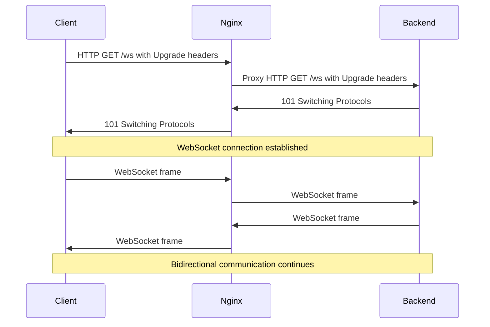

# Nginx WebSocket Proxying

## Introduction

WebSockets provide a powerful way to enable real-time, bidirectional communication between web clients and servers. Unlike traditional HTTP requests, WebSocket connections remain open, allowing for continuous data exchange without the overhead of establishing new connections for each message.

However, in many production environments, web applications are deployed behind reverse proxies like Nginx. This creates a challenge: how do we ensure WebSocket connections properly traverse the Nginx proxy layer to reach our application servers?

In this guide, we'll explore how to configure Nginx to act as a WebSocket proxy, allowing your real-time applications to function properly in a production environment.

## What are WebSockets?

Before diving into the Nginx configuration, let's briefly understand what WebSockets are:

WebSockets represent a communication protocol that provides full-duplex communication over a single TCP connection. Unlike HTTP, which follows a request-response pattern, WebSockets allow:

- Long-lived connections that stay open until explicitly closed
- Bidirectional communication where both client and server can initiate messages
- Low latency messaging suitable for real-time applications

WebSockets start as a standard HTTP request with an upgrade header, which then transitions to the WebSocket protocol if the server supports it.

## The WebSocket Handshake Challenge

The WebSocket protocol begins with a standard HTTP handshake that includes special headers to request a protocol upgrade:

```http
GET /chat HTTP/1.1
Host: example.com
Upgrade: websocket
Connection: Upgrade
Sec-WebSocket-Key: dGhlIHNhbXBsZSBub25jZQ==
Sec-WebSocket-Version: 13
```

When this request passes through Nginx configured as a traditional reverse proxy, the connection often fails because:

1. Standard HTTP proxy settings don't properly handle the protocol upgrade
2. Default timeout settings aren't appropriate for long-lived connections
3. Connection headers might be modified or removed

## Basic Nginx WebSocket Proxy Configuration

Let's start with a basic configuration that enables WebSocket proxying:

```nginx
server {
    listen 80;
    server_name example.com;

    location /socket/ {
        proxy_pass http://backend_server;
        proxy_http_version 1.1;
        proxy_set_header Upgrade $http_upgrade;
        proxy_set_header Connection "upgrade";
    }
}
```

The key elements here are:

- `proxy_http_version 1.1`: WebSocket requires HTTP/1.1
- `proxy_set_header Upgrade $http_upgrade`: Passes the Upgrade header from client to backend
- `proxy_set_header Connection "upgrade"`: Ensures the Connection header is set to "upgrade"

## Handling WebSocket Timeouts

WebSocket connections are long-lived, potentially remaining open for hours or days. Default Nginx timeout settings are typically configured for short HTTP requests, which can cause WebSocket connections to be prematurely closed.

To address this, add these directives:

```nginx
server {
    listen 80;
    server_name example.com;

    location /socket/ {
        proxy_pass http://backend_server;
        proxy_http_version 1.1;
        proxy_set_header Upgrade $http_upgrade;
        proxy_set_header Connection "upgrade";
        
        # WebSocket timeout settings
        proxy_read_timeout 3600s;
        proxy_send_timeout 3600s;
        proxy_connect_timeout 3600s;
    }
}
```

These timeout settings increase the connection lifetime to 1 hour (3600 seconds), which is more appropriate for WebSocket connections.

## Complete WebSocket Proxy Configuration

For a production-ready configuration, we'll need a few more settings to handle various edge cases and ensure proper client information is passed to the backend:

```nginx
map $http_upgrade $connection_upgrade {
    default upgrade;
    '' close;
}

server {
    listen 80;
    server_name example.com;

    location /socket/ {
        proxy_pass http://backend_server;
        
        # WebSocket headers
        proxy_http_version 1.1;
        proxy_set_header Upgrade $http_upgrade;
        proxy_set_header Connection $connection_upgrade;
        
        # Pass client information to backend
        proxy_set_header X-Real-IP $remote_addr;
        proxy_set_header X-Forwarded-For $proxy_add_x_forwarded_for;
        proxy_set_header Host $host;
        
        # WebSocket timeout settings
        proxy_read_timeout 3600s;
        proxy_send_timeout 3600s;
        proxy_connect_timeout 3600s;
        
        # Buffer settings
        proxy_buffer_size 16k;
        proxy_buffers 4 16k;
    }
}
```

This configuration introduces:

1. A `map` directive that sets `$connection_upgrade` to:
   - "upgrade" when `$http_upgrade` is present (WebSocket)
   - "close" when it's not (regular HTTP)

2. Additional headers to pass client information to the backend server

3. Buffer settings to handle larger WebSocket frames efficiently

## Real-World Example: Chat Application

Let's consider a real-world example of a chat application using WebSockets through Nginx. Assume we have:

- Frontend serving static files from `/var/www/html`
- Backend WebSocket server running on localhost port 8080
- WebSocket endpoint at `/ws/chat`

Here's how we would configure Nginx:

```nginx
server {
    listen 80;
    server_name chat.example.com;
    
    # Serve static files
    location / {
        root /var/www/html;
        index index.html;
        try_files $uri $uri/ /index.html;
    }
    
    # WebSocket proxy
    location /ws/ {
        proxy_pass http://localhost:8080;
        proxy_http_version 1.1;
        proxy_set_header Upgrade $http_upgrade;
        proxy_set_header Connection "upgrade";
        proxy_set_header Host $host;
        proxy_set_header X-Real-IP $remote_addr;
        proxy_set_header X-Forwarded-For $proxy_add_x_forwarded_for;
        
        proxy_read_timeout 3600s;
        proxy_send_timeout 3600s;
    }
}
```

With this configuration:

1. Regular HTTP requests for static content are served directly by Nginx
2. WebSocket connections to `/ws/` are proxied to the backend application
3. The WebSocket handshake and connection maintenance are properly handled

## Load Balancing WebSockets

For high-availability setups, you might need to distribute WebSocket connections across multiple backend servers. Here's how to configure WebSocket load balancing:

```nginx
upstream websocket_servers {
    server backend1.example.com:8080;
    server backend2.example.com:8080;
    server backend3.example.com:8080;
    
    # Use IP hash to ensure clients connect to same server
    ip_hash;
}

map $http_upgrade $connection_upgrade {
    default upgrade;
    '' close;
}

server {
    listen 80;
    server_name example.com;
    
    location /ws/ {
        proxy_pass http://websocket_servers;
        proxy_http_version 1.1;
        proxy_set_header Upgrade $http_upgrade;
        proxy_set_header Connection $connection_upgrade;
        proxy_set_header Host $host;
        
        proxy_read_timeout 3600s;
        proxy_send_timeout 3600s;
    }
}
```

Key points:

1. The `upstream` block defines a group of backend servers
2. `ip_hash` ensures that requests from the same client IP always go to the same backend server, which is crucial for WebSocket session persistence
3. Other load balancing methods like `least_conn` can be used, but session persistence should be considered

## Understanding WebSocket Connection Flow

To visualize how WebSocket connections flow through Nginx, here's a diagram:



## Troubleshooting WebSocket Connections

If you encounter issues with WebSocket connections, try these troubleshooting steps:

### 1. Check Nginx Error Logs

```bash
tail -f /var/log/nginx/error.log
```

### 2. Verify Connection Upgrade

Using browser developer tools or a tool like `curl`, check if the WebSocket handshake is properly occurring:

```bash
curl -v -N -H "Connection: Upgrade" -H "Upgrade: websocket" \
  -H "Sec-WebSocket-Key: SGVsbG8sIHdvcmxkIQ==" \
  -H "Sec-WebSocket-Version: 13" \
  http://example.com/ws/
```

### 3. Common Issues and Solutions

#### WebSocket connection closes unexpectedly:
- Increase timeout values with `proxy_read_timeout` and `proxy_send_timeout`
- Check if your backend application is sending ping/pong frames to keep the connection alive

#### 504 Gateway Timeout errors:
- Check backend server connectivity
- Increase `proxy_connect_timeout`

#### 400 Bad Request errors:
- Ensure WebSocket headers are correctly configured
- Verify your backend server supports WebSockets

## Security Considerations

When implementing WebSocket proxying, keep these security considerations in mind:

1. **Same-origin policy**: Configure your WebSocket server to validate the Origin header to prevent cross-site WebSocket hijacking

2. **Rate limiting**: Protect against DoS attacks by limiting the number of connections:

```nginx
# Limit connections per IP
limit_conn_zone $binary_remote_addr zone=conn_limit_per_ip:10m;

server {
    # Other configurations...
    
    location /ws/ {
        limit_conn conn_limit_per_ip 10;
        # Other proxy settings...
    }
}
```

3. **TLS/SSL**: Secure WebSocket connections using wss:// protocol:

```nginx
server {
    listen 443 ssl;
    server_name example.com;
    
    ssl_certificate /path/to/cert.pem;
    ssl_certificate_key /path/to/key.pem;
    
    # WebSocket proxy configuration...
}
```

## Summary

Nginx's WebSocket proxying capabilities allow you to:

1. Seamlessly integrate real-time WebSocket applications into your existing web infrastructure
2. Load balance WebSocket connections across multiple backend servers
3. Benefit from Nginx's performance and security features while maintaining WebSocket functionality

The key elements for successful WebSocket proxying with Nginx are:

- Setting proper HTTP upgrade headers
- Configuring appropriate timeouts for long-lived connections
- Ensuring session persistence when load balancing
- Considering security implications

By following this guide, you should now be able to configure Nginx to properly proxy WebSocket connections to your backend applications, enabling real-time capabilities in your web projects.

## Additional Resources

- [Official Nginx WebSocket Proxying Documentation](https://nginx.org/en/docs/http/websocket.html)
- [WebSocket Protocol RFC 6455](https://tools.ietf.org/html/rfc6455)
- [MDN WebSocket API Documentation](https://developer.mozilla.org/en-US/docs/Web/API/WebSockets_API)

## Exercises

1. Configure Nginx to proxy WebSocket connections to a local Node.js server running on port 3000
2. Implement a simple chat application using WebSockets and deploy it behind Nginx
3. Set up WebSocket load balancing with sticky sessions across three backend servers
4. Secure your WebSocket connections using SSL/TLS with Nginx
5. Implement rate limiting to prevent DoS attacks on your WebSocket endpoints