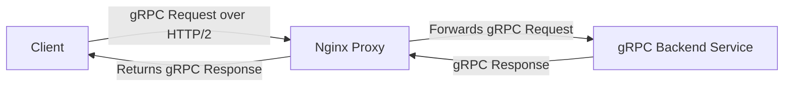

# Nginx gRPC Proxying

## Introduction

gRPC is a high-performance, open-source Remote Procedure Call (RPC) framework developed by Google. It enables client and server applications to communicate transparently and build connected systems. While gRPC offers numerous advantages including efficient binary serialization with Protocol Buffers and HTTP/2 support, deploying gRPC services directly to the internet isn't always ideal.

This is where Nginx comes in. Starting from version 1.13.10, Nginx provides native support for proxying gRPC services, allowing you to:

- Add an additional security layer in front of your gRPC services
- Load balance requests across multiple gRPC backend servers
- Terminate SSL/TLS connections
- Apply rate limiting and access controls

In this guide, we'll walk through configuring Nginx as a gRPC proxy, explore common configurations, and demonstrate real-world applications.

## Prerequisites

Before we begin, make sure you have:

- Nginx version 1.13.10 or higher installed (with HTTP/2 support)
- Basic understanding of gRPC concepts
- A running gRPC service to proxy requests to

## How gRPC Proxying Works

Let's first understand how gRPC proxying works with Nginx:



Unlike traditional HTTP requests, gRPC:
1. Uses HTTP/2 as its transport protocol
2. Transmits messages as binary Protocol Buffers
3. Maintains long-lived connections for streaming communication

Nginx is uniquely positioned to proxy these connections efficiently thanks to its HTTP/2 support.

## Basic Configuration

Let's start with a basic configuration to proxy gRPC requests:

```nginx
http {
    server {
        listen 80 http2;
        server_name grpc.example.com;

        location / {
            grpc_pass grpc://backend_grpc;
        }
    }

    upstream backend_grpc {
        server grpc_server1:50051;
    }
}
```

Key components of this configuration:

- **`listen 80 http2`**: Enables HTTP/2 protocol on port 80, which is required for gRPC
- **`grpc_pass`**: Directs Nginx to pass the request to the specified gRPC server
- **`upstream`**: Defines one or more backend gRPC servers

## Adding TLS/SSL Support

Since gRPC typically uses TLS for secure communication, let's enhance our configuration with SSL:

```nginx
http {
    server {
        listen 443 ssl http2;
        server_name grpc.example.com;

        ssl_certificate /path/to/cert.pem;
        ssl_certificate_key /path/to/key.pem;
        
        ssl_protocols TLSv1.2 TLSv1.3;
        ssl_ciphers HIGH:!aNULL:!MD5;
        ssl_prefer_server_ciphers on;

        location / {
            grpc_pass grpc://backend_grpc;
        }
    }

    upstream backend_grpc {
        server grpc_server1:50051;
    }
}
```

This configuration:
- Listens on port 443 with SSL and HTTP/2 enabled
- Specifies SSL certificate and key paths
- Configures secure TLS protocols and ciphers
- Passes gRPC requests to backend servers

## Load Balancing gRPC Servers

One of the key benefits of using Nginx as a gRPC proxy is load balancing capabilities:

```nginx
http {
    upstream backend_grpc {
        server grpc_server1:50051;
        server grpc_server2:50051;
        server grpc_server3:50051;
    }

    server {
        listen 443 ssl http2;
        server_name grpc.example.com;

        ssl_certificate /path/to/cert.pem;
        ssl_certificate_key /path/to/key.pem;

        location / {
            grpc_pass grpc://backend_grpc;
        }
    }
}
```

By default, Nginx uses a round-robin algorithm for load balancing. You can modify this behavior with parameters like:

```nginx
upstream backend_grpc {
    server grpc_server1:50051 weight=3;
    server grpc_server2:50051;
    server grpc_server3:50051 backup;
}
```

Where:
- `weight=3` means server1 gets 3x more requests
- `backup` means server3 only receives requests when others are unavailable

## Advanced Configuration Options

### Timeout Settings

gRPC connections can be long-lived, especially for streaming calls. Configure appropriate timeouts:

```nginx
location / {
    grpc_pass grpc://backend_grpc;
    
    grpc_read_timeout 1h;
    grpc_send_timeout 1h;
    grpc_connect_timeout 10s;
}
```

### Error Handling

Handle gRPC errors gracefully:

```nginx
location / {
    grpc_pass grpc://backend_grpc;
    
    error_page 502 504 /error;
    grpc_intercept_errors on;
}

location = /error {
    internal;
    default_type application/grpc;
    return 200 "";
}
```

The `grpc_intercept_errors on` directive allows Nginx to intercept and handle backend errors, which is useful for custom error responses.

### Path-Based Routing

Direct different gRPC services to specific backends:

```nginx
server {
    listen 443 ssl http2;
    server_name api.example.com;
    
    # User service
    location /user.UserService/ {
        grpc_pass grpc://user_service_backend;
    }
    
    # Product service
    location /product.ProductService/ {
        grpc_pass grpc://product_service_backend;
    }
}
```

This setup allows you to route different gRPC service requests to their specific backend servers.

## Real-World Example: Microservices Architecture

Let's look at a complete real-world example of using Nginx to proxy gRPC in a microservices architecture:

```nginx
http {
    # User service backends
    upstream user_service {
        server user-svc-1:50051;
        server user-svc-2:50051;
        keepalive 32;
    }
    
    # Order service backends
    upstream order_service {
        server order-svc-1:50051;
        server order-svc-2:50051;
        keepalive 32;
    }
    
    # Product service backends
    upstream product_service {
        server product-svc-1:50051;
        server product-svc-2:50051;
        keepalive 32;
    }
    
    server {
        listen 443 ssl http2;
        server_name api.example.com;
        
        ssl_certificate /etc/nginx/ssl/api.example.com.crt;
        ssl_certificate_key /etc/nginx/ssl/api.example.com.key;
        
        # Common SSL settings
        ssl_protocols TLSv1.2 TLSv1.3;
        ssl_prefer_server_ciphers on;
        ssl_session_cache shared:SSL:10m;
        ssl_session_timeout 10m;
        
        # User Service
        location /user.UserService/ {
            grpc_pass grpc://user_service;
            
            # Logging
            access_log /var/log/nginx/user_service_access.log;
            error_log /var/log/nginx/user_service_error.log;
            
            # Timeouts
            grpc_read_timeout 60s;
            grpc_connect_timeout 5s;
            
            # Client buffer
            grpc_buffer_size 16k;
            
            # Headers
            grpc_set_header X-Real-IP $remote_addr;
        }
        
        # Order Service
        location /order.OrderService/ {
            grpc_pass grpc://order_service;
            
            # Logging
            access_log /var/log/nginx/order_service_access.log;
            error_log /var/log/nginx/order_service_error.log;
            
            # Timeouts
            grpc_read_timeout 60s;
            grpc_connect_timeout 5s;
            
            # Rate limiting
            limit_req zone=api_limit burst=20 nodelay;
        }
        
        # Product Service
        location /product.ProductService/ {
            grpc_pass grpc://product_service;
            
            # Logging
            access_log /var/log/nginx/product_service_access.log;
            error_log /var/log/nginx/product_service_error.log;
            
            # Timeouts
            grpc_read_timeout 60s;
            grpc_connect_timeout 5s;
        }
    }
    
    # Rate limiting configuration
    limit_req_zone $binary_remote_addr zone=api_limit:10m rate=10r/s;
}
```

In this example, we:
1. Define three different gRPC backend services
2. Configure path-based routing for each service
3. Apply service-specific settings like logging and timeouts
4. Implement rate limiting for the Order service
5. Set headers to pass client information to the backends

## Troubleshooting gRPC Proxying

Here are common issues and solutions when working with Nginx gRPC proxying:

### Issue 1: "upstream prematurely closed connection"

**Solution**: Increase timeout values for long-lived connections:

```nginx
location / {
    grpc_pass grpc://backend;
    grpc_read_timeout 300s;
    grpc_send_timeout 300s;
}
```

### Issue 2: "upstream connect error or disconnect/reset before headers"

**Solution**: Ensure your backend gRPC service is running and accessible:

```bash
# Test direct connectivity to backend
grpcurl -plaintext backend_server:50051 list
```

### Issue 3: "http2 protocol error: protocol error"

**Solution**: Ensure HTTP/2 is properly enabled on both Nginx and the backend:

```nginx
server {
    listen 443 ssl http2;  # Make sure http2 is specified
    # ...
}
```

## Performance Tuning

To optimize your Nginx gRPC proxy:

```nginx
# Worker configuration
worker_processes auto;
worker_rlimit_nofile 65535;

events {
    worker_connections 10240;
    multi_accept on;
    use epoll;
}

http {
    # Keep-alive connections
    keepalive_timeout 65;
    keepalive_requests 1000;
    
    # Buffer settings
    grpc_buffer_size 16k;
    
    # HTTP/2 settings
    http2_max_concurrent_streams 128;
    http2_idle_timeout 3m;
    
    upstream backend_grpc {
        server grpc_server1:50051;
        server grpc_server2:50051;
        keepalive 32;  # Keep connections to backends
    }
    
    # Rest of configuration...
}
```

These settings:
- Optimize worker processes based on CPU cores
- Increase file descriptor limits
- Configure HTTP/2 parameters for better performance
- Maintain persistent connections to backend servers

## Summary

In this guide, we've learned how to:

1. Configure Nginx as a gRPC proxy
2. Set up SSL/TLS encryption for secure communication
3. Implement load balancing across multiple gRPC backends
4. Apply advanced configurations like path-based routing and error handling
5. Deploy a real-world microservices architecture with gRPC and Nginx
6. Troubleshoot common issues
7. Optimize Nginx for gRPC performance

Nginx's gRPC proxying capabilities make it an excellent choice for deploying gRPC services in production environments, offering security, scalability, and manageability benefits.

## Additional Resources

To deepen your understanding of Nginx gRPC proxying:

- Explore the official [Nginx gRPC module documentation](https://nginx.org/en/docs/http/ngx_http_grpc_module.html)
- Learn more about [gRPC concepts](https://grpc.io/docs/what-is-grpc/introduction/)
- Study HTTP/2 protocol which powers gRPC communication

## Practice Exercises

1. Set up a basic gRPC service and configure Nginx to proxy requests to it
2. Implement load balancing across multiple gRPC backend instances
3. Configure path-based routing for different gRPC services
4. Experiment with various timeout settings to understand their impact
5. Implement rate limiting for your gRPC services