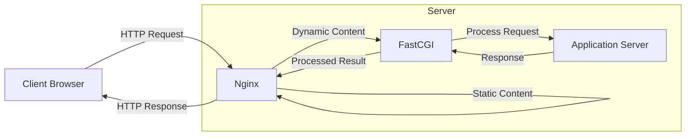

# Nginx FastCGI Proxying

## Introduction

When building modern web applications, you'll often need to serve both static content (like HTML, CSS, and images) and dynamic content (generated by programming languages like PHP, Python, or Ruby). Nginx excels at serving static content efficiently, but to handle dynamic content, it needs to communicate with application servers.

This is where FastCGI comes in. FastCGI (Fast Common Gateway Interface) is a protocol that allows a web server like Nginx to communicate with application servers running various programming languages. By setting up Nginx as a FastCGI proxy, you can:

- Improve performance by offloading dynamic content processing
- Handle more concurrent connections
- Separate concerns between web serving and application logic
- Create a scalable architecture where each component does what it does best

In this guide, we'll explore how to configure Nginx as a FastCGI proxy, focusing primarily on PHP as it's the most common use case, but also covering other languages.

## Understanding FastCGI

### What is FastCGI?

FastCGI is an improved version of the older CGI (Common Gateway Interface) protocol. While CGI creates a new process for each request (which is resource-intensive), FastCGI maintains persistent processes to handle multiple requests, making it much more efficient.

### How FastCGI Works with Nginx



When a request comes in:

1. Nginx determines if the request is for static or dynamic content
2. Static content is served directly by Nginx
3. Dynamic content requests are passed to the FastCGI process
4. The FastCGI process communicates with the application server (PHP-FPM, etc.)
5. The application processes the request and returns the result
6. Nginx sends the final response to the client

## Configuring Nginx with PHP-FPM

PHP-FPM (PHP FastCGI Process Manager) is the most common FastCGI implementation for PHP. Let's set up Nginx to work with PHP-FPM.

### Installing Required Components

First, ensure you have Nginx and PHP-FPM installed:

```bash
# For Ubuntu/Debian
sudo apt update
sudo apt install nginx php-fpm

# For CentOS/RHEL
sudo yum install nginx php-fpm
```

### Basic Configuration

Here's a basic Nginx server block configuration for PHP:

```nginx
server {
    listen 80;
    server_name example.com www.example.com;
    root /var/www/html;
    index index.php index.html index.htm;

    # Process PHP files
    location ~ \.php$ {
        try_files $uri =404;
        
        # FastCGI configuration
        fastcgi_pass unix:/var/run/php/php8.1-fpm.sock;  # Socket path (adjust version)
        # Alternatively, use TCP connection
        # fastcgi_pass 127.0.0.1:9000;
        
        fastcgi_index index.php;
        fastcgi_param SCRIPT_FILENAME $document_root$fastcgi_script_name;
        include fastcgi_params;
    }

    # Deny access to .htaccess files
    location ~ /\.ht {
        deny all;
    }
}
```

Let's break down the key FastCGI-related directives:

- `fastcgi_pass`: Specifies where to pass FastCGI requests (either a Unix socket or TCP address)
- `fastcgi_index`: Sets the default index file
- `fastcgi_param`: Sets FastCGI parameters, with SCRIPT_FILENAME being the most important
- `include fastcgi_params`: Includes the standard FastCGI parameters file

### Understanding fastcgi_params

The `fastcgi_params` file contains common FastCGI parameters. Here's what a typical `fastcgi_params` file looks like:

```nginx
fastcgi_param  QUERY_STRING       $query_string;
fastcgi_param  REQUEST_METHOD     $request_method;
fastcgi_param  CONTENT_TYPE       $content_type;
fastcgi_param  CONTENT_LENGTH     $content_length;

fastcgi_param  SCRIPT_NAME        $fastcgi_script_name;
fastcgi_param  REQUEST_URI        $request_uri;
fastcgi_param  DOCUMENT_URI       $document_uri;
fastcgi_param  DOCUMENT_ROOT      $document_root;
fastcgi_param  SERVER_PROTOCOL    $server_protocol;
fastcgi_param  REQUEST_SCHEME     $scheme;

fastcgi_param  GATEWAY_INTERFACE  CGI/1.1;
fastcgi_param  SERVER_SOFTWARE    nginx/$nginx_version;

fastcgi_param  REMOTE_ADDR        $remote_addr;
fastcgi_param  REMOTE_PORT        $remote_port;
fastcgi_param  SERVER_ADDR        $server_addr;
fastcgi_param  SERVER_PORT        $server_port;
fastcgi_param  SERVER_NAME        $server_name;
```

These parameters pass important information about the request to the FastCGI application.

## Advanced FastCGI Configuration

### Configuring Buffers and Timeouts

For better performance and stability, you can configure FastCGI buffers and timeouts:

```nginx
# In the http, server, or location context
fastcgi_buffers 16 16k;
fastcgi_buffer_size 32k;
fastcgi_connect_timeout 60s;
fastcgi_send_timeout 60s;
fastcgi_read_timeout 60s;
```

- `fastcgi_buffers`: Sets the number and size of buffers for FastCGI responses
- `fastcgi_buffer_size`: Sets the size of the buffer for the FastCGI response header
- `fastcgi_connect_timeout`: Sets a timeout for establishing a connection with a FastCGI server
- `fastcgi_send_timeout`: Sets a timeout for transmitting a request to the FastCGI server
- `fastcgi_read_timeout`: Sets a timeout for reading a response from the FastCGI server

### Handling PHP in Non-Standard Locations

Sometimes you need to process PHP files that don't end with `.php`. For example, in clean URL structures:

```nginx
location / {
    try_files $uri $uri/ /index.php?$args;
}

location ~ \.php$ {
    try_files $uri =404;
    fastcgi_pass unix:/var/run/php/php8.1-fpm.sock;
    fastcgi_index index.php;
    fastcgi_param SCRIPT_FILENAME $document_root$fastcgi_script_name;
    include fastcgi_params;
}
```

This configuration first tries to serve the requested file, then tries to serve it as a directory, and finally passes the request to `index.php` with the original query parameters.

### Implementing FastCGI Caching

One of the major benefits of using Nginx as a FastCGI proxy is the ability to cache dynamic content:

```nginx
# Define cache zone in http context
fastcgi_cache_path /var/cache/nginx levels=1:2 keys_zone=MYAPP:100m inactive=60m;
fastcgi_cache_key "$scheme$request_method$host$request_uri";

server {
    # Server configuration
    
    # Enable caching in specific location
    location ~ \.php$ {
        fastcgi_pass unix:/var/run/php/php8.1-fpm.sock;
        fastcgi_index index.php;
        fastcgi_param SCRIPT_FILENAME $document_root$fastcgi_script_name;
        include fastcgi_params;
        
        # Caching settings
        fastcgi_cache MYAPP;
        fastcgi_cache_valid 200 60m;
        fastcgi_cache_methods GET HEAD;
        
        # Optional: Add cache status to response headers
        add_header X-Cache-Status $upstream_cache_status;
    }
}
```

- `fastcgi_cache_path`: Defines where and how to store the cache
- `fastcgi_cache_key`: Defines what makes a cached response unique
- `fastcgi_cache`: Specifies which cache zone to use
- `fastcgi_cache_valid`: Sets how long to cache responses by status code
- `fastcgi_cache_methods`: Specifies which HTTP methods to cache

### Bypassing Cache for Certain Conditions

Sometimes you want to bypass the cache for certain conditions, like logged-in users:

```nginx
# Define cache bypass conditions
map $cookie_sessionid $skip_cache {
    default 0;
    ~.+ 1;
}

server {
    # Server configuration
    
    location ~ \.php$ {
        # FastCGI configuration
        
        # Cache bypass
        fastcgi_cache_bypass $skip_cache;
        fastcgi_no_cache $skip_cache;
    }
}
```

- `fastcgi_cache_bypass`: Defines when to bypass reading from cache
- `fastcgi_no_cache`: Defines when to bypass writing to cache

## Using FastCGI with Other Languages

### Python with uWSGI

For Python applications, uWSGI is a popular application server that supports FastCGI:

```nginx
server {
    listen 80;
    server_name python-app.example.com;
    
    location / {
        include uwsgi_params;
        uwsgi_pass unix:/tmp/uwsgi.sock;
        # Alternative TCP connection:
        # uwsgi_pass 127.0.0.1:8000;
    }
}
```

You would run your uWSGI server like this:

```bash
uwsgi --socket /tmp/uwsgi.sock --wsgi-file app.py --callable app --processes 4 --threads 2
```

### Ruby with Passenger

For Ruby applications, Phusion Passenger integrates with Nginx:

```nginx
server {
    listen 80;
    server_name ruby-app.example.com;
    root /var/www/ruby-app/public;
    
    passenger_enabled on;
    passenger_ruby /usr/bin/ruby;
}
```

## Real-World Example: WordPress with FastCGI

WordPress is one of the most popular PHP applications. Here's a real-world Nginx configuration for WordPress using FastCGI:

```nginx
server {
    listen 80;
    server_name wordpress.example.com;
    root /var/www/wordpress;
    index index.php;

    # Handle WordPress permalinks
    location / {
        try_files $uri $uri/ /index.php?$args;
    }

    # Process PHP files with FastCGI
    location ~ \.php$ {
        try_files $uri =404;
        fastcgi_pass unix:/var/run/php/php8.1-fpm.sock;
        fastcgi_index index.php;
        fastcgi_param SCRIPT_FILENAME $document_root$fastcgi_script_name;
        include fastcgi_params;
        
        # Basic caching
        fastcgi_cache_bypass $skip_cache;
        fastcgi_no_cache $skip_cache;
        fastcgi_cache WORDPRESS;
        fastcgi_cache_valid 200 60m;
    }
    
    # Deny access to sensitive files
    location ~ /\.(ht|git) {
        deny all;
    }
    
    # Don't cache WP admin or login pages
    set $skip_cache 0;
    if ($request_uri ~* "/wp-admin/|/wp-login.php") {
        set $skip_cache 1;
    }
    if ($http_cookie ~* "comment_author|wordpress_[a-f0-9]+|wp-postpass|wordpress_logged_in") {
        set $skip_cache 1;
    }
}
```

This configuration:
1. Handles WordPress's permalink structure
2. Processes PHP files through FastCGI
3. Implements caching with exceptions for admin pages and logged-in users
4. Protects sensitive files

## Troubleshooting FastCGI Issues

### Common Issues and Solutions

1. **"File not found" or 404 errors**:
   - Ensure the `fastcgi_param SCRIPT_FILENAME` is correct
   - Check file permissions on PHP scripts
   - Verify the `try_files` directive is properly configured

2. **"Bad Gateway" or 502 errors**:
   - Check if the PHP-FPM service is running: `systemctl status php8.1-fpm`
   - Verify the socket path or TCP address in `fastcgi_pass`
   - Check PHP-FPM error logs

3. **Timeout issues**:
   - Increase timeout values with `fastcgi_read_timeout`, `fastcgi_send_timeout`
   - Check for long-running PHP scripts

4. **Caching issues**:
   - Ensure the cache directory exists and is writable by Nginx
   - Verify cache key and conditions are configured correctly

### Debugging with FastCGI

To debug FastCGI issues, you can add custom headers to see what's happening:

```nginx
location ~ \.php$ {
    # Regular FastCGI configuration
    
    # Debugging headers
    add_header X-Script-Filename $document_root$fastcgi_script_name;
    add_header X-Path-Info $fastcgi_path_info;
    add_header X-Cache-Status $upstream_cache_status;
}
```

## Best Practices for FastCGI Proxying

1. **Use Unix sockets over TCP** when the FastCGI service is on the same server for better performance
2. **Implement caching** for frequently accessed dynamic content
3. **Configure appropriate buffer sizes** based on your application's needs
4. **Set reasonable timeouts** to prevent hanging connections
5. **Regularly monitor and adjust** FastCGI settings based on server load
6. **Use `try_files`** to ensure the requested PHP file exists before passing to FastCGI
7. **Secure sensitive files** by denying direct access
8. **Separate FastCGI configurations** into included files for better organization

## Summary

Nginx FastCGI proxying provides an efficient way to serve dynamic content from various application servers. By configuring Nginx as a FastCGI proxy, you can:

- Efficiently process dynamic content from PHP, Python, Ruby, and other languages
- Improve performance through persistent connections and caching
- Create a robust and scalable web architecture where each component handles what it does best

The key components we've covered include:
- Basic FastCGI configuration with PHP-FPM
- Advanced configurations with buffers, timeouts, and caching
- Using FastCGI with different programming languages
- Real-world examples and troubleshooting techniques

With these tools and techniques, you can effectively configure Nginx to work with FastCGI applications, creating high-performance web services.

## Further Learning

To deepen your understanding of Nginx FastCGI proxying, consider exploring these topics:

1. **Micro-caching techniques** for high-traffic dynamic sites
2. **Load balancing multiple FastCGI backends** for increased reliability
3. **FastCGI process management** and tuning for different workloads
4. **Security hardening** for FastCGI applications

### Exercises

1. Set up a basic PHP website with Nginx and PHP-FPM
2. Implement FastCGI caching and measure performance improvements
3. Configure Nginx to handle a Python web application through FastCGI
4. Troubleshoot and resolve common FastCGI issues in a test environment