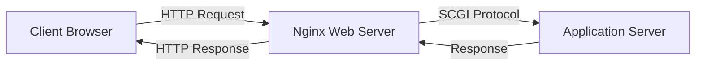

# Nginx SCGI Proxying

## Introduction

SCGI (Simple Common Gateway Interface) is a protocol that works as an alternative to the traditional CGI protocol, allowing web servers to communicate with application servers. SCGI was designed to address performance limitations in CGI while maintaining simplicity. Nginx's SCGI proxying capability enables it to pass requests to SCGI-compatible application servers, making it an essential tool in modern web architecture.

In this guide, we'll explore how to configure Nginx as an SCGI proxy, understand the core concepts, and implement practical examples suitable for real-world applications.

## What is SCGI?

SCGI (Simple Common Gateway Interface) is a protocol that defines how a web server communicates with application servers. It was created as a more efficient alternative to the traditional CGI protocol, with the following advantages:

- **Performance**: Unlike CGI, SCGI doesn't create a new process for each request
- **Simplicity**: Simpler than FastCGI, making it easier to implement
- **Persistence**: Application servers stay running, eliminating startup overhead



## How Nginx SCGI Proxying Works

When Nginx receives an HTTP request that needs to be processed by an application server, it can forward this request using the SCGI protocol. Here's the basic flow:

1. Client sends an HTTP request to Nginx
2. Nginx determines the request should be handled by an SCGI application server
3. Nginx translates the HTTP request into an SCGI request
4. The application server processes the request and returns a response
5. Nginx forwards the response back to the client

## Basic SCGI Configuration in Nginx

To configure Nginx to work as an SCGI proxy, you'll need to use the `scgi_pass` directive. Here's a basic configuration:

```nginx
server {
    listen 80;
    server_name example.com;

    location / {
        scgi_pass localhost:4000;
        include scgi_params;
    }
}
```

The `scgi_pass` directive tells Nginx where to find the SCGI server, and the `include scgi_params` loads default SCGI parameters.

The `scgi_params` file typically contains:

```nginx
scgi_param  REQUEST_METHOD     $request_method;
scgi_param  REQUEST_URI        $request_uri;
scgi_param  QUERY_STRING       $query_string;
scgi_param  CONTENT_TYPE       $content_type;
scgi_param  CONTENT_LENGTH     $content_length;
scgi_param  DOCUMENT_URI       $document_uri;
scgi_param  DOCUMENT_ROOT      $document_root;
scgi_param  SERVER_PROTOCOL    $server_protocol;
scgi_param  SERVER_SOFTWARE    nginx/$nginx_version;
scgi_param  REMOTE_ADDR        $remote_addr;
scgi_param  REMOTE_PORT        $remote_port;
scgi_param  SERVER_ADDR        $server_addr;
scgi_param  SERVER_PORT        $server_port;
scgi_param  SERVER_NAME        $server_name;
```

## Using Unix Sockets for SCGI

Instead of using TCP ports, you can use Unix sockets for SCGI communication, which can provide better performance, especially on the same machine:

```nginx
server {
    listen 80;
    server_name example.com;

    location / {
        scgi_pass unix:/var/run/scgi_app.sock;
        include scgi_params;
    }
}
```

## Configuring SCGI Buffering

Nginx provides configuration options to control buffering of responses from SCGI servers:

```nginx
server {
    listen 80;
    server_name example.com;

    location / {
        scgi_pass localhost:4000;
        include scgi_params;
        
        scgi_buffering on;
        scgi_buffers 8 16k;
        scgi_buffer_size 32k;
    }
}
```

These directives control:
- `scgi_buffering`: Enables or disables buffering of responses
- `scgi_buffers`: Sets the number and size of buffers
- `scgi_buffer_size`: Sets the size of the buffer for the first part of the response

## Practical Example: Connecting to a Python SCGI Application

Here's a complete example of setting up Nginx with a Python-based SCGI application server:

### Step 1: Create a simple Python SCGI application

First, let's create a simple Python SCGI application. You'll need to install the Python SCGI module:

```bash
pip install scgi
```

Then create a file named `scgi_app.py`:

```python
from scgi.scgi_server import SCGIServer
import time

class SCGIHandler:
    def __init__(self):
        pass
        
    def handle_request(self, env, read, write):
        # Print the current time
        current_time = time.strftime("%Y-%m-%d %H:%M:%S")
        
        # Prepare HTTP response
        write("Status: 200 OK\r")
        write("Content-Type: text/html\r\r")
        
        # Write response body
        write(f"""
        <!DOCTYPE html>
        <html>
        <head>
            <title>SCGI Example</title>
        </head>
        <body>
            <h1>Hello from SCGI!</h1>
            <p>Current server time is: {current_time}</p>
            <p>Request path: {env.get('REQUEST_URI', 'Unknown')}</p>
        </body>
        </html>
        """)

if __name__ == "__main__":
    server = SCGIServer(
        handler_class=SCGIHandler,
        host='127.0.0.1',
        port=4000
    )
    print("Starting SCGI server on port 4000...")
    server.serve()
```

### Step 2: Configure Nginx to proxy requests to the SCGI server

Create or modify your Nginx configuration:

```nginx
server {
    listen 80;
    server_name example.local;  # Use your server name

    location / {
        scgi_pass 127.0.0.1:4000;
        include scgi_params;
    }
    
    # Serve static files directly
    location /static/ {
        alias /path/to/static/files/;
    }
}
```

### Step 3: Start the SCGI application and reload Nginx

```bash
# Start the Python SCGI application
python scgi_app.py

# Reload Nginx
sudo systemctl reload nginx
```

Now, when you visit `http://example.local` in your browser, Nginx will forward the request to your SCGI application, which will return the HTML page with the current time.

## Advanced SCGI Configuration

### Timeouts

Setting appropriate timeouts is important for reliable operation:

```nginx
server {
    listen 80;
    server_name example.com;

    location / {
        scgi_pass localhost:4000;
        include scgi_params;
        
        scgi_connect_timeout 60s;
        scgi_send_timeout 60s;
        scgi_read_timeout 60s;
    }
}
```

### Load Balancing SCGI Servers

You can distribute traffic across multiple SCGI servers for load balancing:

```nginx
upstream scgi_servers {
    server 127.0.0.1:4000;
    server 127.0.0.1:4001;
    server 127.0.0.1:4002;
}

server {
    listen 80;
    server_name example.com;

    location / {
        scgi_pass scgi_servers;
        include scgi_params;
    }
}
```

### Custom SCGI Parameters

You can pass custom parameters to your SCGI application:

```nginx
server {
    listen 80;
    server_name example.com;

    location / {
        scgi_pass localhost:4000;
        include scgi_params;
        
        # Custom parameters
        scgi_param CUSTOM_HEADER "Custom Value";
        scgi_param ENVIRONMENT "production";
    }
}
```

## SCGI vs. FastCGI vs. uWSGI

It's helpful to understand how SCGI compares to other similar protocols:

| Feature | SCGI | FastCGI | uWSGI |
|---------|------|---------|-------|
| Complexity | Low | Medium | High |
| Performance | Good | Good | Excellent |
| Adoption | Limited | Widespread | Growing |
| Multiplexing | No | Yes | Yes |
| Language Support | Limited | Extensive | Extensive |

SCGI is generally simpler than FastCGI but offers fewer features. It's a good choice when simplicity is valued over advanced features.

## Troubleshooting SCGI Proxying

When working with SCGI proxying, you might encounter various issues. Here are some common problems and solutions:

### Connection Refused

If Nginx reports "connection refused," it likely means the SCGI application server isn't running or isn't listening on the expected address/port.

Check if your SCGI application is running:
```bash
ps aux | grep scgi
```

Verify that it's listening on the correct port:
```bash
netstat -tulpn | grep 4000
```

### 502 Bad Gateway

A 502 error usually means Nginx can connect to the SCGI server, but the response from the SCGI server was invalid.

Check your SCGI application logs for errors and make sure it's correctly formatting the SCGI response.

### Slow Performance

If you're experiencing slow performance, consider:

1. Adjusting buffer sizes
2. Checking for resource constraints
3. Using Unix sockets instead of TCP for local communication
4. Implementing load balancing for high-traffic scenarios

## Summary

Nginx SCGI proxying provides a powerful way to connect Nginx with application servers using the SCGI protocol. It offers several advantages:

- Improved performance over traditional CGI
- Simplicity compared to other protocols
- Flexibility in application server choice
- Load balancing capabilities
- Efficient resource use

By understanding how to configure SCGI proxying in Nginx, you can create robust web architectures that efficiently handle dynamic content processing.

## Additional Resources

- [Nginx Official Documentation on SCGI](https://nginx.org/en/docs/http/ngx_http_scgi_module.html)
- [SCGI Protocol Specification](https://python.ca/scgi/protocol.txt)
- [Python SCGI Module](https://pypi.org/project/scgi/)

## Exercises

1. Set up a basic SCGI server in your preferred programming language and configure Nginx to proxy requests to it.
2. Modify the Nginx configuration to use Unix sockets instead of TCP ports.
3. Implement a load-balanced SCGI setup with multiple application servers.
4. Configure different locations in Nginx to route to different SCGI applications based on URL patterns.
5. Add custom SCGI parameters and modify your application to use them.