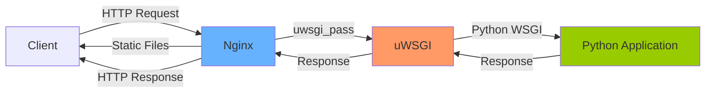

# Nginx uWSGI Proxying

## Introduction

When deploying Python web applications (like those built with Django or Flask), you'll often need to set up a production-ready environment that's secure, performant, and scalable. This is where the combination of Nginx and uWSGI comes into play.

uWSGI is an application server that can run Python web applications, while Nginx is a powerful web server that can act as a reverse proxy. Together, they create a robust setup where Nginx handles client requests and forwards them to your Python application running under uWSGI.

In this guide, we'll learn how to set up Nginx as a reverse proxy for uWSGI applications, allowing you to:

- Improve performance through buffering and caching
- Enhance security by not exposing your application server directly
- Handle SSL/TLS termination
- Serve static files efficiently
- Enable load balancing across multiple uWSGI instances

## Prerequisites

Before we begin, you should have:

- A server with Nginx installed
- Python and pip installed
- Basic knowledge of web servers and Python web frameworks
- A Python web application (Django or Flask) ready to deploy

## Understanding the Architecture

Let's first understand how Nginx and uWSGI work together:



In this setup:

1. Nginx receives all incoming HTTP requests from clients
2. Nginx directly serves static files (images, CSS, JavaScript)
3. Dynamic requests are forwarded to uWSGI via the uwsgi protocol
4. uWSGI processes the request through your Python application
5. The response travels back through uWSGI to Nginx and finally to the client

## Setting Up uWSGI

First, let's install uWSGI and set up our Python application:

```bash
# Install uWSGI
pip install uwsgi

# Create a uWSGI configuration file
touch uwsgi.ini
```

Now let's create a basic uWSGI configuration file (`uwsgi.ini`):

```ini
[uwsgi]
# Python application's entry point
module = myapp.wsgi:application

# Master process
master = true

# Number of worker processes
processes = 5

# Socket configuration (using UNIX socket)
socket = /tmp/myapp.sock
chmod-socket = 660

# Cleanup on exit
vacuum = true

# PID file for managing the process
pidfile = /tmp/myapp.pid

# Log file location
logto = /var/log/uwsgi/myapp.log
```

Start uWSGI with:

```bash
uwsgi --ini uwsgi.ini
```

## Configuring Nginx as a Proxy for uWSGI

Now, let's configure Nginx to proxy requests to our uWSGI instance:

1. Create a new Nginx server block configuration file:

```bash
sudo nano /etc/nginx/sites-available/myapp
```

2. Add the following configuration:

```nginx
server {
    listen 80;
    server_name example.com www.example.com;

    # Location for static files
    location /static/ {
        alias /path/to/your/static/files/;
    }

    # Location for media files
    location /media/ {
        alias /path/to/your/media/files/;
    }

    # Forward requests to uWSGI
    location / {
        include uwsgi_params;
        uwsgi_pass unix:///tmp/myapp.sock;
        
        # Configure timeouts
        uwsgi_read_timeout 60s;
        uwsgi_send_timeout 60s;
        uwsgi_connect_timeout 60s;
        
        # Buffer configuration
        uwsgi_buffering on;
        uwsgi_buffers 8 16k;
        uwsgi_buffer_size 32k;
    }
}
```

3. Enable the configuration by creating a symbolic link:

```bash
sudo ln -s /etc/nginx/sites-available/myapp /etc/nginx/sites-enabled/
```

4. Test and restart Nginx:

```bash
sudo nginx -t
sudo systemctl restart nginx
```

## Understanding the Configuration Parameters

Let's break down the important parts of our Nginx configuration:

### uwsgi_pass

The `uwsgi_pass` directive tells Nginx where to forward requests. We're using a UNIX socket here, but you can also use TCP:

```nginx
# Using UNIX socket
uwsgi_pass unix:///tmp/myapp.sock;

# Or using TCP
# uwsgi_pass 127.0.0.1:8000;
```

### uwsgi_params

The `include uwsgi_params;` directive includes a set of predefined parameters that Nginx passes to uWSGI. This file is typically included with Nginx and contains important headers and settings.

### Buffering and Timeouts

These settings help optimize the communication between Nginx and uWSGI:

```nginx
# Configure timeouts
uwsgi_read_timeout 60s;
uwsgi_send_timeout 60s;
uwsgi_connect_timeout 60s;

# Buffer configuration
uwsgi_buffering on;
uwsgi_buffers 8 16k;
uwsgi_buffer_size 32k;
```

- **uwsgi_buffering**: Enables response buffering from uWSGI
- **uwsgi_buffers**: Configures the number and size of buffers
- **uwsgi_buffer_size**: Sets the initial buffer size for the response header

## Advanced Configuration

### Adding SSL/TLS

For secure HTTPS connections, add SSL configuration to your Nginx server block:

```nginx
server {
    listen 80;
    server_name example.com www.example.com;
    return 301 https://$host$request_uri;
}

server {
    listen 443 ssl;
    server_name example.com www.example.com;
    
    ssl_certificate /path/to/certificate.crt;
    ssl_certificate_key /path/to/private.key;
    ssl_protocols TLSv1.2 TLSv1.3;
    ssl_ciphers HIGH:!aNULL:!MD5;
    
    # Rest of your configuration...
    location / {
        include uwsgi_params;
        uwsgi_pass unix:///tmp/myapp.sock;
        # ...
    }
}
```

### Load Balancing Multiple uWSGI Instances

For scaling your application, you can set up load balancing across multiple uWSGI instances:

```nginx
upstream uwsgi_servers {
    server unix:///tmp/myapp1.sock;
    server unix:///tmp/myapp2.sock;
    server unix:///tmp/myapp3.sock;
}

server {
    # ...
    location / {
        include uwsgi_params;
        uwsgi_pass uwsgi_servers;
        # ...
    }
}
```

### Caching Responses

To improve performance, you can add caching to your Nginx configuration:

```nginx
# Define cache settings
proxy_cache_path /var/cache/nginx levels=1:2 keys_zone=uwsgi_cache:10m max_size=1g inactive=60m;

server {
    # ...
    location / {
        include uwsgi_params;
        uwsgi_pass unix:///tmp/myapp.sock;
        
        # Cache settings
        uwsgi_cache uwsgi_cache;
        uwsgi_cache_key $request_uri;
        uwsgi_cache_valid 200 302 10m;
        uwsgi_cache_valid 404 1m;
        
        # Add cache status header
        add_header X-Cache-Status $upstream_cache_status;
    }
}
```

## Running as a Service

For production, you should run uWSGI as a system service. Create a systemd service file:

```bash
sudo nano /etc/systemd/system/uwsgi-myapp.service
```

Add the following configuration:

```ini
[Unit]
Description=uWSGI instance to serve myapp
After=network.target

[Service]
User=www-data
Group=www-data
WorkingDirectory=/path/to/your/application
ExecStart=/usr/local/bin/uwsgi --ini uwsgi.ini
Restart=always
KillSignal=SIGQUIT
Type=notify
NotifyAccess=all

[Install]
WantedBy=multi-user.target
```

Enable and start the service:

```bash
sudo systemctl enable uwsgi-myapp
sudo systemctl start uwsgi-myapp
```

## Troubleshooting Common Issues

### Socket Permission Problems

If you encounter permission errors with the socket, ensure that both Nginx and uWSGI have the correct permissions:

```bash
# In uwsgi.ini
chmod-socket = 664  # Make socket readable by others

# Check that both processes run under the same user or group
# Or ensure that the socket's group matches Nginx's group
```

### 502 Bad Gateway Errors

If you're getting 502 errors, check:

1. Is uWSGI running? Check with `systemctl status uwsgi-myapp`
2. Is the socket path correct in both uWSGI and Nginx configs?
3. Check uWSGI logs: `tail -f /var/log/uwsgi/myapp.log`
4. Check Nginx error logs: `tail -f /var/log/nginx/error.log`

### Static Files Not Being Served

Ensure that:

1. The path in the `alias` directive is correct
2. Nginx has read permissions for the static files
3. The URL path in your application matches the location block in Nginx

## Real-World Example: Django Application

Let's put everything together with a complete example for a Django application:

### Django settings.py

```python
# settings.py
STATIC_URL = '/static/'
STATIC_ROOT = '/var/www/myapp/static/'
MEDIA_URL = '/media/'
MEDIA_ROOT = '/var/www/myapp/media/'

ALLOWED_HOSTS = ['example.com', 'www.example.com']
```

### uWSGI Configuration

```ini
# uwsgi.ini
[uwsgi]
module = myproject.wsgi:application
chdir = /var/www/myapp
home = /var/www/myapp/venv
master = true
processes = 5
socket = /tmp/myapp.sock
chmod-socket = 664
vacuum = true
pidfile = /tmp/myapp.pid
logto = /var/log/uwsgi/myapp.log
```

### Nginx Configuration

```nginx
# /etc/nginx/sites-available/myapp
server {
    listen 80;
    server_name example.com www.example.com;
    return 301 https://$host$request_uri;
}

server {
    listen 443 ssl;
    server_name example.com www.example.com;
    
    ssl_certificate /etc/letsencrypt/live/example.com/fullchain.pem;
    ssl_certificate_key /etc/letsencrypt/live/example.com/privkey.pem;
    
    # Static files
    location /static/ {
        alias /var/www/myapp/static/;
        expires 30d;
        add_header Cache-Control "public, max-age=2592000";
    }
    
    # Media files
    location /media/ {
        alias /var/www/myapp/media/;
        expires 7d;
        add_header Cache-Control "public, max-age=604800";
    }
    
    # Forward to uWSGI
    location / {
        include uwsgi_params;
        uwsgi_pass unix:///tmp/myapp.sock;
        uwsgi_read_timeout 60s;
        uwsgi_send_timeout 60s;
        
        # Basic HTTP security headers
        add_header X-Content-Type-Options nosniff;
        add_header X-Frame-Options SAMEORIGIN;
        add_header X-XSS-Protection "1; mode=block";
    }
}
```

## Summary

In this guide, we've explored how to set up Nginx as a reverse proxy for uWSGI applications, creating a robust and efficient environment for deploying Python web applications:

1. We set up uWSGI to run our Python application
2. We configured Nginx to proxy requests to uWSGI
3. We learned about advanced configurations such as SSL, load balancing, and caching
4. We set up systemd service for production deployment
5. We looked at troubleshooting common issues
6. We walked through a complete real-world example with Django

This setup provides several benefits:

- **Improved performance**: Nginx efficiently serves static files and can cache responses
- **Enhanced security**: The application server isn't directly exposed to the internet
- **Scalability**: You can easily add more uWSGI workers or instances
- **Reliability**: Nginx can handle slow clients and buffer responses

## Additional Resources

To deepen your understanding of Nginx and uWSGI, check out these resources:

- [uWSGI Documentation](https://uwsgi-docs.readthedocs.io/)
- [Nginx Documentation](https://nginx.org/en/docs/)
- [Django Deployment Checklist](https://docs.djangoproject.com/en/stable/howto/deployment/checklist/)
- [Flask Deployment Options](https://flask.palletsprojects.com/en/latest/deploying/)

## Exercises

1. Set up a basic Flask application with Nginx and uWSGI
2. Configure caching for a specific URL pattern in your application
3. Set up load balancing across multiple uWSGI instances
4. Add rate limiting to your Nginx configuration to protect against abuse
5. Configure Nginx to serve a maintenance page when uWSGI is down