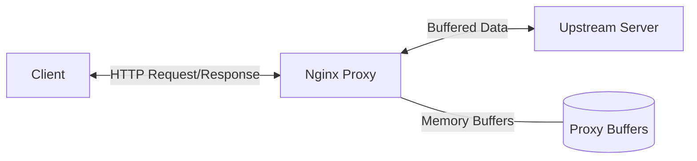

# Nginx Proxy Buffers

## Introduction

When Nginx acts as a reverse proxy, it doesn't simply forward requests and responses between clients and upstream servers. Instead, it uses buffers - temporary storage areas in memory - to process and manage this data. These buffers significantly impact the performance, resource usage, and behavior of your reverse proxy setup.

In this article, we'll explore Nginx proxy buffers in depth - what they are, how they work, and how to configure them optimally for different scenarios.

## What Are Proxy Buffers?

Proxy buffers are memory areas that Nginx allocates to store responses from upstream servers before sending them to clients. Instead of forwarding each packet immediately as it's received, Nginx can buffer partial or complete responses from upstream servers.

This buffering mechanism serves several important purposes:

1. **Performance optimization**: Buffering allows Nginx to manage different connection speeds between clients and upstream servers
2. **Resource management**: It helps control memory usage and prevents overload during traffic spikes
3. **Protection**: It can shield upstream servers from slow clients, preventing resource exhaustion

## How Proxy Buffers Work

To understand proxy buffers, let's look at a simplified view of the data flow when Nginx acts as a reverse proxy:



Here's what happens:

1. A client sends a request to Nginx
2. Nginx forwards the request to an upstream server
3. The upstream server processes the request and starts sending a response
4. Nginx stores the response in memory buffers
5. Once sufficient data is buffered (or the entire response is received), Nginx forwards it to the client

This buffering process can happen in two ways:

- **Buffering enabled**: Nginx receives the entire response from the upstream server, stores it in buffers, and then sends it to the client at the client's pace
- **Buffering disabled**: Nginx forwards response data to the client as soon as it receives it from the upstream server

## Configuring Proxy Buffers

Nginx provides several directives to control proxy buffering behavior. Let's examine the most important ones:

### Basic Buffer Configuration

```nginx
http {
    # Enable or disable buffering
    proxy_buffering on;
    
    # Size of the buffer used for reading the first part of the response
    proxy_buffer_size 4k;
    
    # Number and size of buffers for a single connection
    proxy_buffers 4 8k;
    
    # Maximum size of temp files for a single request
    proxy_max_temp_file_size 1024m;
    
    # Size threshold after which data is written to temp files
    proxy_busy_buffers_size 16k;
    
    server {
        location /api/ {
            proxy_pass http://backend_servers;
        }
    }
}
```

Let's break down these directives:

### `proxy_buffering`

This directive enables or disables buffering of responses from the upstream server:

```nginx
proxy_buffering on;  # Default value
```

When set to `on`, Nginx buffers the entire response from the upstream server. When set to `off`, Nginx forwards each packet immediately as it's received.

### `proxy_buffer_size`

This sets the size of the buffer used for reading the first part of the response received from the upstream server:

```nginx
proxy_buffer_size 4k;  # Default value is dependent on platform
```

The first part of the response usually contains headers that are smaller than the rest of the response. This buffer should be large enough to hold a typical set of response headers.

### `proxy_buffers`

This directive configures the number and size of buffers used for reading a response from the upstream server:

```nginx
proxy_buffers 8 4k;  # 8 buffers, 4KB each (default values vary)
```

The first parameter is the number of buffers, and the second is the size of each buffer. The total memory allocated is `number × size`.

### `proxy_busy_buffers_size`

This sets the maximum size of buffers that can be busy sending data to the client while the response is not yet fully read:

```nginx
proxy_busy_buffers_size 16k;  # Default value
```

While a response is being processed, some buffers are reading from the upstream server while others are sending data to the client. This directive limits how much buffer space can be used for sending to the client.

### `proxy_max_temp_file_size`

If all allocated buffers become full, Nginx can start writing response data to temporary files:

```nginx
proxy_max_temp_file_size 1024m;  # Default value
```

This directive limits the maximum size of these temporary files. Setting it to 0 disables writing to temporary files completely.

## Practical Examples

Let's look at some real-world scenarios and how to configure proxy buffers for them:

### Example 1: Handling Large Responses

When your upstream servers deliver large responses (such as big JSON payloads or file downloads), you might need to increase buffer sizes:

```nginx
server {
    location /api/large-data/ {
        proxy_pass http://data_servers;
        proxy_buffering on;
        proxy_buffer_size 16k;
        proxy_buffers 8 16k;  # Allocate 8 buffers of 16KB each (128KB total)
        proxy_busy_buffers_size 32k;
    }
}
```

This configuration allocates more memory for buffering, allowing Nginx to handle larger responses efficiently.

### Example 2: Protecting Upstream Servers from Slow Clients

If your clients have slow connections but your upstream servers are fast, you can use buffering to prevent slow clients from tying up backend resources:

```nginx
server {
    location / {
        proxy_pass http://application_servers;
        proxy_buffering on;
        proxy_buffers 16 4k;  # More buffers to handle multiple slow clients
        
        # Set low timeouts for upstream connections
        proxy_connect_timeout 60s;
        proxy_read_timeout 60s;
        proxy_send_timeout 60s;
    }
}
```

This setup allows Nginx to quickly read responses from upstream servers, freeing them to handle other requests, while it deals with sending data to slow clients.

### Example 3: Streaming Responses

For applications that require real-time streaming of data (like live video or event streams), you might want to disable buffering:

```nginx
server {
    location /stream/ {
        proxy_pass http://streaming_servers;
        proxy_buffering off;
        
        # Even with buffering off, the response headers are still buffered
        proxy_buffer_size 8k;
        
        # Keep connections alive
        proxy_http_version 1.1;
        proxy_set_header Connection "";
    }
}
```

By disabling buffering, Nginx forwards each packet of data as soon as it's received, reducing latency for real-time applications.

## When to Adjust Proxy Buffer Settings

You might need to adjust your proxy buffer settings in these situations:

1. **High memory usage**: If Nginx is using too much memory, you might need to reduce buffer sizes
2. **Temp file creation**: If you see many temporary files being created, increase buffer sizes or adjust `proxy_max_temp_file_size`
3. **Backend server load**: If upstream servers are being overwhelmed by slow clients, ensure buffering is enabled
4. **Latency requirements**: For real-time applications, consider disabling buffering
5. **Large responses**: Increase buffer sizes when dealing with large response bodies

## Monitoring Proxy Buffer Usage

To effectively optimize your buffer settings, monitor Nginx's behavior. You can:

1. Enable debug logging temporarily:

```nginx
error_log /var/log/nginx/error.log debug;
```

2. Look for buffer-related entries in the logs:

```
2023/05/15 10:23:45 [debug] 1234#0: *5 http proxy temp file: "/var/cache/nginx/proxy_temp/5/00/0000000005"
```

This indicates that buffers were insufficient and Nginx had to write to temporary files.

3. Use Nginx status metrics and monitoring tools to track memory usage.

## Common Issues and Solutions

### Problem: High Disk I/O Due to Temporary Files

**Symptoms**: High disk activity, many files in the proxy temp directory.

**Solution**: Increase buffer sizes and/or the number of buffers:

```nginx
proxy_buffers 16 16k;  # Increase both number and size
proxy_busy_buffers_size 32k;
```

### Problem: High Memory Usage

**Symptoms**: Nginx using excessive memory, possibly affecting other services.

**Solution**: Reduce buffer allocations:

```nginx
proxy_buffers 4 4k;  # Reduce both number and size
proxy_buffer_size 4k;
proxy_max_temp_file_size 100m;  # Allow more use of temp files
```

### Problem: Increased Latency

**Symptoms**: Clients experience delays in receiving responses.

**Solution**: Consider disabling buffering for latency-sensitive endpoints:

```nginx
location /realtime/ {
    proxy_pass http://realtime_backend;
    proxy_buffering off;
}
```

## Summary

Nginx proxy buffers are a powerful feature that can significantly impact the performance and behavior of your reverse proxy setup. By understanding how these buffers work and configuring them properly, you can:

- Optimize resource usage on both Nginx and upstream servers
- Protect backend services from slow clients
- Improve overall performance for different types of applications
- Balance memory usage with disk I/O

Remember that there's no one-size-fits-all configuration for proxy buffers. The optimal settings depend on your specific use case, the nature of your application, and the characteristics of your traffic.

## Additional Resources

- [Nginx Official Documentation on Proxy Module](https://nginx.org/en/docs/http/ngx_http_proxy_module.html)
- [Understanding Nginx HTTP Proxying, Load Balancing, Buffering, and Caching](https://www.digitalocean.com/community/tutorials/understanding-nginx-http-proxying-load-balancing-buffering-and-caching)

## Exercises

1. Configure an Nginx reverse proxy with different buffer settings and use tools like `curl` to measure the response times for various types of requests.

2. Set up a scenario with a deliberately slow upstream server and compare the behavior with buffering enabled versus disabled.

3. Experiment with different buffer sizes and monitor the memory usage of your Nginx processes to find the optimal balance for your use case.

4. Configure Nginx to log debug information about buffer usage and analyze the logs to understand how your specific application traffic interacts with the buffering mechanism.