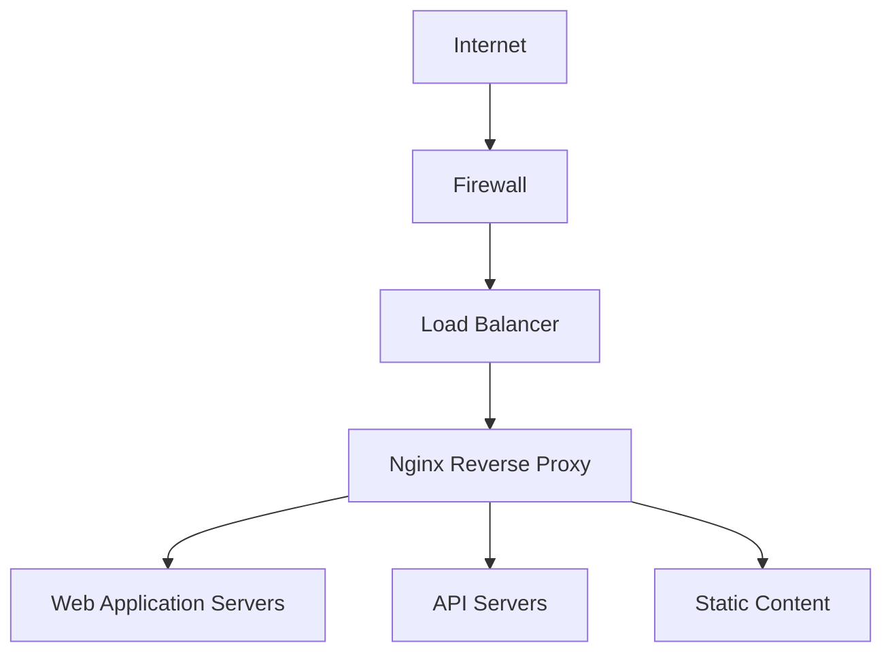

# Nginx Basic Security

## Introduction

Nginx (pronounced "engine-x") is a popular web server, reverse proxy, and load balancer known for its high performance and low resource consumption. While Nginx is powerful and efficient, any web-facing service requires proper security configurations to protect against common attacks and vulnerabilities.

In this guide, we'll explore fundamental security measures for Nginx servers. These basic security configurations serve as your first line of defense against potential threats in production environments.

## Why Nginx Security Matters

Before diving into specific configurations, let's understand why securing your Nginx server is critical:

- Web servers are constant targets for attackers
- Unprotected servers can be compromised for malicious activities
- Security breaches can lead to data theft, service disruption, or server takeover
- Proper security measures help maintain service reliability and protect user data

## Basic Security Configurations

### Hiding Nginx Version Information

By default, Nginx reveals its version number in error pages and in the `Server` HTTP response header. This information can help attackers identify specific vulnerabilities associated with your Nginx version.

To hide this information, add the following directive to the `http` block in your `nginx.conf` file:

```nginx
http {
    # Hide Nginx version
    server_tokens off;
    
    # Other configurations...
}
```

Before:
```
Server: nginx/1.18.0
```

After:
```
Server: nginx
```

### Disabling Unnecessary Modules

Nginx is built with various modules, some of which you might not need. Modules that aren't required for your use case can potentially introduce security vulnerabilities.

When compiling Nginx from source, you can specify only the modules you need using the `--with-*` and `--without-*` options:

```bash
./configure --without-http_autoindex_module --without-http_ssi_module
```

Common modules that can be disabled for improved security if not needed:

- `http_autoindex_module`: Generates directory listings
- `http_ssi_module`: Server-Side Includes
- `http_dav_module`: WebDAV protocol support

### Configuring Proper Access Controls

Restrict access to sensitive files and directories by configuring proper location blocks:

```nginx
# Deny access to hidden files and directories
location ~ /\. {
    deny all;
    return 404;
}

# Deny access to backup files
location ~ ~$ {
    deny all;
    return 404;
}

# Protect sensitive configuration files
location ~ \.(conf|ini|log)$ {
    deny all;
    return 404;
}
```

### Setting Up Secure SSL/TLS Configuration

Properly configuring SSL/TLS is crucial for securing connections between clients and your server:

```nginx
server {
    listen 443 ssl;
    server_name example.com;
    
    # SSL certificate configuration
    ssl_certificate /etc/nginx/ssl/example.com.crt;
    ssl_certificate_key /etc/nginx/ssl/example.com.key;
    
    # SSL protocols and ciphers
    ssl_protocols TLSv1.2 TLSv1.3;
    ssl_prefer_server_ciphers on;
    ssl_ciphers 'ECDHE-ECDSA-AES128-GCM-SHA256:ECDHE-RSA-AES128-GCM-SHA256:ECDHE-ECDSA-AES256-GCM-SHA384:ECDHE-RSA-AES256-GCM-SHA384';
    
    # Enable HSTS
    add_header Strict-Transport-Security "max-age=31536000; includeSubDomains" always;
    
    # Other configurations...
}
```

This configuration:
1. Enables only modern TLS protocols (TLSv1.2 and TLSv1.3)
2. Uses strong cipher suites
3. Enables HTTP Strict Transport Security (HSTS)

### Implementing Rate Limiting

Rate limiting helps protect your server from brute force attacks, DoS attacks, and other forms of abuse:

```nginx
http {
    # Define a zone for limiting requests
    limit_req_zone $binary_remote_addr zone=login:10m rate=1r/s;
    
    server {
        # Apply rate limiting to login page
        location /login {
            limit_req zone=login burst=5 nodelay;
            
            # Regular location configuration...
        }
    }
}
```

This configuration:
1. Creates a 10MB zone named "login" that tracks client IP addresses
2. Limits each IP to 1 request per second
3. Allows a burst of 5 requests without delay

### Adding Security Headers

Security headers provide an additional layer of protection against various attacks:

```nginx
server {
    # Prevent clickjacking attacks
    add_header X-Frame-Options "SAMEORIGIN" always;
    
    # Help prevent XSS attacks
    add_header X-XSS-Protection "1; mode=block" always;
    
    # Prevent MIME-type sniffing
    add_header X-Content-Type-Options "nosniff" always;
    
    # Content Security Policy
    add_header Content-Security-Policy "default-src 'self';" always;
    
    # Referrer Policy
    add_header Referrer-Policy "strict-origin-when-cross-origin" always;
    
    # Permissions Policy (formerly Feature Policy)
    add_header Permissions-Policy "geolocation=(), microphone=(), camera=()" always;
    
    # Other configurations...
}
```

These headers help protect against common web vulnerabilities like:
- Clickjacking
- Cross-site scripting (XSS)
- MIME-type confusion attacks
- Unwanted feature access

### Controlling Buffer Sizes

Properly configured buffer sizes can help prevent buffer overflow attacks:

```nginx
http {
    # Client buffer size
    client_body_buffer_size 10k;
    client_header_buffer_size 1k;
    client_max_body_size 8m;
    large_client_header_buffers 2 1k;
    
    # Other configurations...
}
```

### Creating a Proper Security Architecture

A secure Nginx setup often involves multiple layers:



## Real-World Security Configuration Example

Here's a comprehensive example combining several security measures:

```nginx
# Main nginx.conf
user nginx;
worker_processes auto;
pid /var/run/nginx.pid;

events {
    worker_connections 1024;
}

http {
    # Basic settings
    sendfile on;
    tcp_nopush on;
    tcp_nodelay on;
    keepalive_timeout 65;
    types_hash_max_size 2048;
    server_tokens off;
    
    # MIME types
    include /etc/nginx/mime.types;
    default_type application/octet-stream;
    
    # Logging
    access_log /var/log/nginx/access.log;
    error_log /var/log/nginx/error.log;
    
    # Gzip compression
    gzip on;
    
    # Security settings
    
    # Rate limiting zones
    limit_req_zone $binary_remote_addr zone=api:10m rate=10r/s;
    limit_req_zone $binary_remote_addr zone=login:10m rate=1r/s;
    
    # Buffer size control
    client_body_buffer_size 10k;
    client_header_buffer_size 1k;
    client_max_body_size 8m;
    large_client_header_buffers 2 1k;
    
    # SSL settings
    ssl_protocols TLSv1.2 TLSv1.3;
    ssl_prefer_server_ciphers on;
    ssl_ciphers 'ECDHE-ECDSA-AES128-GCM-SHA256:ECDHE-RSA-AES128-GCM-SHA256:ECDHE-ECDSA-AES256-GCM-SHA384:ECDHE-RSA-AES256-GCM-SHA384';
    ssl_session_cache shared:SSL:10m;
    ssl_session_timeout 10m;
    
    # Virtual host configs
    include /etc/nginx/conf.d/*.conf;
}
```

And a sample server configuration:

```nginx
# /etc/nginx/conf.d/example.com.conf
server {
    listen 80;
    server_name example.com www.example.com;
    
    # Redirect all HTTP to HTTPS
    return 301 https://$host$request_uri;
}

server {
    listen 443 ssl http2;
    server_name example.com www.example.com;
    
    # SSL configuration
    ssl_certificate /etc/nginx/ssl/example.com.crt;
    ssl_certificate_key /etc/nginx/ssl/example.com.key;
    
    # Security headers
    add_header X-Frame-Options "SAMEORIGIN" always;
    add_header X-XSS-Protection "1; mode=block" always;
    add_header X-Content-Type-Options "nosniff" always;
    add_header Content-Security-Policy "default-src 'self'; script-src 'self'" always;
    add_header Strict-Transport-Security "max-age=31536000; includeSubDomains" always;
    add_header Referrer-Policy "strict-origin-when-cross-origin" always;
    
    # Root directory and index files
    root /var/www/example.com;
    index index.html;
    
    # Deny access to hidden files
    location ~ /\. {
        deny all;
        return 404;
    }
    
    # Protect against common attacks
    if ($request_method !~ ^(GET|HEAD|POST)$) {
        return 444;
    }
    
    # Rate limit login attempts
    location /login {
        limit_req zone=login burst=5 nodelay;
        # Other location configurations...
    }
    
    # API rate limiting
    location /api {
        limit_req zone=api burst=20 nodelay;
        # Other location configurations...
    }
    
    # Regular location
    location / {
        try_files $uri $uri/ =404;
    }
}
```

## Verifying Nginx Security Configuration

After implementing security measures, it's important to verify your configuration:

1. Check syntax validity:

```bash
sudo nginx -t
```

2. Test SSL/TLS configuration with online tools like [SSL Labs](https://www.ssllabs.com/ssltest/)

3. Scan for common security vulnerabilities:

```bash
sudo apt install nikto
nikto -h example.com
```

## Summary

Securing Nginx is a critical aspect of web server administration. In this guide, we've covered the essential security configurations:

- Hiding version information
- Disabling unnecessary modules
- Implementing access controls
- Configuring SSL/TLS properly
- Setting up rate limiting
- Adding security headers
- Controlling buffer sizes

Remember that security is an ongoing process. Regularly update your Nginx installation, review security best practices, and stay informed about new vulnerabilities and security techniques.

## Additional Resources

Here are some resources to further enhance your understanding of Nginx security:

- Nginx Official Security Documentation
- Mozilla SSL Configuration Generator
- OWASP Secure Headers Project
- Nginx Hardening Guides

## Exercises

1. Set up a basic Nginx server with the security configurations mentioned in this guide.
2. Configure rate limiting for different sections of your website with appropriate limits.
3. Implement and test headers like Content-Security-Policy with different directives.
4. Create a secure SSL configuration and test it with SSL Labs.
5. Research and implement additional security measures not covered in this guide.