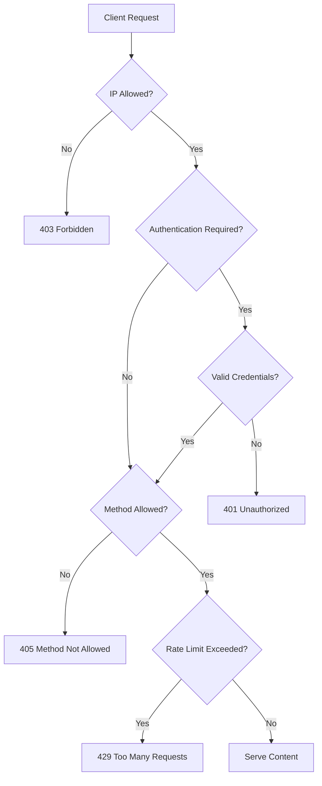

# Nginx Access Restrictions

## Introduction

Access control is a fundamental aspect of web server security. Nginx, a popular high-performance web server, provides several methods to restrict access to your websites and applications. These restrictions help protect sensitive content, prevent unauthorized access, and mitigate potential security threats.

In this guide, we'll explore various Nginx access restriction techniques that you can implement to enhance your web server's security posture. Whether you're hosting a simple website or a complex application, understanding these access control mechanisms is essential for maintaining a secure environment.

## Why Implement Access Restrictions?

Before diving into implementation details, let's understand why access restrictions are important:

- **Protect sensitive information**: Limit access to admin panels, configuration files, and private content
- **Prevent unauthorized users**: Block access based on IP addresses or networks
- **Reduce attack surface**: Restrict access to specific endpoints that don't need to be publicly available
- **Implement authentication**: Require credentials before accessing protected resources
- **Compliance requirements**: Meet organizational or regulatory security standards

## Basic Access Restriction Methods

### IP-Based Restrictions

One of the simplest ways to restrict access is based on IP addresses. This is useful for administrative interfaces or internal tools that should only be accessible from specific locations.

```nginx
server {
    listen 80;
    server_name example.com;

    location /admin {
        # Allow specific IP addresses
        allow 192.168.1.100;
        allow 10.0.0.5;
        
        # Allow an entire subnet
        allow 192.168.2.0/24;
        
        # Deny everyone else
        deny all;
        
        # Admin panel configuration
        # ...
    }
}
```

In this example:
- Only IPs `192.168.1.100` and `10.0.0.5` can access the `/admin` location
- The entire `192.168.2.0/24` subnet is allowed access
- All other IP addresses are denied access

You can also reverse this logic to block specific IPs while allowing everyone else:

```nginx
server {
    listen 80;
    server_name example.com;

    # Block specific IPs
    deny 192.168.1.200;
    deny 10.0.0.10;
    
    # Allow everyone else
    allow all;
}
```

### HTTP Basic Authentication

For simple password protection, Nginx supports HTTP Basic Authentication. While not the most secure method for highly sensitive applications, it provides a useful layer of protection for less critical resources.

First, create a password file using the `htpasswd` utility (part of Apache utils):

```bash
# Install htpasswd if not available
sudo apt-get install apache2-utils

# Create a new password file with a user
sudo htpasswd -c /etc/nginx/.htpasswd username
```

Then configure Nginx to use this file:

```nginx
server {
    listen 80;
    server_name example.com;

    location /protected {
        auth_basic "Restricted Area";
        auth_basic_user_file /etc/nginx/.htpasswd;
        
        # Protected content configuration
        # ...
    }
}
```

When users access `/protected`, they'll be prompted for a username and password:


### Combining IP Restrictions and Authentication

For enhanced security, you can combine both methods:

```nginx
server {
    listen 80;
    server_name example.com;

    location /admin {
        # First, restrict by IP
        allow 192.168.1.0/24;
        deny all;
        
        # Then require authentication
        auth_basic "Admin Area";
        auth_basic_user_file /etc/nginx/.htpasswd;
        
        # Admin content configuration
        # ...
    }
}
```

This creates a double layer of protection - users must both come from an allowed IP range AND provide valid credentials.

## Advanced Access Restrictions

### Restricting Access by HTTP Methods

You can restrict which HTTP methods are allowed for specific locations:

```nginx
server {
    listen 80;
    server_name example.com;

    location /api {
        # Only allow GET, POST, and PUT methods
        limit_except GET POST PUT {
            deny all;
        }
        
        # API configuration
        # ...
    }
}
```

In this example, any request to `/api` using methods other than GET, POST, or PUT (such as DELETE) will be denied.

### Restricting Access by User Agent

You can restrict access based on the user agent string:

```nginx
server {
    listen 80;
    server_name example.com;

    # Block specific user agents
    if ($http_user_agent ~* (curl|wget|python-requests)) {
        return 403;
    }
    
    # Site configuration
    # ...
}
```

This configuration blocks common tools used for scraping or automated access.

### Restricting Access by Referrer

You can control access based on the HTTP referer header:

```nginx
server {
    listen 80;
    server_name example.com;

    location /images {
        # Only allow requests from your own domain
        valid_referers server_names;
        
        if ($invalid_referer) {
            return 403;
        }
        
        # Images configuration
        # ...
    }
}
```

This helps prevent hotlinking of your resources from other websites.

## Implementing Rate Limiting

Rate limiting is another form of access restriction that helps protect against brute force attacks and certain types of DDoS attacks.

```nginx
http {
    # Define a zone for limiting
    limit_req_zone $binary_remote_addr zone=mylimit:10m rate=1r/s;
    
    server {
        listen 80;
        server_name example.com;
        
        # Apply rate limiting to login page
        location /login {
            limit_req zone=mylimit burst=5;
            
            # Login page configuration
            # ...
        }
    }
}
```

This configuration:
- Creates a rate limiting zone named `mylimit` that tracks client IP addresses
- Limits requests to 1 per second
- Allows a burst of 5 requests before enforcing the limit

## Restricting Access to File Types

You can restrict access to specific file types, such as configuration or backup files:

```nginx
server {
    listen 80;
    server_name example.com;
    
    # Block access to sensitive file types
    location ~* \.(conf|bak|sql|md|git|env|json|config)$ {
        deny all;
        return 404;
    }
    
    # Site configuration
    # ...
}
```

## Visualizing Access Restriction Flow

Here's a diagram showing the decision flow of Nginx access restrictions:



## Real-World Examples

### Protecting a WordPress Admin Panel

```nginx
server {
    listen 80;
    server_name example.com;
    
    # WordPress site configuration
    # ...
    
    # Protect wp-admin and wp-login
    location ~* wp-(admin|login) {
        # Only allow office IP range
        allow 192.168.1.0/24;
        
        # Allow developer's home IP
        allow 203.0.113.15;
        
        # Deny everyone else
        deny all;
        
        # Apply rate limiting
        limit_req zone=wpadmin burst=5;
        
        # Pass to PHP processing
        include fastcgi_params;
        fastcgi_pass unix:/var/run/php/php7.4-fpm.sock;
    }
}
```

### Securing an API with Different Restrictions by Endpoint

```nginx
server {
    listen 80;
    server_name api.example.com;
    
    # Public API endpoints
    location /api/v1/public {
        # Allow all but rate limit
        limit_req zone=publicapi burst=10;
        
        # API configuration
        proxy_pass http://backend_servers;
    }
    
    # Private API endpoints
    location /api/v1/private {
        # Only allow internal network
        allow 10.0.0.0/8;
        deny all;
        
        # API configuration
        proxy_pass http://backend_servers;
    }
    
    # Admin API endpoints
    location /api/v1/admin {
        # Only allow specific IPs
        allow 10.0.0.5;
        allow 10.0.0.6;
        deny all;
        
        # Also require authentication
        auth_basic "Admin API";
        auth_basic_user_file /etc/nginx/.htpasswd;
        
        # API configuration
        proxy_pass http://backend_servers;
    }
}
```

## Best Practices

When implementing access restrictions in Nginx, follow these best practices:

1. **Layer your defenses**: Combine multiple restriction methods for critical areas
2. **Use the principle of least privilege**: Only grant access to those who absolutely need it
3. **Keep IP lists updated**: Regularly review and update allowed IP addresses
4. **Log access attempts**: Monitor logs for unauthorized access attempts
5. **Use strong passwords**: If using basic auth, ensure passwords are strong
6. **Consider more robust authentication**: For sensitive applications, consider more secure authentication methods
7. **Test your restrictions**: Verify that your rules work as expected from different locations
8. **Keep Nginx updated**: Regularly update Nginx to patch security vulnerabilities

## Troubleshooting Common Issues

### Access Denied When It Shouldn't Be

If legitimate users are being denied access:

1. Check the order of your `allow` and `deny` directives (they're processed in order)
2. Verify the IP addresses or subnet masks are correct
3. Check if the user's IP address might be changing (dynamic IP)
4. Look at Nginx error logs: `tail -f /var/log/nginx/error.log`

### Authentication Not Working

If authentication isn't working properly:

1. Ensure the path to the `.htpasswd` file is correct
2. Verify Nginx has permission to read the file
3. Check that the username and password were created correctly
4. Look for typos in the configuration

### Rules Not Being Applied

If your restriction rules seem to be ignored:

1. Make sure you've reloaded Nginx after configuration changes: `sudo nginx -s reload`
2. Check that the location block is correct and matches the requested URI
3. Look for conflicting rules in other included configuration files
4. Verify the syntax of your configuration: `sudo nginx -t`

## Summary

Access restrictions in Nginx provide a powerful way to enhance your web server's security. By controlling who can access your content, you can protect sensitive information and reduce the risk of unauthorized access.

In this guide, we've covered:

- Basic IP-based access restrictions
- HTTP Basic Authentication
- Combining multiple restriction methods
- Restricting access by HTTP methods, user agents, and referrers
- Implementing rate limiting to prevent abuse
- Restricting access to sensitive file types
- Real-world examples for common scenarios
- Best practices and troubleshooting tips

By implementing appropriate access restrictions, you can significantly improve your website's security posture and better protect your digital assets.

## Additional Resources

To deepen your understanding of Nginx access restrictions, consider exploring these resources:

- [Nginx Official Documentation](https://nginx.org/en/docs/)
- [Nginx Admin Guide](https://docs.nginx.com/nginx/admin-guide/)
- [Digital Ocean's Nginx Configuration Guide](https://www.digitalocean.com/community/tutorials/how-to-set-up-nginx-server-blocks-on-ubuntu)

## Exercises

1. Configure Nginx to allow access to an admin page only from localhost
2. Set up basic authentication for a directory containing sensitive documents
3. Implement rate limiting for a login page to prevent brute force attacks
4. Create a configuration that blocks common web vulnerability scanners based on their user agent
5. Design a layered access restriction scheme for a web application with public, member, and admin areas