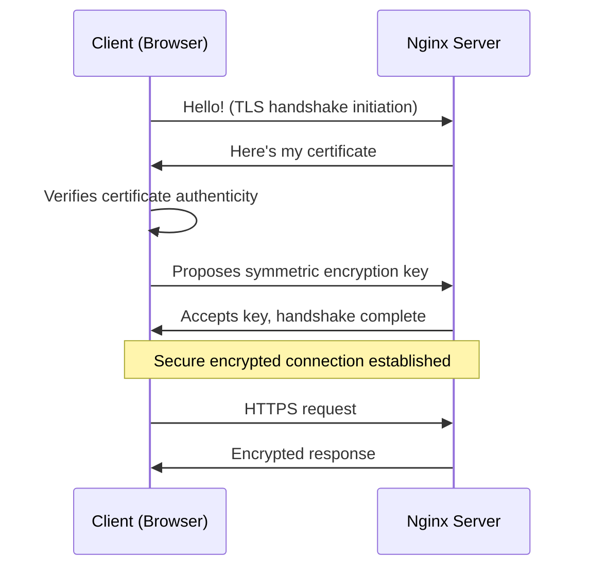

# Nginx SSL Certificates

## Introduction

SSL (Secure Sockets Layer) certificates are digital certificates that authenticate the identity of a website and enable encrypted connections. When properly implemented in Nginx, SSL certificates create a secure channel between your web server and your visitors' browsers, protecting sensitive information from being intercepted or tampered with during transmission.

In this guide, we'll explore how SSL certificates work with Nginx, why they're essential for modern websites, and how to implement them correctly for optimal security.

## Why SSL Certificates Matter

SSL certificates serve three critical purposes:

1. **Encryption**: They encrypt data transmitted between the server and client
2. **Authentication**: They verify the identity of your website
3. **Trust**: They signal to users that your site is secure (via the padlock icon and HTTPS protocol)

In today's web environment, SSL certificates aren't just a security best practice—they're practically mandatory. Search engines like Google prioritize HTTPS websites in search results, and modern browsers mark non-HTTPS sites as "Not Secure."

## How SSL/TLS Works with Nginx

Before diving into implementation, let's understand the basic workflow:



## Types of SSL Certificates

When setting up SSL with Nginx, you'll need to choose a certificate type:

1. **Domain Validated (DV)**: Basic verification of domain ownership
2. **Organization Validated (OV)**: Includes organization verification
3. **Extended Validation (EV)**: Rigorous verification showing the green address bar
4. **Wildcard Certificates**: Cover multiple subdomains (`*.example.com`)
5. **Multi-Domain (SAN) Certificates**: Cover multiple domains
6. **Let's Encrypt**: Free, automated, and open certificate authority

For most beginners, Let's Encrypt offers an excellent starting point due to its simplicity and zero cost.

## Setting Up SSL Certificates in Nginx

Let's walk through the process of setting up SSL certificates with Nginx:

### 1. Obtaining a Certificate

#### Using Let's Encrypt with Certbot

The easiest way to get started is with Let's Encrypt and Certbot:

```bash
# Install Certbot
sudo apt update
sudo apt install certbot python3-certbot-nginx

# Obtain and install the certificate
sudo certbot --nginx -d yourdomain.com -d www.yourdomain.com
```

Certbot will automatically modify your Nginx configuration to use the newly obtained certificates.

#### Using a Commercial Certificate Authority

If you've purchased a certificate from a commercial CA:

1. Generate a Certificate Signing Request (CSR):

```bash
sudo openssl req -new -newkey rsa:2048 -nodes -keyout /etc/ssl/private/yourdomain.key -out /etc/ssl/certs/yourdomain.csr
```

2. Submit the CSR to your certificate authority
3. Download the issued certificate files (typically a `.crt` file and sometimes a CA bundle)
4. Install the certificate files on your server

### 2. Configuring Nginx for SSL

Here's a basic Nginx server block with SSL configuration:

```nginx
server {
    listen 80;
    server_name yourdomain.com www.yourdomain.com;
    
    # Redirect all HTTP requests to HTTPS
    return 301 https://$host$request_uri;
}

server {
    listen 443 ssl http2;
    server_name yourdomain.com www.yourdomain.com;
    
    # SSL certificate files
    ssl_certificate /etc/letsencrypt/live/yourdomain.com/fullchain.pem;
    ssl_certificate_key /etc/letsencrypt/live/yourdomain.com/privkey.pem;
    
    # SSL settings
    ssl_protocols TLSv1.2 TLSv1.3;
    ssl_prefer_server_ciphers on;
    ssl_ciphers 'ECDHE-ECDSA-AES128-GCM-SHA256:ECDHE-RSA-AES128-GCM-SHA256:ECDHE-ECDSA-AES256-GCM-SHA384:ECDHE-RSA-AES256-GCM-SHA384';
    ssl_session_timeout 1d;
    ssl_session_cache shared:SSL:10m;
    ssl_session_tickets off;
    
    # OCSP Stapling
    ssl_stapling on;
    ssl_stapling_verify on;
    resolver 8.8.8.8 8.8.4.4 valid=300s;
    resolver_timeout 5s;
    
    # Security headers
    add_header Strict-Transport-Security "max-age=63072000; includeSubDomains; preload";
    add_header X-Content-Type-Options nosniff;
    add_header X-Frame-Options DENY;
    add_header X-XSS-Protection "1; mode=block";
    
    # Your site configuration
    root /var/www/yourdomain.com/html;
    index index.html index.htm;
    
    location / {
        try_files $uri $uri/ =404;
    }
}
```

### 3. Testing Your SSL Configuration

After setting up your SSL certificate, it's important to verify it's working correctly:

1. **Browser Test**: Open your website in a browser and check for the padlock icon
2. **SSL Labs Test**: Visit [SSL Labs](https://www.ssllabs.com/ssltest/) and enter your domain

## SSL Certificate Best Practices

### 1. Implement Strong SSL Protocols and Ciphers

Use only modern, secure protocols and ciphers:

```nginx
ssl_protocols TLSv1.2 TLSv1.3;
ssl_prefer_server_ciphers on;
ssl_ciphers 'ECDHE-ECDSA-AES128-GCM-SHA256:ECDHE-RSA-AES128-GCM-SHA256:ECDHE-ECDSA-AES256-GCM-SHA384:ECDHE-RSA-AES256-GCM-SHA384';
```

### 2. Enable HTTP Strict Transport Security (HSTS)

HSTS tells browsers to always use HTTPS for your domain:

```nginx
add_header Strict-Transport-Security "max-age=63072000; includeSubDomains; preload";
```

### 3. Set Up OCSP Stapling

OCSP stapling improves performance by allowing Nginx to check certificate validity:

```nginx
ssl_stapling on;
ssl_stapling_verify on;
resolver 8.8.8.8 8.8.4.4 valid=300s;
resolver_timeout 5s;
```

### 4. Optimize SSL Session Caching

To improve performance with SSL:

```nginx
ssl_session_timeout 1d;
ssl_session_cache shared:SSL:10m;
ssl_session_tickets off;
```

### 5. Set Up Automatic Certificate Renewal

Let's Encrypt certificates expire after 90 days, so automatic renewal is essential:

```bash
# Create a cron job for certificate renewal
echo "0 3 * * * /usr/bin/certbot renew --quiet" | sudo tee -a /etc/crontab
```

## Troubleshooting Common SSL Issues

### Certificate Not Trusted

If your certificate shows as "not trusted":
- Ensure you've installed the complete certificate chain
- Check that the root certificate is from a trusted CA
- Verify your `ssl_certificate` directive points to the correct file

```nginx
# Make sure to use the fullchain.pem file with Let's Encrypt
ssl_certificate /etc/letsencrypt/live/yourdomain.com/fullchain.pem;
```

### Mixed Content Warnings

If you see mixed content warnings in the browser console:
- Check for hardcoded HTTP URLs in your HTML, CSS, or JavaScript
- Use relative URLs where possible
- Consider adding this header:

```nginx
add_header Content-Security-Policy "upgrade-insecure-requests";
```

### Certificate Expiration

To avoid certificate expiration surprises:
- Set up monitoring for certificate expiration
- Configure automatic renewal
- Test the renewal process before actual expiration

## Practical Example: Setting Up a Secure WordPress Site

Let's apply what we've learned to set up a secure WordPress site:

```nginx
server {
    listen 80;
    server_name wordpress-example.com www.wordpress-example.com;
    return 301 https://$host$request_uri;
}

server {
    listen 443 ssl http2;
    server_name wordpress-example.com www.wordpress-example.com;
    
    # SSL certificate files
    ssl_certificate /etc/letsencrypt/live/wordpress-example.com/fullchain.pem;
    ssl_certificate_key /etc/letsencrypt/live/wordpress-example.com/privkey.pem;
    
    # SSL settings (as mentioned in the best practices section)
    ssl_protocols TLSv1.2 TLSv1.3;
    ssl_prefer_server_ciphers on;
    ssl_ciphers 'ECDHE-ECDSA-AES128-GCM-SHA256:ECDHE-RSA-AES128-GCM-SHA256:ECDHE-ECDSA-AES256-GCM-SHA384:ECDHE-RSA-AES256-GCM-SHA384';
    ssl_session_timeout 1d;
    ssl_session_cache shared:SSL:10m;
    ssl_session_tickets off;
    ssl_stapling on;
    ssl_stapling_verify on;
    
    # Security headers
    add_header Strict-Transport-Security "max-age=63072000; includeSubDomains; preload";
    
    # WordPress specific configuration
    root /var/www/wordpress-example.com;
    index index.php index.html;
    
    location / {
        try_files $uri $uri/ /index.php?$args;
    }
    
    location ~ \.php$ {
        include snippets/fastcgi-php.conf;
        fastcgi_pass unix:/var/run/php/php8.1-fpm.sock;
    }
    
    # Deny access to .htaccess files
    location ~ /\.ht {
        deny all;
    }
}
```

## Summary

In this guide, we've explored the fundamentals of SSL certificates in Nginx:

- The importance of SSL for security and user trust
- Different types of SSL certificates available
- How to obtain and install certificates
- Best practices for secure SSL configuration
- Troubleshooting common SSL issues
- A practical example with WordPress

Implementing SSL certificates with Nginx might seem complex at first, but the security benefits are well worth the effort. With Let's Encrypt making certificates freely available and tools like Certbot simplifying the process, there's no reason not to secure your web traffic.

## Additional Resources

For further learning, consider exploring:

- [Mozilla SSL Configuration Generator](https://ssl-config.mozilla.org/) - Create custom SSL configurations
- [Let's Encrypt Documentation](https://letsencrypt.org/docs/) - Detailed guides on certificate issuance
- [Nginx HTTP SSL Module Documentation](https://nginx.org/en/docs/http/ngx_http_ssl_module.html) - Official documentation on SSL parameters
- [SSL Labs](https://www.ssllabs.com/ssltest/) - Test your SSL implementation

## Exercises

1. Set up a basic Nginx server with Let's Encrypt SSL
2. Configure HSTS and test it using browser developer tools
3. Experiment with different SSL parameters and test the results with SSL Labs
4. Create a script to monitor your certificate expiration dates
5. Try setting up a wildcard certificate for multiple subdomains