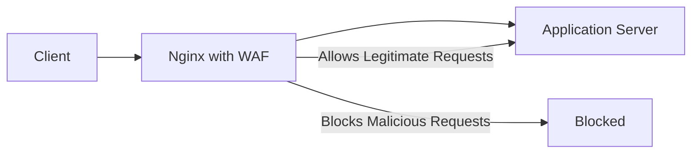

# Nginx WAF Integration

## Introduction

Web Application Firewalls (WAFs) are essential security components that help protect your web applications from various attacks, including SQL injection, cross-site scripting (XSS), and other OWASP Top 10 vulnerabilities. By integrating a WAF with Nginx, you can add an additional layer of security to your web applications without significantly impacting performance.

This guide will walk you through the process of integrating popular WAF solutions with Nginx, configuring basic security rules, and testing your setup. By the end, you'll have a working Nginx setup with WAF protection.

## What is a WAF?

A Web Application Firewall monitors, filters, and blocks HTTP traffic to and from a web application. Unlike traditional firewalls that operate at the network or transport layer, WAFs work at the application layer (Layer 7) of the OSI model.



WAFs analyze HTTP requests and responses to identify and block malicious traffic based on predefined rules or through learning algorithms. When integrated with Nginx, the WAF acts as a filter before requests reach your application server.

## Popular WAF Options for Nginx

There are several WAF solutions that work well with Nginx:

1. **ModSecurity** - Open-source, feature-rich WAF with OWASP Core Rule Set
2. **NAXSI** - Lightweight, focused on efficiency and simplicity
3. **AppProtect** - Commercial WAF included with Nginx Plus

For this tutorial, we'll focus primarily on ModSecurity integration as it's the most widely used open-source option.

## Integrating ModSecurity with Nginx

### Prerequisites

Before starting, ensure you have:

- A server running Linux (Ubuntu/Debian/CentOS)
- Root or sudo access
- Basic familiarity with Nginx configuration
- Nginx installed on your server

### Step 1: Install Required Dependencies

First, let's install the necessary dependencies:

```bash
# For Ubuntu/Debian
sudo apt update
sudo apt install -y git build-essential libpcre3-dev libxml2-dev libyajl-dev liblmdb-dev libgeoip-dev libcurl4-openssl-dev liblua5.3-dev libfuzzy-dev automake libtool

# For CentOS/RHEL
sudo yum install -y git make gcc-c++ flex bison yajl yajl-devel libxml2 libxml2-devel curl-devel GeoIP-devel doxygen zlib-devel pcre-devel lmdb-devel automake libtool
```

### Step 2: Clone and Build ModSecurity

Next, we'll build ModSecurity from source:

```bash
cd /opt
sudo git clone --depth 1 -b v3/master https://github.com/SpiderLabs/ModSecurity
cd ModSecurity
sudo git submodule init
sudo git submodule update
sudo ./build.sh
sudo ./configure
sudo make
sudo make install
```

### Step 3: Clone and Build the Nginx Connector

Now we need to build the connector that integrates ModSecurity with Nginx:

```bash
cd /opt
sudo git clone --depth 1 https://github.com/SpiderLabs/ModSecurity-nginx.git
```

### Step 4: Recompile Nginx with ModSecurity

We need to determine your installed Nginx version and download the matching source code:

```bash
nginx -v
# Note the version number, for example 1.18.0

cd /opt
sudo wget http://nginx.org/download/nginx-1.18.0.tar.gz # Replace with your version
sudo tar zxvf nginx-1.18.0.tar.gz
cd nginx-1.18.0
```

Now compile Nginx with the ModSecurity module:

```bash
sudo ./configure --with-compat --add-dynamic-module=/opt/ModSecurity-nginx
sudo make modules
sudo cp objs/ngx_http_modsecurity_module.so /usr/share/nginx/modules/
```

### Step 5: Configure Nginx to Load the ModSecurity Module

Create or edit your Nginx configuration to load the module:

```bash
sudo mkdir -p /etc/nginx/modsec
cd /etc/nginx/modsec
sudo wget https://raw.githubusercontent.com/SpiderLabs/ModSecurity/v3/master/modsecurity.conf-recommended
sudo mv modsecurity.conf-recommended modsecurity.conf
```

Edit the modsecurity.conf file to enable ModSecurity:

```bash
sudo nano modsecurity.conf
```

Change `SecRuleEngine DetectionOnly` to `SecRuleEngine On` to enable blocking mode.

Create a main ModSecurity configuration file:

```bash
sudo nano /etc/nginx/modsec/main.conf
```

Add the following content:

```
# Include the ModSecurity configuration
Include /etc/nginx/modsec/modsecurity.conf

# Basic rule to block SQL injection
SecRule ARGS "@contains SELECT" "id:1000,phase:2,deny,status:403,log,msg:'SQL Injection Attempt'"
```

Now edit your Nginx configuration to load the module and use ModSecurity:

```bash
sudo nano /etc/nginx/nginx.conf
```

Add the following at the beginning of the file, outside any blocks:

```
load_module modules/ngx_http_modsecurity_module.so;
```

Then, within the `http` block, add:

```
modsecurity on;
modsecurity_rules_file /etc/nginx/modsec/main.conf;
```

### Step 6: Install OWASP Core Rule Set (CRS)

The OWASP Core Rule Set provides a set of generic attack detection rules:

```bash
cd /etc/nginx/modsec
sudo wget https://github.com/coreruleset/coreruleset/archive/v3.3.2.tar.gz
sudo tar -xzf v3.3.2.tar.gz
sudo mv coreruleset-3.3.2 owasp-crs
sudo cp owasp-crs/crs-setup.conf.example owasp-crs/crs-setup.conf
```

Edit your main.conf file to include the CRS:

```bash
sudo nano /etc/nginx/modsec/main.conf
```

Add the following after the existing content:

```
# Include OWASP CRS rules
Include /etc/nginx/modsec/owasp-crs/crs-setup.conf
Include /etc/nginx/modsec/owasp-crs/rules/*.conf
```

### Step 7: Test and Restart Nginx

Test your Nginx configuration for syntax errors:

```bash
sudo nginx -t
```

If there are no errors, restart Nginx:

```bash
sudo systemctl restart nginx
```

## Testing Your WAF Integration

Let's test if our WAF is properly blocking malicious requests:

### Test 1: SQL Injection Test

Try accessing a URL with a SQL injection payload:

```
http://your-server-ip/?id=1' OR '1'='1
```

If ModSecurity is working correctly, you should receive a 403 Forbidden error instead of the normal page.

### Test 2: XSS Attack Test

Try accessing a URL with an XSS payload:

```
http://your-server-ip/?search=<script>alert('XSS')</script>
```

The request should be blocked with a 403 error if your WAF is properly configured.

## Custom WAF Rules

ModSecurity uses a powerful rule language to define security policies. Here's an example of a custom rule to block specific user agents:

Edit your main.conf file:

```bash
sudo nano /etc/nginx/modsec/main.conf
```

Add the following custom rule:

```
# Block bad bots
SecRule REQUEST_HEADERS:User-Agent "@contains badbot" \
    "id:1001,phase:1,deny,status:403,log,msg:'Bad Bot Detected'"
```

### Understanding ModSecurity Rule Syntax

A basic ModSecurity rule follows this structure:

```
SecRule VARIABLES "OPERATOR" "ACTIONS"
```

Where:
- **VARIABLES**: What to check (headers, arguments, cookies, etc.)
- **OPERATOR**: How to check it (contains, regex, etc.)
- **ACTIONS**: What to do if the rule matches (block, log, etc.)

Example rule breakdown:

```
SecRule ARGS:username "@rx admin[^a-z]" "id:1002,phase:2,deny,status:403,log,msg:'Possible Admin Access Attempt'"
```

- Checks the username parameter
- Uses regex to look for "admin" followed by a non-lowercase letter
- If found, blocks the request, returns 403, logs the event with a custom message

## Integrating NAXSI WAF with Nginx

As an alternative to ModSecurity, NAXSI ("Nginx Anti XSS & SQL Injection") is a lightweight WAF specifically designed for Nginx.

### Installing NAXSI

```bash
cd /opt
sudo git clone https://github.com/nbs-system/naxsi.git
cd /opt
sudo wget http://nginx.org/download/nginx-1.18.0.tar.gz # Replace with your version
sudo tar zxvf nginx-1.18.0.tar.gz
cd nginx-1.18.0
sudo ./configure --add-module=/opt/naxsi/naxsi_src/ --prefix=/usr/share/nginx
sudo make
sudo make install
```

### Configuring NAXSI

Create a NAXSI configuration file:

```bash
sudo cp /opt/naxsi/naxsi_config/naxsi_core.rules /etc/nginx/
sudo nano /etc/nginx/naxsi.rules
```

Add the following content:

```
# Basic configuration
LearningMode; # Remove this in production
SecRulesEnabled;
DeniedUrl "/RequestDenied";

# Check URLs
CheckRule "$SQL >= 8" BLOCK;
CheckRule "$RFI >= 8" BLOCK;
CheckRule "$TRAVERSAL >= 4" BLOCK;
CheckRule "$XSS >= 8" BLOCK;

# Custom rules
BasicRule wl:1 "mz:$URL:/|BODY"; # Whitelist example
```

Update your Nginx server block:

```nginx
server {
    listen 80;
    server_name example.com;
    
    # NAXSI
    include /etc/nginx/naxsi_core.rules;
    include /etc/nginx/naxsi.rules;
    
    location / {
        root /var/www/html;
        index index.html;
    }
    
    location /RequestDenied {
        return 403 "Access Denied";
    }
}
```

## Performance Considerations

WAFs can impact performance, so consider these optimization tips:

1. **Selective Protection**: Only apply the WAF to sensitive parts of your application
2. **Rule Optimization**: Remove unnecessary rules that don't apply to your application
3. **Hardware Resources**: Ensure your server has adequate CPU and memory
4. **Caching**: Implement Nginx caching to reduce the impact of WAF processing

Example of selective WAF application:

```nginx
server {
    listen 80;
    server_name example.com;
    
    # Apply WAF only to admin area
    location /admin {
        modsecurity on;
        modsecurity_rules_file /etc/nginx/modsec/main.conf;
        proxy_pass http://backend;
    }
    
    # No WAF for static content
    location /static {
        modsecurity off;
        alias /var/www/static;
    }
}
```

## Monitoring and Logging

Proper monitoring is essential to verify your WAF is working correctly:

### Configure Enhanced Logging

Edit your modsecurity.conf file:

```bash
sudo nano /etc/nginx/modsec/modsecurity.conf
```

Ensure these settings are configured:

```
SecAuditEngine RelevantOnly
SecAuditLog /var/log/nginx/modsec_audit.log
SecAuditLogParts ABIJDEFHZ
```

### Analyzing Logs

You can use tools like grep to analyze the logs:

```bash
# Find blocked requests
sudo grep "Access denied" /var/log/nginx/modsec_audit.log

# Find specific attack types
sudo grep "SQL Injection" /var/log/nginx/modsec_audit.log
```

For more advanced analysis, consider using ELK Stack (Elasticsearch, Logstash, Kibana) or similar tools to visualize WAF activity.

## Troubleshooting Common Issues

### False Positives

If legitimate requests are being blocked:

1. Check the audit log to identify the rule causing the block
2. Create a rule exclusion in your ModSecurity configuration:

```
# Whitelist a specific rule for a specific URL
SecRule REQUEST_URI "@beginsWith /api/data" "id:1500,phase:1,pass,nolog,ctl:ruleRemoveById=949110"
```

### ModSecurity Not Working

If ModSecurity doesn't seem to be blocking requests:

1. Verify the module is loaded: `nginx -V` should show the ModSecurity module
2. Check that SecRuleEngine is set to "On" not "DetectionOnly"
3. Examine Nginx error logs for ModSecurity startup issues

### Performance Issues

If your server is experiencing high load after WAF implementation:

1. Profile the performance impact: `top` and `htop` can help identify resource usage
2. Consider reducing the rule set by disabling rules that aren't relevant to your application
3. Implement caching for static content

## Summary

In this guide, we've covered:

1. The basics of Web Application Firewalls and their importance
2. How to integrate ModSecurity with Nginx
3. Installing and configuring the OWASP Core Rule Set
4. Creating custom ModSecurity rules
5. Alternative WAF solution (NAXSI)
6. Performance optimization techniques
7. Monitoring and troubleshooting your WAF setup

By implementing a WAF with Nginx, you've added a crucial layer of security to protect your web applications from common attacks. Remember that WAF configuration is not a one-time task—regular updates and tuning are necessary to maintain effective protection as new threats emerge.

## Additional Resources

- [ModSecurity GitHub Repository](https://github.com/SpiderLabs/ModSecurity)
- [OWASP ModSecurity Core Rule Set](https://coreruleset.org/)
- [NAXSI GitHub Repository](https://github.com/nbs-system/naxsi)
- [OWASP Top 10 Web Application Security Risks](https://owasp.org/www-project-top-ten/)

## Exercises

1. Install ModSecurity with Nginx and configure it to block requests containing the word "hacker" in any parameter.
2. Create a custom rule that blocks access to a specific path (e.g., /admin) from specific IP ranges.
3. Configure ModSecurity to log but not block SQL injection attempts, then analyze the logs to identify false positives.
4. Implement rate limiting in conjunction with WAF rules to prevent brute force attacks.
5. Set up ModSecurity in learning mode for a week, analyze the logs, and create custom rules based on your findings.