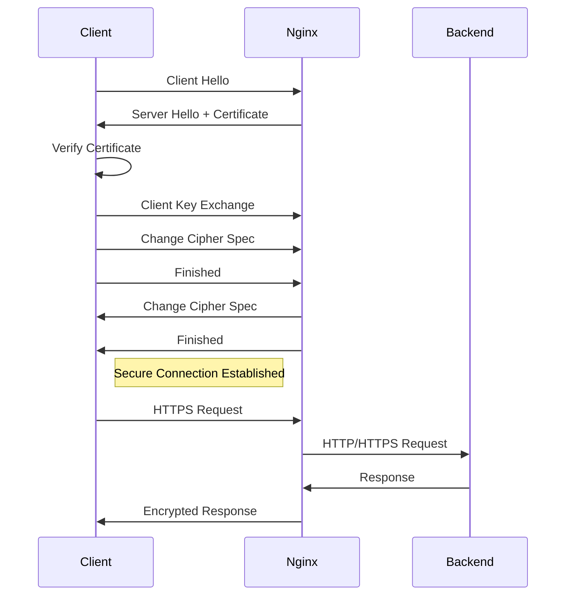

# Nginx SSL Configuration

## Introduction

In today's digital landscape, securing web traffic has become essential for protecting sensitive information and maintaining user trust. SSL (Secure Sockets Layer) and its successor TLS (Transport Layer Security) are cryptographic protocols that provide secure communication over a computer network.

This guide will walk you through configuring SSL/TLS in Nginx, one of the most popular web servers. By enabling HTTPS on your Nginx server, you'll:

- Encrypt data transmitted between users and your server
- Protect your users' privacy and sensitive information
- Improve your site's search engine ranking (Google favors HTTPS sites)
- Build trust with your audience through the visual security indicators in browsers

Whether you're hosting a personal blog or managing a complex web application, this guide will help you implement proper SSL configuration in Nginx.

## Prerequisites

Before we begin, make sure you have:

- A server with Nginx installed
- Root or sudo access to your server
- A domain name pointing to your server
- Basic familiarity with the command line
- An SSL certificate (we'll cover how to obtain one)

## Understanding SSL/TLS Certificates

### What is an SSL/TLS Certificate?

An SSL/TLS certificate is a digital certificate that:

1. Authenticates the identity of a website
2. Enables encrypted connections
3. Contains information about the certificate's owner, its validity period, and the public key needed for establishing secure connections

### Types of SSL Certificates

There are several types of SSL certificates available:

1. **Domain Validated (DV)** - Basic level verification that only confirms domain ownership
2. **Organization Validated (OV)** - Includes verification of the organization behind the domain
3. **Extended Validation (EV)** - Highest level of validation with thorough background checks
4. **Wildcard Certificates** - Secures a domain and unlimited subdomains
5. **Multi-Domain Certificates** - Secures multiple domains with a single certificate

### Certificate Authorities

SSL certificates are typically issued by trusted Certificate Authorities (CAs) such as:

- Let's Encrypt (free)
- DigiCert
- Comodo SSL
- GlobalSign
- GoDaddy
- Sectigo

For this guide, we'll use Let's Encrypt, which offers free DV certificates.

## Obtaining an SSL Certificate with Let's Encrypt

Let's Encrypt is a free, automated, and open Certificate Authority that provides an easy way to obtain SSL certificates.

### Installing Certbot

Certbot is a tool that simplifies the process of obtaining and renewing Let's Encrypt certificates.

For Ubuntu/Debian:

```bash
sudo apt update
sudo apt install certbot python3-certbot-nginx
```

For CentOS/RHEL:

```bash
sudo yum install epel-release
sudo yum install certbot python3-certbot-nginx
```

### Generating a Certificate

To obtain a certificate, run:

```bash
sudo certbot --nginx -d example.com -d www.example.com
```

Replace `example.com` and `www.example.com` with your actual domain name(s).

Certbot will:
1. Verify your domain ownership
2. Obtain certificates
3. Automatically update your Nginx configuration
4. Set up auto-renewal

If everything works correctly, you'll see a message indicating success.

## Manual SSL Configuration in Nginx

While Certbot can automatically configure Nginx, understanding the manual process is important for custom setups or troubleshooting.

### Basic SSL Configuration

Here's a basic Nginx server block for SSL:

```nginx
server {
    listen 80;
    server_name example.com www.example.com;
    
    # Redirect HTTP to HTTPS
    return 301 https://$host$request_uri;
}

server {
    listen 443 ssl;
    server_name example.com www.example.com;
    
    # SSL certificate files
    ssl_certificate /etc/letsencrypt/live/example.com/fullchain.pem;
    ssl_certificate_key /etc/letsencrypt/live/example.com/privkey.pem;
    
    # Root directory and index files
    root /var/www/html;
    index index.html index.htm;
    
    location / {
        try_files $uri $uri/ =404;
    }
}
```

### Advanced SSL Configuration for Security

For improved security, modify your SSL configuration with best practices:

```nginx
server {
    listen 80;
    server_name example.com www.example.com;
    return 301 https://$host$request_uri;
}

server {
    listen 443 ssl http2;
    server_name example.com www.example.com;
    
    # SSL certificate files
    ssl_certificate /etc/letsencrypt/live/example.com/fullchain.pem;
    ssl_certificate_key /etc/letsencrypt/live/example.com/privkey.pem;
    
    # Improve SSL settings
    ssl_protocols TLSv1.2 TLSv1.3;
    ssl_prefer_server_ciphers on;
    ssl_ciphers ECDHE-ECDSA-AES128-GCM-SHA256:ECDHE-RSA-AES128-GCM-SHA256:ECDHE-ECDSA-AES256-GCM-SHA384:ECDHE-RSA-AES256-GCM-SHA384:ECDHE-ECDSA-CHACHA20-POLY1305:ECDHE-RSA-CHACHA20-POLY1305:DHE-RSA-AES128-GCM-SHA256:DHE-RSA-AES256-GCM-SHA384;
    
    # DH parameters for perfect forward secrecy
    ssl_dhparam /etc/nginx/dhparam.pem;
    
    # HSTS (optional but recommended)
    add_header Strict-Transport-Security "max-age=63072000; includeSubDomains; preload" always;
    
    # OCSP Stapling
    ssl_stapling on;
    ssl_stapling_verify on;
    ssl_trusted_certificate /etc/letsencrypt/live/example.com/chain.pem;
    resolver 8.8.8.8 8.8.4.4 valid=300s;
    resolver_timeout 5s;
    
    # SSL session cache
    ssl_session_cache shared:SSL:10m;
    ssl_session_timeout 1h;
    ssl_session_tickets off;
    
    # Root directory and index files
    root /var/www/html;
    index index.html index.htm;
    
    location / {
        try_files $uri $uri/ =404;
    }
}
```

### Generating DH Parameters

For perfect forward secrecy, generate a Diffie-Hellman parameter file:

```bash
sudo openssl dhparam -out /etc/nginx/dhparam.pem 2048
```

This may take a few minutes to complete.

## Step-by-Step SSL Implementation

Let's walk through a complete implementation process:

### 1. Set up a basic Nginx server

```bash
# Install Nginx
sudo apt update
sudo apt install nginx

# Start and enable Nginx
sudo systemctl start nginx
sudo systemctl enable nginx
```

### 2. Create a basic website

```bash
# Create a directory for your site
sudo mkdir -p /var/www/example.com/html

# Create a sample index.html file
sudo nano /var/www/example.com/html/index.html
```

Add some basic HTML to the file:

```html
<!DOCTYPE html>
<html>
<head>
    <title>SSL Test Site</title>
</head>
<body>
    <h1>SSL Test Site</h1>
    <p>Congratulations! Your Nginx server is working.</p>
</body>
</html>
```

### 3. Configure Nginx for your domain

```bash
sudo nano /etc/nginx/sites-available/example.com
```

Add a basic server configuration:

```nginx
server {
    listen 80;
    server_name example.com www.example.com;
    root /var/www/example.com/html;
    index index.html index.htm;

    location / {
        try_files $uri $uri/ =404;
    }
}
```

Enable the site:

```bash
sudo ln -s /etc/nginx/sites-available/example.com /etc/nginx/sites-enabled/
sudo nginx -t
sudo systemctl reload nginx
```

### 4. Install Certbot and obtain SSL certificates

```bash
sudo apt install certbot python3-certbot-nginx
sudo certbot --nginx -d example.com -d www.example.com
```

### 5. Verify and enhance SSL configuration

Check your SSL configuration with online tools like [SSL Labs](https://www.ssllabs.com/ssltest/).

## SSL Configuration for Different Use Cases

### Configuration for Multiple Domains

To host multiple domains on the same server with individual SSL certificates:

```nginx
# First website
server {
    listen 443 ssl http2;
    server_name example1.com www.example1.com;
    
    ssl_certificate /etc/letsencrypt/live/example1.com/fullchain.pem;
    ssl_certificate_key /etc/letsencrypt/live/example1.com/privkey.pem;
    
    # SSL settings as in the advanced configuration
    
    root /var/www/example1.com/html;
    # Other directives...
}

# Second website
server {
    listen 443 ssl http2;
    server_name example2.com www.example2.com;
    
    ssl_certificate /etc/letsencrypt/live/example2.com/fullchain.pem;
    ssl_certificate_key /etc/letsencrypt/live/example2.com/privkey.pem;
    
    # SSL settings as in the advanced configuration
    
    root /var/www/example2.com/html;
    # Other directives...
}
```

### Configuration for Web Applications

For a web application like a Node.js app:

```nginx
server {
    listen 443 ssl http2;
    server_name app.example.com;
    
    # SSL certificate configuration
    ssl_certificate /etc/letsencrypt/live/app.example.com/fullchain.pem;
    ssl_certificate_key /etc/letsencrypt/live/app.example.com/privkey.pem;
    
    # SSL settings as in the advanced configuration
    
    location / {
        proxy_pass http://localhost:3000;
        proxy_http_version 1.1;
        proxy_set_header Upgrade $http_upgrade;
        proxy_set_header Connection 'upgrade';
        proxy_set_header Host $host;
        proxy_cache_bypass $http_upgrade;
    }
}
```

### Configuration for API Servers

For an API server:

```nginx
server {
    listen 443 ssl http2;
    server_name api.example.com;
    
    # SSL certificate configuration
    ssl_certificate /etc/letsencrypt/live/api.example.com/fullchain.pem;
    ssl_certificate_key /etc/letsencrypt/live/api.example.com/privkey.pem;
    
    # SSL settings as in the advanced configuration
    
    # Add CORS headers if needed
    add_header 'Access-Control-Allow-Origin' 'https://example.com';
    add_header 'Access-Control-Allow-Methods' 'GET, POST, OPTIONS';
    add_header 'Access-Control-Allow-Headers' 'DNT,User-Agent,X-Requested-With,If-Modified-Since,Cache-Control,Content-Type,Range,Authorization';
    
    location / {
        proxy_pass http://localhost:8080;
        proxy_http_version 1.1;
        proxy_set_header Host $host;
        proxy_set_header X-Real-IP $remote_addr;
        proxy_set_header X-Forwarded-For $proxy_add_x_forwarded_for;
        proxy_set_header X-Forwarded-Proto $scheme;
    }
}
```

## SSL Configuration Visual Flow

Here's a diagram showing the SSL handshake process:



## Troubleshooting Common SSL Issues

### 1. Certificate Verification Failures

**Problem**: Certificate not trusted by browsers

**Solution**:
- Ensure you've included the full certificate chain
- Check that your CA is trusted by major browsers
- Verify the certificate is correctly formatted

### 2. Certificate and Private Key Mismatch

**Problem**: SSL handshake failing due to mismatched private key

**Solution**:
- Verify the certificate and private key match using:
  ```bash
  sudo openssl x509 -noout -modulus -in certificate.crt | openssl md5
  sudo openssl rsa -noout -modulus -in private.key | openssl md5
  ```
  The output of both commands should be identical.

### 3. Mixed Content Warnings

**Problem**: Secure pages loading insecure resources

**Solution**:
- Update all resource URLs to use HTTPS
- Add Content-Security-Policy headers:
  ```nginx
  add_header Content-Security-Policy "upgrade-insecure-requests";
  ```

### 4. HTTPS Redirect Loop

**Problem**: Infinite redirect loop when forcing HTTPS

**Solution**:
- Check proxy headers if behind a load balancer
- Ensure redirect conditions are correctly set:
  ```nginx
  server {
      listen 80;
      server_name example.com www.example.com;
      
      # Check if not already HTTPS
      if ($scheme != "https") {
          return 301 https://$host$request_uri;
      }
  }
  ```

### 5. Certificate Renewal Failures

**Problem**: Certificates not renewing automatically

**Solution**:
- Check Certbot's renewal cron job:
  ```bash
  sudo systemctl status certbot.timer
  ```
- Ensure Nginx allows Let's Encrypt's validation requests
- Test renewal manually:
  ```bash
  sudo certbot renew --dry-run
  ```

## SSL Security Best Practices

1. **Use TLS 1.2 and 1.3 only**
   - Disable older, insecure protocols (SSL 3.0, TLS 1.0, TLS 1.1)

2. **Implement strong cipher suites**
   - Prioritize ECDHE and DHE ciphers for forward secrecy
   - Avoid weak ciphers (RC4, DES, 3DES, MD5)

3. **Enable HTTP Strict Transport Security (HSTS)**
   - Forces browsers to use HTTPS for your domain
   ```nginx
   add_header Strict-Transport-Security "max-age=63072000; includeSubDomains; preload";
   ```

4. **Implement OCSP Stapling**
   - Improves certificate validation performance
   ```nginx
   ssl_stapling on;
   ssl_stapling_verify on;
   ```

5. **Use strong DH parameters**
   - Generate a 2048-bit or 4096-bit DH group for key exchange

6. **Disable SSL session tickets**
   - Reduces risk of compromised session keys
   ```nginx
   ssl_session_tickets off;
   ```

7. **Configure proper SSL session cache**
   - Improves performance for returning visitors
   ```nginx
   ssl_session_cache shared:SSL:10m;
   ssl_session_timeout 1h;
   ```

8. **Regularly audit your SSL configuration**
   - Use tools like SSL Labs, testssl.sh, or Mozilla's Observatory

## Automating SSL Management

### Setting Up Auto-Renewal with Let's Encrypt

Let's Encrypt certificates are valid for 90 days and should be renewed before expiration. Certbot installs a systemd timer or cron job for automatic renewals.

To check if the timer is active:

```bash
sudo systemctl status certbot.timer
```

To manually trigger a renewal (useful for testing):

```bash
sudo certbot renew --dry-run
```

### Scaling SSL with Wildcard Certificates

For managing multiple subdomains, consider using a wildcard certificate:

```bash
sudo certbot certonly --manual --preferred-challenges=dns \
  --server https://acme-v02.api.letsencrypt.org/directory \
  --email admin@example.com -d example.com -d *.example.com
```

This requires DNS verification by adding TXT records to your domain.

## Summary

In this guide, we've covered:

1. The importance of SSL/TLS for web security
2. Obtaining free SSL certificates from Let's Encrypt
3. Basic and advanced Nginx SSL configuration
4. Setting up proper security headers and cipher suites
5. Troubleshooting common SSL issues
6. Best practices for SSL implementation
7. Automating certificate renewal and management

By following these steps, you've secured your Nginx web server with HTTPS, protecting your users' data and improving your site's trustworthiness and search engine ranking.

## Additional Resources

- [Nginx Official Documentation](https://nginx.org/en/docs/)
- [Let's Encrypt Documentation](https://letsencrypt.org/docs/)
- [Mozilla SSL Configuration Generator](https://ssl-config.mozilla.org/)
- [SSL Labs Server Test](https://www.ssllabs.com/ssltest/)
- [Security Headers Scanner](https://securityheaders.com/)

## Exercises

1. **Basic Setup Exercise**
   - Set up a basic Nginx server with SSL using Let's Encrypt
   - Verify your setup using SSL Labs and aim for an A grade

2. **Security Enhancement Exercise**
   - Implement HSTS, OCSP stapling, and strong cipher suites
   - Test your configuration for security vulnerabilities

3. **Multiple Domain Exercise**
   - Configure Nginx to serve multiple domains with separate SSL certificates
   - Implement proper redirection from HTTP to HTTPS

4. **Wildcard Certificate Exercise**
   - Obtain and configure a wildcard certificate for multiple subdomains
   - Set up DNS validation for Let's Encrypt

5. **Automation Exercise**
   - Create a bash script to automate certificate renewal and Nginx reloading
   - Set up email notifications for renewal failures