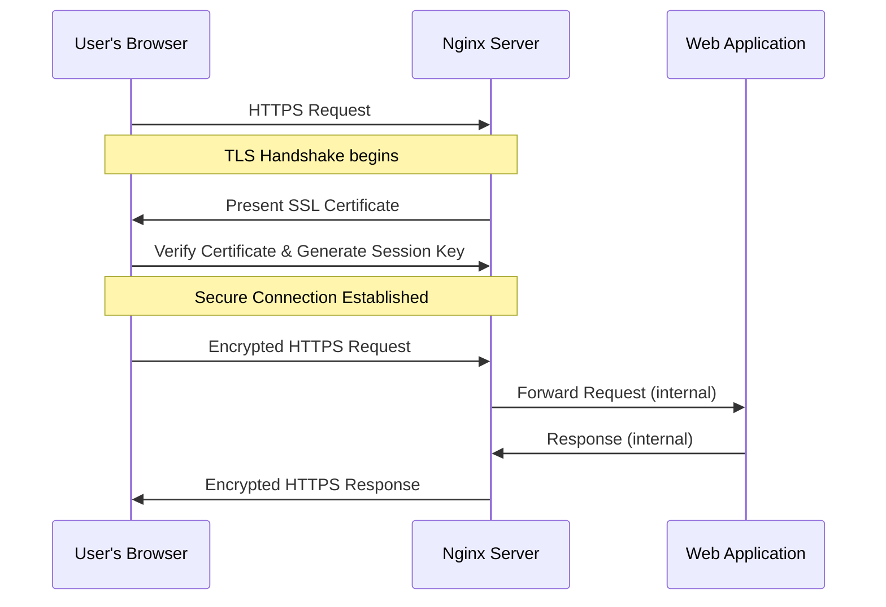

# Nginx HTTPS Setup

## Introduction

Securing your web applications with HTTPS is essential in today's internet landscape. HTTPS encrypts the data exchanged between your users and your server, protecting sensitive information from potential eavesdroppers and attackers. This tutorial will guide you through setting up HTTPS on your Nginx web server, a crucial step in securing your web applications.

HTTPS works by implementing SSL/TLS (Secure Sockets Layer/Transport Layer Security) protocols. These protocols create an encrypted connection between your users' browsers and your server, ensuring that all data transmitted remains private and unaltered during transfer.

## Prerequisites

Before starting with this tutorial, make sure you have:

- A server with Nginx installed
- A registered domain name pointing to your server
- Root or sudo access to your server
- Basic familiarity with terminal commands

## Understanding SSL/TLS Certificates

SSL/TLS certificates are digital files that:
- Verify the identity of your website
- Enable encrypted connections
- Create trust between your users and your website

There are several types of certificates:

1. **Domain Validated (DV)** - Basic verification of domain ownership
2. **Organization Validated (OV)** - Includes organization verification
3. **Extended Validation (EV)** - Highest level of validation

For a beginner setup, we'll focus on Domain Validated certificates, which are often free and sufficient for basic security needs.

## Getting an SSL/TLS Certificate

Let's Encrypt provides free, automated SSL/TLS certificates. We'll use Certbot to obtain and install a Let's Encrypt certificate.

### Installing Certbot

First, let's install Certbot and the Nginx plugin:

```bash
# For Ubuntu/Debian systems
sudo apt update
sudo apt install certbot python3-certbot-nginx

# For CentOS/RHEL systems
sudo yum install certbot python3-certbot-nginx
```

### Obtaining a Certificate

Now, let's obtain a certificate for your domain:

```bash
sudo certbot --nginx -d yourdomain.com -d www.yourdomain.com
```

Replace `yourdomain.com` with your actual domain name. If successful, Certbot will:

1. Verify your domain ownership
2. Obtain certificates
3. Automatically configure Nginx
4. Set up certificate renewal

The output should look something like:

```
Congratulations! You have successfully enabled HTTPS on
https://yourdomain.com and https://www.yourdomain.com

You should test your configuration at:
https://www.ssllabs.com/ssltest/analyze.html?d=yourdomain.com
```

## Manual Nginx HTTPS Configuration

While Certbot can automatically configure Nginx, understanding how to manually set up HTTPS is valuable knowledge. Here's how to configure Nginx for HTTPS:

### Step 1: Create an Nginx Server Block

Create or modify your Nginx server block configuration:

```nginx
server {
    listen 80;
    server_name yourdomain.com www.yourdomain.com;
    
    # Redirect all HTTP traffic to HTTPS
    return 301 https://$host$request_uri;
}

server {
    listen 443 ssl;
    server_name yourdomain.com www.yourdomain.com;
    
    # SSL/TLS certificate paths
    ssl_certificate /etc/letsencrypt/live/yourdomain.com/fullchain.pem;
    ssl_certificate_key /etc/letsencrypt/live/yourdomain.com/privkey.pem;
    
    # Document root directory
    root /var/www/yourdomain.com/html;
    index index.html index.htm;
    
    # Additional server configuration...
}
```

### Step 2: Configure SSL Parameters

For better security, add these SSL parameters to your HTTPS server block or in a separate file (e.g., `/etc/nginx/snippets/ssl-params.conf`) that you can include:

```nginx
# Optimized SSL settings
ssl_protocols TLSv1.2 TLSv1.3;
ssl_prefer_server_ciphers on;
ssl_ciphers ECDHE-ECDSA-AES128-GCM-SHA256:ECDHE-RSA-AES128-GCM-SHA256:ECDHE-ECDSA-AES256-GCM-SHA384:ECDHE-RSA-AES256-GCM-SHA384:ECDHE-ECDSA-CHACHA20-POLY1305:ECDHE-RSA-CHACHA20-POLY1305:DHE-RSA-AES128-GCM-SHA256:DHE-RSA-AES256-GCM-SHA384;
ssl_session_cache shared:SSL:10m;
ssl_session_timeout 1d;
ssl_session_tickets off;

# OCSP Stapling
ssl_stapling on;
ssl_stapling_verify on;
resolver 8.8.8.8 8.8.4.4 valid=300s;
resolver_timeout 5s;

# Security headers
add_header Strict-Transport-Security "max-age=63072000; includeSubDomains; preload";
add_header X-Content-Type-Options nosniff;
add_header X-Frame-Options DENY;
add_header X-XSS-Protection "1; mode=block";
```

If using a separate file, include it in your server block:

```nginx
server {
    listen 443 ssl;
    # Other server settings...
    
    include snippets/ssl-params.conf;
    
    # Rest of configuration...
}
```

### Step 3: Test and Restart Nginx

Before applying changes, test your Nginx configuration:

```bash
sudo nginx -t
```

If the test is successful, restart Nginx:

```bash
sudo systemctl restart nginx
```

## Understanding the HTTPS Flow

Here's a simplified diagram of how HTTPS works with Nginx:



## Best Practices for Nginx HTTPS Configuration

### 1. Redirect HTTP to HTTPS

Always redirect HTTP traffic to HTTPS to ensure users are always on a secure connection:

```nginx
server {
    listen 80;
    server_name yourdomain.com www.yourdomain.com;
    return 301 https://$host$request_uri;
}
```

### 2. Implement Strong Security Headers

Security headers protect against various attacks:

```nginx
add_header Strict-Transport-Security "max-age=63072000; includeSubDomains; preload";
add_header Content-Security-Policy "default-src 'self'; script-src 'self' 'unsafe-inline' 'unsafe-eval' https://www.google-analytics.com";
add_header X-Content-Type-Options nosniff;
add_header X-Frame-Options DENY;
add_header X-XSS-Protection "1; mode=block";
add_header Referrer-Policy strict-origin-when-cross-origin;
```

### 3. Use Strong Ciphers and TLS Versions

Disable outdated protocols and ciphers:

```nginx
ssl_protocols TLSv1.2 TLSv1.3;
ssl_prefer_server_ciphers on;
ssl_ciphers ECDHE-ECDSA-AES128-GCM-SHA256:ECDHE-RSA-AES128-GCM-SHA256:ECDHE-ECDSA-AES256-GCM-SHA384:ECDHE-RSA-AES256-GCM-SHA384:ECDHE-ECDSA-CHACHA20-POLY1305:ECDHE-RSA-CHACHA20-POLY1305:DHE-RSA-AES128-GCM-SHA256:DHE-RSA-AES256-GCM-SHA384;
```

### 4. Configure Diffie-Hellman Parameters

Generate and use strong DH parameters:

```bash
sudo openssl dhparam -out /etc/nginx/dhparam.pem 2048
```

Then add to your Nginx configuration:

```nginx
ssl_dhparam /etc/nginx/dhparam.pem;
```

### 5. Set Up Automated Certificate Renewal

Let's Encrypt certificates expire after 90 days. Certbot sets up an automatic renewal process, but verify it's working correctly:

```bash
sudo certbot renew --dry-run
```

## Troubleshooting Common Issues

### Certificate Not Found

If Nginx can't find your certificate files:

1. Verify the paths in your configuration match the actual certificate location
2. Check file permissions (Nginx needs read access)
3. Ensure certificates were successfully generated

### Mixed Content Warnings

If your site shows mixed content warnings:

1. Use a tool like [Why No Padlock](https://www.whynopadlock.com/) to identify insecure content
2. Update resources to use HTTPS URLs
3. Add this header to force HTTPS for all content:

```nginx
add_header Content-Security-Policy "upgrade-insecure-requests";
```

### Certificate Validation Errors

If visitors see certificate validation errors:

1. Verify your certificate chain is complete
2. Ensure your domain name matches the certificate's common name or subject alternative names
3. Check if your certificate has expired

## Testing Your HTTPS Setup

After setting up HTTPS, test your configuration:

1. Visit your site with HTTPS (https://yourdomain.com)
2. Check for the padlock icon in your browser
3. Test your site with [SSL Labs](https://www.ssllabs.com/ssltest/)
4. Verify automatic HTTP to HTTPS redirection works

## Summary

Setting up HTTPS with Nginx is a critical security measure for any website. In this tutorial, you've learned:

- The importance of HTTPS for web security
- How to obtain free SSL/TLS certificates with Let's Encrypt
- How to configure Nginx for HTTPS
- Best practices for SSL/TLS configuration
- Troubleshooting common HTTPS issues

By implementing these steps, you've significantly improved your website's security, protected your users' data, and improved your site's reputation with both users and search engines.

## Additional Resources

- [Nginx Official Documentation on HTTPS](https://nginx.org/en/docs/http/configuring_https_servers.html)
- [Let's Encrypt Documentation](https://letsencrypt.org/docs/)
- [Mozilla SSL Configuration Generator](https://ssl-config.mozilla.org/)
- [SSL Labs Server Test](https://www.ssllabs.com/ssltest/)

## Exercises

1. Set up HTTPS on a test domain and aim for an A+ rating on SSL Labs.
2. Configure HTTP/2 with your HTTPS setup for improved performance.
3. Implement HSTS preloading for your domain.
4. Set up multiple subdomains with a wildcard certificate.
5. Create a bash script to check certificate expiration and send alerts.