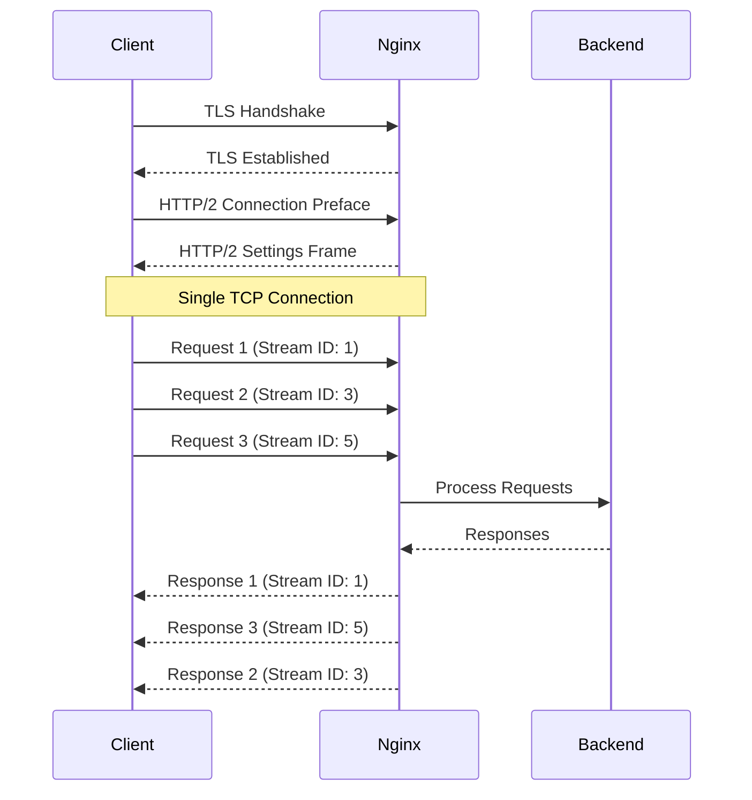

# Nginx HTTP2 Setup

## Introduction

HTTP/2 is the second major version of the HTTP protocol, designed to improve web performance by addressing many of the limitations of HTTP/1.1. It offers several important benefits including:

- **Multiplexing**: Allows multiple requests and responses to be sent over a single connection simultaneously
- **Header compression**: Reduces overhead by compressing HTTP headers
- **Server push**: Enables servers to proactively send resources to clients before they request them
- **Binary protocol**: More efficient to parse compared to the text-based HTTP/1.1

In this guide, we'll walk through the process of setting up HTTP/2 in Nginx, an essential skill for improving both the performance and security of your web applications.

## Prerequisites

Before we begin, make sure you have:

1. Nginx version 1.9.5 or higher installed (HTTP/2 support was added in this version)
2. SSL/TLS certificate (HTTP/2 in browsers only works over HTTPS)
3. Root or sudo access to your server

## Checking Nginx Version

First, let's confirm that your Nginx version supports HTTP/2:

```bash
nginx -v
```

Expected output:
```
nginx version: nginx/1.20.1
```

If your version is below 1.9.5, you'll need to upgrade Nginx first.

## Setting Up HTTP/2 in Nginx

### Step 1: Configure SSL/TLS

HTTP/2 requires a secure connection (HTTPS), so we need to set up SSL/TLS first. If you already have SSL configured, you can skip to Step 2.

Here's how to configure a basic SSL setup in your Nginx server block:

```nginx
server {
    listen 443 ssl;
    server_name example.com www.example.com;
    
    ssl_certificate /path/to/your/certificate.crt;
    ssl_certificate_key /path/to/your/private.key;
    
    # Other SSL settings
    ssl_protocols TLSv1.2 TLSv1.3;
    ssl_prefer_server_ciphers on;
    ssl_ciphers ECDHE-ECDSA-AES128-GCM-SHA256:ECDHE-RSA-AES128-GCM-SHA256:ECDHE-ECDSA-AES256-GCM-SHA384:ECDHE-RSA-AES256-GCM-SHA384:ECDHE-ECDSA-CHACHA20-POLY1305:ECDHE-RSA-CHACHA20-POLY1305:DHE-RSA-AES128-GCM-SHA256:DHE-RSA-AES256-GCM-SHA384;
    
    # ... rest of your configuration
}
```

### Step 2: Enable HTTP/2

Enabling HTTP/2 is remarkably simple. You just need to add the `http2` parameter to your `listen` directive:

```nginx
server {
    listen 443 ssl http2;
    server_name example.com www.example.com;
    
    ssl_certificate /path/to/your/certificate.crt;
    ssl_certificate_key /path/to/your/private.key;
    
    # Rest of your SSL and server configuration
}
```

That's it! The `http2` parameter tells Nginx to use the HTTP/2 protocol for this server block.

### Step 3: HTTP to HTTPS Redirection

It's a good practice to redirect all HTTP traffic to HTTPS, especially when using HTTP/2:

```nginx
server {
    listen 80;
    server_name example.com www.example.com;
    
    return 301 https://$host$request_uri;
}
```

### Step 4: Testing the Configuration

Always validate your Nginx configuration before reloading:

```bash
sudo nginx -t
```

Expected output:
```
nginx: the configuration file /etc/nginx/nginx.conf syntax is ok
nginx: configuration file /etc/nginx/nginx.conf test is successful
```

### Step 5: Reload Nginx

Apply the changes by reloading Nginx:

```bash
sudo systemctl reload nginx
```

## Verifying HTTP/2 Is Working

There are several ways to verify that HTTP/2 is working correctly:

### Method 1: Using Chrome DevTools

1. Open Chrome DevTools (F12 or Right-click > Inspect)
2. Go to the "Network" tab
3. Visit your website
4. Click on any resource and check the "Protocol" column or field - it should say "h2" for HTTP/2

### Method 2: Using curl

You can use curl to check for HTTP/2 support:

```bash
curl -I --http2 https://example.com
```

Look for `HTTP/2` in the response:

```
HTTP/2 200
server: nginx/1.20.1
date: Fri, 14 Mar 2025 12:34:56 GMT
content-type: text/html; charset=UTF-8
...
```

### Method 3: Online Testing Tools

You can use online tools like [KeyCDN HTTP/2 Test](https://tools.keycdn.com/http2-test) or [HTTP/2 Test](https://http2.pro/) to verify your HTTP/2 setup.

## HTTP/2 Performance Optimization

Now that you have HTTP/2 enabled, here are some optimization tips:

### 1. Adjust Nginx Worker Connections

Since HTTP/2 uses fewer connections, you might want to adjust your worker connections:

```nginx
events {
    worker_connections 1024;
}
```

### 2. Optimize SSL Parameters

```nginx
ssl_session_cache shared:SSL:10m;
ssl_session_timeout 10m;
ssl_session_tickets off;
ssl_stapling on;
ssl_stapling_verify on;
```

### 3. Fine-tune Buffer Sizes

```nginx
http {
    client_body_buffer_size 16k;
    client_header_buffer_size 1k;
    client_max_body_size 8m;
    large_client_header_buffers 2 1k;
}
```

## Understanding HTTP/2 Flow

Here's a diagram showing how HTTP/2 communication works:



## Common Issues and Troubleshooting

### Issue 1: HTTP/2 Not Working Despite Configuration

**Possible causes:**
- Nginx version doesn't support HTTP/2
- Configuration syntax error
- SSL certificate issues

**Solution:**
Check your Nginx version, validate your configuration, and verify your SSL certificates.

### Issue 2: ALPN Negotiation Failed

**Possible cause:**
OpenSSL version is too old to support ALPN (Application-Layer Protocol Negotiation)

**Solution:**
Upgrade OpenSSL to version 1.0.2 or higher:

```bash
openssl version
sudo apt update
sudo apt upgrade openssl
```

### Issue 3: Performance Not Improved

**Possible cause:**
Your website might not be optimized to leverage HTTP/2 benefits

**Solution:**
- Combine small CSS/JS files instead of using many tiny files
- Implement proper caching
- Optimize images and assets

## Security Considerations with HTTP/2

While HTTP/2 itself improves security by requiring HTTPS, there are additional security considerations:

### 1. Keep Nginx Updated

Regular updates help protect against newly discovered vulnerabilities:

```bash
sudo apt update
sudo apt upgrade nginx
```

### 2. Implement Strong SSL Ciphers

```nginx
ssl_protocols TLSv1.2 TLSv1.3;
ssl_prefer_server_ciphers on;
ssl_ciphers ECDHE-ECDSA-AES128-GCM-SHA256:ECDHE-RSA-AES128-GCM-SHA256:ECDHE-ECDSA-AES256-GCM-SHA384:ECDHE-RSA-AES256-GCM-SHA384:ECDHE-ECDSA-CHACHA20-POLY1305:ECDHE-RSA-CHACHA20-POLY1305:DHE-RSA-AES128-GCM-SHA256:DHE-RSA-AES256-GCM-SHA384;
```

### 3. Implement Security Headers

```nginx
add_header Strict-Transport-Security "max-age=31536000; includeSubDomains" always;
add_header X-Content-Type-Options nosniff;
add_header X-Frame-Options SAMEORIGIN;
add_header X-XSS-Protection "1; mode=block";
```

## Complete Configuration Example

Here's a complete Nginx configuration example with HTTP/2 and security best practices:

```nginx
http {
    # General HTTP settings
    sendfile on;
    tcp_nopush on;
    tcp_nodelay on;
    keepalive_timeout 65;
    types_hash_max_size 2048;
    server_tokens off;
    
    # MIME types
    include /etc/nginx/mime.types;
    default_type application/octet-stream;
    
    # Logging
    access_log /var/log/nginx/access.log;
    error_log /var/log/nginx/error.log;
    
    # Gzip compression
    gzip on;
    gzip_vary on;
    gzip_proxied any;
    gzip_comp_level 6;
    gzip_types text/plain text/css application/json application/javascript text/xml application/xml application/xml+rss text/javascript;
    
    # SSL settings
    ssl_protocols TLSv1.2 TLSv1.3;
    ssl_prefer_server_ciphers on;
    ssl_ciphers ECDHE-ECDSA-AES128-GCM-SHA256:ECDHE-RSA-AES128-GCM-SHA256:ECDHE-ECDSA-AES256-GCM-SHA384:ECDHE-RSA-AES256-GCM-SHA384:ECDHE-ECDSA-CHACHA20-POLY1305:ECDHE-RSA-CHACHA20-POLY1305:DHE-RSA-AES128-GCM-SHA256:DHE-RSA-AES256-GCM-SHA384;
    ssl_session_cache shared:SSL:10m;
    ssl_session_timeout 10m;
    ssl_session_tickets off;
    ssl_stapling on;
    ssl_stapling_verify on;
    resolver 8.8.8.8 8.8.4.4 valid=300s;
    resolver_timeout 5s;
    
    # HTTP/2 Server Block
    server {
        listen 443 ssl http2;
        listen [::]:443 ssl http2;
        server_name example.com www.example.com;
        
        ssl_certificate /path/to/your/certificate.crt;
        ssl_certificate_key /path/to/your/private.key;
        
        root /var/www/html;
        index index.html index.htm index.php;
        
        # Security headers
        add_header Strict-Transport-Security "max-age=31536000; includeSubDomains" always;
        add_header X-Content-Type-Options nosniff;
        add_header X-Frame-Options SAMEORIGIN;
        add_header X-XSS-Protection "1; mode=block";
        
        location / {
            try_files $uri $uri/ =404;
        }
        
        # PHP handling example
        location ~ \.php$ {
            include snippets/fastcgi-php.conf;
            fastcgi_pass unix:/var/run/php/php7.4-fpm.sock;
        }
        
        # Deny access to hidden files
        location ~ /\. {
            deny all;
        }
    }
    
    # HTTP to HTTPS redirect
    server {
        listen 80;
        listen [::]:80;
        server_name example.com www.example.com;
        
        return 301 https://$host$request_uri;
    }
}
```

## Summary

In this guide, you've learned how to:

1. Set up HTTP/2 in Nginx to improve performance and security
2. Configure SSL/TLS certificates, required for HTTP/2
3. Redirect HTTP traffic to HTTPS
4. Verify that HTTP/2 is working correctly
5. Optimize your Nginx configuration for HTTP/2
6. Implement important security measures for your HTTP/2 setup

HTTP/2 is a significant improvement over HTTP/1.1, offering better performance through multiplexing, header compression, and other optimizations. By following this guide, you've not only improved your website's performance but also enhanced its security posture.

## Further Learning

To deepen your understanding of HTTP/2 and Nginx security, consider exploring:

1. HTTP/2 Server Push configuration in Nginx
2. Advanced SSL/TLS optimization techniques
3. Performance testing and benchmarking HTTP/2 vs HTTP/1.1
4. Nginx rate limiting and request throttling
5. Web Application Firewall (WAF) integration with Nginx

## Practice Exercises

1. Set up HTTP/2 on a test server and measure the performance improvement compared to HTTP/1.1
2. Configure HTTP/2 Server Push for critical CSS and JavaScript files
3. Implement rate limiting to protect your HTTP/2-enabled website from DDoS attacks
4. Create a script to regularly check and renew your SSL certificates
5. Set up HTTP/3 (QUIC) alongside HTTP/2 for future-proofing (requires Nginx 1.19.0+ with the quic patch)