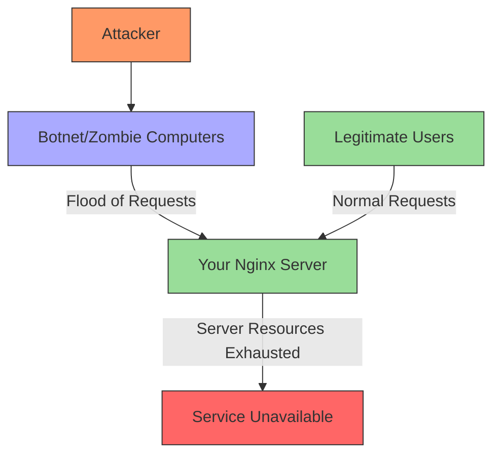

# Nginx DDoS Protection

## Introduction

Distributed Denial of Service (DDoS) attacks are one of the most common threats web applications face today. These attacks attempt to overwhelm your servers with a flood of malicious traffic, preventing legitimate users from accessing your services. Nginx, being a powerful and flexible web server, provides several built-in features and configuration options that can help mitigate DDoS attacks.

In this guide, we'll explore how to configure Nginx to protect your web applications from various types of DDoS attacks. We'll cover basic rate limiting, connection limiting, and more advanced techniques to build a robust defense system.

## Understanding DDoS Attacks

Before diving into protection methods, let's understand what DDoS attacks typically look like:



Common types of DDoS attacks include:

1. **HTTP Flood** - Overwhelming the server with GET/POST requests
2. **SYN Flood** - Sending many TCP SYN packets without completing the handshake
3. **UDP Flood** - Sending large numbers of UDP packets to random ports
4. **Slowloris** - Keeping many connections open by sending partial HTTP requests

## Basic DDoS Protection Techniques

### 1. Rate Limiting

Rate limiting restricts the number of requests a client can make in a given timeframe. This is one of the most effective ways to mitigate HTTP-based DDoS attacks.

To implement basic rate limiting in Nginx:

```nginx
http {
    # Define a zone for limiting
    limit_req_zone $binary_remote_addr zone=my_limit:10m rate=10r/s;
    
    server {
        location / {
            # Apply rate limiting
            limit_req zone=my_limit burst=20 nodelay;
            
            # Your other configuration
            proxy_pass http://my_upstream;
        }
    }
}
```

In this configuration:
- `$binary_remote_addr` uses the client's IP address as the key
- `zone=my_limit:10m` creates a 10MB shared memory zone named "my_limit"
- `rate=10r/s` allows 10 requests per second per IP address
- `burst=20` allows bursts of up to 20 requests
- `nodelay` processes requests without delay as long as they're within the burst limit

### 2. Connection Limiting

Connection limiting restricts how many connections a single client can establish, which helps prevent connection-based attacks:

```nginx
http {
    # Define a zone for limiting connections
    limit_conn_zone $binary_remote_addr zone=conn_limit:10m;
    
    server {
        # Apply connection limiting - max 10 connections per IP
        limit_conn conn_limit 10;
        
        # Your other configuration
    }
}
```

### 3. Buffer Size Limitations

Limiting buffer sizes can prevent attackers from consuming excessive memory:

```nginx
http {
    # Set buffer size limitations
    client_body_buffer_size 1k;
    client_header_buffer_size 1k;
    client_max_body_size 1m;
    large_client_header_buffers 2 1k;
    
    server {
        # Your server configuration
    }
}
```

### 4. Timeout Settings

Properly configured timeout settings can mitigate slow DDoS attacks:

```nginx
http {
    # Configure various timeouts
    client_body_timeout 10;
    client_header_timeout 10;
    keepalive_timeout 65;
    send_timeout 10;
    
    server {
        # Your server configuration
    }
}
```

## Advanced DDoS Protection

### 1. IP-based Blocking

You can block suspicious IP addresses or ranges:

```nginx
http {
    # Include a blocklist file
    include /etc/nginx/conf.d/blocklist.conf;
    
    server {
        # Your server configuration
    }
}
```

And in `/etc/nginx/conf.d/blocklist.conf`:

```nginx
# Block individual IPs
deny 192.168.1.1;

# Block IP ranges
deny 192.168.1.0/24;

# Allow specific IPs
allow 10.0.0.1;

# Block everyone else (use carefully!)
# deny all;
```

### 2. User Agent Filtering

Block suspicious user agents:

```nginx
server {
    # Block suspicious user agents
    if ($http_user_agent ~* (curl|wget|python|nikto|sqlmap)) {
        return 403;
    }
    
    # Your other configuration
}
```

### 3. Implementing Firewall Rules with Nginx

Nginx can act as a basic application-level firewall:

```nginx
http {
    # Define a geo module to categorize IPs
    geo $limit {
        default 1;
        10.0.0.0/8 0;  # Trusted IPs don't get limited
        192.168.0.0/16 0;
    }
    
    # Use the geo module result with rate limiting
    limit_req_zone $binary_remote_addr zone=req_zone:10m rate=10r/s;
    
    map $limit $limit_key {
        0 "";  # Trusted IPs use empty key (no limiting)
        1 $binary_remote_addr;  # Others use their IP
    }
    
    server {
        location / {
            limit_req zone=req_zone burst=10 nodelay;
            # Your other configuration
        }
    }
}
```

## Real-World Configuration Example

Here's a complete configuration that combines multiple protection techniques:

```nginx
user nginx;
worker_processes auto;
error_log /var/log/nginx/error.log warn;
pid /var/run/nginx.pid;

events {
    worker_connections 1024;
}

http {
    # Basic settings
    include /etc/nginx/mime.types;
    default_type application/octet-stream;
    sendfile on;
    keepalive_timeout 65;
    
    # DDoS protection: Define rate limiting zones
    limit_req_zone $binary_remote_addr zone=one:10m rate=1r/s;
    limit_req_zone $binary_remote_addr zone=two:10m rate=10r/s;
    
    # DDoS protection: Define connection limiting
    limit_conn_zone $binary_remote_addr zone=addr:10m;
    
    # Server configuration
    server {
        listen 80;
        server_name example.com www.example.com;
        
        # Restrict timeout
        client_body_timeout 10s;
        client_header_timeout 10s;
        
        # Buffer size limitations
        client_body_buffer_size 200k;
        client_header_buffer_size 2k;
        client_max_body_size 200k;
        large_client_header_buffers 3 1k;
        
        # Global connection limiting per IP
        limit_conn addr 10;
        
        # Location-specific rules
        location / {
            # Rate limiting for general access
            limit_req zone=two burst=100 nodelay;
            
            # Your website configuration
            root /usr/share/nginx/html;
            index index.html;
        }
        
        # Strict rate limiting for login endpoints
        location /login {
            limit_req zone=one burst=5 nodelay;
            
            # Your login page configuration
            proxy_pass http://backend_servers;
        }
        
        # Block suspicious requests
        location ~ (\.(svn|git|hg|bzr|cvs)|/wp-admin/|/wp-login) {
            deny all;
            return 404;
        }
    }
}
```

## Testing Your DDoS Protection

It's important to test your configuration to ensure it works as expected. Here's how you can simulate a basic load test using `ab` (ApacheBench):

```bash
# Install ApacheBench if needed
sudo apt install apache2-utils

# Send 1000 requests, 100 concurrently
ab -n 1000 -c 100 http://your-site.com/
```

When the rate limit is exceeded, Nginx will return a 503 Service Temporarily Unavailable error. You can customize this response:

```nginx
# Custom error for rate limiting
limit_req_status 429;  # Too Many Requests
error_page 429 /too_many_requests.html;

location = /too_many_requests.html {
    root /usr/share/nginx/html;
    internal;
}
```

## Using Nginx Plus for Enhanced DDoS Protection

Nginx Plus (the commercial version) offers additional features for DDoS protection:

1. **Dynamic Rate Limiting**: Adjust rate limits dynamically based on server load
2. **Real-time Monitoring**: Dashboard to visualize attack patterns
3. **Advanced Analytics**: Detailed traffic analysis
4. **API-based Configuration**: Programmatically update protection rules

If your application faces significant threats, consider upgrading to Nginx Plus or combining Nginx with specialized DDoS protection services.

## Additional Tools That Work With Nginx

For more comprehensive protection, consider integrating Nginx with:

1. **ModSecurity**: Web Application Firewall that can be used with Nginx
2. **Fail2ban**: Automatically ban IPs that show malicious behavior
3. **CloudFlare**: CDN with built-in DDoS protection that works well with Nginx

Example of integrating Fail2ban with Nginx:

```bash
# Install Fail2ban
sudo apt install fail2ban

# Create Nginx-specific jail configuration
sudo nano /etc/fail2ban/jail.d/nginx.conf
```

Add this content to the configuration file:

```ini
[nginx-req-limit]
enabled = true
filter = nginx-req-limit
action = iptables-multiport[name=ReqLimit, port="http,https", protocol=tcp]
logpath = /var/log/nginx/error.log
findtime = 600
bantime = 7200
maxretry = 10
```

## Summary

In this guide, we've covered various techniques to protect your Nginx server from DDoS attacks:

1. **Basic rate limiting** to control request frequency
2. **Connection limiting** to prevent connection saturation
3. **Buffer size limitations** to prevent memory exhaustion
4. **Timeout configuration** to mitigate slow attacks
5. **IP and User-Agent blocking** to filter suspicious traffic
6. **Real-world configuration examples** that combine multiple techniques

Remember that DDoS protection is not a one-size-fits-all solution. You should adjust these configurations based on your specific application needs, traffic patterns, and threat model.

## Exercises

1. Configure basic rate limiting on your Nginx server and test it using ApacheBench.
2. Set up different rate limits for various endpoints based on their sensitivity.
3. Implement and test connection limiting on your Nginx server.
4. Create a custom error page for when rate limits are exceeded.
5. Set up Fail2ban to work with your Nginx server.

## Additional Resources

- [Nginx Documentation on Rate Limiting](https://nginx.org/en/docs/http/ngx_http_limit_req_module.html)
- [Nginx Blog: Mitigating DDoS Attacks](https://www.nginx.com/blog/mitigating-ddos-attacks-with-nginx-and-nginx-plus/)
- [OWASP DDoS Prevention Cheat Sheet](https://cheatsheetseries.owasp.org/cheatsheets/DDoS_Cheat_Sheet.html)

By implementing these protection measures, you'll significantly improve your web application's resilience against DDoS attacks, ensuring better availability for your legitimate users.