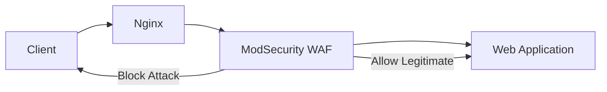

# Nginx ModSecurity

## Introduction

ModSecurity is an open-source Web Application Firewall (WAF) that can be integrated with Nginx to provide real-time protection against various web application attacks. It acts as a shield between your web application and potential attackers, inspecting incoming HTTP requests and outgoing responses to identify and block malicious traffic.

In this guide, we'll explore how to implement ModSecurity with Nginx, configure security rules, and protect your web applications from common security threats such as SQL injection, cross-site scripting (XSS), and more.



## Why Use ModSecurity with Nginx?

- **Layer of Defense**: Adds an essential security layer to detect and prevent attacks
- **Customizable Rules**: Allows you to create and tailor rules specific to your application
- **Real-time Monitoring**: Provides visibility into attack patterns and security events
- **OWASP Protection**: Includes rules to protect against OWASP Top 10 vulnerabilities
- **Minimal Performance Impact**: When properly configured, adds minimal overhead

## Prerequisites

Before we begin, ensure you have:

- A server with Nginx installed
- Root or sudo access to your server
- Basic knowledge of Nginx configuration
- Familiarity with the Linux command line

## Installation

### Step 1: Install Required Dependencies

First, we need to install the necessary dependencies to compile ModSecurity:

```bash
# For Debian/Ubuntu systems
sudo apt update
sudo apt install -y git build-essential libpcre3-dev libxml2-dev libyajl-dev \
  libcurl4-openssl-dev libgeoip-dev liblmdb-dev libpcre++-dev pkgconf zlib1g-dev libssl-dev
```

### Step 2: Clone and Compile ModSecurity

Next, we'll clone and compile the ModSecurity library:

```bash
# Create a working directory
mkdir ~/nginx-modsecurity
cd ~/nginx-modsecurity

# Clone ModSecurity repository
git clone --depth 1 -b v3/master --single-branch https://github.com/SpiderLabs/ModSecurity
cd ModSecurity

# Initialize and update submodules
git submodule init
git submodule update

# Build ModSecurity
./build.sh
./configure
make
sudo make install
```

### Step 3: Download the Nginx Connector for ModSecurity

Now, we'll download the Nginx connector for ModSecurity:

```bash
cd ~/nginx-modsecurity
git clone --depth 1 https://github.com/SpiderLabs/ModSecurity-nginx.git
```

### Step 4: Compile Nginx with ModSecurity

If you have Nginx installed from source, you'll need to recompile it with the ModSecurity module. If you installed Nginx from a package manager, you'll need to compile a dynamic module:

```bash
# Get Nginx version
NGINX_VERSION=$(nginx -v 2>&1 | awk -F/ '{print $2}')

# Download the corresponding Nginx source
wget https://nginx.org/download/nginx-$NGINX_VERSION.tar.gz
tar zxvf nginx-$NGINX_VERSION.tar.gz
cd nginx-$NGINX_VERSION

# Configure Nginx with ModSecurity module
./configure --with-compat --add-dynamic-module=../ModSecurity-nginx

# Compile only the modules
make modules

# Copy the module to Nginx modules directory
sudo cp objs/ngx_http_modsecurity_module.so /etc/nginx/modules/
```

### Step 5: Configure Nginx to Use ModSecurity

Edit your Nginx configuration to load and use ModSecurity:

```nginx
# In /etc/nginx/nginx.conf, at the top of the file
load_module modules/ngx_http_modsecurity_module.so;

http {
    # Other http configurations...
    
    # ModSecurity configuration
    modsecurity on;
    modsecurity_rules_file /etc/nginx/modsec/main.conf;
}
```

### Step 6: Set Up ModSecurity Configuration

Create the basic ModSecurity configuration:

```bash
# Create the directory
sudo mkdir -p /etc/nginx/modsec

# Copy the recommended configuration
sudo cp ~/nginx-modsecurity/ModSecurity/modsecurity.conf-recommended /etc/nginx/modsec/modsecurity.conf

# Create the main configuration file
sudo touch /etc/nginx/modsec/main.conf
```

Edit the main configuration file `/etc/nginx/modsec/main.conf`:

```
# Include the ModSecurity configuration
Include /etc/nginx/modsec/modsecurity.conf

# Set the default rules engine mode to On (actively blocking)
SecRuleEngine On

# Include OWASP Core Rule Set (CRS)
Include /etc/nginx/modsec/owasp-crs/crs-setup.conf
Include /etc/nginx/modsec/owasp-crs/rules/*.conf
```

### Step 7: Install OWASP Core Rule Set (CRS)

The OWASP Core Rule Set provides a set of rules to protect against common web attacks:

```bash
cd /etc/nginx/modsec
sudo git clone https://github.com/coreruleset/coreruleset owasp-crs
sudo cp owasp-crs/crs-setup.conf.example owasp-crs/crs-setup.conf
```

### Step 8: Configure ModSecurity Parameters

Edit the ModSecurity config file at `/etc/nginx/modsec/modsecurity.conf`:

```
# -- Rule engine initialization ----------------------------------------------

# Enable ModSecurity
SecRuleEngine On

# -- Request body handling ---------------------------------------------------

# Allow ModSecurity to access request bodies
SecRequestBodyAccess On

# -- Response body handling --------------------------------------------------

# Allow ModSecurity to access response bodies
SecResponseBodyAccess On

# -- Audit logging ----------------------------------------------------------

# Log everything to a file
SecAuditEngine RelevantOnly
SecAuditLogRelevantStatus "^(?:5|4(?!04))"
SecAuditLogParts ABIJDEFHZ
SecAuditLogType Serial
SecAuditLog /var/log/nginx/modsec_audit.log

# -- Debug Mode --------------------------------------------------------------

# Disable debug mode in production
SecDebugLog /var/log/nginx/modsec_debug.log
SecDebugLogLevel 0
```

### Step 9: Test and Restart Nginx

Test your Nginx configuration and restart the service:

```bash
sudo nginx -t
sudo systemctl restart nginx
```

## Basic ModSecurity Rules

ModSecurity uses rules to detect and block malicious requests. Let's examine some basic rules:

### Creating a Custom Rule File

Create a file for your custom rules:

```bash
sudo touch /etc/nginx/modsec/custom-rules.conf
```

Then include this file in your main configuration (`/etc/nginx/modsec/main.conf`):

```
# Include custom rules
Include /etc/nginx/modsec/custom-rules.conf
```

### Rule Structure

ModSecurity rules follow this structure:

```
SecRule VARIABLES "OPERATOR" "ACTIONS"
```

Where:
- `VARIABLES`: What to inspect (like ARGS, REQUEST_HEADERS, etc.)
- `OPERATOR`: How to inspect (like regex matching with @rx)
- `ACTIONS`: What to do when the rule matches (like block, log, etc.)

### Example Rules

Here are some example rules to add to your `custom-rules.conf` file:

#### Blocking SQL Injection Attempts

```
# Block SQL injection attempts
SecRule ARGS "@rx select.*from" \
    "id:1000,\
    phase:2,\
    deny,\
    status:403,\
    log,\
    msg:'Potential SQL Injection Attack'"
```

#### Blocking Cross-Site Scripting (XSS) Attempts

```
# Block XSS attempts
SecRule ARGS "@rx <script.*>" \
    "id:1001,\
    phase:2,\
    deny,\
    status:403,\
    log,\
    msg:'Potential XSS Attack'"
```

#### Rate Limiting Rules

```
# Rate limiting - track by IP
SecAction \
    "id:1002,\
    phase:1,\
    nolog,\
    pass,\
    initcol:ip=%{REMOTE_ADDR},\
    setvar:ip.requests=+1,\
    expirevar:ip.requests=60"

# Block if too many requests
SecRule IP:REQUESTS "@gt 100" \
    "id:1003,\
    phase:1,\
    deny,\
    status:429,\
    log,\
    msg:'Rate limit exceeded'"
```

## Real-World Example: Securing a WordPress Site

Let's see a practical example of securing a WordPress site with ModSecurity and Nginx:

```nginx
server {
    listen 80;
    server_name example.com;
    
    # ModSecurity configuration
    modsecurity on;
    modsecurity_rules_file /etc/nginx/modsec/main.conf;
    
    # Specific WordPress protection rules
    location /wp-login.php {
        # Apply additional ModSecurity rules to WordPress login
        modsecurity_rules '
            # Limit login attempts
            SecRule IP:WORDPRESS_LOGIN "@gt 5" \
                "id:2000,\
                phase:1,\
                deny,\
                status:403,\
                log,\
                setvar:ip.wordpress_block=1,\
                expirevar:ip.wordpress_block=300,\
                msg:\'WordPress login attempt limit exceeded\'"
        ';
        
        # Regular location configuration
        try_files $uri $uri/ /index.php?$args;
        
        # Pass to PHP handler
        include fastcgi_params;
        fastcgi_pass unix:/var/run/php/php7.4-fpm.sock;
        fastcgi_param SCRIPT_FILENAME $document_root$fastcgi_script_name;
    }
    
    # Protect wp-config.php
    location = /wp-config.php {
        deny all;
    }
    
    # Other WordPress locations
    location / {
        try_files $uri $uri/ /index.php?$args;
        
        # Pass to PHP handler
        location ~ \.php$ {
            include fastcgi_params;
            fastcgi_pass unix:/var/run/php/php7.4-fpm.sock;
            fastcgi_param SCRIPT_FILENAME $document_root$fastcgi_script_name;
        }
    }
}
```

In this example, we've applied ModSecurity to our WordPress site with special protection for the login page.

## Advanced Configuration

### Adjusting Detection Sensitivity

ModSecurity can be too restrictive by default. You can adjust its sensitivity by:

1. Using the `SecRuleEngine` directive:
   - `SecRuleEngine On`: Full blocking mode
   - `SecRuleEngine DetectionOnly`: Detection without blocking
   - `SecRuleEngine Off`: Disabled

2. Selectively disabling rules:

```
# Disable a specific rule
SecRuleRemoveById 942100

# Disable a group of rules
SecRuleRemoveByTag "attack-sqli"
```

### Logging and Monitoring

To effectively use ModSecurity, set up proper logging:

```
# In modsecurity.conf
SecAuditLog /var/log/nginx/modsec_audit.log
SecAuditLogFormat JSON
```

You can then monitor these logs for attack patterns using tools like:
- ELK Stack (Elasticsearch, Logstash, Kibana)
- Graylog
- Splunk

### Performance Optimization

To maintain performance with ModSecurity:

1. Limit which parts of the request to inspect:

```
# Only inspect specific file types
SecRule REQUEST_FILENAME "!\.(gif|jpg|png|css|js)$" \
    "id:1004,\
    phase:1,\
    pass,\
    nolog,\
    ctl:ruleEngine=On"

SecRule REQUEST_FILENAME "\.(gif|jpg|png|css|js)$" \
    "id:1005,\
    phase:1,\
    pass,\
    nolog,\
    ctl:ruleEngine=Off"
```

2. Adjust inspection limits:

```
# Adjust request body limit
SecRequestBodyLimit 13107200
SecRequestBodyNoFilesLimit 131072
```

## Troubleshooting

### Common Issues and Solutions

1. **False Positives**: ModSecurity might block legitimate traffic

   Solution: Use DetectionOnly mode initially and analyze logs:
   ```
   SecRuleEngine DetectionOnly
   ```

2. **Performance Issues**: High CPU usage or latency

   Solution: Optimize rules and increase resource limits:
   ```
   # Adjust timeouts
   SecRequestBodyTimeout 60
   
   # Disable inspection for static content
   SecRule REQUEST_FILENAME "\.(jpg|jpeg|png|gif|css|js)$" "id:1006,phase:1,allow,nolog"
   ```

3. **Rule Conflicts**: Multiple rules causing unexpected behavior

   Solution: Debug by identifying problematic rules:
   ```
   # Increase debug level temporarily
   SecDebugLogLevel 3
   ```

### How to Debug ModSecurity Issues

1. Enable debug logging with an appropriate level:
   ```
   SecDebugLog /var/log/nginx/modsec_debug.log
   SecDebugLogLevel 3
   ```

2. Test specific requests that are causing issues:
   ```bash
   curl -v "http://your-website.com/?test=select%20from"
   ```

3. Check the debug log to see which rules triggered:
   ```bash
   tail -f /var/log/nginx/modsec_debug.log
   ```

## Summary

ModSecurity provides a powerful layer of protection for your Nginx web server. In this guide, we've covered:

- Installing and configuring ModSecurity with Nginx
- Setting up basic and custom security rules
- Applying ModSecurity to protect real-world applications like WordPress
- Advanced configuration options for performance and usability
- Troubleshooting common issues

By implementing ModSecurity, you can significantly enhance your web application's security posture and protect against common attacks. Remember that security is an ongoing process that requires regular updates and monitoring to stay effective against evolving threats.

## Additional Resources

For further learning:

- [Official ModSecurity Documentation](https://github.com/SpiderLabs/ModSecurity/wiki)
- [OWASP ModSecurity Core Rule Set (CRS) Documentation](https://coreruleset.org/documentation/)
- [ModSecurity Handbook](https://www.feistyduck.com/books/modsecurity-handbook/) by Ivan Ristić

## Exercises

1. Install ModSecurity with Nginx on a test server and verify it's working.
2. Create a custom rule to block requests containing a specific User-Agent.
3. Implement ModSecurity in DetectionOnly mode and analyze logs for potential attacks.
4. Set up protection for a specific web application with custom rules.
5. Experiment with different SecRuleEngine settings and observe the effects.