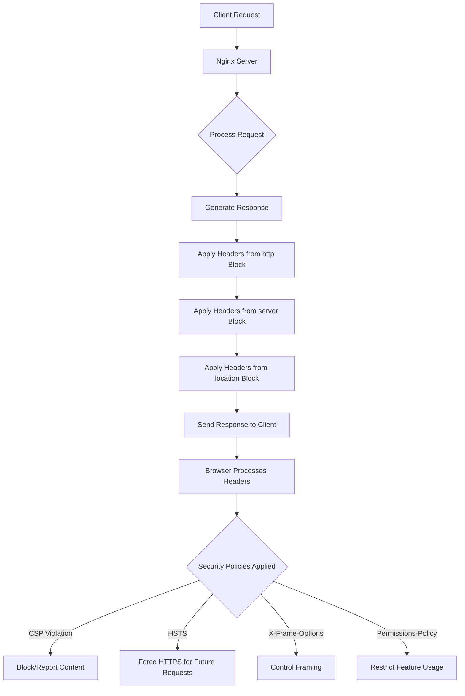

# Nginx Headers Security

## Introduction

HTTP headers are an essential part of web communication, acting as metadata that provides additional information about the HTTP request or response. When it comes to web security, properly configured HTTP response headers can significantly enhance your website's security posture by protecting against various attacks like Cross-Site Scripting (XSS), clickjacking, and other common vulnerabilities.

In this guide, we'll explore how to configure security-related headers in Nginx, one of the most popular web servers and reverse proxies. By the end of this tutorial, you'll understand how these headers work and how to implement them to enhance your web application's security.

## Why HTTP Security Headers Matter

Before diving into implementation, let's understand why security headers are crucial:

1. **Defense in Depth**: They provide an additional layer of security beyond your application code
2. **Browser Behavior Control**: They instruct browsers how to behave when handling your site's content
3. **Attack Surface Reduction**: They help mitigate various attack vectors with minimal configuration

## Essential Security Headers for Nginx

Let's look at the most important security headers you should configure in your Nginx server.

### X-Content-Type-Options

This header prevents browsers from MIME-sniffing a response away from the declared content type, reducing the risk of content-type confusion attacks.

```nginx
add_header X-Content-Type-Options nosniff;
```

**What it does**: Browsers will strictly interpret the file based on the Content-Type header, preventing attackers from disguising malicious files as benign ones.

### X-Frame-Options

This header helps prevent clickjacking attacks by controlling whether your page can be embedded in frames on other websites.

```nginx
add_header X-Frame-Options SAMEORIGIN;
```

**Options**:
- `DENY`: Prevents any domain from framing your content
- `SAMEORIGIN`: Allows only your own domain to frame your content
- `ALLOW-FROM uri`: Allows specified URI to frame your content (deprecated in modern browsers)

### Content-Security-Policy (CSP)

CSP is a powerful header that helps mitigate a wide range of attacks, particularly XSS vulnerabilities, by specifying which dynamic resources are allowed to load.

```nginx
add_header Content-Security-Policy "default-src 'self'; script-src 'self' https://trusted-cdn.com; img-src 'self' https://trusted-images.com; style-src 'self' https://trusted-styles.com; font-src 'self'; connect-src 'self'; frame-ancestors 'self'; form-action 'self';";
```

**Basic directives**:
- `default-src`: Fallback for other resource types
- `script-src`: Controls JavaScript sources
- `style-src`: Controls CSS sources
- `img-src`: Controls image sources
- `connect-src`: Controls URLs for fetch, WebSocket, and EventSource
- `frame-ancestors`: Controls which sites can embed your page (similar to X-Frame-Options)
- `form-action`: Restricts where forms can be submitted

### Strict-Transport-Security (HSTS)

HSTS forces browsers to use HTTPS instead of HTTP, protecting against protocol downgrade attacks and cookie hijacking.

```nginx
add_header Strict-Transport-Security "max-age=31536000; includeSubDomains; preload";
```

**Parameters**:
- `max-age`: Duration (in seconds) browsers should remember to access the site via HTTPS
- `includeSubDomains`: Apply policy to all subdomains
- `preload`: Indicates intent to submit to browser HSTS preload list (optional)

### X-XSS-Protection

Although modern browsers rely more on CSP, this legacy header can provide an additional layer of XSS protection for older browsers.

```nginx
add_header X-XSS-Protection "1; mode=block";
```

**Options**:
- `0`: Disables XSS filtering
- `1`: Enables XSS filtering
- `1; mode=block`: Enables XSS filtering and prevents rendering of the page if an attack is detected

### Referrer-Policy

Controls how much referrer information is included with requests.

```nginx
add_header Referrer-Policy "strict-origin-when-cross-origin";
```

**Common values**:
- `no-referrer`: No referrer information is sent
- `no-referrer-when-downgrade`: Don't send referrer when HTTPS → HTTP
- `same-origin`: Only send for same-origin requests
- `strict-origin`: Send only the origin for HTTPS → HTTPS
- `strict-origin-when-cross-origin`: Send full URL for same-origin, only origin for cross-origin

### Permissions-Policy (formerly Feature-Policy)

Controls which browser features and APIs can be used in your web application.

```nginx
add_header Permissions-Policy "camera=(), microphone=(), geolocation=(), interest-cohort=()";
```

This example disables access to camera, microphone, geolocation, and FLoC (Federated Learning of Cohorts).

## Implementing Security Headers in Nginx

Now let's see how to integrate these headers into your Nginx configuration. You can add headers at different levels:

### Server Block Level

This applies headers to all responses from a specific server:

```nginx
server {
    listen 80;
    server_name example.com;
    
    # Security headers
    add_header X-Content-Type-Options nosniff;
    add_header X-Frame-Options SAMEORIGIN;
    add_header X-XSS-Protection "1; mode=block";
    add_header Content-Security-Policy "default-src 'self';";
    add_header Strict-Transport-Security "max-age=31536000; includeSubDomains" always;
    add_header Referrer-Policy "strict-origin-when-cross-origin";
    add_header Permissions-Policy "camera=(), microphone=(), geolocation=()";
    
    # Other server configurations...
}
```

### Location Block Level

For more specific control, you can add headers to particular locations:

```nginx
server {
    listen 80;
    server_name example.com;
    
    location / {
        # Security headers for main content
        add_header X-Content-Type-Options nosniff;
        add_header X-Frame-Options SAMEORIGIN;
        # Other headers...
    }
    
    location /api/ {
        # Different security policy for API
        add_header Content-Security-Policy "default-src 'none'; connect-src 'self'";
        # Other API-specific headers...
    }
}
```

### HTTP Block Level

For server-wide defaults:

```nginx
http {
    # Default security headers for all servers
    add_header X-Content-Type-Options nosniff;
    add_header X-Frame-Options SAMEORIGIN;
    # Other headers...
    
    server {
        # Server-specific configurations...
    }
}
```

## Important Considerations

When implementing security headers, keep these things in mind:

1. **Header Inheritance**: By default, Nginx doesn't inherit headers from higher levels if a lower level sets any `add_header` directives. Use the `always` parameter to force inheritance.

```nginx
add_header X-Frame-Options SAMEORIGIN always;
```

2. **Testing**: Always test your headers using tools like:
   - [Security Headers](https://securityheaders.com/)
   - [Mozilla Observatory](https://observatory.mozilla.org/)

3. **CSP Reporting**: Start with CSP in report-only mode to identify issues:

```nginx
add_header Content-Security-Policy-Report-Only "default-src 'self'; report-uri https://example.com/csp-report";
```

## Practical Example: Complete Nginx Configuration

Here's a comprehensive example that implements all the security headers we've discussed:

```nginx
server {
    listen 80;
    server_name example.com;
    
    # Redirect all HTTP traffic to HTTPS
    return 301 https://$host$request_uri;
}

server {
    listen 443 ssl http2;
    server_name example.com;
    
    # SSL configuration
    ssl_certificate /path/to/cert.pem;
    ssl_certificate_key /path/to/key.pem;
    ssl_protocols TLSv1.2 TLSv1.3;
    ssl_ciphers HIGH:!aNULL:!MD5;
    ssl_prefer_server_ciphers on;
    
    # Security headers
    add_header X-Content-Type-Options nosniff always;
    add_header X-Frame-Options SAMEORIGIN always;
    add_header X-XSS-Protection "1; mode=block" always;
    add_header Strict-Transport-Security "max-age=31536000; includeSubDomains; preload" always;
    add_header Referrer-Policy "strict-origin-when-cross-origin" always;
    add_header Permissions-Policy "camera=(), microphone=(), geolocation=(), interest-cohort=()" always;
    
    # Standard CSP for main website
    add_header Content-Security-Policy "default-src 'self'; script-src 'self' https://trusted-cdn.com; img-src 'self' data:; style-src 'self' 'unsafe-inline' https://trusted-styles.com; font-src 'self'; connect-src 'self'; frame-ancestors 'self'; form-action 'self';" always;
    
    # Root location
    location / {
        root /var/www/html;
        index index.html;
        try_files $uri $uri/ =404;
    }
    
    # API location with different CSP
    location /api/ {
        add_header Content-Security-Policy "default-src 'none'; connect-src 'self';" always;
        
        # API proxy configuration
        proxy_pass http://backend_api;
        proxy_set_header Host $host;
        proxy_set_header X-Real-IP $remote_addr;
    }
    
    # Static assets location
    location /static/ {
        alias /var/www/static/;
        expires 30d;
    }
}
```

## Verifying Your Headers

After implementing security headers, it's important to verify they're working correctly. Here's how you can check:

### Using curl

```bash
curl -I https://example.com
```

This will show all headers returned by your server:

```
HTTP/2 200 
server: nginx/1.18.0
date: Fri, 14 Mar 2025 12:00:00 GMT
content-type: text/html; charset=UTF-8
content-length: 12345
x-content-type-options: nosniff
x-frame-options: SAMEORIGIN
x-xss-protection: 1; mode=block
content-security-policy: default-src 'self'; script-src 'self' https://trusted-cdn.com; ...
strict-transport-security: max-age=31536000; includeSubDomains; preload
referrer-policy: strict-origin-when-cross-origin
permissions-policy: camera=(), microphone=(), geolocation=(), interest-cohort=()
```

### Using Online Tools

For a more comprehensive analysis, use online tools that provide detailed reports and recommendations:

1. **Security Headers** (https://securityheaders.com)
2. **Mozilla Observatory** (https://observatory.mozilla.org)
3. **ImmuniWeb** (https://www.immuniweb.com/websec/)

## Common Issues and Troubleshooting

### Content Doesn't Load After Adding CSP

If parts of your website stop functioning after implementing CSP, check your browser's console for CSP violation reports. You may need to:

1. Add missing sources to your CSP directives
2. Use 'unsafe-inline' or nonces temporarily while refactoring inline scripts
3. Start with CSP in report-only mode to identify all required sources

```nginx
# Report-only mode helps identify issues without breaking functionality
add_header Content-Security-Policy-Report-Only "default-src 'self'; script-src 'self'; report-uri https://example.com/csp-report";
```

### Headers Not Being Applied

If your headers aren't showing up in responses:

1. Verify the `add_header` directives are in the right context
2. Check if a lower-level block is overriding headers; add the `always` parameter
3. Ensure your Nginx configuration is valid with `nginx -t`
4. Restart Nginx after configuration changes with `systemctl restart nginx`

## Security Headers Evolution

HTTP security headers continue to evolve. Here's what to know:

1. Some older headers are being deprecated (like X-XSS-Protection) in favor of newer ones (like CSP)
2. Feature-Policy has been replaced by Permissions-Policy
3. New headers are being introduced to address emerging threats

Keep your configurations up-to-date by following security blogs and the [Mozilla Web Security Guidelines](https://infosec.mozilla.org/guidelines/web_security).

## Flow of Header Processing

Let's visualize how security headers are processed:



## Summary

Properly configured security headers are an essential part of a comprehensive web security strategy. They instruct browsers how to handle your content and help protect against various attacks. The key headers to implement in your Nginx server include:

- X-Content-Type-Options
- X-Frame-Options
- Content-Security-Policy
- Strict-Transport-Security
- Referrer-Policy
- Permissions-Policy

By following the examples and guidelines in this tutorial, you can significantly improve your website's security posture with minimal effort. Remember to regularly test and update your security headers as best practices evolve.

## Additional Resources

- [OWASP Secure Headers Project](https://owasp.org/www-project-secure-headers/)
- [Mozilla MDN: HTTP Headers](https://developer.mozilla.org/en-US/docs/Web/HTTP/Headers)
- [Nginx Documentation](https://nginx.org/en/docs/)
- [Content Security Policy Reference](https://content-security-policy.com/)

## Exercises

1. Set up a basic Nginx server and implement all the security headers discussed in this guide.
2. Use online tools to scan your server and improve its security score.
3. Create a custom CSP that allows resources only from specific domains.
4. Implement CSP reporting and analyze the violations.
5. Compare the security headers of popular websites to understand real-world implementations.

By implementing proper security headers in your Nginx configuration, you've taken a significant step toward protecting your web applications against common vulnerabilities. Keep learning and stay up-to-date with the latest security best practices!