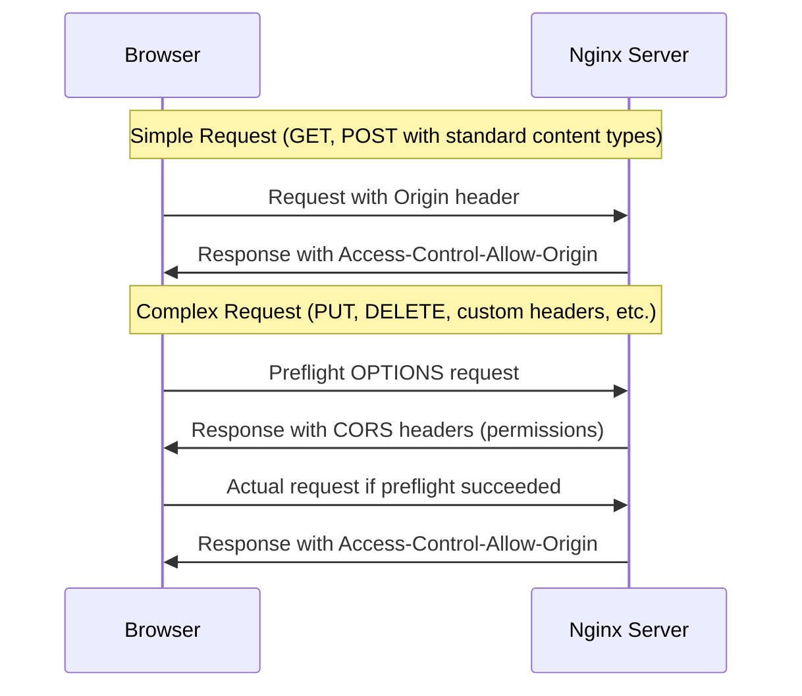

# Nginx CORS Configuration

## Introduction

Cross-Origin Resource Sharing (CORS) is a security feature implemented by web browsers that restricts web pages from making requests to a different domain than the one that served the original page. This same-origin policy helps prevent malicious websites from accessing sensitive data on other sites. However, there are legitimate cases where you need resources from different domains to interact.

This is where CORS comes in - it's a mechanism that allows servers to specify who can access their resources and how. Nginx, a popular web server and reverse proxy, provides several ways to configure CORS headers to enable safe cross-origin requests.

In this guide, we'll explore how to properly configure CORS in Nginx to maintain security while allowing necessary cross-origin communication.

## Understanding CORS Basics

Before diving into Nginx configuration, let's understand the key concepts of CORS:

### What is a Cross-Origin Request?

A cross-origin request occurs when a webpage from one domain (origin) requests a resource from a different domain. For example:

- Page served from: `https://myapp.com`
- API request to: `https://api.example.com`

Without proper CORS configuration, the browser blocks this request for security reasons.

### Key CORS Headers

The primary HTTP headers involved in CORS are:

1. `Access-Control-Allow-Origin`: Specifies which origins can access the resource
2. `Access-Control-Allow-Methods`: Specifies the HTTP methods allowed when accessing the resource
3. `Access-Control-Allow-Headers`: Indicates which HTTP headers can be used during the request
4. `Access-Control-Allow-Credentials`: Indicates whether the request can include credentials (cookies, HTTP authentication)
5. `Access-Control-Expose-Headers`: Specifies which headers can be exposed to the client
6. `Access-Control-Max-Age`: Specifies how long the preflight request results can be cached

### The CORS Request Flow



## Basic Nginx CORS Configuration

Let's start with a simple Nginx configuration that allows CORS requests from any origin:

```nginx
server {
    listen 80;
    server_name api.example.com;

    location / {
        # Your existing configuration here
        
        # Simple CORS configuration
        add_header 'Access-Control-Allow-Origin' '*';
        add_header 'Access-Control-Allow-Methods' 'GET, POST, OPTIONS';
        add_header 'Access-Control-Allow-Headers' 'DNT,User-Agent,X-Requested-With,If-Modified-Since,Cache-Control,Content-Type,Range';
        
        # Handle preflight OPTIONS requests
        if ($request_method = 'OPTIONS') {
            add_header 'Access-Control-Max-Age' 1728000;
            add_header 'Content-Type' 'text/plain charset=UTF-8';
            add_header 'Content-Length' 0;
            return 204;
        }
    }
}
```

This configuration:
- Allows requests from any origin (`*`)
- Permits GET, POST, and OPTIONS methods
- Allows common HTTP headers
- Handles OPTIONS preflight requests properly

## Configuring CORS for Specific Origins

In production environments, it's more secure to specify which origins can access your resources rather than allowing all origins (`*`):

```nginx
server {
    listen 80;
    server_name api.example.com;
    
    location / {
        # Your existing configuration here
        
        # Check Origin header
        set $cors_origin "";
        if ($http_origin ~ "^https://(www\.)?myapp\.com$") {
            set $cors_origin $http_origin;
        }
        
        # Set CORS headers if origin is allowed
        if ($cors_origin) {
            add_header 'Access-Control-Allow-Origin' $cors_origin;
            add_header 'Access-Control-Allow-Methods' 'GET, POST, PUT, DELETE, OPTIONS';
            add_header 'Access-Control-Allow-Headers' 'Authorization,Content-Type,Accept,Origin,User-Agent,DNT,Cache-Control,X-Mx-ReqToken,X-Requested-With';
            add_header 'Access-Control-Allow-Credentials' 'true';
            add_header 'Access-Control-Expose-Headers' 'Content-Length,Content-Range';
        }
        
        # Handle preflight OPTIONS requests
        if ($request_method = 'OPTIONS') {
            add_header 'Access-Control-Max-Age' 1728000;
            add_header 'Content-Type' 'text/plain charset=UTF-8';
            add_header 'Content-Length' 0;
            return 204;
        }
    }
}
```

This configuration:
- Only allows requests from domains matching `https://(www.)?myapp.com`
- Sends back the actual requesting origin in the `Access-Control-Allow-Origin` header
- Allows credentials to be included in requests
- Exposes certain headers to the client application

## Multiple Allowed Origins

If you need to allow multiple specific origins, you can use a more complex condition:

```nginx
map $http_origin $cors_origin {
    default "";
    "https://myapp.com" "$http_origin";
    "https://admin.myapp.com" "$http_origin";
    "https://partner.example.org" "$http_origin";
}

server {
    listen 80;
    server_name api.example.com;
    
    location / {
        # Your existing configuration here
        
        # Set CORS headers if origin is allowed
        if ($cors_origin) {
            add_header 'Access-Control-Allow-Origin' $cors_origin always;
            add_header 'Access-Control-Allow-Methods' 'GET, POST, PUT, DELETE, OPTIONS' always;
            add_header 'Access-Control-Allow-Headers' 'Authorization,Content-Type,Accept,Origin,User-Agent,DNT,Cache-Control,X-Mx-ReqToken,X-Requested-With' always;
            add_header 'Access-Control-Allow-Credentials' 'true' always;
        }
        
        # Handle preflight OPTIONS requests
        if ($request_method = 'OPTIONS') {
            add_header 'Access-Control-Max-Age' 1728000 always;
            add_header 'Content-Type' 'text/plain charset=UTF-8';
            add_header 'Content-Length' 0;
            return 204;
        }
    }
}
```

Note the use of the `always` parameter with `add_header`, which ensures headers are sent even for error responses.

## Common Pitfalls and Solutions

### Headers Not Being Set

One common issue is that Nginx's `add_header` directives are only applied to successful responses by default. Use the `always` parameter to ensure headers are sent even for error responses:

```nginx
add_header 'Access-Control-Allow-Origin' $cors_origin always;
```

### Missing Options for Preflight Requests

Make sure your server properly handles OPTIONS requests for preflight checks:

```nginx
if ($request_method = 'OPTIONS') {
    add_header 'Access-Control-Allow-Origin' $cors_origin always;
    add_header 'Access-Control-Allow-Methods' 'GET, POST, PUT, DELETE, OPTIONS' always;
    add_header 'Access-Control-Allow-Headers' 'Authorization,Content-Type,Accept,Origin,User-Agent' always;
    add_header 'Access-Control-Max-Age' 1728000 always;
    add_header 'Content-Type' 'text/plain charset=UTF-8';
    add_header 'Content-Length' 0;
    return 204;
}
```

### Credentials Not Working

If your application needs to send cookies or authentication headers, you must:

1. Set `Access-Control-Allow-Credentials` to `true`
2. Specify the exact origin rather than using the wildcard `*`
3. Configure your client to include credentials (e.g., `fetch()` with `credentials: 'include'`)

```nginx
# NOT working with credentials
add_header 'Access-Control-Allow-Origin' '*';
add_header 'Access-Control-Allow-Credentials' 'true';

# Working with credentials
add_header 'Access-Control-Allow-Origin' 'https://myapp.com';
add_header 'Access-Control-Allow-Credentials' 'true';
```

## Real-World Example: API Gateway Configuration

Here's a complete example for an Nginx server acting as an API gateway:

```nginx
http {
    # Define allowed origins
    map $http_origin $cors_origin {
        default "";
        "https://app.example.com" "$http_origin";
        "https://admin.example.com" "$http_origin";
        "http://localhost:3000" "$http_origin"; # For development
    }
    
    server {
        listen 443 ssl;
        server_name api.example.com;
        
        # SSL configuration (recommended for production)
        ssl_certificate /path/to/certificate.crt;
        ssl_certificate_key /path/to/private.key;
        
        # API endpoints
        location /api/ {
            # Proxy to your backend
            proxy_pass http://backend_servers;
            proxy_set_header Host $host;
            proxy_set_header X-Real-IP $remote_addr;
            
            # CORS headers for normal responses
            if ($cors_origin) {
                add_header 'Access-Control-Allow-Origin' $cors_origin always;
                add_header 'Access-Control-Allow-Methods' 'GET, POST, PUT, DELETE, PATCH, OPTIONS' always;
                add_header 'Access-Control-Allow-Headers' 'Authorization,Content-Type,Accept,Origin,User-Agent,X-Requested-With,X-API-Key' always;
                add_header 'Access-Control-Allow-Credentials' 'true' always;
                add_header 'Access-Control-Expose-Headers' 'Content-Length,Content-Range,X-RateLimit-Remaining' always;
            }
            
            # Handle preflight OPTIONS requests
            if ($request_method = 'OPTIONS') {
                add_header 'Access-Control-Max-Age' 1728000 always;
                add_header 'Content-Type' 'text/plain charset=UTF-8';
                add_header 'Content-Length' 0;
                return 204;
            }
        }
        
        # Deny access to .htaccess files
        location ~ /\.ht {
            deny all;
        }
    }
    
    # Redirect HTTP to HTTPS
    server {
        listen 80;
        server_name api.example.com;
        return 301 https://$server_name$request_uri;
    }
}
```

This configuration:
- Uses a secure HTTPS connection
- Allows only specific origins
- Provides all necessary CORS headers
- Properly handles preflight requests
- Includes security best practices

## Testing Your CORS Configuration

After implementing your CORS configuration, test it with a simple cross-origin request:

```javascript
// From a page on https://myapp.com
fetch('https://api.example.com/data', {
  method: 'GET',
  credentials: 'include' // If using credentials
})
.then(response => response.json())
.then(data => console.log('Success:', data))
.catch(error => console.error('Error:', error));

// For a request with custom headers
fetch('https://api.example.com/data', {
  method: 'POST',
  headers: {
    'Content-Type': 'application/json',
    'X-API-Key': 'my-api-key'
  },
  body: JSON.stringify({ key: 'value' }),
  credentials: 'include'
})
.then(response => response.json())
.then(data => console.log('Success:', data))
.catch(error => console.error('Error:', error));
```

You can check the browser's developer console for CORS errors if something isn't configured correctly.

## Security Considerations

When implementing CORS, consider these security best practices:

1. **Be specific with origins**: Avoid using `*` in production environments
2. **Limit allowed methods**: Only include HTTP methods your API actually needs
3. **Restrict allowed headers**: Only allow headers your application requires
4. **Use HTTPS**: Always use secure connections for cross-origin requests
5. **Set reasonable max-age**: Balance between performance and security when caching preflight results
6. **Regularly audit CORS policies**: Review and update your allowed origins as needs change

## Summary

Configuring CORS in Nginx allows you to safely enable cross-origin requests while maintaining security boundaries. By properly setting CORS headers, you can control which origins, methods, and headers are permitted to access your resources.

Remember these key points:

- CORS is a browser security feature that restricts cross-origin requests
- Nginx can be configured to send the appropriate CORS headers
- Be specific about which origins can access your resources
- Properly handle preflight OPTIONS requests
- Consider security implications when setting up CORS

## Additional Resources

- [MDN Web Docs: Cross-Origin Resource Sharing (CORS)](https://developer.mozilla.org/en-US/docs/Web/HTTP/CORS)
- [Nginx Documentation](https://nginx.org/en/docs/)
- [OWASP CORS Security Cheat Sheet](https://cheatsheetseries.owasp.org/cheatsheets/Cross-Site_Request_Forgery_Prevention_Cheat_Sheet.html)

## Exercise

Try implementing these challenges to test your understanding:

1. Configure Nginx to allow CORS requests only from subdomains of your main domain (e.g., `*.example.com`)
2. Set up different CORS configurations for different API endpoints
3. Create a development environment configuration that allows localhost origins while your production configuration only allows your production domains