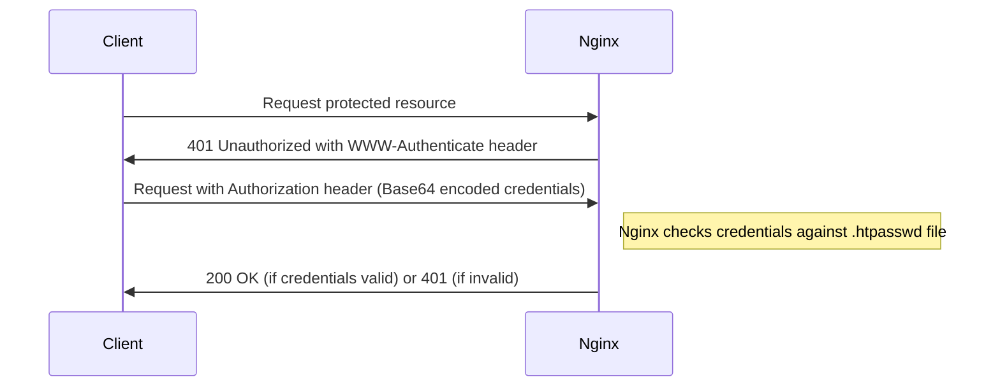
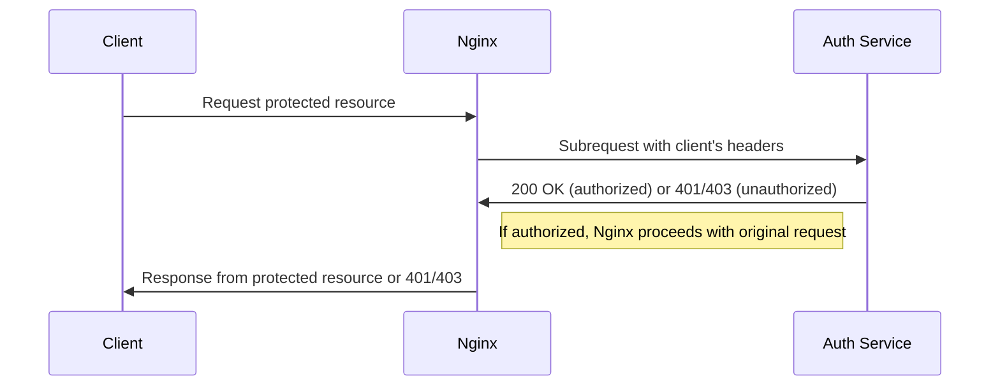
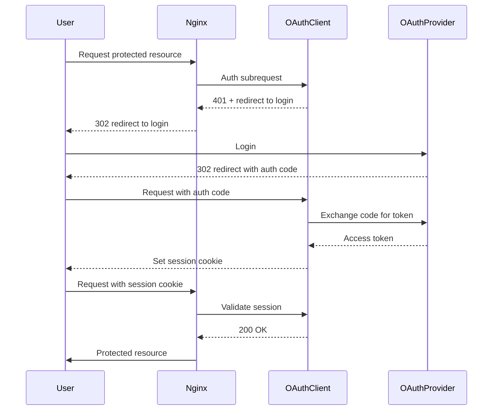

# Nginx Authentication Methods

## Introduction

Authentication is a fundamental aspect of web security that verifies the identity of users attempting to access your resources. Nginx, a popular high-performance web server and reverse proxy, offers several authentication mechanisms to protect your applications from unauthorized access.

In this guide, we'll explore various authentication methods available in Nginx, from simple username/password verification to more complex token-based systems. By the end, you'll understand how to implement these methods to secure your web applications effectively.

## Basic Authentication

Basic authentication is the simplest form of HTTP authentication, where the client provides a username and password to access protected resources.

### How Basic Authentication Works



### Setting Up Basic Authentication

1. First, create a password file using the `htpasswd` utility (part of the Apache HTTP Server utilities):

```bash
# Install the utility if needed
sudo apt-get install apache2-utils

# Create a new password file and add a user
sudo htpasswd -c /etc/nginx/.htpasswd username
```

2. Configure Nginx to use this password file by adding the following to your server or location block:

```nginx
server {
    listen 80;
    server_name example.com;

    location /protected/ {
        auth_basic "Restricted Area";
        auth_basic_user_file /etc/nginx/.htpasswd;
        
        # Your regular location configuration
        root /var/www/html;
        index index.html;
    }
}
```

3. Test the configuration and reload Nginx:

```bash
sudo nginx -t
sudo systemctl reload nginx
```

Now, when you visit `http://example.com/protected/`, the browser will prompt you for credentials.

### Advantages and Limitations

**Advantages:**
- Simple to implement
- Supported by all browsers
- No additional modules required

**Limitations:**
- Credentials are only encoded, not encrypted (unless using HTTPS)
- No session management (credentials sent with every request)
- Limited to username/password combinations

## IP-Based Authentication

You can restrict access to your resources based on client IP addresses.

### Implementation Example

```nginx
server {
    listen 80;
    server_name example.com;

    location /admin/ {
        # Allow specific IPs
        allow 192.168.1.0/24;  # Allow entire subnet
        allow 10.0.0.5;        # Allow specific IP
        
        # Block all other IPs
        deny all;
        
        # Regular configuration
        root /var/www/html/admin;
        index index.html;
    }
}
```

This configuration allows access only from the specified IP addresses or subnets and denies all others.

## Combining Basic Auth with IP Restrictions

You can combine both methods for enhanced security:

```nginx
server {
    listen 80;
    server_name example.com;

    location /admin/ {
        # IP restrictions
        allow 192.168.1.0/24;
        deny all;
        
        # Password authentication
        auth_basic "Admin Area";
        auth_basic_user_file /etc/nginx/.htpasswd;
        
        # Regular configuration
        root /var/www/html/admin;
        index index.html;
    }
}
```

## Subrequest Authentication (Auth Request Module)

The `ngx_http_auth_request_module` enables authentication based on the result of a subrequest to an authentication service or endpoint. This is a powerful way to integrate with external authentication systems.

### How It Works



### Implementation Example

1. Enable the auth_request module (it might be compiled into Nginx or available as a dynamic module):

```bash
# Check if the module is available
nginx -V 2>&1 | grep http_auth_request_module

# If not, you'll need to recompile Nginx with this module
```

2. Configure Nginx to use an authentication service:

```nginx
server {
    listen 80;
    server_name example.com;
    
    # Define the authentication endpoint
    location = /auth {
        internal;
        proxy_pass http://auth-service:8080/validate;
        proxy_pass_request_body off;
        proxy_set_header Content-Length "";
        proxy_set_header X-Original-URI $request_uri;
    }
    
    # Protected location
    location /api/ {
        auth_request /auth;
        auth_request_set $auth_status $upstream_status;
        
        # Pass auth response headers to the client
        auth_request_set $auth_user $upstream_http_x_user;
        proxy_set_header X-User $auth_user;
        
        # Regular proxy configuration
        proxy_pass http://backend-service:8000;
    }
}
```

In this example:
- `/auth` is an internal location that proxies to your authentication service
- The `auth_request` directive triggers the authentication subrequest
- Custom headers can be passed between your auth service and backend

## LDAP Authentication

For enterprise environments, LDAP authentication is common. Nginx supports LDAP through the `nginx-auth-ldap` module.

### Setting Up LDAP Authentication

1. First, install the required modules:

```bash
# For Ubuntu/Debian
sudo apt-get install libnginx-mod-http-auth-ldap

# For compilation from source
# (requires downloading the module from GitHub)
```

2. Configure LDAP authentication:

```nginx
# Load the module (if dynamic)
load_module modules/ngx_http_auth_ldap_module.so;

http {
    # LDAP server configuration
    ldap_server ldap_server1 {
        url ldap://ldap.example.com:389/dc=example,dc=com?uid?sub?(objectClass=person);
        binddn "cn=nginx,dc=example,dc=com";
        binddn_passwd "nginx_password";
        group_attribute memberUid;
        group_attribute_is_dn off;
        require valid_user;
    }
    
    server {
        listen 80;
        server_name example.com;
        
        location /secure/ {
            auth_ldap "Secure Area";
            auth_ldap_servers ldap_server1;
            
            # Regular configuration
            root /var/www/html/secure;
            index index.html;
        }
    }
}
```

## JWT (JSON Web Token) Authentication

JWT authentication is popular for single-page applications and microservices. Nginx can validate JWTs using the `nginx-jwt` module or through the auth_request mechanism with a dedicated validation service.

### Using Auth Request for JWT Validation

```nginx
server {
    listen 80;
    server_name example.com;
    
    # JWT validation service
    location = /validate-jwt {
        internal;
        proxy_pass http://jwt-validator:8080/validate;
        proxy_pass_request_body off;
        proxy_set_header Content-Length "";
        proxy_set_header X-Original-URI $request_uri;
        
        # Pass the Authorization header to the validator
        proxy_set_header Authorization $http_authorization;
    }
    
    # Protected API
    location /api/ {
        auth_request /validate-jwt;
        auth_request_set $jwt_user $upstream_http_x_user;
        proxy_set_header X-User $jwt_user;
        
        # Regular proxy configuration
        proxy_pass http://api-service:8000;
    }
}
```

### Example JWT Validator Implementation (Node.js)

Your JWT validation service might look like this:

```javascript
const express = require('express');
const jwt = require('jsonwebtoken');
const app = express();

const SECRET_KEY = process.env.JWT_SECRET;

app.get('/validate', (req, res) => {
  const authHeader = req.headers.authorization || '';
  const token = authHeader.replace('Bearer ', '');
  
  if (!token) {
    return res.status(401).send('No token provided');
  }
  
  try {
    const decoded = jwt.verify(token, SECRET_KEY);
    // Add user info for the upstream service
    res.setHeader('X-User', decoded.sub);
    res.status(200).send('OK');
  } catch (err) {
    res.status(401).send('Invalid token');
  }
});

app.listen(8080, () => console.log('JWT validator running on port 8080'));
```

## OAuth 2.0 Authentication

For integrating with OAuth providers like Google, GitHub, or custom OAuth servers, you can use the auth_request module with a dedicated OAuth client.

### OAuth 2.0 Flow with Nginx



### Implementation Example with Auth Request

```nginx
server {
    listen 80;
    server_name example.com;
    
    # OAuth validation endpoint
    location = /oauth2/auth {
        internal;
        proxy_pass http://oauth-client:8080/validate;
        proxy_pass_request_body off;
        proxy_set_header Content-Length "";
        
        # Pass cookies for session validation
        proxy_set_header Cookie $http_cookie;
    }
    
    # OAuth callback handled by the OAuth client
    location /oauth2/callback {
        proxy_pass http://oauth-client:8080/callback;
        proxy_pass_request_headers on;
    }
    
    # Login initiation endpoint
    location /oauth2/login {
        proxy_pass http://oauth-client:8080/login;
    }
    
    # Protected application
    location / {
        auth_request /oauth2/auth;
        auth_request_set $auth_user $upstream_http_x_user;
        
        # If auth fails, redirect to login
        error_page 401 = /oauth2/login;
        
        # Pass user info to the application
        proxy_set_header X-User $auth_user;
        
        # Regular configuration
        root /var/www/html;
        index index.html;
    }
}
```

## Client Certificate Authentication (mTLS)

Mutual TLS authentication uses client certificates to authenticate clients, providing strong security for sensitive applications.

### Setting Up Client Certificate Authentication

```nginx
server {
    listen 443 ssl;
    server_name secure.example.com;
    
    # Server certificate
    ssl_certificate /etc/nginx/ssl/server.crt;
    ssl_certificate_key /etc/nginx/ssl/server.key;
    
    # Client certificate verification
    ssl_client_certificate /etc/nginx/ssl/ca.crt;
    ssl_verify_client on;
    
    location / {
        # Only accessible with valid client certificate
        root /var/www/html/secure;
        index index.html;
        
        # You can access client certificate details with variables:
        # $ssl_client_s_dn, $ssl_client_i_dn, etc.
    }
}
```

## Combining Authentication Methods

For high-security environments, you can combine multiple authentication methods:

```nginx
server {
    listen 443 ssl;
    server_name secure.example.com;
    
    # TLS configuration
    ssl_certificate /etc/nginx/ssl/server.crt;
    ssl_certificate_key /etc/nginx/ssl/server.key;
    
    # Client certificate verification
    ssl_client_certificate /etc/nginx/ssl/ca.crt;
    ssl_verify_client on;
    
    # JWT validation service
    location = /validate-jwt {
        internal;
        proxy_pass http://jwt-validator:8080/validate;
        proxy_pass_request_body off;
        proxy_set_header Content-Length "";
        proxy_set_header Authorization $http_authorization;
        
        # Pass client certificate info to validator
        proxy_set_header X-SSL-Client-DN $ssl_client_s_dn;
    }
    
    # Protected API with both mTLS and JWT
    location /api/ {
        # First layer: mTLS (already handled by ssl_verify_client)
        # Second layer: JWT validation
        auth_request /validate-jwt;
        
        # Regular proxy configuration
        proxy_pass http://api-service:8000;
        
        # Pass client and authentication info to backend
        proxy_set_header X-SSL-Client-DN $ssl_client_s_dn;
        proxy_set_header X-User $upstream_http_x_user;
    }
}
```

## Troubleshooting Authentication Issues

When implementing authentication in Nginx, you might encounter various issues. Here are some common problems and solutions:

### Common Issues

1. **401 Unauthorized errors even with correct credentials**
   - Check file permissions on your .htpasswd file (should be readable by Nginx)
   - Verify the path to your auth_basic_user_file
   - Check for typos in username/password

2. **Auth subrequests failing**
   - Check Nginx error logs for details
   - Verify your authentication service is running
   - Ensure proper headers are being passed

3. **LDAP authentication not working**
   - Verify LDAP server connectivity
   - Check LDAP query syntax and credentials
   - Review LDAP module configuration

### Debugging Tips

Enable debug logging for authentication:

```nginx
error_log /var/log/nginx/error.log debug;
```

Test basic authentication credentials manually:

```bash
# For basic auth
echo -n "username:password" | base64
# Then use the result in a curl request
curl -H "Authorization: Basic <base64_string>" https://example.com/protected/
```

## Security Best Practices

When implementing authentication in Nginx, follow these security best practices:

1. **Always use HTTPS** for any authenticated resource
2. **Implement rate limiting** to prevent brute force attacks:

```nginx
http {
    # Define a limit zone
    limit_req_zone $binary_remote_addr zone=login:10m rate=1r/s;
    
    server {
        # Apply rate limiting to login endpoints
        location /login {
            limit_req zone=login burst=5 nodelay;
            # Regular configuration
        }
    }
}
```

3. **Set secure headers** for authenticated areas:

```nginx
location /secure/ {
    # Authentication configuration
    
    # Security headers
    add_header X-Frame-Options "DENY";
    add_header X-Content-Type-Options "nosniff";
    add_header X-XSS-Protection "1; mode=block";
    add_header Content-Security-Policy "default-src 'self';";
    
    # Regular configuration
}
```

4. **Implement proper session management** when using custom authentication

5. **Regularly rotate credentials and certificates**

## Summary

Nginx offers various authentication methods to secure your web applications, each with its own strengths and appropriate use cases:

- **Basic Authentication**: Simple username/password protection, ideal for internal tools or development environments.
- **IP-Based Restrictions**: Control access based on client IP addresses, useful for administrative areas.
- **Subrequest Authentication**: Flexible integration with external authentication services.
- **LDAP Authentication**: Enterprise-grade authentication for corporate environments.
- **JWT Authentication**: Token-based authentication for modern web applications and APIs.
- **OAuth 2.0**: Third-party authentication integration for social login or enterprise SSO.
- **Client Certificates**: Strong cryptographic authentication for high-security requirements.

Remember that the most secure systems often combine multiple authentication methods along with proper encryption (HTTPS) and additional security measures.

## Additional Resources

Here are some resources to help you learn more about Nginx authentication:

- [Nginx Official Documentation](https://nginx.org/en/docs/)
- [Nginx Auth Request Module Documentation](https://nginx.org/en/docs/http/ngx_http_auth_request_module.html)
- [OWASP Authentication Cheat Sheet](https://cheatsheetseries.owasp.org/cheatsheets/Authentication_Cheat_Sheet.html)

## Exercises

1. Set up basic authentication for a directory on your test server.
2. Create a simple JWT validation service and integrate it with Nginx using the auth_request module.
3. Implement OAuth 2.0 authentication for your application using Nginx as a reverse proxy.
4. Configure a combination of IP-based restrictions and basic authentication for an admin area.
5. Set up client certificate authentication for a secure API endpoint.